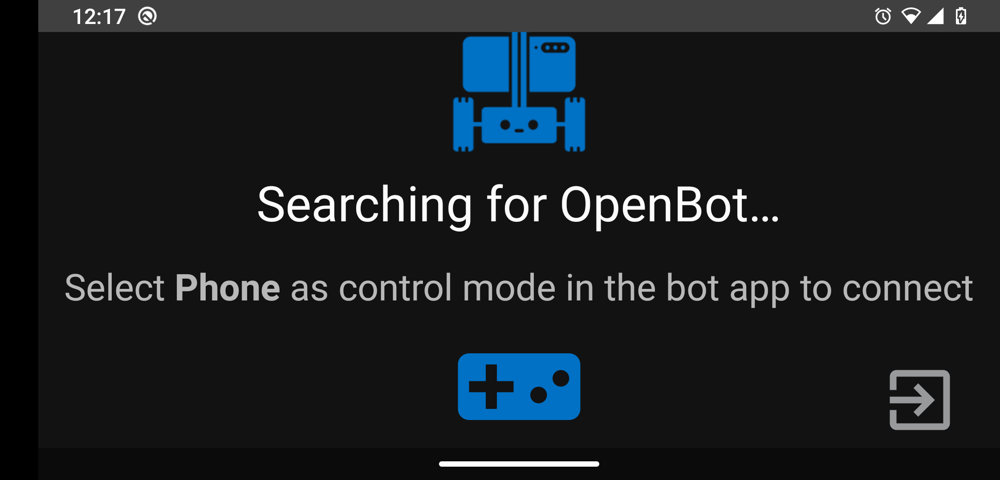
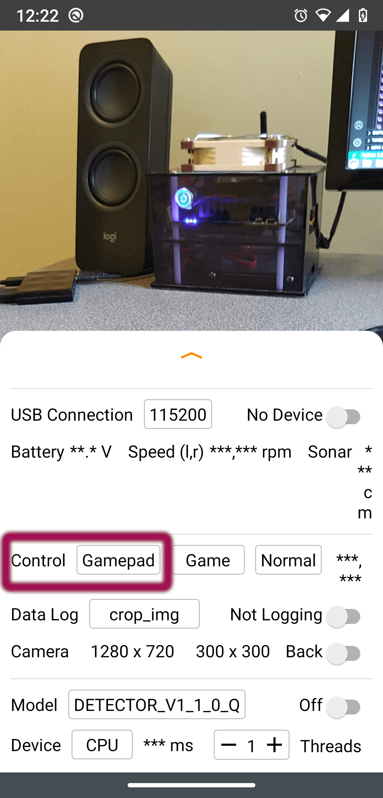
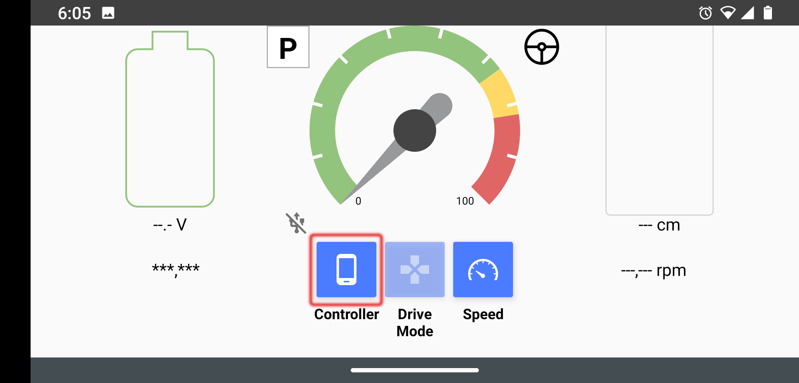
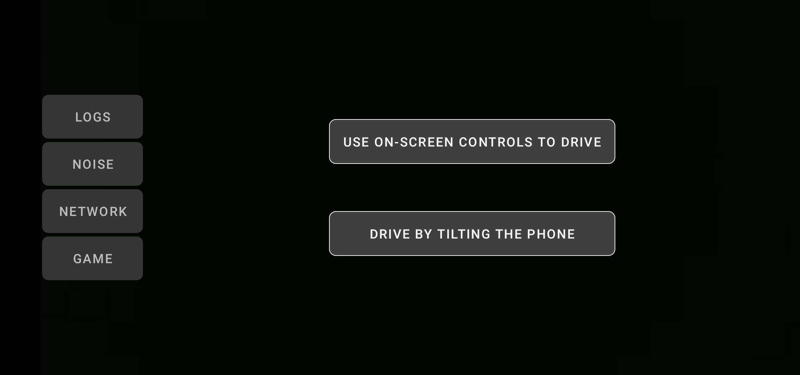
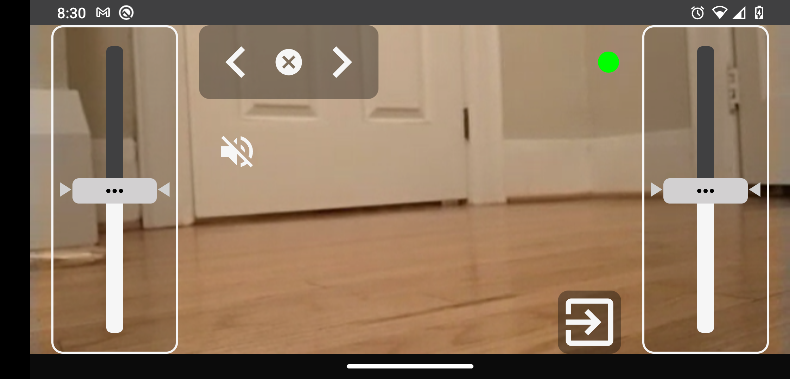
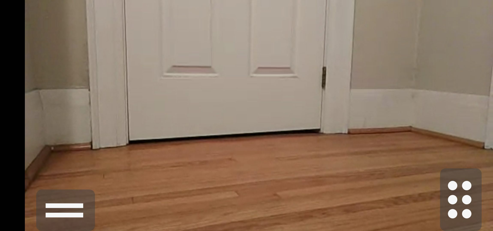

# Controller App

This Android app serves as a `remote controller` for the [OpenBot](https://www.openbot.org) vehicle.  Basically it performs similar function as PS3/4 or Xbox remote controller, but running on another Android device.

## Connection

When the controller app is started, it immediately tries to connect to the robot. We see the following screen:

  

To connect the controller to the robot, place the robot's app control setting into the **Phone** mode.

  
  

You can also connect to the controller from the `FreeRoamFragment` by selecting the phone as the controller:

  

In a few seconds, you will hear a beep, and the controller will change its screen to:

  

Here you can select to drive the robot by tilting the phone, or by using the on-screen controls.

***Note:*** This should be sufficient to connect, but if the connection cannot be established after 30 seconds, toggle the `Control` setting on the bot app to `Gamepad` and then to `Phone` again to re-initiate the connection. If that fails, exit the controller app and start it again. Toggle the Control mode again on the robot app.

## Operation

### On-screen controls
This mode allows the user to control the robot car via two sliders in `Dual Drive` mode. You can turn left/right by moving the slider thumb up and down on each side. The wheels on each side turn forward/backward when moving the thumb above/below the center of the slider.

  

You can also set the left/right turn indicators 
 
 
by clicking on the arrows on the top-left of the screen, and the red button between them to cancel.

### Tilt to drive
The controller can also use its accelerometer motion sensor to drive the robot. If you select this option, the controller will enter a full-screen (Zen) mode with only the video showing and a `brake` and `accelerator` pedals. To exit this mode, double-tap on the screen.

Here is a picture of the `tilt mode` screen:

  

Use the `accelerator` and `brake` buttons to move forward/backward.

- Pressing the `acceletator` will accelerate the robot to full speed within 2 seconds. When you release the button, the robot will slow down to a stop (stop speed set to 0% of the maximum speed, can be adjusted).
- Pressing the `brake` button will immedately stop the robot. If we hold the brake for another second, the robot will start moving backwards until it reaches the maximim reverse speed in one second. When we let go of the brake, the robot will come to a stop.
- We steer the robot by tilting the controller left or right.

## Future Development

Some of the features we are looking to add are:

- Add information on the controller for more robot sensors, such as battery level and speed.
- Video Stream from the robot's camera to the controller
- Use controller's gyroscope sensor co control the robot
- Send crash and bump events from the robot to the controller for a more realistic experience

Here is a [Technical Overview](../../docs/technical/OpenBotController.pdf) of the controller app.
