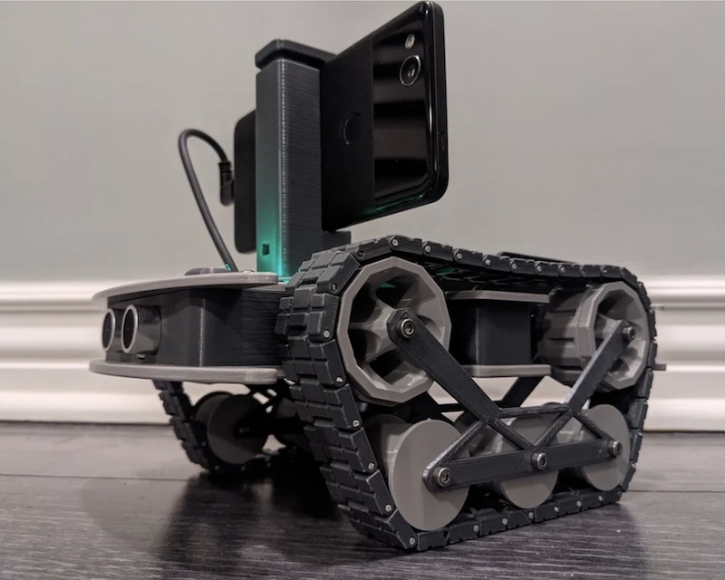

<a href="https://www.openbot.org/" target="_blank">
  
</a>

<h1 align="center"><a>Turning Smartphones into Robots</a></h1>

<p align="center">
   </a>
   </a>
   </a>
   </a>
   </a>
   </a>
   </a>
   </a>
</p>

<p align="center">
  <a href="README.md">English</a> |
  <a href="README.zh-CN.md">简体中文</a> |
  <span>Deutsch</span> |
  <a href="README.fr-FR.md">Français</a> |
  <a href="README.es-ES.md">Español</a>
</p>

OpenBot nutzt Smartphones als Gehirne für kostengünstige Roboter. Wir haben ein kleines Elektrofahrzeug entworfen, das etwa 50 Dollar kostet und als Roboterkörper dient. Unser Software-Stack für Android-Smartphones unterstützt fortschrittliche Robotikanwendungen wie Personenverfolgung und Echtzeit-Autonomes Fahren.

## Erste Schritte mit OpenBot

- Lesen Sie den [Haftungsausschluss](DISCLAIMER.de-DE.md)
- Bauen Sie Ihren eigenen [Roboterkörper](body/README.de-DE.md)
- Flashen Sie die [Arduino-Firmware](firmware/README.de-DE.md)
- Installieren Sie die [Android-Apps](android/README.de-DE.md)
- Steuern Sie den Roboter über einen [Controller](controller/README.de-DE.md)
- Programmieren Sie Ihren Roboter im [Playground](open-code/README.de-DE.md)
- Trainieren Sie Ihre eigene [Fahrstrategie](policy/README.de-DE.md)

## Den Quellcode erhalten

- Sie können das Repository als [Zip-Datei](https://github.com/intel-isl/OpenBot/archive/master.zip) herunterladen und in einen Ordner Ihrer Wahl extrahieren.
- Sie können das OpenBot-Repository von GitHub mit dem folgenden Befehl klonen:
    ```bash
    git clone https://github.com/intel-isl/OpenBot.git
    ```
- Sie können das OpenBot-Repository forken und dann Ihre lokale Kopie klonen. Dies wird empfohlen, insbesondere wenn Sie [beitragen](CONTRIBUTING.de-DE.md) möchten.

## Videos

<a href="https://www.youtube.com/watch?v=RbzPXywJifA" >
  
</a>

<a href="https://www.youtube.com/watch?v=qc8hFLyWDOM" >
  
</a>

## Coole Projekte mit OpenBot

Es gibt bereits viele coole Projekte, die OpenBot nutzen. Unten ist eine kleine Auswahl. Klicken Sie auf die Bilder, um zu den jeweiligen Projekten weitergeleitet zu werden.

<p float="left">
  <a href="https://www.thingiverse.com/thing:4670884" target="_blank">
    
  </a>
  <a href="https://diyrobocars.com/2020/12/14/an-improved-version-of-the-intel-openbot" target="_blank">
    
  </a>
  <a href="https://custom-build-robots.com/raspberry-pi-robot-cars/openbot-your-smartphone-controls-a-robot-car-introduction/13860?lang=en" target="_blank">
    
  </a>
  <a href="https://www.youtube.com/watch?v=PEj8jWapGt4" target="_blank">
    
  </a>
</p>

## Kontakt

- Treten Sie unserem [Slack](https://join.slack.com/t/openbot-community/shared_invite/zt-jl8ygxqt-WNRNi9yzh7Lu60qui6Nh6w) Kanal bei, um sich mit der OpenBot-Community zu verbinden.
- Kontaktieren Sie uns per [E-Mail](mailto:openbot.team@gmail.com)

## Beitrag leisten

Bitte lesen Sie die [Beitragsrichtlinien](CONTRIBUTING.de-DE.md). Wenn Sie nicht sicher sind, wo Sie anfangen sollen, werfen Sie einen Blick auf die [offenen Probleme](https://github.com/intel-isl/OpenBot/issues).

## Zitieren

Bitte zitieren Sie unser [Papier](https://arxiv.org/abs/2008.10631), wenn Sie OpenBot verwenden.

```bib
@inproceedings{mueller2021openbot,
    title     = {OpenBot: Turning Smartphones into Robots},
    author    = {M{\"u}ller, Matthias und Koltun, Vladlen},
    booktitle = {Proceedings of the International Conference on Robotics and Automation (ICRA)},
    year = {2021},
}
```

<a href="https://www.openbot.org//" target="_blank">
  
</a>