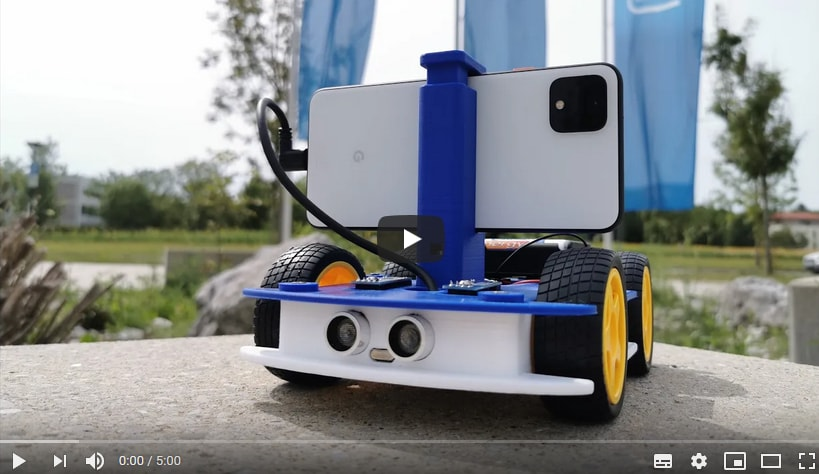

<a href="https://www.openbot.org/" target="_blank">
  
</a>

<h1 align="center"><a>Turning Smartphones into Robots</a></h1>

<p align="center">
   </a>
   </a>
   </a>
   </a>
   </a>
   </a>
   </a>
   </a>
</p>

<p align="center">
  <span>English</span> |
  <a href="README_CN.md">简体中文</a>
</p>

OpenBot leverages smartphones as brains for low-cost robots. We have designed a small electric vehicle that costs about $50 and serves as a robot body. Our software stack for Android smartphones supports advanced robotics workloads such as person following and real-time autonomous navigation.

## Getting started with OpenBot

- Build your own [Robot Body](body/README.md)
- Flash the [Arduino Firmware](firmware/README.md)
- Compile and run the [Android App](android/README.md)
- Train your own [Driving Policy](policy/README.md)

## Citation

Please cite our [paper](docs/paper/OpenBot.pdf) if you use OpenBot.

```bib
@article{openbot2020,
    author    = {Matthias M\"uller and Vladlen Koltun},
    title     = {{OpenBot}: Turning Smartphones into Robots},
    journal   = {arXiv:2008.10631},
    year      = {2020},
}
```

## Video

<a href="https://www.youtube.com/watch?v=qc8hFLyWDOM" >
  
</a>

## Contribute

Please read the [contribution guidelines](CONTRIBUTING.md). If you are not sure where to start have a look at the [open issues](https://github.com/intel-isl/OpenBot/issues).

## Contact

- Join our [Slack](https://join.slack.com/t/openbot-community/shared_invite/zt-isk656e8-9SGO3F5iPFskJ8oir8i1ww) channel to connect with the OpenBot community.
- Contact us via [Email](mailto:openbot.team@gmail.com)

<a href="https://www.openbot.org//" target="_blank">
  
</a>
