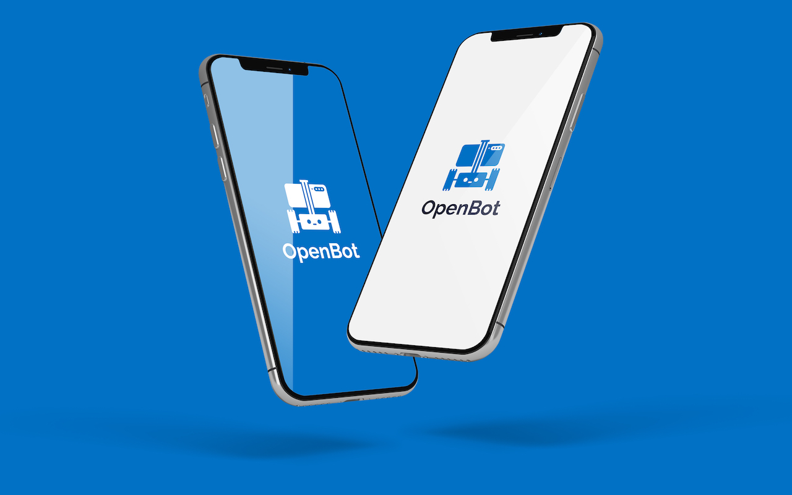

# Android App

Our application is derived from the [TensorFlow Lite Object Detection Android Demo](https://github.com/tensorflow/examples/tree/master/lite/examples/object_detection/android). We add a data logger and support for game controllers to collect datasets with the robot. Currently, we record readings from following sensors: camera, gyroscope, accelerometer, magnetometer, ambient light sensor, and barometer. Using the Android API, we are able to obtain the following sensor readings: RGB images, angular speed, linear acceleration, gravity, magnetic field strength, light intensity, atmospheric pressure, latitude, longitude, altitude, bearing, and speed. In addition to the phone sensors, we also record body sensor readings (wheel odometry, obstacle distance and battery voltage), which are transmitted via the serial link. Lastly, we record control commands received from a connected game controller, if present. We also integrate several neural networks for person following and autonomous navigation.

## Getting Started

### Prerequisites

- Setup [Android Studio](https://developer.android.com/studio/index.html)
- Android device and Android development environment with minimum API 21
- Android Studio 3.2 or later

### Building
- Open Android Studio and select *Open an existing Android Studio project*.
- Select the OpenBot/android directory and click OK.
- Confirm Gradle Sync if neccessary.
- Connect your Android device and make sure USB Debugging in the [developer options](https://developer.android.com/studio/debug/dev-options) is enabled. Depending on your development environment [further steps](https://developer.android.com/studio/run/device) might be necessary.
- Click the Run button (the green arrow) or select Run > Run 'android' from the top menu. You may need to rebuild the project using Build > Rebuild Project.
- If it asks you to use Instant Run, click *Proceed Without Instant Run*.

### Code Structure
The [TensorFlow Lite Object Detection Android Demo](https://github.com/tensorflow/examples/tree/master/lite/examples/object_detection/android) was used as starting point to integrate TFLite models and obtain the camera feed. The main activity is the [NetworkActivity](app/src/main/java/org/openbot/NetworkActivity.java) which runs the main thread. It inherits from the [CameraActivity](app/src/main/java/org/openbot/CameraActivity.java) which manages the camera and UI. The [SensorService](app/src/main/java/org/openbot/SensorService.java) reads all other phone sensors and logs them. The [env](app/src/main/java/org/openbot/env) folder contains utility classes such as the [GameController](app/src/main/java/org/openbot/env/GameController.java) interface and an [AudioPlayer](app/src/main/java/org/openbot/env/AudioPlayer.java) for the audible feedback. The [tflite](app/src/main/java/org/openbot/tflite) folder contains the model definitions for the [Autopilot](app/src/main/java/org/openbot/tflite/Autopilot.java) and [Detector](app/src/main/java/org/openbot/tflite/Detector.java) networks.

## How to Use the App
Coming soon...

  

