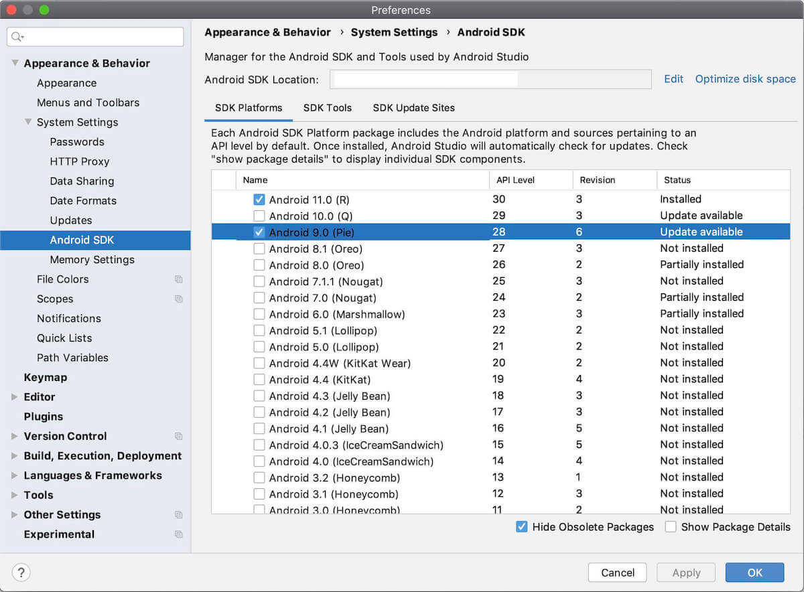

# Android Apps

  English |
  <a href="README_CN.md">简体中文</a>

- [OpenBot app](app/README.md)
- [Controller app](controller/README.md)

## Install the apps
You can download the apks from the assets of the [latest release](https://github.com/intel-isl/OpenBot/releases/latest) and just [install](https://www.lifewire.com/install-apk-on-android-4177185) it on your phone directly. Note that that apk is signed with a debug key. If you want the latest app from the master branch, you can also download it from the build artifacts [here](https://github.com/intel-isl/OpenBot/actions?query=workflow%3A%22Java+CI+with+Gradle%22). Note, that it may not be stable. If you would like to make changes to the app later, follow the steps below to compile the app and deploy it on your phone.

## Build the apps

### Prerequisites

- [Android Studio 3.2 or later](https://developer.android.com/studio/index.html) for building and installing the apks.
- Android device and Android development environment with minimum API 21.
- Currently, we use API 30 as compile SDK and API 29 as target SDK. It should get installed automatically, but if not you can install the SDK manually. Go to Android Studio -> Preferences -> Appearance & Behaviour -> System Settings -> Android SDK. Make sure API 30 is checked and click apply.

### Build process

1. Open Android Studio and select *Open an existing Android Studio project*.
2. Select the OpenBot/android directory and click OK.
3. If you want to install the [OpenBot app](app/README.md) make sure to select the *app* configuration. If you want to install the [Controller app](controller/README.md), select the *controller* configuration. Confirm Gradle Sync if neccessary. To perform a Gradle Sync manually, click on the gradle icon.
  
4. Connect your Android device and make sure USB Debugging in the [developer options](https://developer.android.com/studio/debug/dev-options) is enabled. Depending on your development environment [further steps](https://developer.android.com/studio/run/device) might be necessary. You should see your device in the navigation bar at the top now.
  
5. Click the Run button (the green arrow) or select Run > Run 'android' from the top menu. You may need to rebuild the project using Build > Rebuild Project.
  
6. If it asks you to use Instant Run, click *Proceed Without Instant Run*.

