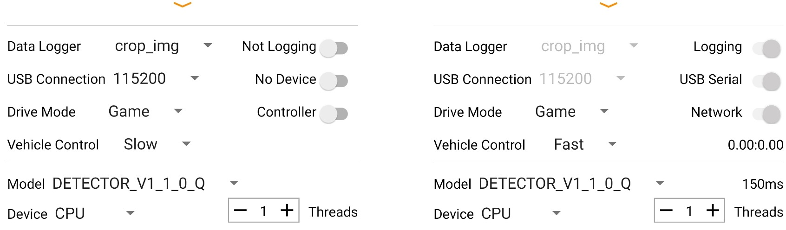

# 安卓 App

  <a href="README.md">English</a> |
  简体中文

我们的应用程序派生自[TensorFlow Lite object Detection Android Demo](https://github.com/tensorflow/examples/tree/master/lite/examples/object_detection/android)。我们增加了一个数据记录器，并支持游戏控制器与机器人一起收集数据集。目前，我们记录以下传感器的读数：相机、陀螺仪、加速计、磁力计、环境光传感器和气压计。使用Android API，我们可以获得以下传感器读数：RGB图像、角速度、线加速度、重力、磁场强度、光强、大气压力、纬度、经度、海拔、方位和速度。除了手机传感器，我们还记录车身传感器读数(车轮里程计、障碍物距离和电池电压)，这些读数通过串口传输。最后，我们记录从连接的游戏控制器接收道德命令(如果存在)。我们还集成了多个神经网络用于人员跟踪和自主导航。

## 免责声明

1. **安全性：** 一定要确保在安全的环境下操作。请记住，您的手机可能会在碰撞中受损！ **安全：** 一定要确保在安全的环境中操作。在使用自动控制时（如人员跟随或驾驶策略），必须特别小心。确保您始终连接着一个游戏手柄控制器，并熟悉按键映射，以便您可以在任何时候停止车辆。使用时风险自负
2. **应用程序正在开发中：** 应用程序正在开发中，根据您的手机型号和操作系统的版本，可能会崩溃或表现出意外行为。请务必在不连接车轮的情况下测试所有功能。使用时请自行承担风险!

## 开始

### 先决条件

- [Android Studio 3.2或更高版本](https://developer.android.com/studio/index.html)，用于构建和安装apk，否则从[最新版本](https://github.com/intel-isl/OpenBot/releases/latest)的静态资源中下载apk。
- 安卓设备和安卓开发环境，最低API 21。

### 构建
- 如果你使用的是[最新版本](https://github.com/intel-isl/OpenBot/releases/latest)的静态资源中的apk，你可以跳过下面的步骤，直接在手机上[安装](https://www.lifewire.com/install-apk-on-android-4177185)即可。注意，该apk是用调试密钥签名的。
- 打开Android Studio，选择*打开一个现有的Android Studio项目*。
- 选择OpenBot/android目录，点击确定。
- 如果需要的话，确认Gradle Sync。
- 连接你的Android设备，并确保在[开发者选项](https://developer.android.com/studio/debug/dev-options)中启用USB调试。根据你的开发环境，[进一步的步骤](https://developer.android.com/studio/run/device)可能是必要的。
- 单击"运行"按钮（绿色箭头）或从顶部菜单中选择 "运行">"运行'安卓'"。你可能需要使用Build > Rebuild Project来重建项目。
- 如果它要求你使用Instant Run，点击*Proceed Without Instant Run*。

### 代码结构
Tensorlfow Lite目标检测示例程序 [TensorFlow Lite Object Detection Android Demo](https://github.com/tensorflow/examples/tree/master/lite/examples/object_detection/android) 作为集成TFLite模型并获取相机源的起点。 Main activity 是运行主线程的[NetworkActivity](app/src/main/java/org/openbot/NetworkActivity.java)。它继承自管理摄像机和UI的[CameraActivity](app/src/main/java/org/openbot/CameraActivity.java)。[SensorService](app/src/main/java/org/openbot/SensorService.java)读取所有其他电话传感器并记录它们。[env](app/src/main/java/org/openbot/env)文件夹包含实用程序类，如[GameController](app/src/main/java/org/openbot/env/GameController.java)接口和用于声音反馈的[AudioPlayer](app/src/main/java/org/openbot/env/AudioPlayer.java)。[tflite](app/src/main/java/org/openbot/tflite)文件夹包含[Autopilot](app/src/main/java/org/openbot/tflite/Autopilot.java)和[Detector](app/src/main/java/org/openbot/tflite/Detector.java)网络的模型定义。

## 如何使用应用程序

  

### 数据记录器

有四种不同的记录模式。

- **only_sensors**。所有传感器数据，但不保存图像
- **crop_img**: 保存所有传感器数据和具有网络输入尺寸的裁剪图像。这是默认设置，是数据收集时应该使用的设置。
- **preview_img**: 保存所有传感器数据和全尺寸图像。这将需要大量的内存，而且速度会很慢。然而，它对于编译FPV视频是很好的。
- **all_imgs**: 所有的传感器数据和裁剪和全尺寸的图像被保存。这将需要大量的内存，而且可能很慢。

右边的开关是用来切换登录和关闭的。在游戏控制器上，这个开关可以用X按钮来切换。

### USB连接

下拉菜单用于设置波特率。默认值是115200，你应该不需要改变这个值，除非你把Arduino固件搞乱。该应用程序将尝试自动连接，但如果你遇到问题，你可以使用这个开关来断开/连接。

### 驱动模式

在使用游戏控制器（如PS4）时，有三种不同的驱动模式。

- **游戏模式**。使用左右肩部触发器（R2，L2）进行前进和后退油门，任一操纵杆进行转向。该模式模仿赛车电子游戏的控制模式。
- **操纵杆模式**。使用任一操纵杆控制机器人。
- **左右模式**：使用左右操纵杆控制机器人。用左右两根操纵杆分别控制汽车的左右两边 这是原始的差速转向。

右侧的开关用于在游戏控制器和网络之间切换控制。在游戏控制器上，可以使用R1触发按钮切换此开关。

### 车辆控制

有三种不同的速度。

- **慢速**：电机所承受的电压被限制在输入电压的50%（约6V）。
- **正常**：电机所承受的电压被限制在输入电压的75%以内(约9V)。
- **快速**：没有限制。全输入电压将应用于电机 (~12V)。*这是运行神经网络的默认设置*。

以更高的速度运行会降低电机的寿命，但更有乐趣。从连接的游戏控制器接收到的控制或网络预测的控制显示在右侧。

### 模型

该应用程序随附三种模型：

- **DETECTOR_V1_1_0_Q**。此模式用于人员跟踪。它使用MobileNet V1模型的SSD对象检测器。为了在嵌入式设备上获得更好的性能，该模型进行了量化。
- **DETECTOR_V3_S_Q**。该模型用于人员跟踪。它使用MobileNet V3模型的SSD对象检测器。为了提高嵌入式设备的性能，该模型进行了量化。
此模型用于自主导航。它将直接从摄像机输入预测控件。很有可能它在您的环境中不起作用。您应该按照我们的说明来训练自己的[驾驶策略](../ policy)并予以替换。
如果一个模型处于活动状态，它的右侧将显示以[ms]为单位的推理速度。

### 设备

使用下拉菜单选择运行神经网络的设备。您有以下选择。

- **CPU**：使用CPU可以在大多数手机上使用，是默认选择。您可以调整线程数量以优化性能。
- **GPU**：大多数智能手机都具有GPU。具有大量输入（例如图像）的网络通常在GPU上运行得更快。
- **NNAPI**：这将使用[TensorFlow Lite NNAPI delegate](https://www.tensorflow.org/lite/performance/nnapi)。现代智能手机通常会配备专用的AI加速器。[神经网络API](https://developer.android.com/ndk/guides/neuralnetworks)(NNAPI)为Android设备上的TensorFlow Lite模型提供加速，这些设备具有图形处理单元(GPU)、数字信号处理器(DSP)和神经处理单元(NPU)。请注意，在一些较旧的手机上，这可能会非常慢!

## 下一步（可选）

训练自己的[驾驶策略](../policy/README_CN.md)