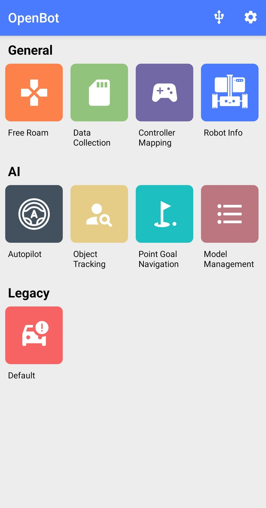
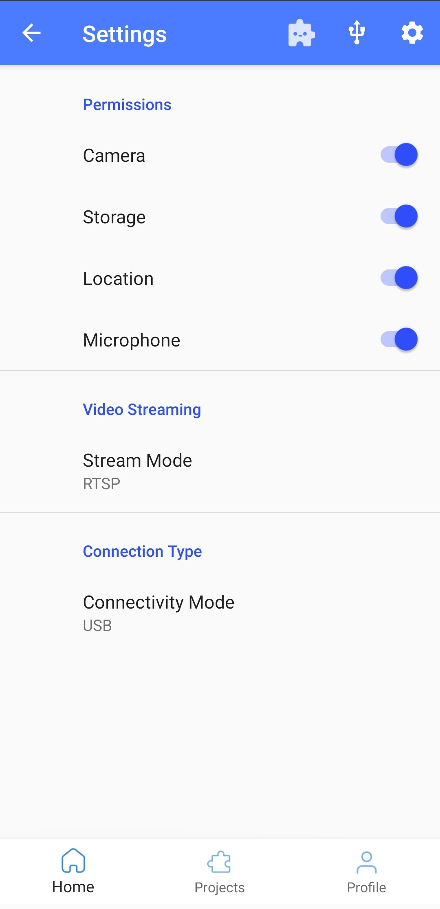

# Robot App

## DISCLAIMERS

1. **Safety:** Always make sure you operate in a safe environment. Keep in mind, that your phone could be damaged in a collision! Special 
care is neccessary when using automated control (e.g. person following or driving policy). Make sure you always have a game controller connected and are familiar with the key mapping so you can stop the vehicle at any time. Use at your own risk!
2. **App under development:** The application is under development and may crash or exhibit unexpected behaviour depending on your phone model and version of the operating system. Make sure to test all functionalities with no wheels connected. Use at your own risk!

## App Screens

### Main Menu

The app starts with a menu screen that shows all available screens. The settings screen can be opened with a click on the icon at the top right corner. By clicking on the other icons the user can access various screens whose functionalities are explained in the following.

### Default

The [DefaultActivity](src/main/java/org/openbot/original/DefaultActivity.java) includes the most important features of the OpenBot app in a single screen. It displays the connection status to the vehicle and reports measurements from vehicle sensors. The robot can be controlled by standard BT game controllers or another smartphone running the OpenBot [controller app](../controller). We have also implemented a data logger to collect datasets with the robot. Currently, we record readings from following sensors: camera, gyroscope, accelerometer, magnetometer, ambient light sensor, and barometer. Using the Android API, we are able to obtain the following sensor readings: RGB images, angular speed, linear acceleration, gravity, magnetic field strength, light intensity, atmospheric pressure, latitude, longitude, altitude, bearing, and speed. In addition to the phone sensors, we record body sensor readings (wheel odometry, obstacle distance and battery voltage), which are transmitted via the serial link. We also record and timestamp control signals received from a connected controller, if present. Lastly, we integrate several neural networks for person following and autonomous navigation.

  

#### USB Connection

The drop-down menu is used to set the baud rate. The default is 115200 and you should not need to change this unless you mess with the Arduino firmware. The app will attempt to connect automatically, but in case you encounter issues you can use this switch to disconnect/connect.

#### Vehicle Status

The field **Battery** displays the battery voltage as measured by the Arduino via the voltage divider. The field **Speed (l,r)** reports the left and right speed of the (front) wheels in rpm. It is measured by the Arduino via the optical wheel speed sensors. The field **Sonar** shows the free space in front of the car in centimeters. It is measured by the Arduino via the ultrasonic sensor. Note, you will only receive values a few seconds after the USB connections has been established.

#### Control

The first button is for selecting the **control mode**. There are two different control modes:

- **Gamepad**: The app receives controls from a connected BT controller.
- **Phone**:  The robot can be controlled via another smartphone with the controller app installed or though a Python script running on a computer connected to the same network.

The second button is for selecting the **drive mode**. There are three different drive modes when using a game controller (e.g. PS4):

- **Game**: Use the right and left shoulder triggers (R2, L2) for forward and reverse throttle and either joystick for steering. This mode imitates the control mode of car racing video games.
- **Joystick**: Use either one of the joysticks to control the robot.
- **Dual**: Use the left and right joystick to control the left and right side of the car. This is raw differential steering.

The third button is for selecting the **speed mode**. There are three different speed modes:

- **Slow**: The voltage applied to the motors is limited to 50% of the input voltage (~6V).
- **Normal**: The voltage applied to the motors is limited to 75% of the input voltage (~9V).
- **Fast**: There is no limit. The full input voltage will be applied to the motors at full throttle (~12V). *This is the default setting for running the neural networks.*

Running at higher speeds will reduce the lifetime of the motors but is more fun. The controls that are sent to the robot are displayed on the right side. When using the game controller, the speed mode can be increased by pressing down the right joystick (R3) and decrased by pressing down the left joystick (L3).

#### Data Log

There are four different logging modes:

- **only_sensors**: All sensor data but no images are saved.
- **crop_img**: All sensor data and a cropped images that have the input size of the network are saved. This is the default setting and is what should be used for data collection.
- **preview_img**: All sensor data and a full-size images are saved. This will require a lot of memory and can be slow. However, it is nice for compiling FPV videos.
- **all_imgs**: All sensor data and both cropped and full-size images are saved. This will require a lot of memory and can be slow.

The switch on the right is used to toggle logging on and off. On the game controller this switch can be toggled with the X button. 

#### Camera

The first item shows the preview resolution. The second item shows the crop resolution. This is the image that is used as input to the neural networks. You will notice that this resolution changes depending on which model you select below. If you train your own autopilot, make sure to select the `AUTOPILOT_F` model. The crop resolution should show `256x96`. The switch on the right is used to toggle between the rear and the front camera.

#### Model

There are two models that come with the app:

- **MobileNetV1-300**: This model is used for person following. It uses a SSD object detector with MobileNet V1 backbone. The model is quantized for better performance on embedded devices. It comes with the app.
- **CIL-Mobile**: This model is used for autonomous navigation. It will predict controls directly from the camera input. Chances are that it will not work in your environment. You should follow our instructions to train your own [Driving Policy](../../policy) and replace it.

Additonal models can be downloaded from the Model Management screen.

The switch on the right is used to turn the network on and off. When the network is running, it produces the controls for the robot and the game controller is disabled. However, you may still use the buttons on the game controller, for example to toggle this switch with the R1 trigger button to regain control of the robot. 

#### Device

Use the drop-down menu to select the device on which the neural network should be executed. You have the following choices:

- **CPU**: Using the CPU works on most phones and is the default choice. You can adjust the number of threads to optimize performance. 
- **GPU**: Most smartphones have a GPU. Networks with large inputs such as images often run faster on a GPU.
- **NNAPI**: This will use the [TensorFlow Lite NNAPI delegate](https://www.tensorflow.org/lite/performance/nnapi). Modern smartphones often come with dedicated AI accelerators. The [Neural Network API](https://developer.android.com/ndk/guides/neuralnetworks) (NNAPI) provides acceleration for TensorFlow Lite models on Android devices with Graphics Processing Unit (GPU), Digital Signal Processor (DSP) and Neural Processing Unit (NPU). Note that on some older phones this can be very slow!

If a model is active, the inference speed in [ms] will be displayed next to the device which is running the model.

### Free Roam

Free Roam offers simple robot control with real time updates and information about battery, speed and distance from surfaces.

- **Battery**: The battery icon shows realtime battery levels of the connected robot.

- **Drive Mode**: There are 3 drive modes displayed on the view:

    - D -> Drive, when the robot is driving forward

    - N -> Neutral, when the robot is stationary
 
    - R -> Reverse, when the robot is moving backwards

- **Speed**: The speedometer shows the realtime speed of the robot.

- **Sonar**: The sonar view distance of robot from an oncoming object in cm.

- **Control**: Controller, Drive Mode and Speed are used to control robot settings as described above in the Control section.

### Data Collection

Simple UI for collection of data sets.

- **Preview Resolution**: Used to switch between resolutions of camera preview. There are 3 settings:
    - ***FULL_HD*** (1920x1080p)
    - ***HD*** (1280x720p)
    - ***SD*** (640x360)

- **Model Resolution**: Used to switch between resolutions of images saved for training different models.

### Controller Mapping

Simple UI to check the button and joystick mapping of a connected BT controller.

### Autopilot

Simple UI for running autopilot models.

### Object Tracking

Simple UI for tracking objects of 80 different classes. A short description of the different AI models for object tracking and performance benchmarks can be found in [Model Management](#model-management).

### Model Management

All models are quantized for better performance on embedded devices. Please refer to the tables below for a short description of the available models and benchmarking results. The [mean Average Precision (mAP)](https://kharshit.github.io/blog/2019/09/20/evaluation-metrics-for-object-detection-and-segmentation) is computed on the validation set of the [COCO Detection 2017](https://cocodataset.org/#detection-2017) dataset. The runtime is averaged across 100 frames and reported in frames per second (fps).

#### MobileNetV1-300 (pre-installed) - mAP: 18%

SSD object detector with MobileNet V3 backbone and input resolution of 300x300.

|phone/device (fps)| CPU | GPU | NNAPI |
|------------------|-----|-----|-------|
| Samsung S20FE    |  34 |  57 |   87  |
| Huawei P30 Pro   |  36 |  25 |   10  |
| Google Pixel 6XL |  35 |  42 |   53  |
| Xiaomi Mi9       |  22 |  41 |   33  |

#### MobileNetV3-320 - mAP: 16%

SSD object detector with MobileNet V3 backbone and input resolution of 320x320.

|phone/device (fps)| CPU | GPU | NNAPI |
|------------------|-----|-----|-------|
| Samsung S20FE    |  34 |  42 |   28  |
| Huawei P30 Pro   |  32 |  27 |   23  |
| Google Pixel 6XL |  33 |  43 |   27  |
| Xiaomi Mi9       |  20 |  45 |   10  |

#### YoloV4-224 - mAP: mAP: 40.40%

State-of-the-art object detector [YoloV4](https://arxiv.org/abs/2004.10934) with input resolution of 224x224.

|phone/device (fps)| CPU | GPU | NNAPI |
|------------------|-----|-----|-------|
| Samsung S20FE    | 3.1 | 7.1 |  4.2  |
| Huawei P30 Pro   | 2.4 | 6.2 |  0.7  |
| Google Pixel 6XL | 2.7 |  11 |  0.9  |
| Xiaomi Mi9       | 2.1 | 6.4 |  1.7  |

#### YoloV4-tiny-224 - mAP: 22.05%

Tiny version of YoloV4 with input resolution of 224x224.

|phone/device (fps)| CPU | GPU | NNAPI |
|------------------|-----|-----|-------|
| Samsung S20FE    |  30 |  21 |   14  |
| Huawei P30 Pro   |  27 |  17 |   22  |
| Google Pixel 6XL |  29 |  24 |   19  |
| Xiaomi Mi9       |  16 |  14 |  9.3  |

#### YoloV4-tiny-416 - mAP: 29.42%

Tiny version of YoloV4 with input resolution of 416x416.

|phone/device (fps)| CPU | GPU | NNAPI |
|------------------|-----|-----|-------|
| Samsung S20FE    |  12 | 9.4 |  7.7  |
| Huawei P30 Pro   | 8.4 | 7.6 |  6.9  |
| Google Pixel 6XL |  10 | 9.6 |  7.2  |
| Xiaomi Mi9       | 9.0 | 7.3 |  5.0  |

## Add your own fragment

Please refer to the [ContributionGuide](ContributionGuide.md) to learn how to add your own fragments to the OpenBot app.

## Code Structure

The [TensorFlow Lite Object Detection Android Demo](https://github.com/tensorflow/examples/tree/master/lite/examples/object_detection/android) was used as starting point to integrate TFLite models and obtain the camera feed. The [DefaultActivity](src/main/java/org/openbot/robot/DefaultActivity.java) runs the main thread and inherits from the [CameraActivity](src/main/java/org/openbot/robot/CameraActivity.java) to manage the camera and UI. The [SensorService](src/main/java/org/openbot/robot/SensorService.java) reads all other phone sensors and logs them. The [ServerService](src/main/java/org/openbot/robot/ServerService.java) and [NsdService](src/main/java/org/openbot/robot/NsdService.java) establish a connection to a local [Python server](../../policy/README.md#web-app) with a React frontend. If you collect data it can be uploaded automatically for visualization, training ML models and downloading trained models to the robot. The [env](src/main/java/org/openbot/env) folder contains utility classes such as the [Vehicle](src/main/java/org/openbot/env/Vehicle.java) interface, [GameController](src/main/java/org/openbot/env/GameController.java) interface, [PhoneController](src/main/java/org/openbot/env/PhoneController.java) interface and an [AudioPlayer](src/main/java/org/openbot/env/AudioPlayer.java) for the audible feedback. The [tflite](src/main/java/org/openbot/tflite) folder contains the model definitions for the [Autopilot](src/main/java/org/openbot/tflite/Autopilot.java) and [Detector](src/main/java/org/openbot/tflite/Detector.java) networks.

## Next (optional)

Train your own [Driving Policy](../../policy/README.md)
