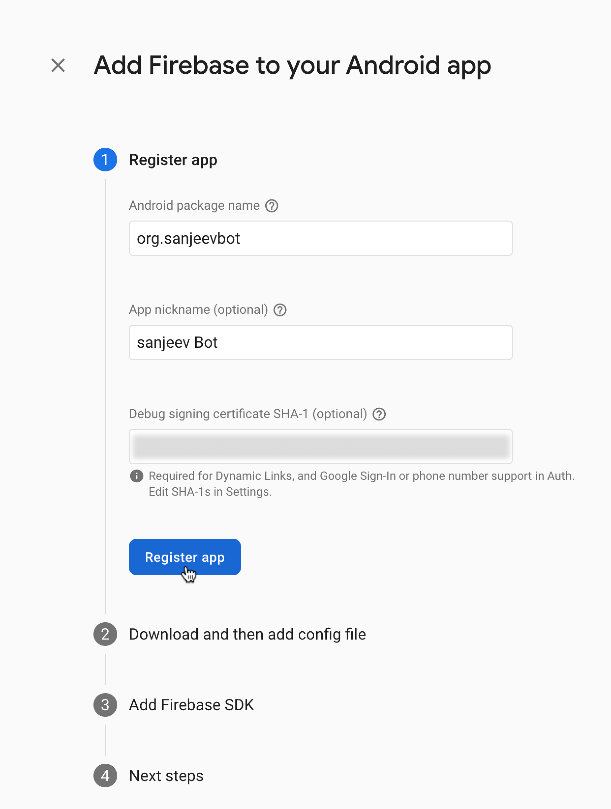
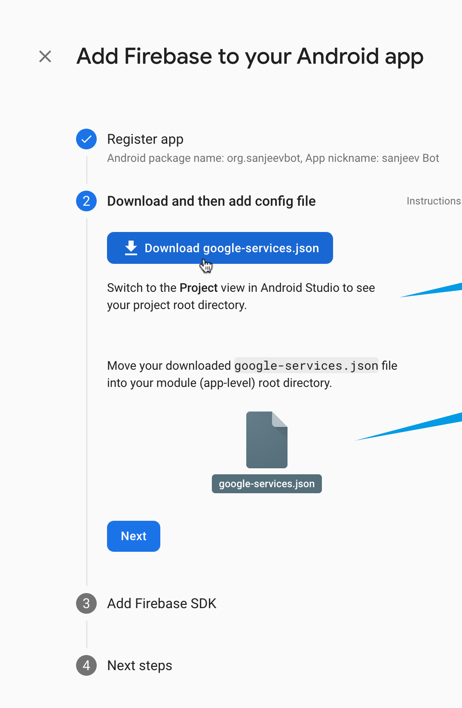
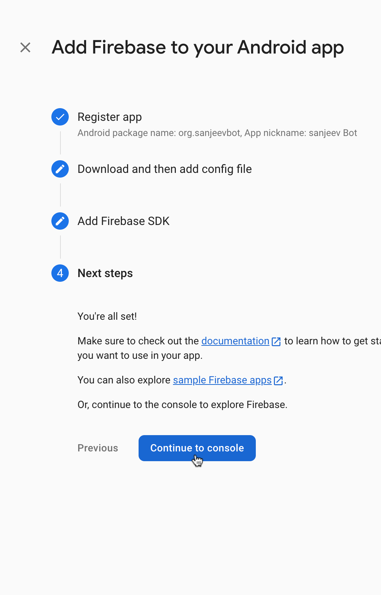
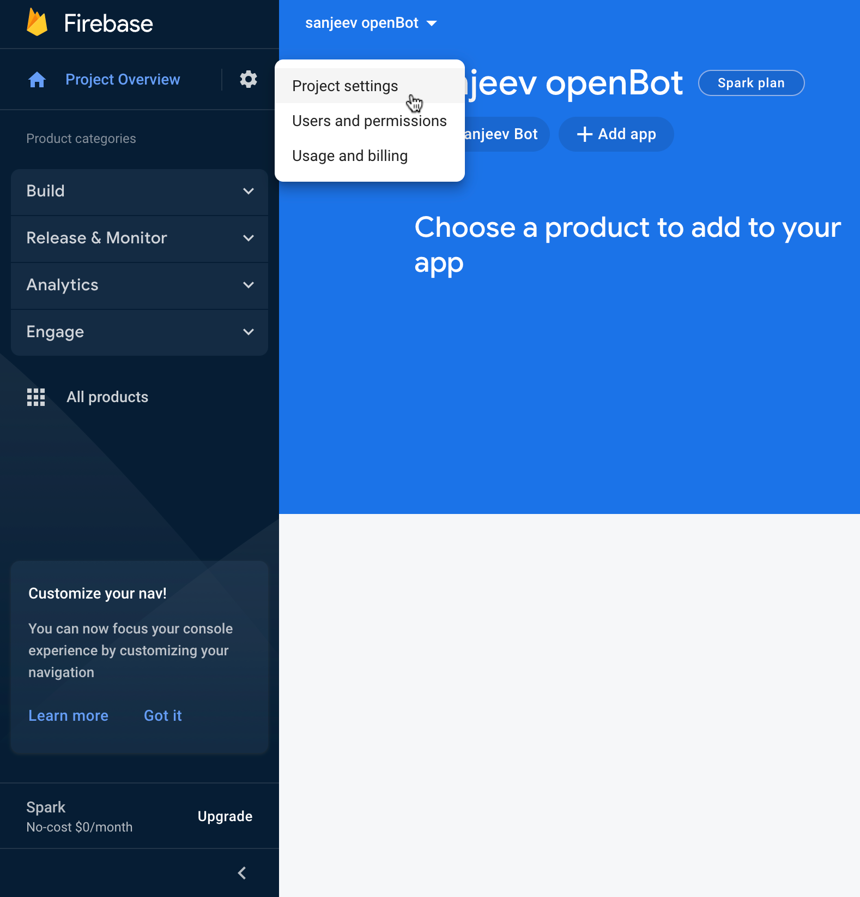
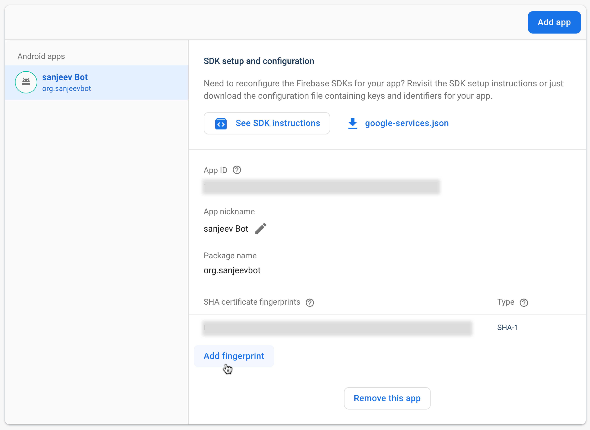

## Google Firebase

Google Firebase is a mobile and web application development platform that offers a variety of services and tools to help developers build high-quality apps quickly and efficiently. It includes features such as real-time database, user authentication, hosting, cloud storage, and more, all integrated into a single platform. Firebase provides a convenient and scalable solution for developers to manage their backend infrastructure, allowing them to focus on building great user experiences.

## Firebase Google Sign-In Authentication

Firebase Google Sign-In Authentication is a feature of the Firebase platform that allows users to sign in to mobile or web apps using their Google credentials. This service provides a secure and convenient way for users to access apps without having to remember and manage separate login credentials. Firebase manages the entire authentication process, from verifying the user's identity with Google to providing a unique user ID that can be used to personalize the user's experience within the app. This feature also includes additional security measures, such as two-factor authentication, to help protect user accounts from unauthorized access.
****
### Set up your Firebase project

- Go to the [Firebase Console](https://console.firebase.google.com/) and create a `new project`.
<p>


</p>

- Add a `new Android app` to your project and follow the instructions to `register your app` with Firebase.
<p>

</p>

- When you add a new Android app to your Firebase project, Firebase will ask you to provide the `package name` of your app, along with an optional `SHA-1` fingerprint for the signing certificate used to `sign your app's APK`.


- About the `SHA-1` fingerprint is a unique identifier for your `app's signing certificate`, and is used by Firebase to verify the authenticity of your app when communicating with Firebase servers. If you plan to use Firebase Authentication in your app, you will need to provide an `SHA-1` fingerprint `for the signing certificate` used to sign the `release version` of your app.


- To obtain the `SHA-1` fingerprint for the debug signing certificate, you can use the `keytool` command-line tool that is included with the `Java SDK`. Here's how to use it on `Mac` and `Windows`:
  

  - **On Mac**
    ```shell
    keytool -list -v -keystore ~/.android/debug.keystore -alias androiddebugkey -storepass android -keypass android
    ```
    This command will list the details of the debug signing certificate located at `~/.android/debug.keystore`. The `-alias` flag specifies the alias name used to identify the debug signing certificate. The `-storepass` and `-keypass` flags specify the passwords for the keystore and key, respectively.
  

  - **On Windows**
    ```shell 
    keytool -list -v -keystore "%USERPROFILE%.android\debug.keystore" -alias androiddebugkey -storepass android -keypass android
    ```
    This command is similar to the Mac command, but uses a `different path` to locate the debug.keystore file. `%USERPROFILE%` is a system environment variable that points to the current user's profile directory, which contains the `.android` directory where the `debug.keystore` file is located.

- Download the `google-services.json` file and `add` it to your app's `app directory`.

<p>



</p>

- In the `Firebase Console`, go to the `Authentication section` and `enable` the `Google Sign-In` provider.

<p>


</p>


- If you have `skipped the step to add the SHA-1 key` to your Firebase project during the setup process, you can `still add` it later by following these steps:

  - Go to your `Firebase console` and select `your project`.
  - Click on the `gear icon` in the `upper-left corner` and select `Project settings`.
  - Under the `Your apps` section, select the `Android app` you want to `add the SHA-1` key to.
  - `Scroll down` to the `SHA certificate fingerprints` section and click on `Add fingerprint`.
  - Enter the `SHA-1` key for your app's signing certificate.
  - Click on `Save` to add the SHA-1 key to your Firebase project.

<p>


</p>

- If you have `already implemented Firebase authentication` before adding the key, you may need to `update` your app's `configuration` by `replacing` the `google-services.json` file in your project directory with the `updated` one from your `Firebase console`.