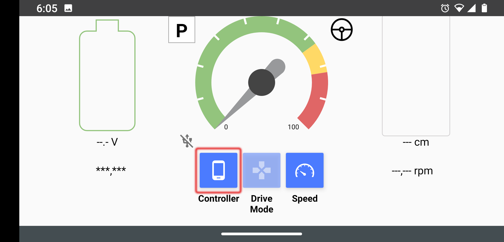
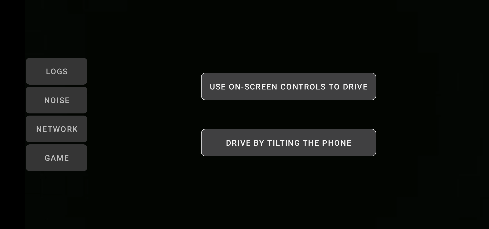
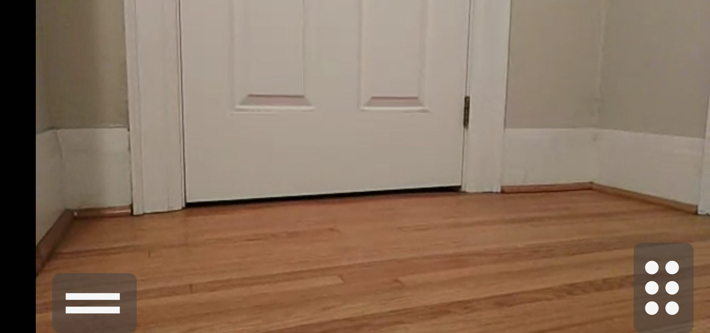

# Controller App

    <a href="README.md">English</a> |
    <a href="README.zh-CN.md">简体中文</a> |
    <a href="README.de-DE.md">Deutsch</a> |
    <a href="README.fr-FR.md">Français</a> |
    Español

Esta aplicación de Android sirve como un `control remoto` para el vehículo [OpenBot](https://www.openbot.org). Básicamente, realiza una función similar a la de un control remoto de PS3/4 o Xbox, pero ejecutándose en otro dispositivo Android.

## Conexión

Cuando se inicia la aplicación del controlador, intenta conectarse inmediatamente al robot. Vemos la siguiente pantalla:

  

Para conectar el controlador al robot, coloca la configuración de control de la aplicación del robot en el modo **Phone**.

  
  

También puedes conectarte al controlador desde el `FreeRoamFragment` seleccionando el teléfono como el controlador:

  

En unos segundos, escucharás un pitido y el controlador cambiará su pantalla a:

  

Aquí puedes seleccionar conducir el robot inclinando el teléfono o utilizando los controles en pantalla.

***Nota:*** Esto debería ser suficiente para conectar, pero si la conexión no se puede establecer después de 30 segundos, cambia la configuración de `Control` en la aplicación del robot a `Gamepad` y luego a `Phone` nuevamente para reiniciar la conexión. Si eso falla, cierra la aplicación del controlador y vuelve a iniciarla. Cambia el modo de Control nuevamente en la aplicación del robot.

## Operación

### Controles en pantalla
Este modo permite al usuario controlar el coche robot mediante dos deslizadores en modo `Dual Drive`. Puedes girar a la izquierda/derecha moviendo el pulgar del deslizador hacia arriba y hacia abajo en cada lado. Las ruedas de cada lado giran hacia adelante/atrás cuando mueves el pulgar por encima/debajo del centro del deslizador.

  

También puedes configurar los indicadores de giro a la izquierda/derecha 
 
 
haciendo clic en las flechas en la parte superior izquierda de la pantalla, y el botón rojo entre ellas para cancelar.

### Inclinar para conducir
El controlador también puede usar su sensor de movimiento acelerómetro para conducir el robot. Si seleccionas esta opción, el controlador entrará en un modo de pantalla completa (Zen) con solo el video mostrando y los pedales de `freno` y `acelerador`. Para salir de este modo, toca dos veces la pantalla.

Aquí hay una imagen de la pantalla del `modo de inclinación`:

  

Usa los botones de `acelerador` y `freno` para moverte hacia adelante/atrás.

- Presionar el `acelerador` acelerará el robot a toda velocidad en 2 segundos. Cuando sueltes el botón, el robot reducirá la velocidad hasta detenerse (la velocidad de parada se establece en 0% de la velocidad máxima, se puede ajustar).
- Presionar el botón de `freno` detendrá inmediatamente el robot. Si mantenemos el freno durante otro segundo, el robot comenzará a moverse hacia atrás hasta alcanzar la velocidad máxima en reversa en un segundo. Cuando soltemos el freno, el robot se detendrá.
- Dirigimos el robot inclinando el controlador hacia la izquierda o derecha.

## Desarrollo Futuro

Algunas de las características que estamos buscando agregar son:

- Añadir información en el controlador para más sensores del robot, como el nivel de batería y la velocidad.
- Transmisión de video desde la cámara del robot al controlador.
- Usar el sensor giroscópico del controlador para controlar el robot.
- Enviar eventos de choque y golpe desde el robot al controlador para una experiencia más realista.

Aquí tienes una [Descripción Técnica](../../docs/technical/OpenBotController.pdf) de la aplicación del controlador.