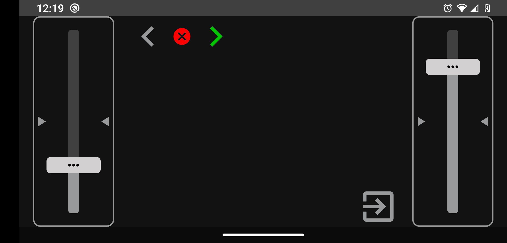
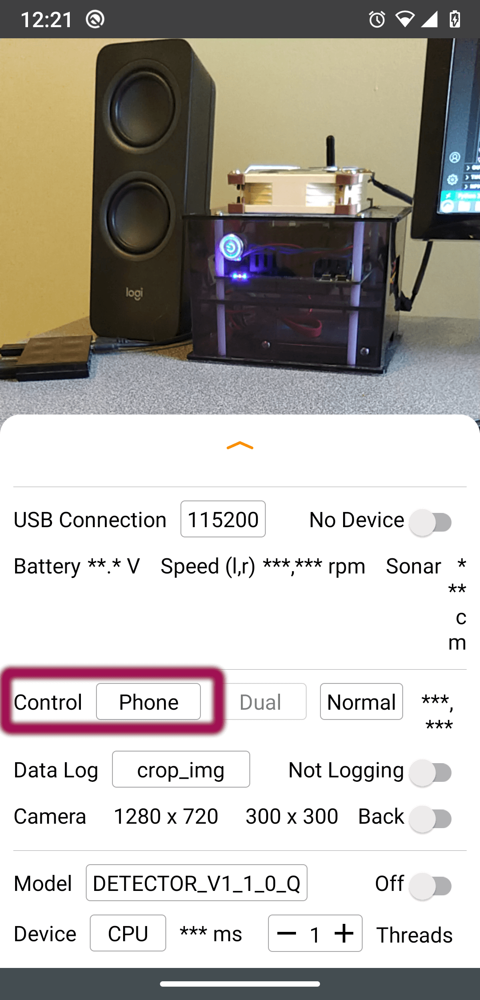
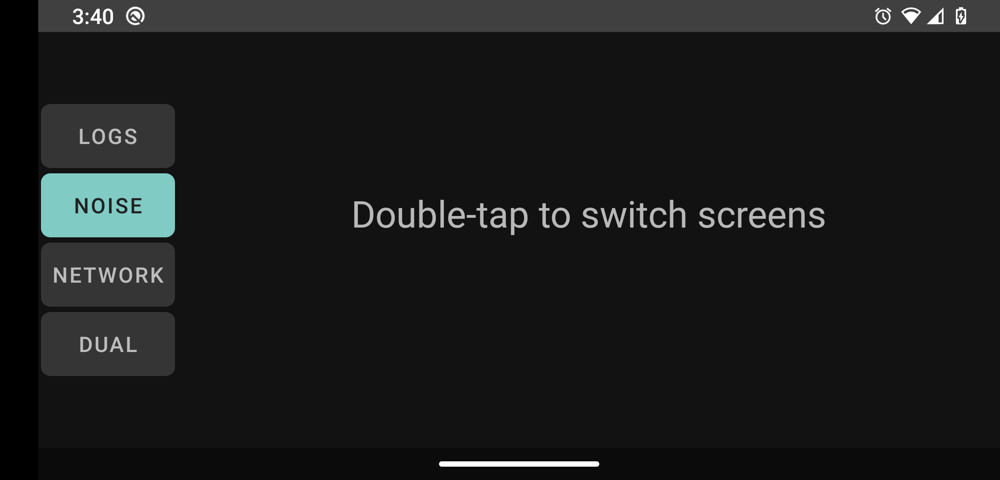

# Controller

This Android app serves as a `remote controller` for the [OpenBot](https://www.openbot.org) vehicle.  Basically it preforms similar function as PS3/4 or Xbox remote controller, but running on another Android device. It allows the user to control the robot car via two sliders in `Dual Drive` mode.

  

## Connection

When the controller app is started, it immediately tries to connect to the robot. We see the following screen:

  

To connect the controller to the robot, place the robot's app control setting into a **Phone** mode.

  
  

In a few seconds, you will hear a beep, and the controller will change its screen to:

  

... and then to the screen with the drive controls.

***Note:*** This should be sufficient to connect, but if the connection cannot be established after 30 seconds, toggle the `Control` setting on the bot app to `Gamepad`
and then to `Phone` again to re-initiate the connection. If that fails, exit the controller app and start it again. Toggle the Control mode again on the robot app.

## Operation

The operation of the controller app is pretty self-explanatory. You can turn left/right by moving the slider thumb up and down on each side. You can also place the wheels
on each side in reverse by moving the thumb below the center of the slider.

You can also set right/left
 
 
turn indicators by clicking on the arrows on the top-left of the screen, and the red button between them to cancel.

If you like to control some other settings on the robot, such as `Noise`, `Logs`, etc, double-tap in the middle of the screen, and you will see the buttons on the left.
They also show the current settings, so if the `Noise` button is highlighted, this means this setting on the robot is `ON`. If you change the setting manually from
 the robot menu, this should be reflected on the controller app as well.
 
## Future Development

Some of the features we are looking to add are:

- Add information on the controller for more robot sensors, such as battery level and speed.
- Video Stream from the robot's camera to the controller
- Use controller's gyroscope sensor co control the robot
- Send crash and bump events from the robot to the controller for a more realistic experience

## Build

Compile and run the [Android App](../README.md)

Here is a [Technical Overview](../../docs/technical/OpenBotController.pdf) of the controller app.
