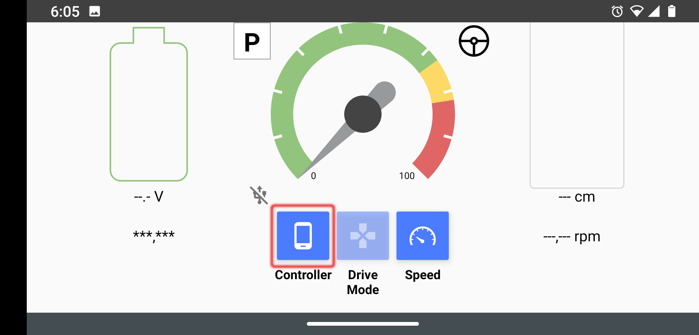
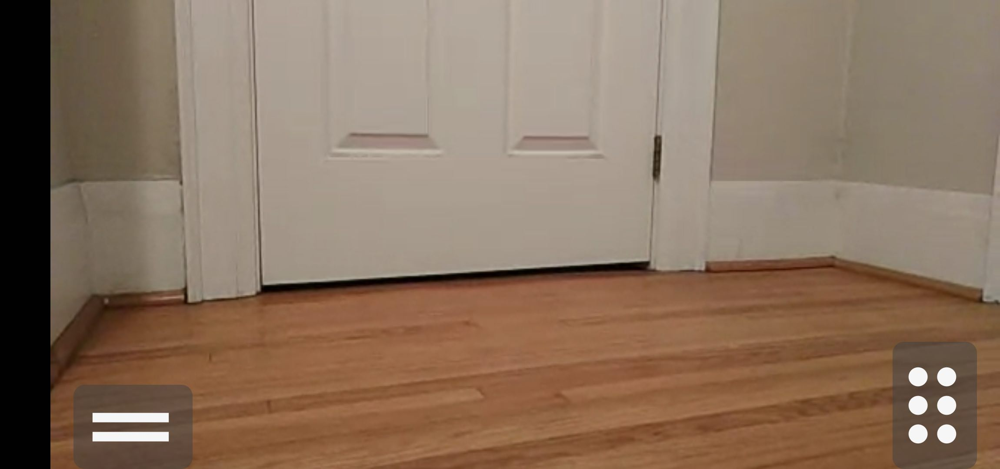

# 控制器应用

  <a href="README.md">English</a> |
  简体中文 |
  <a href="README.de-DE.md">Deutsch</a> |
  <a href="README.fr-FR.md">Français</a> |
  <a href="README.es-ES.md">Español</a>

这款安卓应用程序作为 [OpenBot](https://www.openbot.org) 车辆的 `远程控制器`。基本上，它的功能类似于PS3/4或Xbox的遥控器，但运行在另一台安卓设备上。

## 连接

当控制器应用启动时，它会立即尝试连接到机器人。我们会看到以下屏幕：

  

要将控制器连接到机器人，请将机器人的应用控制设置置于 **Phone** 模式。

  
  

你也可以通过在 `FreeRoamFragment` 中选择手机作为控制器来连接控制器：

  

几秒钟后，你会听到一声哔声，控制器的屏幕会变成：

  

在这里，你可以选择通过倾斜手机或使用屏幕上的控制来驾驶机器人。

***注意:*** 这应该足以连接，但如果在30秒后仍无法建立连接，请将机器人应用的 `Control` 设置切换到 `Gamepad`，然后再切换回 `Phone` 以重新启动连接。如果仍然失败，请退出控制器应用并重新启动。再次切换机器人应用上的控制模式。

## 操作

### 屏幕控制
这种模式允许用户通过 `双驱动` 模式下的两个滑块来控制机器人车。你可以通过在每一侧上下移动滑块的滑块拇指来左转/右转。当滑块拇指移动到滑块中心的上方/下方时，每一侧的轮子会向前/向后转动。

  

你还可以通过点击屏幕左上角的箭头来设置左/右转向指示灯 
 
 
以及中间的红色按钮来取消。

### 倾斜驾驶
控制器还可以使用其加速度计运动传感器来驾驶机器人。如果你选择此选项，控制器将进入全屏（Zen）模式，只有视频显示和 `刹车` 和 `加速` 踏板。要退出此模式，请双击屏幕。

这是 `倾斜模式` 屏幕的图片：

  

使用 `加速` 和 `刹车` 按钮来前进/后退。

- 按下 `加速` 按钮，机器人将在2秒内加速到全速。当你松开按钮时，机器人会减速至停止（停止速度设置为最大速度的0%，可以调整）。
- 按下 `刹车` 按钮，机器人会立即停止。如果我们再按住刹车一秒钟，机器人会开始倒退，直到在一秒钟内达到最大倒车速度。当我们松开刹车时，机器人会停止。
- 我们通过左右倾斜控制器来转向机器人。

## 未来发展

我们计划添加的一些功能包括：

- 在控制器上添加更多机器人传感器的信息，如电池电量和速度。
- 从机器人的摄像头向控制器传输视频流
- 使用控制器的陀螺仪传感器来控制机器人
- 从机器人向控制器发送碰撞和撞击事件，以获得更真实的体验

这里有一个控制器应用的 [技术概述](../../docs/technical/OpenBotController.pdf)。