# Robot App

  <a href="README.md">English</a> |
  <a href="README.zh-CN.md">简体中文</a> |
  <a href="README.de-DE.md">Deutsch</a> |
  Français |
  <a href="README.es-ES.md">Español</a>

## AVERTISSEMENTS

1. **Sécurité :** Assurez-vous toujours d'opérer dans un environnement sûr. Gardez à l'esprit que votre téléphone pourrait être endommagé en cas de collision ! Une attention particulière est nécessaire lors de l'utilisation du contrôle automatisé (par exemple, suivi de personne ou politique de conduite). Assurez-vous d'avoir toujours une manette de jeu connectée et de bien connaître la configuration des touches afin de pouvoir arrêter le véhicule à tout moment. Utilisez à vos propres risques !
2. **Application en développement :** L'application est en cours de développement et peut planter ou présenter un comportement inattendu en fonction de votre modèle de téléphone et de la version du système d'exploitation. Assurez-vous de tester toutes les fonctionnalités sans roues connectées. Utilisez à vos propres risques !

## Écrans de l'application

### Menu Principal

L'application démarre avec un écran de menu qui affiche tous les écrans disponibles. L'écran des paramètres peut être ouvert en cliquant sur l'icône en haut à droite. En cliquant sur les autres icônes, l'utilisateur peut accéder à divers écrans dont les fonctionnalités sont expliquées ci-dessous.

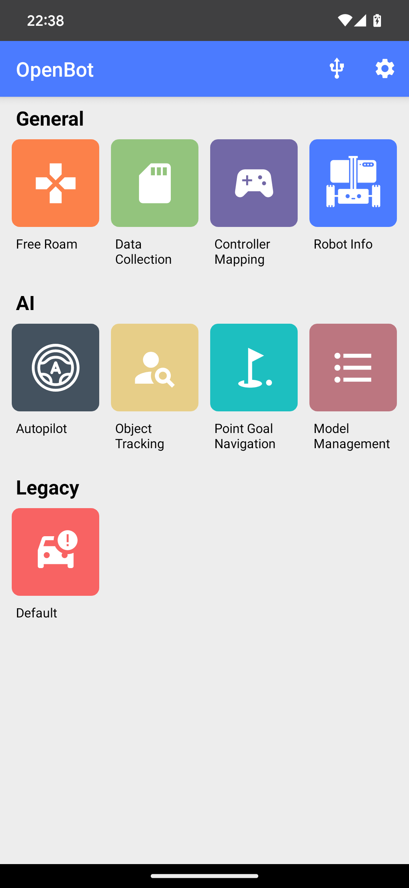
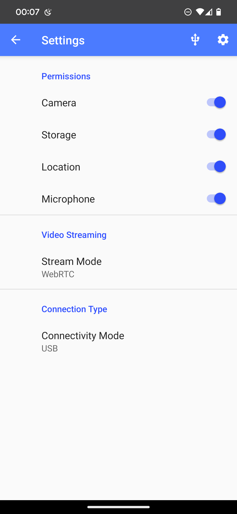
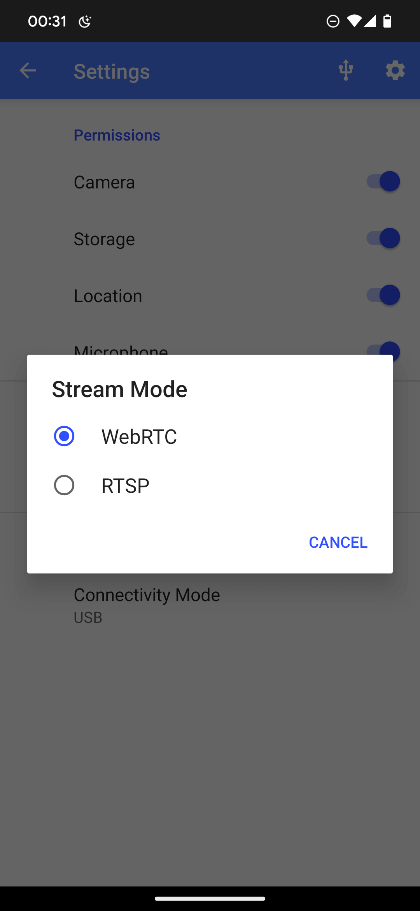
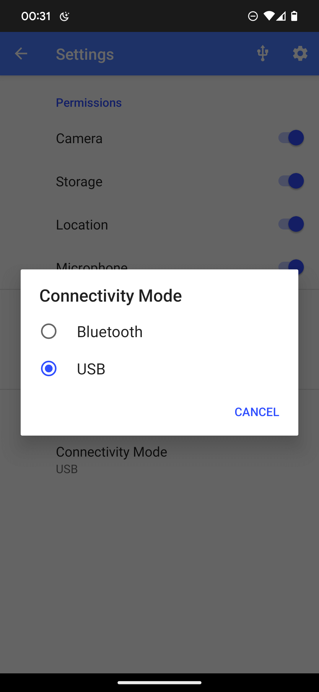

### Menu Paramètres

#### Connexion USB

Appuyez sur l'icône USB pour ouvrir les options USB. Le menu déroulant est utilisé pour définir le débit en bauds. La valeur par défaut est 115200 et vous ne devriez pas avoir besoin de la changer à moins de modifier le firmware Arduino. L'application tentera de se connecter automatiquement, mais en cas de problème, vous pouvez utiliser cet interrupteur pour déconnecter/connecter.

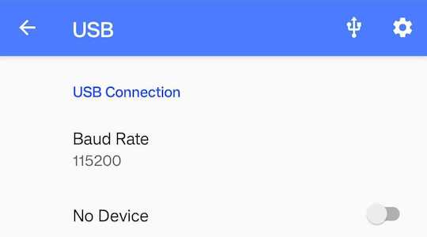
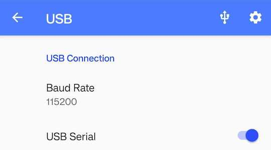

#### Permissions

Ici, vous pouvez vérifier les permissions de l'application et les ajuster si nécessaire.

#### Diffusion Vidéo

Vous pouvez choisir entre `WebRTC` et `RTSP` pour diffuser la vidéo vers un appareil externe. L'application de contrôle du téléphone et le serveur node-js doivent tous deux être configurés sur `WebRTC`. Le contrôleur Python s'attend à ce que le flux soit configuré sur `RTSP`.

#### Connexion Bluetooth

Assurez-vous que votre appareil Android prend en charge BLE (Bluetooth Low Energy). Si votre version d'Android est supérieure ou égale à 7.0, vous devez également activer le service de localisation et autoriser la permission de localisation dans les paramètres pour rechercher les appareils BLE à proximité. Pour activer BLE, changez le mode de connectivité de USB à Bluetooth dans le menu des paramètres. Vous verrez une icône Bluetooth en haut de l'écran d'accueil. Appuyez sur l'icône Bluetooth pour démarrer la recherche BLE ; cela prend 4 secondes pour scanner et obtenir une liste de tous les appareils OpenBot BLE à proximité. Connectez-vous à votre OpenBot en appuyant sur le bouton `Connect`. Après une connexion réussie, le bouton `Connect` se transformera en `Disconnect`. Vous pouvez maintenant revenir à l'écran d'accueil.

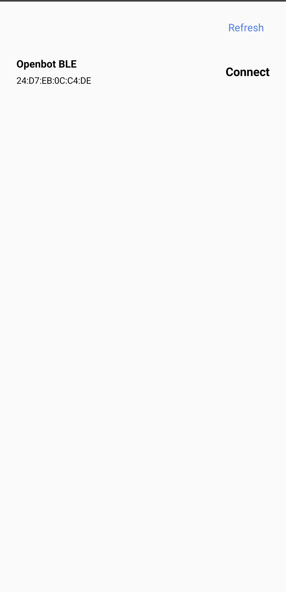
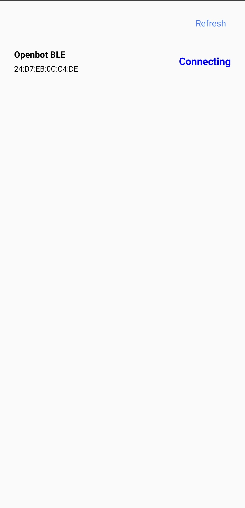
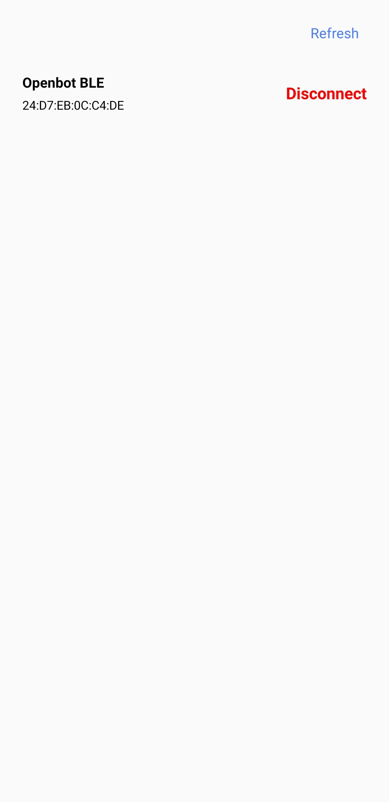

### Mode Libre

Le mode libre offre un contrôle simple du robot avec des mises à jour en temps réel et des informations sur la batterie, la vitesse et la distance par rapport aux surfaces.

- **Batterie** : L'icône de la batterie affiche les niveaux de batterie en temps réel du robot connecté.
- **État de conduite** : Il y a 3 états de conduite affichés à l'écran :
  - D -> Conduite, lorsque le robot avance
  - N -> Neutre, lorsque le robot est à l'arrêt
  - R -> Recul, lorsque le robot recule
  Le volant tourne proportionnellement à l'angle de direction.
- **Vitesse** : Le compteur de vitesse affiche la vitesse du robot.
- **Sonar** : La distance libre devant le robot en cm.
- **Contrôle** : Le contrôleur, le mode de conduite et la vitesse sont utilisés pour contrôler les paramètres du robot comme décrit dans la [section de contrôle](#control).

### Collecte de Données

Interface utilisateur simple pour la collecte de jeux de données.

- **Serveur** : Si vous avez l'[application web](../../policy#web-app) pour l'entraînement des politiques en cours d'exécution, vous pouvez la sélectionner ici pour télécharger automatiquement les données.
- **Résolution de Prévisualisation** : Utilisée pour basculer entre les résolutions de prévisualisation de la caméra. Il y a 3 réglages :
  - ***FULL_HD*** (1920x1080p)
  - ***HD*** (1280x720p)
  - ***SD*** (640x360)
- **Résolution du Modèle** : Utilisée pour basculer entre les résolutions des images enregistrées pour l'entraînement de différents modèles.
- **Enregistrer/Rejeter les Données Collectées** : Le processus de collecte de données peut être contrôlé depuis l'écran ou à distance, par exemple depuis une manette Bluetooth. Lors de l'utilisation d'une manette Bluetooth, vous pouvez :
  - Appuyer sur le **bouton A** pour **démarrer** le processus de collecte de données
  - Appuyer à nouveau sur le **bouton A** pour **arrêter** la collecte de données et enregistrer les données collectées dans un fichier .zip
  - Appuyer sur le **bouton R1** pour **arrêter** la collecte de données **sans enregistrer** les données collectées (par exemple en raison d'une collision inattendue avec l'environnement)
  - N'oubliez pas d'utiliser le fragment de mappage du contrôleur pour vous assurer que vous utilisez les bons boutons.

### Mappage du Contrôleur

Interface utilisateur simple pour vérifier le mappage des boutons et des joysticks d'un contrôleur BT connecté.

### Informations sur le Robot

Interface utilisateur simple pour obtenir des informations sur le robot et tester les fonctionnalités de base. Le **Type de Robot** tel que configuré dans le firmware est affiché sous forme de texte et d'animation. Les coches dans les sections **Capteurs**, **Odométrie des Roues** et **LEDs** montrent quelles fonctionnalités sont prises en charge par le robot connecté. La section **Lectures** fournit les mesures de capteur les plus importantes. Dans la section **Envoyer des Commandes**, les utilisateurs peuvent envoyer des commandes de moteur de base en appuyant sur les boutons correspondants et contrôler les LEDs avant et arrière avec un curseur.

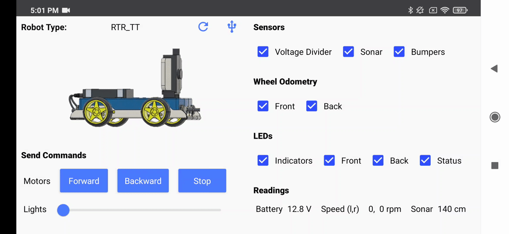

### Pilote Automatique

Interface utilisateur simple pour exécuter des modèles de pilote automatique.

- **Serveur** : Si vous avez l'[application web](../../policy#web-app) pour l'entraînement des politiques en cours d'exécution, vous pouvez la sélectionner ici et envoyer des modèles de pilote automatique entraînés au robot.
- **Modèle** : Choisissez un modèle entraîné à utiliser pour le mode pilote automatique.
- **Appareil** : Utilisez le CPU, le GPU ou le NNAPI pour l'inférence (plus de détails [ici](#device)).
- **Threads** : Nombre de threads à utiliser (fait une différence uniquement lorsque le CPU est sélectionné comme appareil).
- **Contrôle** : Le contrôleur, le mode de conduite et la vitesse sont utilisés pour contrôler les paramètres du robot comme décrit dans la [section de contrôle](#control).

### Suivi d'Objets

Interface utilisateur simple pour suivre des objets de 80 classes différentes. Une brève description des différents modèles d'IA pour le suivi d'objets et des benchmarks de performance peut être trouvée dans [Gestion des Modèles](#model-management).

- **Vitesse Dynamique** : réduit la vitesse du robot en "Mode Auto" s'il se rapproche de l'objet suivi.
  La vitesse est ajustée en fonction de la zone de la boîte de délimitation (fonctionne mieux en orientation paysage).
- **Modèle** : Choisissez un détecteur d'objets en fonction des performances de votre téléphone (voir ci-dessous pour les [résultats des benchmarks](#benchmark)).
- **Objet** : Choisissez l'objet que vous souhaitez suivre. Les modèles peuvent détecter les 80 [classes d'objets COCO](https://tech.amikelive.com/node-718/what-object-categories-labels-are-in-coco-dataset/).
- **Confiance** : Seuil de confiance pour déterminer si les détections sont acceptées. Augmentez si vous obtenez de fausses détections, diminuez si l'objet d'intérêt n'est pas détecté.
- **Appareil** : Utilisez le CPU, le GPU ou le NNAPI pour l'inférence (plus de détails [ici](#device)).
- **Threads** : Nombre de threads à utiliser (fait une différence uniquement lorsque le CPU est sélectionné comme appareil).
- **Contrôle** : Le contrôleur, le mode de conduite et la vitesse sont utilisés pour contrôler les paramètres du robot comme décrit dans la [section de contrôle](#control).

### Navigation vers un Point

Notez que ce fragment nécessite ARCore et la permission de la caméra. Si votre appareil ne prend pas en charge ARCore et que vous continuez quand même, l'application plantera. Dans cet écran, vous pouvez spécifier un objectif via un vecteur 2D par rapport à la position et à l'orientation actuelles du robot. Le vecteur 2D contient la distance à l'avant et à gauche du robot en mètres. Les deux valeurs peuvent également être négatives et correspondent alors à l'arrière et à la droite du robot. Après avoir spécifié l'objectif et appuyé sur `Start`, le robot exécutera une politique d'IA qui tentera d'atteindre l'objectif tout en évitant les obstacles.

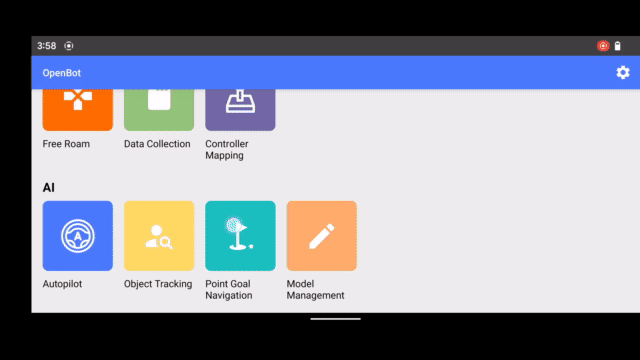

### Gestion des Modèles

Tous les modèles sont quantifiés pour de meilleures performances sur les appareils embarqués. Veuillez vous référer à la section ci-dessous pour une brève description des modèles disponibles et des résultats des benchmarks. La [moyenne de précision moyenne (mAP)](https://kharshit.github.io/blog/2019/09/20/evaluation-metrics-for-object-detection-and-segmentation) est calculée sur l'ensemble de validation du [COCO Detection 2017](https://cocodataset.org/#detection-2017). Chaque modèle est exécuté pendant environ 1 minute ; le temps d'inférence est moyenné sur les 100 dernières images et rapporté en images par seconde (fps). Notez que les modèles avec une résolution d'entrée plus grande peuvent être meilleurs pour les petits objets malgré une mAP plus faible.

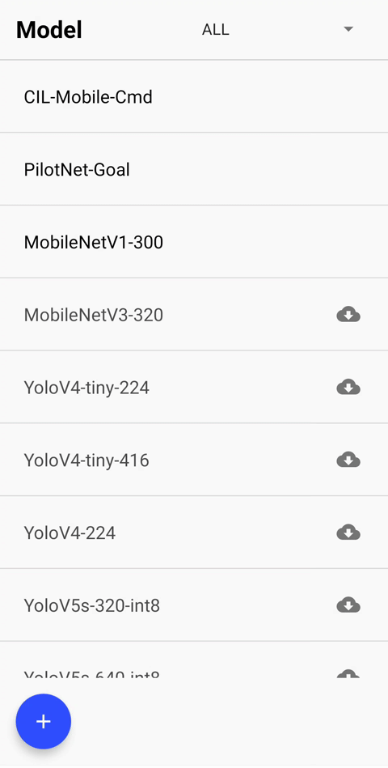

### Benchmark

#### Téléphones

| Nom du Modèle    | Chipset        | RAM  | OS |
|------------------|----------------|------|----|
| Samsung S22 Ultra| Exynos 2200    | 12GB | 12 |
| Samsung S20FE 5G | Snapdragon 865 |  6GB | 12 |
| Huawei P30 Pro   | Kirin 980      |  8GB | 10 |
| Google Pixel 6XL | Google Tensor  | 12GB | 12 |
| Xiaomi Mi9       | Snapdragon 855 |  6GB | 10 |
| Google Pixel 4XL | Snapdragon 855 |  6GB | 13 |

#### MobileNetV1-300 (pré-installé) - mAP : 18%

Détecteur d'objets SSD avec [MobileNet V1](https://tfhub.dev/tensorflow/lite-model/ssd_mobilenet_v1/1/metadata/2) en arrière-plan et une résolution d'entrée de 300x300.

|téléphone/appareil (fps)| CPU | GPU | NNAPI |
|------------------------|-----|-----|-------|
| Samsung S22 Ultra      |  33 |  13 |   30  |
| Samsung S20FE 5G       |  34 |  57 |   87  |
| Huawei P30 Pro         |  36 |  25 |   10  |
| Google Pixel 6XL       |  35 |  42 |   53  |
| Xiaomi Mi9             |  22 |  41 |   33  |
| Google Pixel 4XL       |  37 |  36 |   45  |

#### MobileNetV3-320 - mAP : 16%

Détecteur d'objets SSD avec MobileNet V3 en arrière-plan et une résolution d'entrée de 320x320.

|téléphone/appareil (fps)| CPU | GPU | NNAPI |
|------------------------|-----|-----|-------|
| Samsung S22 Ultra      |  30 |  17 |   30  |
| Samsung S20FE 5G       |  34 |  42 |   28  |
| Huawei P30 Pro         |  32 |  27 |   23  |
| Google Pixel 6XL       |  33 |  43 |   27  |
| Xiaomi Mi9             |  20 |  45 |   10  |
| Google Pixel 4XL       |  32 |  38 |   21  |

#### YoloV4-tiny-224 - mAP : 22%

Version réduite de [YoloV4](https://arxiv.org/abs/2004.10934) avec une résolution d'entrée de 224x224.

|téléphone/appareil (fps)| CPU | GPU | NNAPI |
|------------------------|-----|-----|-------|
| Samsung S22 Ultra      |  31 |  12 |   31  |
| Samsung S20FE 5G       |  30 |  21 |   14  |
| Huawei P30 Pro         |  27 |  17 |   22  |
| Google Pixel 6XL       |  29 |  24 |   19  |
| Xiaomi Mi9             |  16 |  14 |  9.3  |
| Google Pixel 4XL       |  22 |  19 |   14  |

#### YoloV4-tiny-416 - mAP : 29%

Version réduite de [YoloV4](https://arxiv.org/abs/2004.10934) avec une résolution d'entrée de 416x416.

|téléphone/appareil (fps)| CPU | GPU | NNAPI |
|------------------------|-----|-----|-------|
| Samsung S22 Ultra      |  13 | 9.8 |   13  |
| Samsung S20FE 5G       |  12 | 9.4 |  7.7  |
| Huawei P30 Pro         | 8.4 | 7.6 |  6.9  |
| Google Pixel 6XL       |  10 | 9.6 |  7.2  |
| Xiaomi Mi9             | 9.0 | 7.3 |  5.0  |
| Google Pixel 4XL       | 7.2 | 7.4 |  6.2  |

#### YoloV4-224 - mAP : 40%

[YoloV4](https://arxiv.org/abs/2004.10934) avec une résolution d'entrée de 224x224.

|téléphone/appareil (fps)| CPU | GPU | NNAPI |
|------------------------|-----|-----|-------|
| Samsung S22 Ultra      | 3.7 | 5.6 |  3.5  |
| Samsung S20FE 5G       | 3.1 | 7.1 |  4.2  |
| Huawei P30 Pro         | 2.4 | 6.2 |  0.7  |
| Google Pixel 6XL       | 2.7 |  11 |  0.9  |
| Xiaomi Mi9             | 2.1 | 6.4 |  1.7  |
| Google Pixel 4XL       | 1.8 | 5.0 |  3.7  |

#### YoloV5s-320 - mAP : 28%

[YoloV5](https://github.com/ultralytics/yolov5) avec une résolution d'entrée de 320x320.

|téléphone/appareil (fps)| CPU | GPU | NNAPI |
|------------------------|-----|-----|-------|
| Samsung S22 Ultra      |  21 |  10 |   21  |
| Xiaomi Mi9             |  13 |  15 |

|téléphone/appareil (fps)| CPU | GPU | NNAPI |
|-----------------------|-----|-----|-------|
| Samsung S22 Ultra     | 5.5 | 4.9 |  5.0  |
| Xiaomi Mi9            | 4.1 | 4.6 |   -   |
| Google Pixel 4XL      | 3.7 | 4.6 |  4.6  |

#### YoloV5m-320 - mAP : 35%

[YoloV5](https://github.com/ultralytics/yolov5) avec une résolution d'entrée de 320x320.

|téléphone/appareil (fps)| CPU | GPU | NNAPI |
|-----------------------|-----|-----|-------|
| Samsung S22 Ultra     |  13 | 8.2 |   11  |
| Xiaomi Mi9            | 9.7 | 9.9 |   -   |
| Google Pixel 4XL      | 7.9 | 9.2 |   15  |

#### YoloV5l-320 - mAP : 38%

[YoloV5](https://github.com/ultralytics/yolov5) avec une résolution d'entrée de 320x320.

|téléphone/appareil (fps)| CPU | GPU | NNAPI |
|-----------------------|-----|-----|-------|
| Samsung S22 Ultra     | 7.6 | 3.4 |  7.6  |
| Xiaomi Mi9            | 5.5 | 5.0 |   -   |
| Google Pixel 4XL      | 5.3 | 4.0 |  5.3  |

#### EfficientDet-L0-320 - mAP : 26%

[EfficientDet-L0](https://tfhub.dev/tensorflow/lite-model/efficientdet/lite0/detection/metadata/1) avec une résolution d'entrée de 320x320. Remarque : Les performances du modèle se détériorent en mode paysage ; le seuil de confiance pourrait devoir être ajusté.

|téléphone/appareil (fps)| CPU | GPU | NNAPI |
|-----------------------|-----|-----|-------|
| Samsung S22 Ultra     |  18 |  10 |   16  |
| Xiaomi Mi9            |  16 |  20 |  1.2  |
| Google Pixel 4XL      |  17 |  17 |   16  |

#### EfficientDet-L1-384 - mAP : 31%

[EfficientDet-L1](https://tfhub.dev/tensorflow/lite-model/efficientdet/lite1/detection/metadata/1) avec une résolution d'entrée de 384x384. Remarque : Les performances du modèle se détériorent en mode paysage ; le seuil de confiance pourrait devoir être ajusté.

|téléphone/appareil (fps)| CPU | GPU | NNAPI |
|-----------------------|-----|-----|-------|
| Samsung S22 Ultra     |  12 | 9.2 |   10  |
| Xiaomi Mi9            |  10 |  13 |    -  |
| Google Pixel 4XL      |  11 |  11 |   10  |

#### EfficientDet-L2-448 - mAP : 34%

[EfficientDet-L2](https://tfhub.dev/tensorflow/lite-model/efficientdet/lite2/detection/metadata/1) avec une résolution d'entrée de 448x448. Remarque : Les performances du modèle se détériorent en mode paysage ; le seuil de confiance pourrait devoir être ajusté.

|téléphone/appareil (fps)| CPU | GPU | NNAPI |
|-----------------------|-----|-----|-------|
| Samsung S22 Ultra     | 9.8 | 8.4 |  8.2  |
| Xiaomi Mi9            | 6.4 | 9.4 |   -   |
| Google Pixel 4XL      | 7.7 | 8.3 |  7.6  |

### Par défaut

La [DefaultActivity](src/main/java/org/openbot/original/DefaultActivity.java) inclut les fonctionnalités les plus importantes de l'application OpenBot sur un seul écran. Elle affiche l'état de la connexion au véhicule et rapporte les mesures des capteurs du véhicule. Le robot peut être contrôlé par des manettes de jeu BT standard ou un autre smartphone exécutant l'application [controller](../controller) OpenBot. Nous avons également implémenté un enregistreur de données pour collecter des ensembles de données avec le robot. Actuellement, nous enregistrons les lectures des capteurs suivants : caméra, gyroscope, accéléromètre, magnétomètre, capteur de lumière ambiante et baromètre. En utilisant l'API Android, nous pouvons obtenir les lectures des capteurs suivants : images RGB, vitesse angulaire, accélération linéaire, gravité, intensité du champ magnétique, intensité lumineuse, pression atmosphérique, latitude, longitude, altitude, cap et vitesse. En plus des capteurs du téléphone, nous enregistrons les lectures des capteurs du corps (odométrie des roues, distance des obstacles et tension de la batterie), qui sont transmises via le lien série. Nous enregistrons également et horodatons les signaux de contrôle reçus d'un contrôleur connecté, le cas échéant. Enfin, nous intégrons plusieurs réseaux neuronaux pour le suivi des personnes et la navigation autonome.

  

#### Connexion USB

Identique à celle du [menu des paramètres](#settings-menu).

#### État du véhicule

Le champ **Batterie** affiche la tension de la batterie mesurée par l'Arduino via le diviseur de tension. Le champ **Vitesse (g,d)** rapporte la vitesse gauche et droite des roues (avant) en tr/min. Elle est mesurée par l'Arduino via les capteurs de vitesse des roues optiques. Le champ **Sonar** montre l'espace libre devant la voiture en centimètres. Il est mesuré par l'Arduino via le capteur ultrasonique. Notez que vous ne recevrez des valeurs que quelques secondes après l'établissement de la connexion USB.

#### Contrôle

Le premier bouton sert à sélectionner le **mode de contrôle**. Il existe deux modes de contrôle différents :

- **Gamepad** : L'application reçoit les commandes d'un contrôleur BT connecté.
- **Téléphone** : Le robot peut être contrôlé via un autre smartphone avec l'application de contrôle installée ou via un script Python exécuté sur un ordinateur connecté au même réseau.

Le deuxième bouton sert à sélectionner le **mode de conduite**. Il existe trois modes de conduite différents lors de l'utilisation d'une manette de jeu (par exemple, PS4) :

- **Jeu** : Utilisez les gâchettes d'épaule droite et gauche (R2, L2) pour l'accélération avant et arrière et l'un des joysticks pour la direction. Ce mode imite le mode de contrôle des jeux vidéo de course automobile.
- **Joystick** : Utilisez l'un des joysticks pour contrôler le robot.
- **Double** : Utilisez les joysticks gauche et droit pour contrôler les côtés gauche et droit de la voiture. C'est une direction différentielle brute.

Le troisième bouton sert à sélectionner le **mode de vitesse**. Il existe trois modes de vitesse différents :

- **Lent** : La tension appliquée aux moteurs est limitée à 50 % de la tension d'entrée (~6V).
- **Normal** : La tension appliquée aux moteurs est limitée à 75 % de la tension d'entrée (~9V).
- **Rapide** : Il n'y a pas de limite. La tension d'entrée complète sera appliquée aux moteurs à pleine accélération (~12V). *C'est le réglage par défaut pour exécuter les réseaux neuronaux.*

Rouler à des vitesses plus élevées réduira la durée de vie des moteurs mais est plus amusant. Les commandes envoyées au robot sont affichées sur le côté droit. Lors de l'utilisation de la manette de jeu, le mode de vitesse peut être augmenté en appuyant sur le joystick droit (R3) et diminué en appuyant sur le joystick gauche (L3).

#### Journal de données

Il existe quatre modes de journalisation différents :

- **only_sensors** : Toutes les données des capteurs mais pas d'images sont enregistrées.
- **crop_img** : Toutes les données des capteurs et une image recadrée ayant la taille d'entrée du réseau sont enregistrées. C'est le réglage par défaut et ce qui doit être utilisé pour la collecte de données.
- **preview_img** : Toutes les données des capteurs et une image en taille réelle sont enregistrées. Cela nécessitera beaucoup de mémoire et peut être lent. Cependant, c'est agréable pour compiler des vidéos FPV.
- **all_imgs** : Toutes les données des capteurs et les images recadrées et en taille réelle sont enregistrées. Cela nécessitera beaucoup de mémoire et peut être lent.

L'interrupteur à droite est utilisé pour activer et désactiver la journalisation. Sur la manette de jeu, cet interrupteur peut être activé avec le bouton X.

#### Caméra

Le premier élément montre la résolution de prévisualisation. Le deuxième élément montre la résolution de recadrage. C'est l'image utilisée comme entrée pour les réseaux neuronaux. Vous remarquerez que cette résolution change en fonction du modèle que vous sélectionnez ci-dessous. Si vous entraînez votre propre pilote automatique, assurez-vous de sélectionner le modèle `AUTOPILOT_F`. La résolution de recadrage devrait afficher `256x96`. L'interrupteur à droite est utilisé pour basculer entre la caméra arrière et la caméra avant.

#### Modèle

Il y a deux modèles inclus avec l'application :

- **MobileNetV1-300** : Ce modèle est utilisé pour le suivi des personnes. Il utilise un détecteur d'objets SSD avec un backbone MobileNet V1. Le modèle est quantifié pour de meilleures performances sur les appareils embarqués. Il est inclus avec l'application.
- **CIL-Mobile** : Ce modèle est utilisé pour la navigation autonome. Il prédit les commandes directement à partir de l'entrée de la caméra. Il est probable qu'il ne fonctionne pas dans votre environnement. Vous devriez suivre nos instructions pour entraîner votre propre [Driving Policy](../../policy) et le remplacer.

Des modèles supplémentaires peuvent être téléchargés depuis l'écran de gestion des modèles.

L'interrupteur à droite est utilisé pour activer et désactiver le réseau. Lorsque le réseau est en cours d'exécution, il produit les commandes pour le robot et la manette de jeu est désactivée. Cependant, vous pouvez toujours utiliser les boutons de la manette de jeu, par exemple pour basculer cet interrupteur avec le bouton de la gâchette R1 pour reprendre le contrôle du robot.

#### Appareil

Utilisez le menu déroulant pour sélectionner l'appareil sur lequel le réseau neuronal doit être exécuté. Vous avez les choix suivants :

- **CPU** : L'utilisation du CPU fonctionne sur la plupart des téléphones et est le choix par défaut. Vous pouvez ajuster le nombre de threads pour optimiser les performances.
- **GPU** : La plupart des smartphones ont un GPU. Les réseaux avec de grandes entrées telles que les images fonctionnent souvent plus rapidement sur un GPU.
- **NNAPI** : Cela utilisera le [délégué NNAPI de TensorFlow Lite](https://www.tensorflow.org/lite/performance/nnapi). Les smartphones modernes sont souvent équipés d'accélérateurs AI dédiés. L'[API de réseau neuronal](https://developer.android.com/ndk/guides/neuralnetworks) (NNAPI) fournit une accélération pour les modèles TensorFlow Lite sur les appareils Android avec unité de traitement graphique (GPU), processeur de signal numérique (DSP) et unité de traitement neuronal (NPU). Notez que sur certains téléphones plus anciens, cela peut être très lent !

Si un modèle est actif, la vitesse d'inférence en [ms] sera affichée à côté de l'appareil exécutant le modèle.

## Ajouter votre propre fragment

Veuillez vous référer au [Guide de contribution](ContributionGuide.md) pour apprendre comment ajouter vos propres fragments à l'application OpenBot.

## Structure du code

La [démo Android de détection d'objets TensorFlow Lite](https://github.com/tensorflow/examples/tree/master/lite/examples/object_detection/android) a été utilisée comme point de départ pour intégrer les modèles TFLite et obtenir le flux de la caméra. La [DefaultActivity](src/main/java/org/openbot/robot/DefaultActivity.java) exécute le thread principal et hérite de la [CameraActivity](src/main/java/org/openbot/robot/CameraActivity.java) pour gérer la caméra et l'interface utilisateur. Le [SensorService](src/main/java/org/openbot/robot/SensorService.java) lit tous les autres capteurs du téléphone et les enregistre. Le [ServerService](src/main/java/org/openbot/robot/ServerService.java) et le [NsdService](src/main/java/org/openbot/robot/NsdService.java) établissent une connexion à un [serveur Python local](../../policy/README.md#web-app) avec une interface frontend React. Si vous collectez des données, elles peuvent être téléchargées automatiquement pour la visualisation, l'entraînement de modèles ML et le téléchargement de modèles entraînés sur le robot. Le dossier [env](src/main/java/org/openbot/env) contient des classes utilitaires telles que l'interface [Vehicle](src/main/java/org/openbot/env/Vehicle.java), l'interface [GameController](src/main/java/org/openbot/env/GameController.java), l'interface [PhoneController](src/main/java/org/openbot/env/PhoneController.java) et un [AudioPlayer](src/main/java/org/openbot/env/AudioPlayer.java) pour le retour sonore. Le dossier [tflite](src/main/java/org/openbot/tflite) contient les définitions de modèles pour les réseaux [Autopilot](src/main/java/org/openbot/tflite/Autopilot.java) et [Detector](src/main/java/org/openbot/tflite/Detector.java).

## Suivant (optionnel)

Entraînez votre propre [Driving Policy](../../policy/README.md)