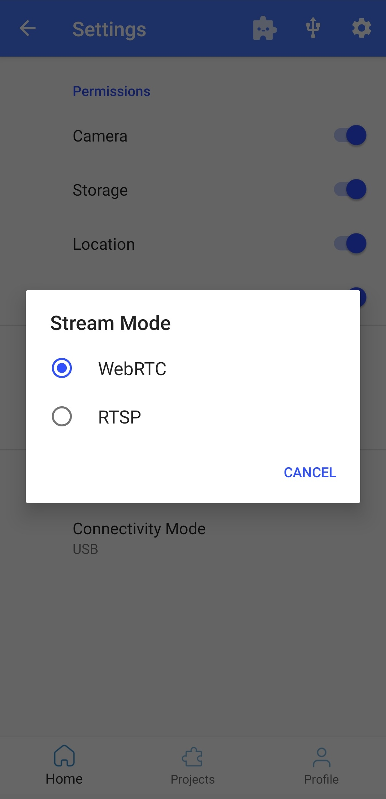
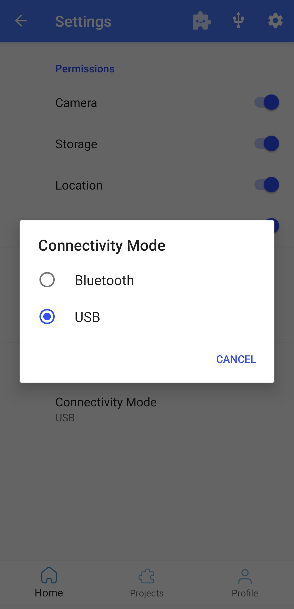
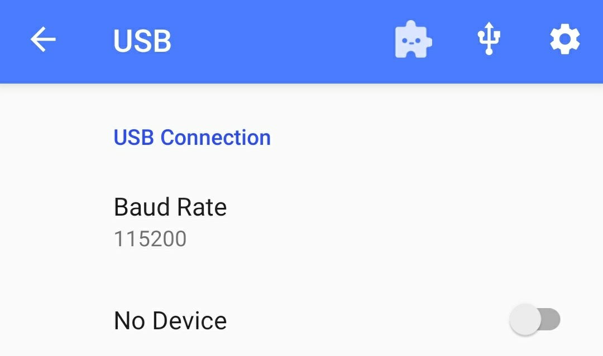
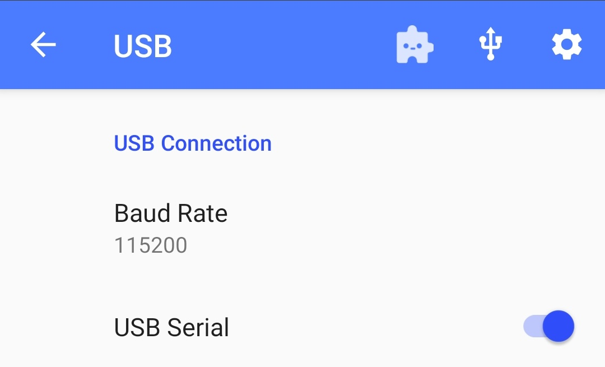
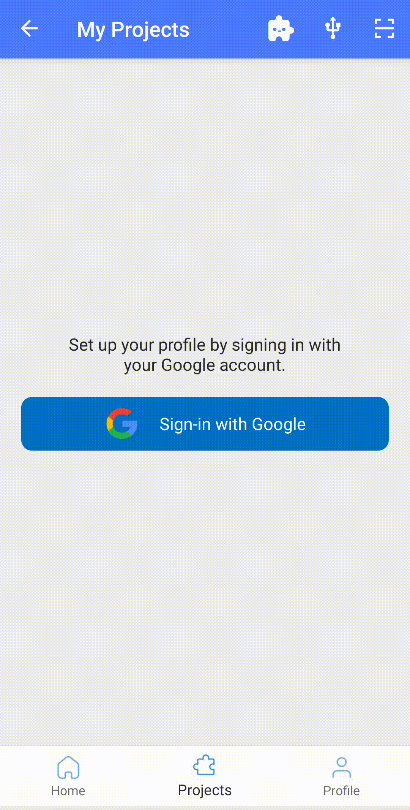
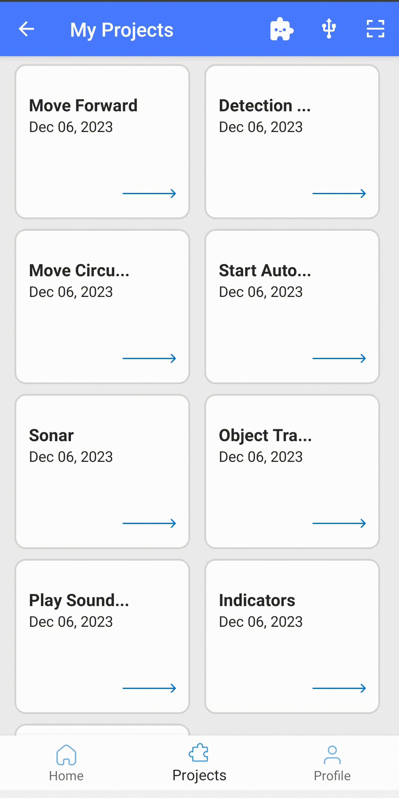

# 로봇 앱

  <a href="README.md">English</a> |
  <a href="README.zh-CN.md">简体中文</a> |
  <a href="README.de-DE.md">Deutsch</a> |
  <a href="README.fr-FR.md">Français</a> |
  <a href="README.es-ES.md">Español</a> |
  한국어

## 면책 조항

1. **안전:** 항상 안전한 환경에서 작동하는지 확인하세요. 충돌 시 전화기가 손상될 수 있다는 점을 명심하세요! 자동 제어(예: 사람 따라가기 또는 운전 모드)를 사용할 때는 특별한 주의가 필요해요. 항상 게임 컨트롤러가 연결되어 있고, 키 매핑을 잘 알고 있어야 언제든지 차량을 멈출 수 있어요. 사용은 전적으로 자신의 책임이에요!
2. **앱 개발 중:** 이 앱은 개발 중에 있으며, 사용자의 전화기 모델과 운영 체제 버전에 따라 충돌하거나 예상치 못한 동작을 할 수 있어요. 바퀴가 연결되지 않은 상태에서 모든 기능을 테스트해 보세요. 사용은 전적으로 자신의 책임이에요!

## 앱 화면

### 메인 메뉴

앱은 모든 사용 가능한 화면을 보여주는 메뉴 화면으로 시작돼요. 설정 화면은 오른쪽 상단 모서리에 있는 아이콘을 클릭하면 열 수 있어요. 다른 아이콘을 클릭하면 여러 가지 화면에 접근할 수 있고, 각 화면의 기능은 아래에서 설명할게요.

### 설정 메뉴

#### USB 연결

USB 아이콘을 탭하면 USB 옵션이 열려요. 드롭다운 메뉴는 전송 속도를 설정하는 데 사용돼요. 기본값은 115200이며, Arduino 펌웨어를 만지지 않는 한 이 값은 변경할 필요가 없어요. 앱은 자동으로 연결을 시도하지만, 문제가 생기면 이 스위치를 사용해 연결을 끊거나 다시 연결할 수 있어요.

#### 권한

여기에서 앱의 권한을 확인하고 필요에 따라 조정할 수 있어요.

#### 비디오 스트리밍

외부 장치로 비디오를 스트리밍할 때 `WebRTC`와 `RTSP` 중에서 선택할 수 있어요. 전화기 제어 앱과 node-js 서버는 `WebRTC`로 설정해야 해요. 파이썬 제어 앱은 스트림이 `RTSP`로 설정되어 있어야 해요.

#### Bluetooth 연결

안드로이드 기기가 BLE (Bluetooth Low Energy)를 지원하는지 확인하세요. 만약 안드로이드 버전이 7.0 이상이라면, 근처의 BLE 장치를 찾으려면 위치 서비스도 켜고 설정에서 위치 권한을 허용해야 해요. BLE를 활성화하려면 설정 메뉴에서 연결 모드를 USB에서 Bluetooth로 변경하면 돼요. 그러면 홈 화면 상단에 Bluetooth 아이콘이 나타날 거예요. Bluetooth 아이콘을 눌러 BLE 스캔을 시작해요. 스캔은 4초 정도 걸리며 근처에 있는 모든 OpenBot BLE 장치 목록을 보여줘요. `Connect` 버튼을 눌러 OpenBot에 연결하면 돼요. 연결이 성공하면 `Connect` 버튼이 `Disconnect`로 변경돼요. 이제 홈 화면으로 돌아갈 수 있어요.

### 자유로운 이동

자유로운 이동은 로봇의 간단한 제어와 실시간 배터리, 속도, 표면에서의 거리 정보를 제공합니다.

- **배터리**: 배터리 아이콘은 연결된 로봇의 실시간 배터리 상태를 보여줍니다.
- **운전 상태**: 뷰에는 3가지 운전 상태가 표시됩니다:
  - D -> 주행, 로봇이 앞으로 움직일 때
  - N -> 중립, 로봇이 정지했을 때
  - R -> 후진, 로봇이 뒤로 움직일 때
    스티어링 휠은 조향 각도에 비례하여 회전합니다.
- **속도**: 속도계는 로봇의 속도를 보여줍니다.
- **소나**: 로봇 앞의 자유로운 거리를 센티미터(cm)로 표시합니다.
- **제어**: 컨트롤러, 주행 모드 및 속도는 [제어 섹션](#control)에서 설명된 대로 로봇 설정을 제어하는 데 사용됩니다.

### 데이터 수집

데이터 세트를 수집할 수 있는 간단한 UI입니다.

- **서버**: [웹 앱](../../policy#web-app)을 통해 정책 훈련을 실행 중이라면, 여기서 선택하여 데이터를 자동으로 업로드할 수 있습니다.
- **미리보기 해상도**: 카메라 미리보기 해상도를 변경하는 데 사용됩니다. 3가지 설정이 있습니다:
  - ***FULL_HD*** (1920x1080p)
  - ***HD*** (1280x720p)
  - ***SD*** (640x360)
- **모델 해상도**: 훈련용 이미지의 해상도를 변경하는 데 사용됩니다.
- **수집된 데이터 저장/버리기**: 데이터 수집 과정은 화면에서 또는 원격으로, 예를 들어 블루투스 컨트롤러로 제어할 수 있습니다. 블루투스 컨트롤러를 사용할 때는:
  - **A 버튼**을 눌러 **데이터 수집 시작**
  - **A 버튼을 다시 누르면** 데이터 수집을 **중지**하고 수집된 데이터를 .zip 파일로 저장
  - 또는 **R1 버튼**을 눌러 데이터 수집을 **중지**하고 **저장하지 않기** (예: 예기치 않은 환경 충돌로 인한 경우)
  - 정확한 버튼을 사용하고 있는지 확인하려면 컨트롤러 매핑 정보를 참조하세요.

### 컨트롤러 매핑

연결된 BT 컨트롤러의 버튼과 조이스틱 매핑을 확인할 수 있는 간단한 UI입니다.

### 로봇 정보

로봇 정보와 기본 기능을 테스트할 수 있는 간단한 UI입니다. 펌웨어에 설정된 **로봇 유형**이 텍스트와 애니메이션으로 표시됩니다. **센서**, **휠 오도메트리**, **LED** 섹션의 체크 표시를 통해 연결된 로봇이 지원하는 기능을 확인할 수 있습니다. **측정값** 섹션에서는 가장 중요한 센서 측정값을 제공합니다. **명령 전송** 섹션에서는 사용자가 해당 버튼을 눌러 기본 모터 명령을 전송하고, 슬라이더를 사용해 앞뒤 LED를 제어할 수 있습니다.

### 오토 파일럿

자동 조종 모델을 실행하기 위한 간단한 UI에요!

- **서버**: [웹 앱](../../policy#web-app)에서 정책 훈련이 실행 중이면, 여기서 선택하고 훈련된 자동 조종 모델을 로봇으로 보낼 수 있어요.
- **모델**: 자동 조종 모드에 사용할 훈련된 모델을 선택해요.
- **장치**: 추론을 위해 CPU, GPU 또는 NNAPI를 사용할 수 있어요 (자세한 내용은 [여기](#device)에서 확인해요).
- **스레드**: 사용할 스레드 수 (CPU가 장치로 선택된 경우에만 차이가 나요).
- **제어**: 제어기, 주행 모드, 속도는 [제어 섹션](#control)에서 설명한 대로 로봇 설정을 제어하는 데 사용돼요.

### 객체 추적

80개의 다른 클래스의 객체를 추적할 수 있는 간단한 UI입니다. 객체 추적을 위한 다양한 AI 모델과 성능 벤치마크에 대한 간략한 설명은 [모델 관리](#model-management)에서 확인할 수 있어요.

- **동적 속도**: 추적 중인 객체에 가까워지면 "자동 모드"에서 로봇 속도가 줄어들어요. 속도는 바운딩 박스의 영역 크기에 따라 조정돼요 (가로 방향에서 가장 잘 작동해요).
- **모델**: 폰 성능에 맞는 객체 탐지기를 선택하세요 (아래의 [벤치마크 결과](#benchmark) 참고).
- **객체**: 추적하고 싶은 객체를 선택하세요. 모델은 80개의 COCO [객체 클래스](https://tech.amikelive.com/node-718/what-object-categories-labels-are-in-coco-dataset/)를 감지할 수 있어요.
- **신뢰도**: 탐지가 받아들여지는지 여부를 결정하는 신뢰도 임계값이에요. 잘못된 탐지가 많으면 신뢰도를 높이고, 원하는 객체가 탐지되지 않으면 낮춰보세요.
- **장치**: 추론을 위해 CPU, GPU 또는 NNAPI를 사용해요 (자세한 내용은 [여기](#device)에서 확인).
- **스레드**: 사용할 스레드 수 (CPU를 장치로 선택했을 때만 차이가 있어요).
- **제어**: 제어기, 주행 모드, 속도는 [제어 섹션](#control)에서 설명한 대로 로봇 설정을 제어하는 데 사용돼요.

### 포인트 목표 네비게이션

이 기능은 ARCore와 카메라 권한이 필요해요! 만약 기기가 ARCore를 지원하지 않는데도 계속 진행하면, 앱이 종료될 수 있어요. 이 화면에서는 로봇의 현재 위치와 방향을 기준으로 2D 벡터를 사용해 목표를 지정할 수 있어요. 2D 벡터는 로봇의 앞과 왼쪽으로의 거리를 미터 단위로 나타내요. 두 값은 음수일 수도 있는데, 그럴 경우 뒤쪽과 오른쪽을 의미해요. 목표를 지정하고 `시작`을 누르면 로봇은 장애물을 피하면서 목표를 달성하려고 AI 정책을 실행할 거예요!

### 모델 관리

모든 모델은 임베디드 장치에서 더 나은 성능을 위해 양자화되었습니다. 아래 섹션에서 사용 가능한 모델과 벤치마크 결과에 대한 간단한 설명을 확인해주세요. [평균 평균 정확도(mAP)](https://kharshit.github.io/blog/2019/09/20/evaluation-metrics-for-object-detection-and-segmentation)은 [COCO Detection 2017](https://cocodataset.org/#detection-2017) 데이터셋의 검증 세트에서 계산됩니다. 각 모델은 약 1분 동안 실행되며, 추론 시간은 마지막 100프레임을 평균내어 초당 프레임 수(fps)로 보고됩니다. 더 큰 입력 해상도를 가진 모델이 mAP가 낮더라도 작은 객체에는 더 유리할 수 있다는 점에 유의하세요.

### 벤치마크

#### 휴대폰

| Model Name       | Chipset        | RAM  | OS |
|------------------|----------------|------|----|
| Samsung S22 Ultra| Exynos 2200    | 12GB | 12 |
| Samsung S20FE 5G | Snapdragon 865 |  6GB | 12 |
| Huawei P30 Pro   | Kirin 980      |  8GB | 10 |
| Google Pixel 6XL | Google Tensor  | 12GB | 12 |
| Xiaomi Mi9       | Snapdragon 855 |  6GB | 10 |
| Google Pixel 4XL | Snapdragon 855 |  6GB | 13 |

#### MobileNetV1-300 (pre-installed) - mAP: 18%

SSD 객체 탐지기, [MobileNet V1](https://tfhub.dev/tensorflow/lite-model/ssd_mobilenet_v1/1/metadata/2) 백본을 사용하고 입력 해상도는 300x300이에요.

|phone/device (fps)| CPU | GPU | NNAPI |
|------------------|-----|-----|-------|
| Samsung S22 Ultra|  33 |  13 |   30  |
| Samsung S20FE 5G |  34 |  57 |   87  |
| Huawei P30 Pro   |  36 |  25 |   10  |
| Google Pixel 6XL |  35 |  42 |   53  |
| Xiaomi Mi9       |  22 |  41 |   33  |
| Google Pixel 4XL |  37 |  36 |   45  |

#### MobileNetV3-320 - mAP: 16%

320x320 해상도의 입력을 가진 MobileNet V3 백본을 사용하는 SSD 객체 탐지기.

|phone/device (fps)| CPU | GPU | NNAPI |
|------------------|-----|-----|-------|
| Samsung S22 Ultra|  30 |  17 |   30  |
| Samsung S20FE 5G |  34 |  42 |   28  |
| Huawei P30 Pro   |  32 |  27 |   23  |
| Google Pixel 6XL |  33 |  43 |   27  |
| Xiaomi Mi9       |  20 |  45 |   10  |
| Google Pixel 4XL |  32 |  38 |   21  |

#### YoloV4-tiny-224 - mAP: 22%

224x224 입력 해상도를 가진 [YoloV4](https://arxiv.org/abs/2004.10934)의 작은 버전이에요!

|phone/device (fps)| CPU | GPU | NNAPI |
|------------------|-----|-----|-------|
| Samsung S22 Ultra|  31 |  12 |   31  |
| Samsung S20FE 5G |  30 |  21 |   14  |
| Huawei P30 Pro   |  27 |  17 |   22  |
| Google Pixel 6XL |  29 |  24 |   19  |
| Xiaomi Mi9       |  16 |  14 |  9.3  |
| Google Pixel 4XL |  22 |  19 |   14  |

#### YoloV4-tiny-416 - mAP: 29%

416x416 해상도의 입력을 사용하는 [YoloV4](https://arxiv.org/abs/2004.10934)의 작은 버전이에요!

|phone/device (fps)| CPU | GPU | NNAPI |
|------------------|-----|-----|-------|
| Samsung S22 Ultra|  13 | 9.8 |   13  |
| Samsung S20FE 5G |  12 | 9.4 |  7.7  |
| Huawei P30 Pro   | 8.4 | 7.6 |  6.9  |
| Google Pixel 6XL |  10 | 9.6 |  7.2  |
| Xiaomi Mi9       | 9.0 | 7.3 |  5.0  |
| Google Pixel 4XL | 7.2 | 7.4 |  6.2  |

#### YoloV4-224 - mAP: 40%

[YoloV4](https://arxiv.org/abs/2004.10934)은 224x224 해상도의 입력을 사용해요!

|phone/device (fps)| CPU | GPU | NNAPI |
|------------------|-----|-----|-------|
| Samsung S22 Ultra| 3.7 | 5.6 |  3.5  |
| Samsung S20FE 5G | 3.1 | 7.1 |  4.2  |
| Huawei P30 Pro   | 2.4 | 6.2 |  0.7  |
| Google Pixel 6XL | 2.7 |  11 |  0.9  |
| Xiaomi Mi9       | 2.1 | 6.4 |  1.7  |
| Google Pixel 4XL | 1.8 | 5.0 |  3.7  |

#### YoloV5s-320 - mAP: 28%

[YoloV5](https://github.com/ultralytics/yolov5)은 320x320 해상도의 입력을 사용해요!

|phone/device (fps)| CPU | GPU | NNAPI |
|------------------|-----|-----|-------|
| Samsung S22 Ultra|  21 |  10 |   21  |
| Xiaomi Mi9       |  13 |  15 |  0.8  |
| Google Pixel 4XL |  12 |  17 |   18  |

#### YoloV5s-640 - mAP: 34%

[YoloV5](https://github.com/ultralytics/yolov5)는 640x640 해상도의 입력을 사용해요!

|phone/device (fps)| CPU | GPU | NNAPI |
|------------------|-----|-----|-------|
| Samsung S22 Ultra| 5.5 | 4.9 |  5.0  |
| Xiaomi Mi9       | 4.1 | 4.6 |   -   |
| Google Pixel 4XL | 3.7 | 4.6 |  4.6  |

#### YoloV5m-320 - mAP: 35%

[YoloV5](https://github.com/ultralytics/yolov5)는 320x320 해상도의 입력을 사용해요!

|phone/device (fps)| CPU | GPU | NNAPI |
|------------------|-----|-----|-------|
| Samsung S22 Ultra|  13 | 8.2 |   11  |
| Xiaomi Mi9       | 9.7 | 9.9 |   -   |
| Google Pixel 4XL | 7.9 | 9.2 |   15  |

#### YoloV5l-320 - mAP: 38%

[YoloV5](https://github.com/ultralytics/yolov5)는 입력 해상도가 320x320인 모델이에요!

|phone/device (fps)| CPU | GPU | NNAPI |
|------------------|-----|-----|-------|
| Samsung S22 Ultra| 7.6 | 3.4 |  7.6  |
| Xiaomi Mi9       | 5.5 | 5.0 |   -   |
| Google Pixel 4XL | 5.3 | 4.0 |  5.3  |

#### EfficientDet-L0-320 - mAP: 26%

[EfficientDet-L0](https://tfhub.dev/tensorflow/lite-model/efficientdet/lite0/detection/metadata/1)은 입력 해상도가 320x320인 모델이에요. 참고로, 가로 모드에서는 모델 성능이 떨어질 수 있으니, 신뢰도 기준을 조정해야 할 수도 있어요!

|phone/device (fps)| CPU | GPU | NNAPI |
|------------------|-----|-----|-------|
| Samsung S22 Ultra|  18 |  10 |   16  |
| Xiaomi Mi9       |  16 |  20 |  1.2  |
| Google Pixel 4XL |  17 |  17 |   16  |

#### EfficientDet-L1-384 - mAP: 31%

[EfficientDet-L1](https://tfhub.dev/tensorflow/lite-model/efficientdet/lite1/detection/metadata/1)은 입력 해상도가 384x384인 모델이에요. 주의: 모델 성능이 가로 모드에서는 떨어질 수 있어요. 그럴 땐 신뢰도 임계값을 조정해야 할 수도 있어요!

|phone/device (fps)| CPU | GPU | NNAPI |
|------------------|-----|-----|-------|
| Samsung S22 Ultra|  12 | 9.2 |   10  |
| Xiaomi Mi9       |  10 |  13 |    -  |
| Google Pixel 4XL |  11 |  11 |   10  |

#### EfficientDet-L2-448 - mAP: 34%

[EfficientDet-L2](https://tfhub.dev/tensorflow/lite-model/efficientdet/lite2/detection/metadata/1)는 입력 해상도가 448x448이에요. 참고로, 가로 모드에서는 모델 성능이 떨어질 수 있어요. 신뢰도 기준을 조정해야 할 수도 있답니다!

|phone/device (fps)| CPU | GPU | NNAPI |
|------------------|-----|-----|-------|
| Samsung S22 Ultra| 9.8 | 8.4 |  8.2  |
| Xiaomi Mi9       | 6.4 | 9.4 |   -   |
| Google Pixel 4XL | 7.7 | 8.3 |  7.6  |

### 기본 설정

[DefaultActivity](src/main/java/org/openbot/original/DefaultActivity.java)는 OpenBot 앱의 가장 중요한 기능들을 한 화면에 담고 있어요. 차량과의 연결 상태를 표시하고, 차량 센서에서 측정된 값을 보고해요. 로봇은 표준 BT 게임 컨트롤러나 OpenBot [컨트롤러 앱](../controller)을 실행하는 다른 스마트폰으로 제어할 수 있어요. 또한, 로봇과 함께 데이터셋을 수집할 수 있는 데이터 로거도 구현했답니다. 현재는 카메라, 자이로스코프, 가속도계, 자기계, 주변 광 센서, 기압계에서 측정된 값을 기록하고 있어요. Android API를 사용해 다음과 같은 센서 값을 얻을 수 있어요: RGB 이미지, 각속도, 선형 가속도, 중력, 자기장 강도, 빛의 강도, 대기압, 위도, 경도, 고도, 방향, 속도. 또한, 전화기의 센서 외에도 바퀴 오도메트리, 장애물 거리, 배터리 전압 등의 본체 센서 값을 기록하며, 이는 직렬 연결을 통해 전송돼요. 연결된 컨트롤러에서 받은 제어 신호도 기록하고 타임스탬프를 추가해요. 마지막으로, 사람 추적 및 자율 항법을 위한 여러 신경망을 통합하고 있어요.

  

#### USB 연결

[설정 메뉴](#설정-메뉴)와 동일해요.

#### 차량 상태

**배터리** 필드는 Arduino가 전압 분배기를 통해 측정한 배터리 전압을 표시해요. **속도 (왼쪽, 오른쪽)** 필드는 (앞) 바퀴의 왼쪽과 오른쪽 속도를 rpm으로 나타내요. 이는 Arduino가 광학 휠 속도 센서를 통해 측정해요. **소나** 필드는 차량 앞쪽의 자유 공간을 센티미터 단위로 표시해요. 이는 Arduino가 초음파 센서를 통해 측정한 값이에요. 참고로, USB 연결이 설정된 후 몇 초 후에만 값을 받을 수 있어요!

#### 제어

첫 번째 버튼은 **제어 모드**를 선택하는 버튼이에요. 두 가지 제어 모드가 있어요:

- **게임패드**: 앱은 연결된 BT 컨트롤러로부터 제어를 받아요.
- **폰**: 로봇은 다른 스마트폰에서 컨트롤러 앱을 실행하거나, 같은 네트워크에 연결된 컴퓨터에서 파이썬 스크립트를 실행하여 제어할 수 있어요.

두 번째 버튼은 **주행 모드**를 선택하는 버튼이에요. 게임패드를 사용할 때는 세 가지 주행 모드가 있어요 (예: PS4):

- **게임**: 오른쪽과 왼쪽 어깨 트리거(R2, L2)를 사용하여 전진과 후진 스로틀을 조정하고, 조이스틱을 사용해 조향을 해요. 이 모드는 자동차 경주 비디오 게임의 제어 모드를 따라해요.
- **조이스틱**: 조이스틱 중 하나를 사용해 로봇을 제어할 수 있어요.
- **듀얼**: 왼쪽과 오른쪽 조이스틱을 사용해 자동차의 왼쪽과 오른쪽을 각각 제어해요. 이건 원시적인 차동 조향이에요.

세 번째 버튼은 **속도 모드**를 선택하는 버튼이에요. 세 가지 속도 모드가 있어요:

- **느림**: 모터에 가해지는 전압이 입력 전압의 50%로 제한돼요 (~6V).
- **보통**: 모터에 가해지는 전압이 입력 전압의 75%로 제한돼요 (~9V).
- **빠름**: 제한이 없어요. 전체 입력 전압이 풀 스로틀로 모터에 가해져요 (~12V). *이 모드는 신경망을 실행하는 기본 설정이에요.*

더 높은 속도로 실행하면 모터의 수명이 줄어들지만, 더 재밌어요. 로봇에 전달되는 제어 신호는 오른쪽에 표시돼요. 게임패드를 사용할 때, 오른쪽 조이스틱(R3)을 눌러서 속도 모드를 높일 수 있고, 왼쪽 조이스틱(L3)을 눌러서 속도 모드를 낮출 수 있어요.

#### 데이터 로그

로그 모드에는 네 가지가 있어요:

- **only_sensors**: 모든 센서 데이터는 저장되지만 이미지가 저장되지 않아요.
- **crop_img**: 모든 센서 데이터와 네트워크 입력 크기에 맞게 잘린 이미지가 저장돼요. 이게 기본 설정이고 데이터 수집할 때 사용하면 좋아요!
- **preview_img**: 모든 센서 데이터와 전체 크기 이미지가 저장돼요. 이 모드는 많은 메모리를 사용하고 좀 느릴 수 있어요. 하지만 FPV 영상 만들 때는 좋아요!
- **all_imgs**: 모든 센서 데이터와 잘린 이미지, 전체 크기 이미지가 모두 저장돼요. 메모리를 많이 쓰고 속도가 느릴 수 있어요.

오른쪽에 있는 스위치를 사용하면 로그를 켜고 끌 수 있어요. 게임 컨트롤러에서는 X 버튼으로 이 스위치를 조작할 수 있어요!

#### 카메라

첫 번째 항목은 미리보기 해상도를 표시합니다. 두 번째 항목은 크롭 해상도를 표시합니다. 이 이미지는 신경망에 입력되는 이미지입니다. 아래에서 선택하는 모델에 따라 이 해상도가 달라진다는 점을 알 수 있을 거예요. 만약 자신의 자율주행기를 훈련시키고 있다면 `AUTOPILOT_F` 모델을 선택해야 해요. 크롭 해상도는 `256x96`이어야 합니다. 오른쪽의 스위치는 후방 카메라와 전방 카메라를 전환하는 데 사용됩니다.

#### 모델

앱에는 두 가지 모델이 포함되어 있어요:

- **MobileNetV1-300**: 이 모델은 사람을 따라가는 데 사용돼요. SSD 객체 감지기를 사용하고 MobileNet V1 백본을 이용해요. 이 모델은 임베디드 장치에서 더 나은 성능을 위해 양자화되어 있어요. 이 모델은 앱과 함께 제공돼요.
- **CIL-Mobile**: 이 모델은 자율주행에 사용돼요. 카메라 입력으로부터 직접 제어를 예측해요. 이 모델은 여러분의 환경에서 제대로 작동하지 않을 수도 있어요. [운전 정책](../../policy)을 훈련시켜서 교체하는 방법을 따라야 해요.

추가 모델은 모델 관리 화면에서 다운로드할 수 있어요.

오른쪽의 스위치는 네트워크를 켜거나 끄는 데 사용돼요. 네트워크가 실행 중일 때는 로봇에 대한 제어가 이루어지고 게임 컨트롤러는 비활성화돼요. 하지만 여전히 게임 컨트롤러의 버튼을 사용할 수 있어요, 예를 들어 R1 트리거 버튼으로 이 스위치를 전환하여 로봇의 제어를 되찾을 수 있어요.

#### 장치

드롭다운 메뉴를 사용하여 신경망을 실행할 장치를 선택할 수 있어요. 선택할 수 있는 장치는 다음과 같아요:

- **CPU**: CPU를 사용하면 대부분의 스마트폰에서 작동하고 기본 선택이에요. 성능 최적화를 위해 스레드 수를 조정할 수 있어요.
- **GPU**: 대부분의 스마트폰에는 GPU가 있어요. 이미지와 같은 큰 입력을 처리할 때는 GPU가 더 빠를 수 있어요.
- **NNAPI**: 이 옵션은 [TensorFlow Lite NNAPI 델리게이트](https://www.tensorflow.org/lite/performance/nnapi)를 사용해요. 최신 스마트폰은 전용 AI 가속기를 갖추고 있을 수 있어요. [신경망 API](https://developer.android.com/ndk/guides/neuralnetworks)(NNAPI)는 GPU, 디지털 신호 처리기(DSP), 신경 처리 장치(NPU)가 있는 Android 장치에서 TensorFlow Lite 모델을 가속화해요. 하지만 오래된 스마트폰에서는 이 기능이 매우 느릴 수 있어요!

모델이 활성화되면, 모델을 실행하는 장치 옆에 추론 속도가 [ms]로 표시돼요.

### 프로젝트 화면

프로젝트 화면은 Google 계정으로 로그인한 경우 OpenBot Playground 프로젝트 목록을 표시해요. 이 프로젝트들을 실행하여 OpenBot과 연결하거나, 화면 오른쪽 상단의 스캐너 아이콘을 클릭하여 QR 코드를 스캔할 수 있어요. 로그인하지 않으면 Google 로그인 버튼이 표시되지만, 프로젝트의 QR 코드는 로그인하지 않고도 스캔할 수 있어요. 로그인 후 `Oops, no project found`라는 메시지가 화면에 표시되면, 해당 계정에 Google Drive에 저장된 프로젝트가 있는지 확인하세요.

최신 프로젝트가 프로젝트 목록에 보이지 않으면 프로젝트 화면을 아래로 끌어당겨 새로 고침할 수 있어요.

- **Google Drive 프로젝트**: Google Drive 프로젝트를 실행하려면 실행하고 싶은 프로젝트를 탭하고, 프로젝트 파일의 내용이 읽힐 때까지 기다려요. 파일이 성공적으로 오류 없이 읽혀지면, `Start`와 `Cancel` 두 개의 버튼이 있는 팝업이 나타나요. 팝업에는 실행하려는 프로젝트의 이름도 표시돼요. 프로젝트를 실행하려면 `Start` 버튼을 클릭하고, 활동을 중지하려면 `Cancel` 버튼을 클릭해요. 만약 `Something went wrong`라는 팝업 메시지가 나타나면, Google Drive 파일에 문제가 있을 수 있어요. 이 문제를 해결하려면 프로젝트 화면을 새로 고침하고 동일한 절차를 반복하세요.

- **QR 코드 스캐너**: Playground 프로젝트의 QR 코드를 스캔하려면 화면 오른쪽 상단에 있는 QR 코드 아이콘을 클릭해요. 앱이 카메라 접근을 허용하도록 해서 QR 코드를 스캔할 수 있게 해요. 코드가 스캔되면, 파일의 내용이 읽히기를 기다려요. 파일이 오류 없이 성공적으로 읽혀지면, `Start`와 `Cancel` 버튼이 있는 팝업이 나타나요. 팝업에는 실행하려는 프로젝트의 이름도 표시돼요. 프로젝트를 실행하려면 `Start` 버튼을 클릭하고, 활동을 중지하려면 `Cancel` 버튼을 클릭해요. 만약 `Something went wrong`이라는 팝업 메시지가 나타나면, Google Drive 파일에 문제가 있을 수 있어요. 이 문제를 해결하려면 Playground에서 새로운 QR 코드를 생성하고 동일한 절차를 반복하세요.

- **프로젝트 실행**: OpenBot Playground 프로젝트가 성공적으로 실행되면, 화면에 코드 블록 이름과 함께 Playground 블록 명령을 중지할 수 있는 정지 버튼이 표시돼요.

- **프로젝트 삭제**: 프로젝트를 삭제하려면 삭제하려는 프로젝트를 길게 눌러요. 그러면 삭제 확인 팝업 화면이 나타나요. 'Yes'를 탭하여 프로젝트를 삭제해요.

### 프로필 화면
앱의 프로필 화면은 사용자가 로그인했는지 여부에 따라 다양한 옵션을 제공합니다.
사용자가 로그인하지 않은 경우, 'Google 로그인' 버튼이 나타나며 사용자가 Google 계정으로 로그인하도록 유도합니다. 로그인 후에는 프로필과 다른 기능을 이용할 수 있습니다.
사용자가 로그인한 경우, '프로필' 탭에 두 개의 버튼이 표시됩니다: '프로필 수정'과 '로그아웃'.

- **프로필 수정**: 이 버튼을 누르면 사용자가 이름과 프로필 사진 등 프로필 정보를 업데이트할 수 있는 새 화면이 열립니다.

- **로그아웃**: 이 버튼을 누르면 사용자가 계정에서 로그아웃됩니다. 이 버튼을 눌렀을 때 사용자는 로그아웃되고 로그인 화면으로 돌아갑니다.

  

  
  
  

### OpenBot 플레이그라운드 화면

OpenBot Playground 서비스를 이용하려면 화면 상단의 툴바 옵션에서 OpenBot Playground 아이콘을 클릭하세요. OpenBot Playground에 대해 더 알아보려면 [여기](../../open-code/README.md)를 클릭하세요.

## 나만의 프래그먼트 추가하기

나만의 프래그먼트를 OpenBot 앱에 추가하는 방법은 [기여 가이드](ContributionGuide.md)를 참조하세요.

## 코드 구조

[TensorFlow Lite 객체 탐지 안드로이드 데모](https://github.com/tensorflow/examples/tree/master/lite/examples/object_detection/android)가 TFLite 모델을 통합하고 카메라 피드를 받기 위한 출발점으로 사용되었습니다. [DefaultActivity](src/main/java/org/openbot/robot/DefaultActivity.java)는 메인 스레드를 실행하며 [CameraActivity](src/main/java/org/openbot/robot/CameraActivity.java)에서 상속받아 카메라와 UI를 관리합니다. [SensorService](src/main/java/org/openbot/robot/SensorService.java)는 다른 모든 전화 센서를 읽고 기록합니다. [ServerService](src/main/java/org/openbot/robot/ServerService.java)와 [NsdService](src/main/java/org/openbot/robot/NsdService.java)는 로컬 [Python 서버](../../policy/README.md#web-app)와 연결을 설정합니다. 데이터를 수집하면 자동으로 시각화, ML 모델 훈련, 훈련된 모델을 로봇으로 다운로드하는 기능을 지원합니다. [env](src/main/java/org/openbot/env) 폴더에는 [Vehicle](src/main/java/org/openbot/env/Vehicle.java) 인터페이스, [GameController](src/main/java/org/openbot/env/GameController.java) 인터페이스, [PhoneController](src/main/java/org/openbot/env/PhoneController.java) 인터페이스와 소리 피드백을 위한 [AudioPlayer](src/main/java/org/openbot/env/AudioPlayer.java) 클래스가 포함되어 있습니다. [tflite](src/main/java/org/openbot/tflite) 폴더는 [Autopilot](src/main/java/org/openbot/tflite/Autopilot.java)와 [Detector](src/main/java/org/openbot/tflite/Detector.java) 네트워크의 모델 정의를 포함합니다.

## 다음 (선택 사항)

자신만의 [운전 정책](../../policy/README.ko-KR.md) 훈련하기
