## Google Firebase

<p align="center">
  <span>English</span> |
  <a href="README.zh-CN.md">简体中文</a> |
  <a href="README.de-DE.md">Deutsch</a> |
  <a href="README.fr-FR.md">Français</a> |
  <a href="README.es-ES.md">Español</a>
</p>

Google Firebase is a mobile and web application development platform that offers a variety of services and tools to help developers build high-quality apps quickly and efficiently. It includes features such as real-time database, user authentication, hosting, cloud storage and many more, all these are integrated into a single platform. Firebase provides a convenient and scalable solution for developers to manage their backend infrastructure, allowing them to focus on building great user experiences.

- ### Firebase Google Sign-In Authentication

  Firebase Google Sign-In Authentication is a feature of the Firebase platform that allows users to sign in to mobile or web apps using their Google credentials. This service provides a secure and convenient way for users to access apps without having to remember and manage separate login credentials. Firebase manages the entire authentication process, from verifying the user's identity with Google to providing a unique user ID that can be used to personalize the user's experience within the app. This feature also includes additional security measures, such as two-factor authentication, to help protect user's account from unauthorized access.

- ### Usage
  In this application, we use Firebase for Google Sign-In authentication to access [OpenBot Playground](../../../../../../../../open-code/README.md) projects uploaded on Google Drive. If you plan to clone this Android application and build it on your device, it's important to note that you will need to set up your own [Firebase Project](#set-up-your-firebase-project). This is because the SHA-1 key is required for Google Sign-In authentication. 
  
  And you will need to [set up Firebase](../../../../../../../../open-code/README.md) for the [OpenBot Playground](https://www.playground.openbot.org/) web application as well. This is because the Android app retrieves files from the user's Google Drive, which is created by Firebase Google Drive services. It's important to use the same Firebase project for both the Android and web applications for Google Drive services to work properly.
  
  If you do not want to use OpenBot Playground services, you do not need to set up Firebase authentication or Google Sign-In authentication.

### Prerequisites
To integrate Firebase into an Android OpenBot application for Google Sign-In, we will need a few prerequisites.
- **Google Account:** To use Google Sign-In with Firebase, you must have a Google account. If you don't have one, click here to [create](https://accounts.google.com/signup) free Google account.
- **Firebase Account:** You need to have a Firebase account and create a new Firebase project for your Android application. You can create a new Firebase project from the [Firebase Console](https://console.firebase.google.com/).
****

### Set up your Firebase project

- Go to the [Firebase Console](https://console.firebase.google.com/) and create a `new project` following these steps.
  1. Click on the "Create Project" button.
  2. Enter a name for your Firebase project and click "Next" button.
  3. Google Analytics can be disabled if you do not want to use them.
  4. Click on the "Create Project" button.
<p>
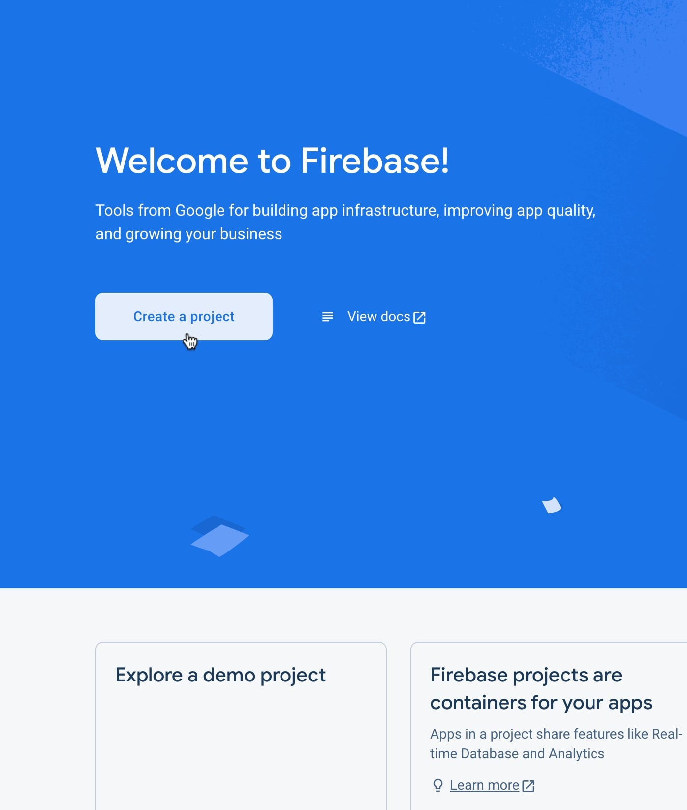
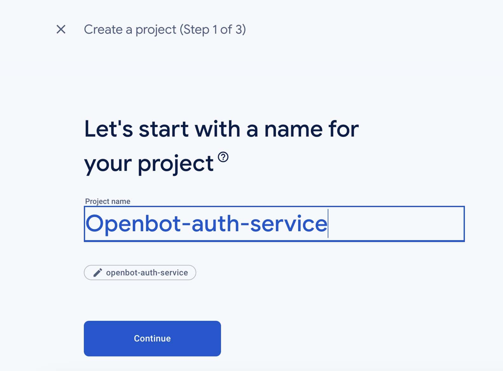
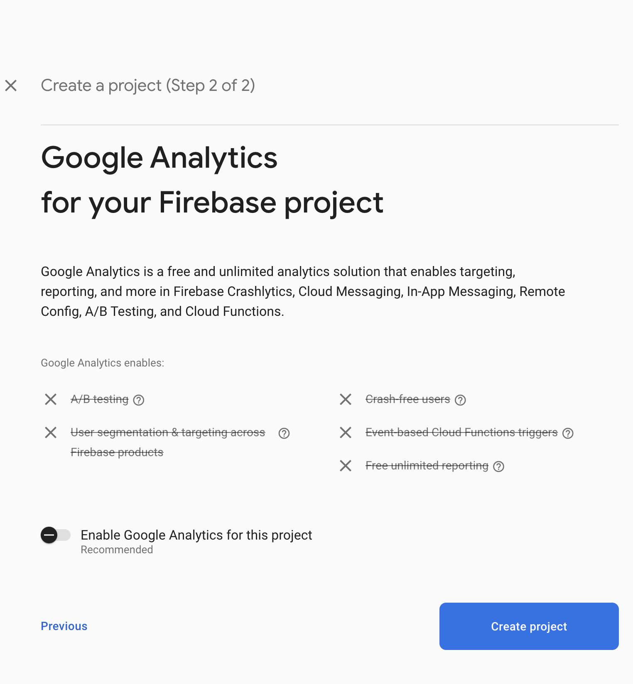
</p>

- To add a new Android app to your Firebase project, do the following:
  1. Click on the Android icon in the Firebase project.
  2. Enter `package name` of your Android app. This should be `unique` for Firebase.
  3. Enter your app's nickname.
  4. The **SHA-1 key** is **mandatory** for Firebase Google SignIn service to sign your application's APK. Enter it in the appropriate field.
  5. Click on the `Register` button.
  

- About the `SHA-1` fingerprint/key is a unique identifier for your `app's signing certificate`, and is used by Firebase to verify the authenticity of your app when communicating with Firebase servers. If you plan to use Firebase Authentication in your app, you will need to provide an `SHA-1` key `for the signing certificate` used to sign the `release version` of your app.
  
<p>
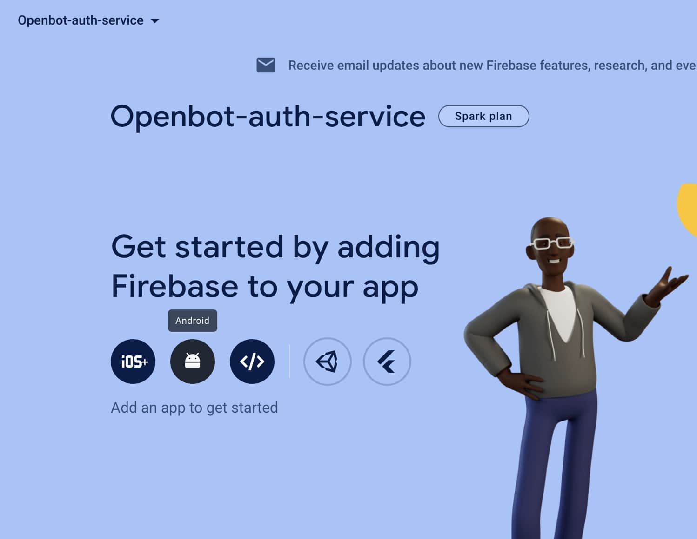
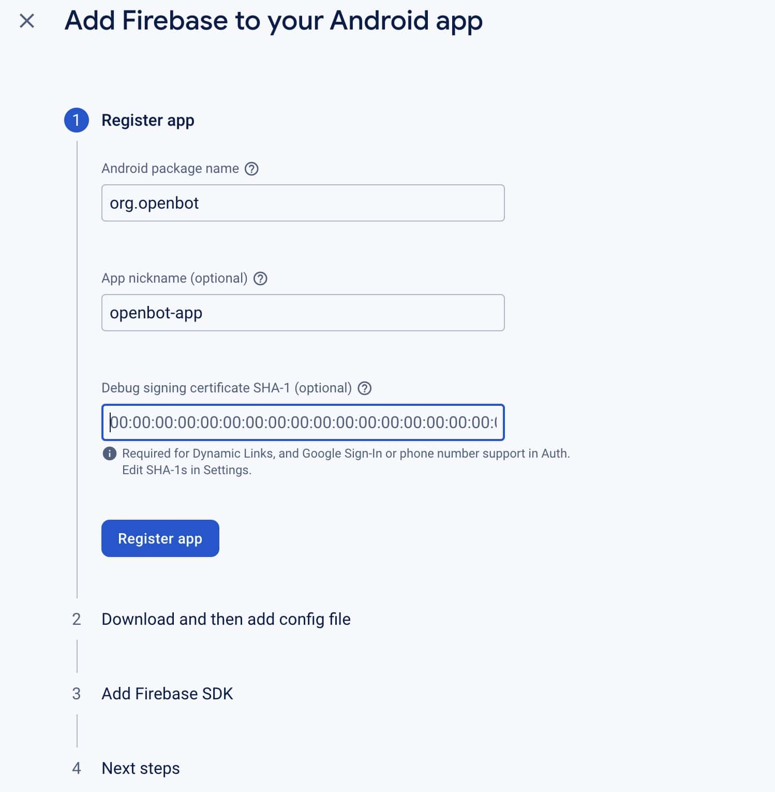
</p>

- To obtain the `SHA-1` key, you can use the `keytool` (command-line tool) that is included with the `Java SDK`. Here's how to use it on `Mac` and `Windows`:
  

  - **On Mac**
    ```shell
    keytool -list -v -keystore ~/.android/debug.keystore -alias androiddebugkey -storepass android -keypass android
    ```
    This command will list the details of the debug signing certificate located at `~/.android/debug.keystore`. The `-alias` flag specifies the alias name used to identify the debug signing certificate. The `-storepass` and `-keypass` flags specify the passwords for the keystore and key, respectively.
  

  - **On Windows**
    ```shell 
    keytool -list -v -keystore "%USERPROFILE%.android\debug.keystore" -alias androiddebugkey -storepass android -keypass android
    ```
    This command is similar to the Mac command, but uses a `different path` to locate the debug.keystore file. `%USERPROFILE%` is a system environment variable that points to the current user's profile directory, which contains the `.android` directory where the `debug.keystore` file is located.

- Download the `google-services.json` file and `add` it to your Application's `app directory` and also `assets directory`.
- Click on the next button, And you have to skip the third step because we already **add firebase SDK** in gradle file for this project.
- Continue to the Firebase Console to configure the Firebase services you want to use in your Android app.

<p>
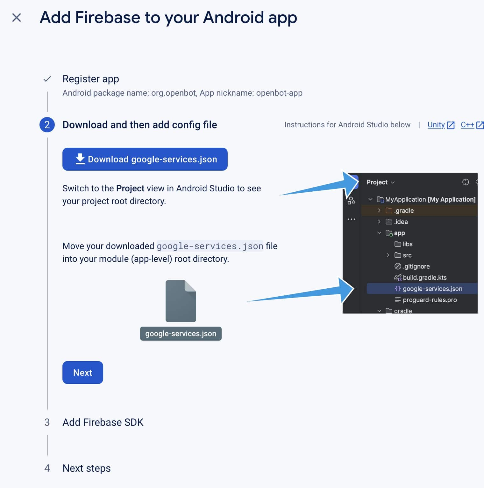
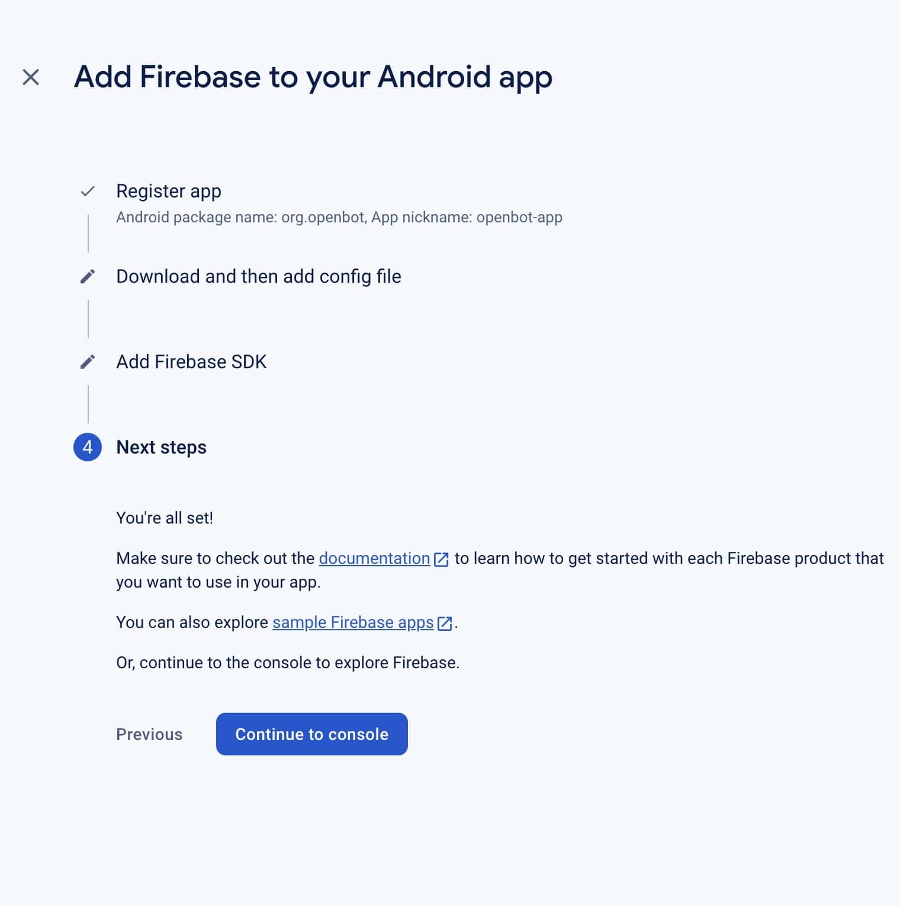
</p>

- To `enable Google Sign-In authentication` for your Firebase project, follow these steps:
  1. Go to the Firebase Console and select your project.
  2. Click on the `All products` option in the left `sidebar menu`.
  3. Click on `Authentication`.
  4. Click on the `Get Started` button.
  5. Click on the `Google icon`.
  6. Click on the `toggle button` to `enable` Google Sign-In authentication.

<p>

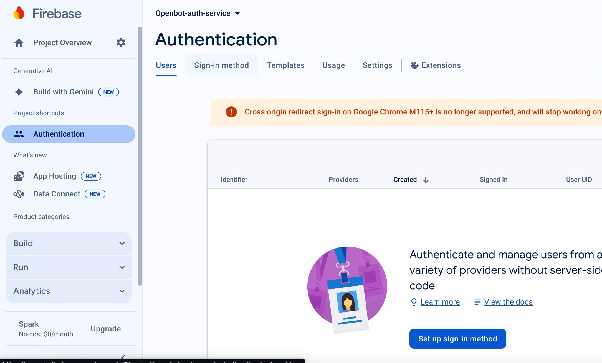
</p>
<p>
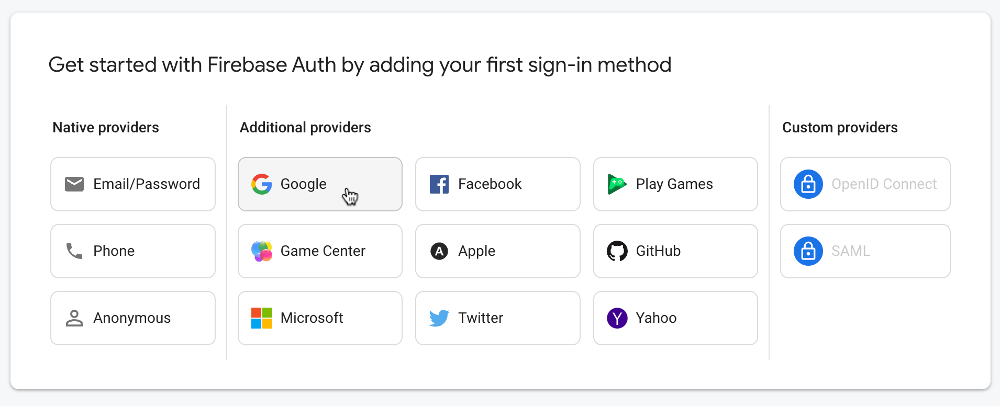

</p>


- If you have `skipped the step to add the SHA-1 key` to your Firebase project during the setup process, you can `still add` it later by following these steps:

  - Go to your `Firebase console` and select `your project`.
  - Click on the `gear icon` in the `upper-left corner` and select `Project settings`.
  - Under `Your apps` section, select the `Android app` you want to `add the SHA-1 key`.
  - `Scroll down` to the `SHA-1 certificate fingerprints` section and click on `Add fingerprint`.
  - Enter the `SHA-1 key` for your app's signing certificate.
  - Click on `Save` to add the SHA-1 key to your Firebase project.

<p>
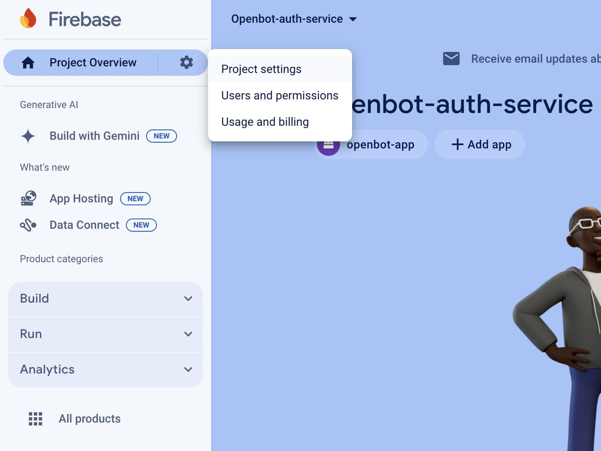
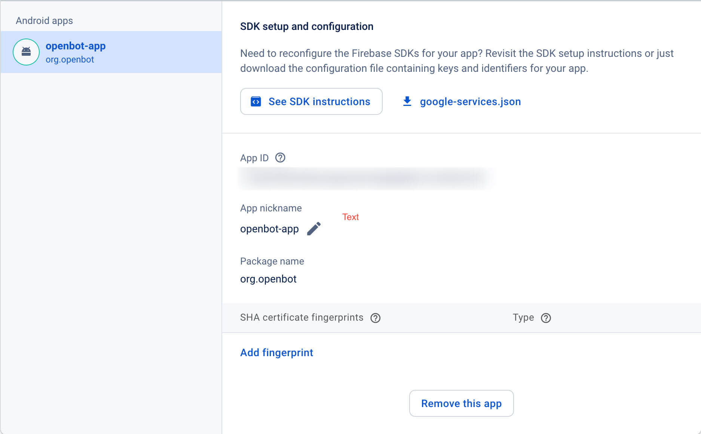
</p>

- If you have `already implemented Firebase authentication` before adding the SHA-1 key, you may need to `update` your app's `configuration`. This can be done by `replacing` the `google-services.json` file in project directory with the `updated google-services.json` file from Firebase project setting.

<p>
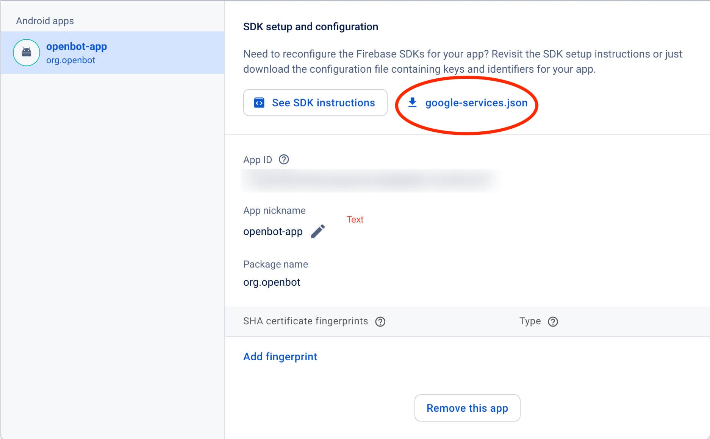
</p>
