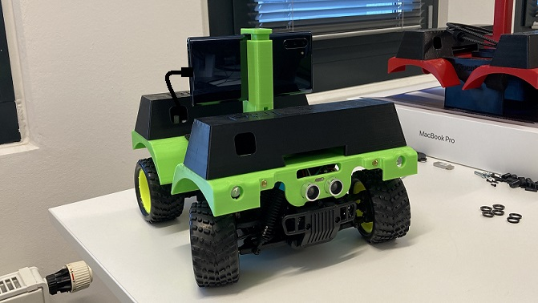

# OpenBot: Cuerpo del Robot

  <a href="README.md">English</a> |
  <a href="README.zh-CN.md">简体中文</a> |
  <a href="README.de-DE.md">Deutsch</a> |
  <a href="README.fr-FR.md">Français</a> |
  Español

Puedes comprar un OpenBot [listo para usar (RTR)](rtr) en Amazon:
- [RTR-TT](https://buy.openbot.org/rtr-tt)
- [RTR-520](https://buy.openbot.org/rtr-520)

Para pedidos más grandes, por favor contáctanos por correo electrónico.

## Construyendo el tuyo propio

Puedes construir cualquier cuerpo de robot con ruedas alrededor de un microcontrolador como el Arduino Nano para usar con el conjunto de software de OpenBot. Hemos diseñado un [cuerpo impreso en 3D](diy) para un robot con ruedas que se basa en hardware de hobby de bajo costo y fácilmente disponible. [OpenBot Lite](lite) es una variante más pequeña y simplificada de la versión DIY de OpenBot desarrollada para la educación. Incluso si no deseas construirlo, puedes encontrar útiles las [guías en video paso a paso](lite/#step-by-step-video-guides). También hemos diseñado un [cuerpo impreso en 3D](rc_truck) para camiones RC 1:16 disponibles comercialmente (como [este](https://www.amazon.de/dp/B00M3J7DJW)). También proporcionamos planos para construir un [vehículo multi-terreno](mtv), como una plataforma de propósito general para proyectos al aire libre utilizando el marco de OpenBot.

A continuación, se presentan varios ejemplos con instrucciones de construcción y más detalles:

<table style="width:100%;border:none;text-align:center">
  <tr>
  <td>  
  </td>
  <td>
  
  </td>
  <td>
  
  </td>
  <td>
  
  </td>
  <td>
  
  </td>
  </tr>
  <tr>
    <td><a href="diy"> DIY </a></td>
    <td><a href="lite"> Lite </a></td>
    <td><a href="rc_truck"> RC Truck </a></td>
    <td><a href="mtv"> Vehículo Multi-Terreno </a></td>
    <td><a href="rtr"> RTR </a></td>
  </tr>
</table>

## Siguiente

Flashea el [Firmware de Arduino](../firmware/README.es-ES.md)