# OpenBot: Robot Body

  English |
  <a href="README_CN.md">简体中文</a>

We have designed a body for a wheeled robot which relies on low-cost, readily available hobby hardware.

## Chassis

### 3D printing

You will need to print the following parts in order to build your OpenBot.

1) body_bottom ([STL](cad/regular_body/body_bottom.stl), [STEP](cad/regular_body/body_bottom.step))
2) body_top ([STL](cad/regular_body/body_top.stl), [STEP](cad/regular_body/body_top.step))
3) phone_mount_bottom ([STL](cad/phone_mount/phone_mount_bottom.stl), [STEP](cad/phone_mount/phone_mount_bottom.step))
4) phone_mount_top ([STL](cad/phone_mount/phone_mount_top.stl), [STEP](cad/phone_mount/phone_mount_top.step))

For the above parts, your build plate needs to be at least 240mmx150mm.

Since a lot of common 3D printers have a smaller build volume, we have also made a [slim body](cad/slim_body/README.md) which fits on a 220mmx220mm build plate at 45 degrees.

For printing on 3D printers with even smaller build volumes, there is also a [glueable body](cad/glue_body/README.md) which fits on a 150mmx140mm build plate. Thanks to @sloretz.

On an Ultimaker S5, we achieved good results with the following settings:

- layer height: 0.2mm
- wall thickness: 1.5mm
- infill density: 20%
- infill pattern: grid
- print speed 80 mm/s
- no support

We were able to print the chassis with PLA, ABS and CPE. In our experience the print was not affected very much by the print settings. However, if you have the patience, printing slower and with smaller layer height will improve the print. Also adding a support structure can improve the print, but it will require additional work to remove afterwards.

Before you proceed with the build, you may need to clean the 3D print.

  
  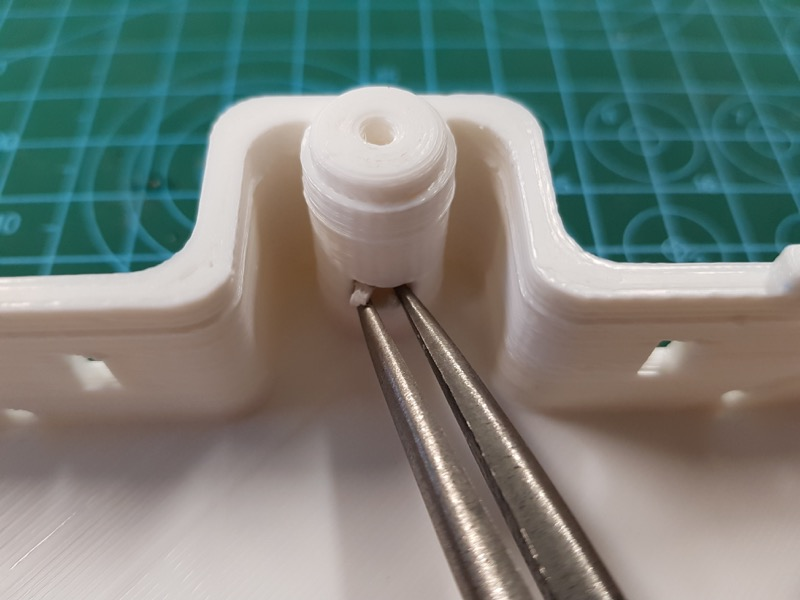 
  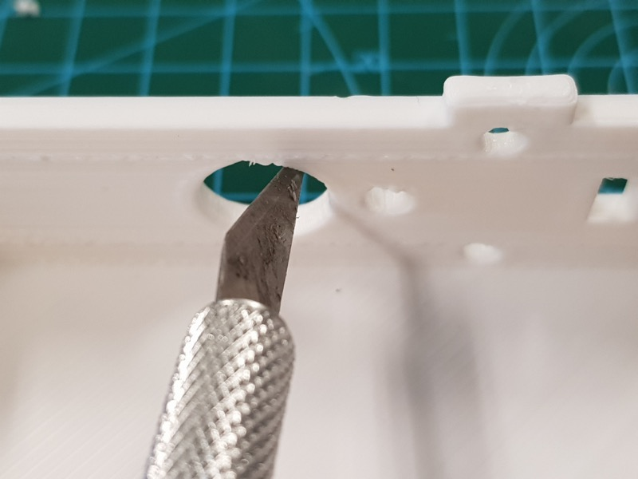

### Alternatives

If you do not have access to a 3D printer, there are several Arduino robot car kits available which you can use as a starting point. These kits come with a chassis, motors and accessories. We recommend to get a basic kit, since you won't need a lot of the electronics and sensors of the more expensive kits. Here are some options:

- Perseids DIY Robot Smart Car Chassis Kit ([EU](https://www.amazon.de/dp/B07DNXBNHY), [US](https://www.amazon.com/dp/B07DNXBFQN))
- SZDoit 4WD Smart Metal Robot Car Chassis Kit ([US](https://www.amazon.com/dp/B083K4RKBP), [AE](https://www.aliexpress.com/item/33048227237.html))
- Joy-it Robot Car Kit 01 ([EU](https://www.amazon.de/dp/B073ZGJF28))
- Smart Car Kit 4WD Smart Robot Car Chassis Kit ([AE](https://www.aliexpress.com/item/4001238626191.html))

You will also need a phone mount. Here is one option:

- Mpow Dashboard Car Phone Mount ([EU](https://www.amazon.de/dp/B0762GS7MS), [US](https://www.amazon.com/dp/B08BYFP9BZ))

You can also get creative and build your own OpenBot chassis and phone mount using a material of your choice (e.g. wood, cardboard, styrofoam, etc.). If you do, please post some pictures on the [Slack channel](https://github.com/intel-isl/OpenBot#contact) so others can admire your creativity. Here is one example by [@custom-build-robots](https://custom-build-robots.com/roboter/openbot-dein-smartphone-steuert-ein-roboter-auto-chassis-bauen/13636):

  
  
  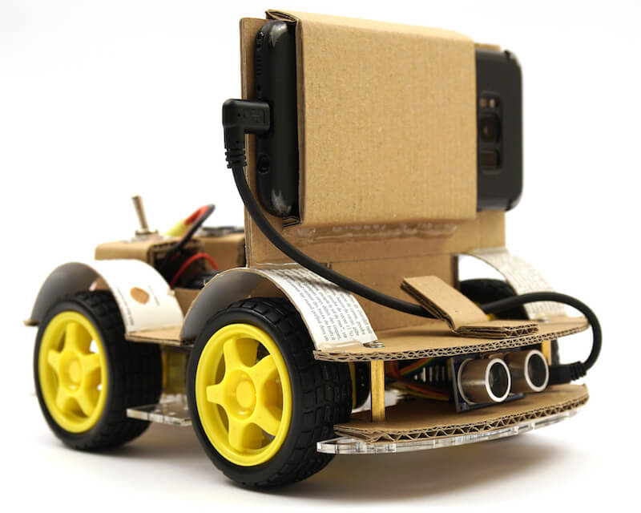

## Assembly

There are two different options for assembly of the robot, DIY and PCB. The DIY approach relies on the popular L298N motor driver and is recommended for hobbyists with some electronics experience. It requires a fair amount of wiring, especially if all the sensors and LEDs are installed. However, all components are readily available in most contries and especially for single builds or just to try out the project, the DIY option is recommended. In order to reduce the wiring and make assembly easier, we have also developed a [custom PCB](pcb). This is recommended if you desire a cleaner build or want to build multiple OpenBots.

### Bill of materials

Our robot body relies on readily available hobby electronics. We provide links for Germany (EU) and the United States (US) with fast shipping. If you have the patience to wait a bit longer, you can also get the compoenents a lot cheaper from AliExpress (AE). You will need the following components.

#### Required components

- 1x Arduino Nano ([EU](https://www.amazon.de/dp/B01MS7DUEM), [US](https://www.amazon.com/dp/B00NLAMS9C), [AE](https://www.aliexpress.com/item/32866959979.html))
- 4x TT motors with tires ([EU](https://www.conrad.de/de/p/joy-it-com-motor01-getriebemotor-gelb-schwarz-passend-fuer-einplatinen-computer-arduino-banana-pi-cubieboard-raspbe-1573543.html), [US](https://www.amazon.com/dp/B081YQM55P), [AE](https://www.aliexpress.com/item/4000126948489.html))
- 3x 18650 battery ([EU](https://www.conrad.de/de/p/conrad-energy-18650-usb-spezial-akku-18650-li-ion-3-7-v-1400-mah-1525536.html), [US](https://www.amazon.com/dp/B083K4XSKG), [AE](https://www.aliexpress.com/item/32352434845.html))
- 1x 18650 battery holder([EU](https://www.amazon.de/dp/B075V25QJ9), [US](https://www.amazon.com/dp/B07DWQYD7H), [AE](https://www.aliexpress.com/item/33037738446.html))
- 1x USB OTG cable ([EU](https://www.amazon.de/gp/product/B075M4CQHZ) ,[US](https://www.amazon.com/dp/B07LBHKTMM), [AE](https://www.aliexpress.com/item/10000330515850.html))
- 1x spring or rubber band ([EU](https://www.amazon.de/gp/product/B01N30EAZO/), [US](https://www.amazon.com/dp/B008RFVWU2), [AE](https://www.aliexpress.com/item/33043769059.html))
- 16x M3x25 screw ([EU](https://www.amazon.de/dp/B07KFL3SSV), [US](https://www.amazon.com/dp/B07WJL3P3X), [AE](https://www.aliexpress.com/item/4000173341865.html))
- 16x M3 nut ([EU](https://www.amazon.de/dp/B07JMF3KMD), [US](https://www.amazon.com/dp/B071NLDW56), [AE](https://www.aliexpress.com/item/32977174437.html))
- 6x M3x5 screw ([EU](https://www.amazon.de/dp/B01HBRG3W8), [US](https://www.amazon.com/dp/B07MBHMLL2), [AE](https://www.aliexpress.com/item/32892594230.html))
- Dupont cables ([EU](https://www.amazon.de/dp/B07KYHBVR7), [US](https://www.amazon.com/dp/B07GD2BWPY), [AE](https://www.aliexpress.com/item/4000766001685.html))

#### Optional components

- 2 x Speed Sensor ([EU](https://www.conrad.de/de/p/joy-it-sen-speed-erweiterungsmodul-passend-fuer-einplatinen-computer-arduino-banana-pi-cubieboard-raspberry-pi-pc-1646891.html), [US](https://www.amazon.com/dp/B081W2TY6Q), [AE](https://www.aliexpress.com/i/32850602744.html))
- 1x Ultrasonic Sensor ([EU](https://www.amazon.de/dp/B00LSJWRXU), [US](https://www.amazon.com/dp/B0852V181G/), [AE](https://www.aliexpress.com/item/32713522570.html))
- 1x On/Off Switch ([EU](https://www.amazon.de/dp/B07QB22J62), [US](https://www.amazon.com/dp/B01N2U8PK0), [AE](https://www.aliexpress.com/item/1000005699023.html))
- 2x Orange LED 5mm ([EU](https://www.amazon.de/gp/product/B01NCL0UTQ), [US](https://www.amazon.com/dp/B077XD7MVB), [AE](https://www.aliexpress.com/item/4000329069943.html))
- 1x OLED display ([EU](https://www.amazon.de/dp/B079H2C7WH), [US](https://www.amazon.com/dp/B085NHM5TC), [AE](https://www.aliexpress.com/item/4001268387467.html))

#### DIY components (Option 1)

- 1x L298N Motor Driver ([EU](https://www.conrad.de/de/p/joy-it-motormodul-2-u-4-phasen-6-bis-12v-1573541.html), [US](https://www.amazon.com/dp/B085XSLKFQ), [AE](https://www.aliexpress.com/item/32994608743.html))
- (Optional) Resistors (2x 150&#8486; for the LEDs and a 20 k&#8486; and 10k&#8486; for the voltage divider)
- (Combo) 4x TT motors & tires + 2x L298N + dupont cables ([US](https://www.amazon.com/dp/B07ZT619TD))
- (Combo) 4x TT motors & tires + wires + screws ([US](https://www.amazon.com/dp/B07DRGTCTP))

#### PCB components (Option 2)

- 1x [Custom PCB](pcb)
- 5x Micro JST PH 2.0 cable ([EU](https://www.amazon.de/gp/product/B07449V33P), [US](https://www.amazon.com/dp/B07449V33P), [AE](https://www.aliexpress.com/item/32963304134.html))

### Build instructions

**Tip:** Click on the images to open them in full resolution in a new tab.

#### Option 1: DIY

  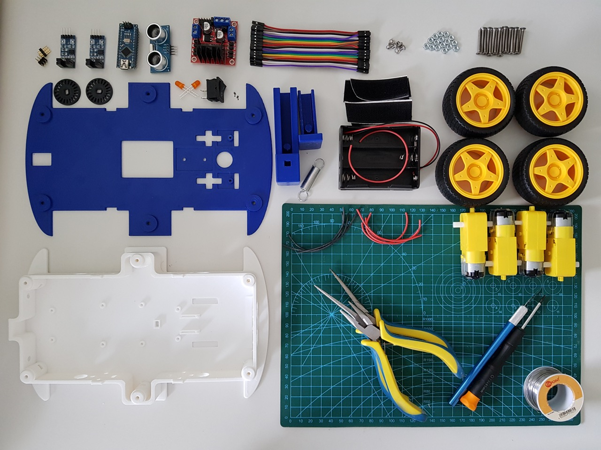
   

**Tip:** To make all the wiring easier you can build a small power distributor for the 5V and GND connections by soldering a 6x2 male header to a perfboard. Then connect the power distributor with the 5V / GND of the motor driver.

1. Solder wires to the motors and add the encoder disks to the two front motors if you intend to use the speed sensors.
    

      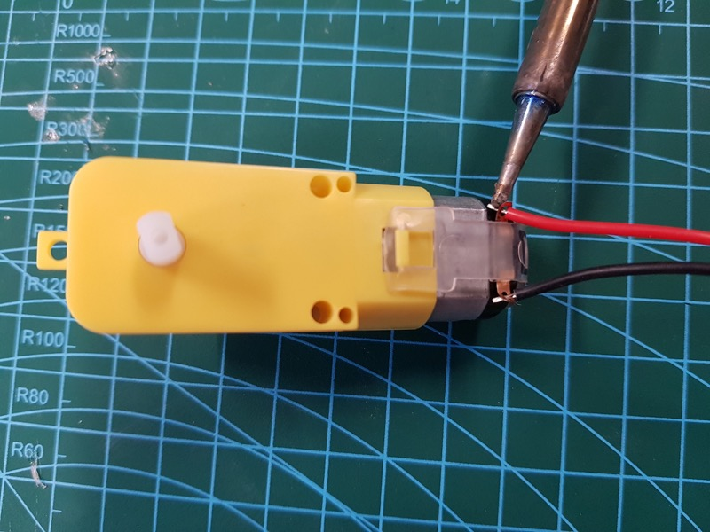
      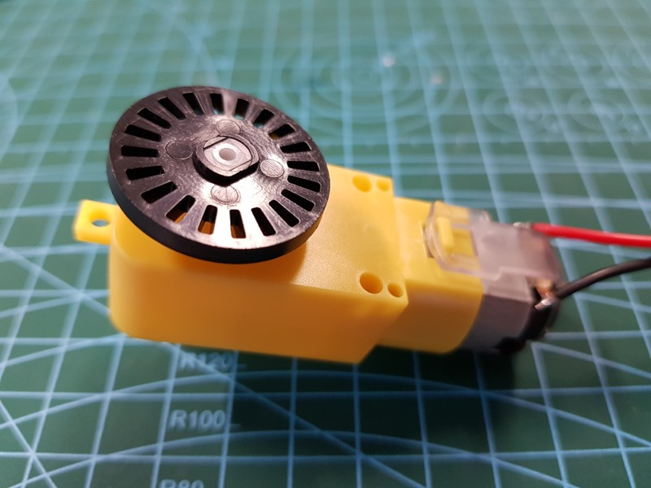 
    

2. Insert the positive and negative leads of the two left motors into OUT1 (+) and OUT2 (-) of the L298N board. Insert the positive and negative leads of the two right motors into OUT4 (+) and OUT3 (-) of the L298N board.
3. Mount the motors with eight M3x25 screws and nuts.
    

      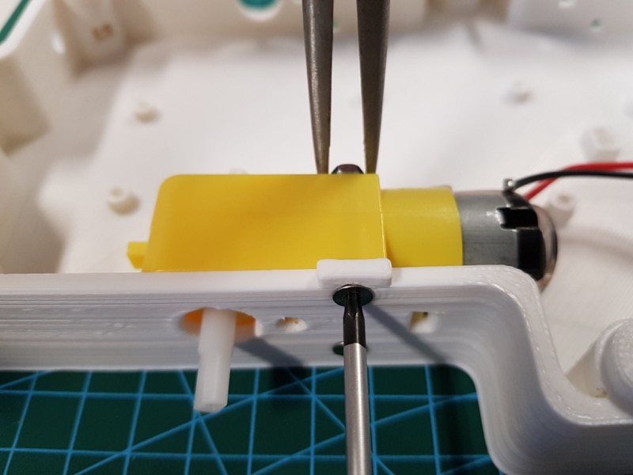
      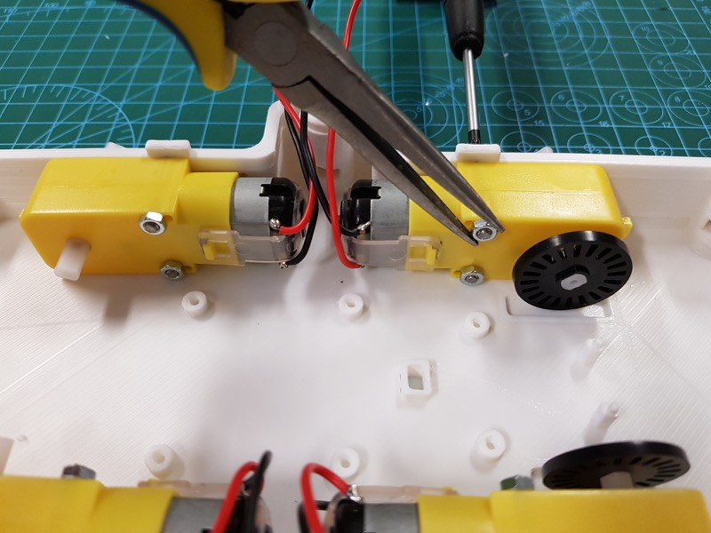 
      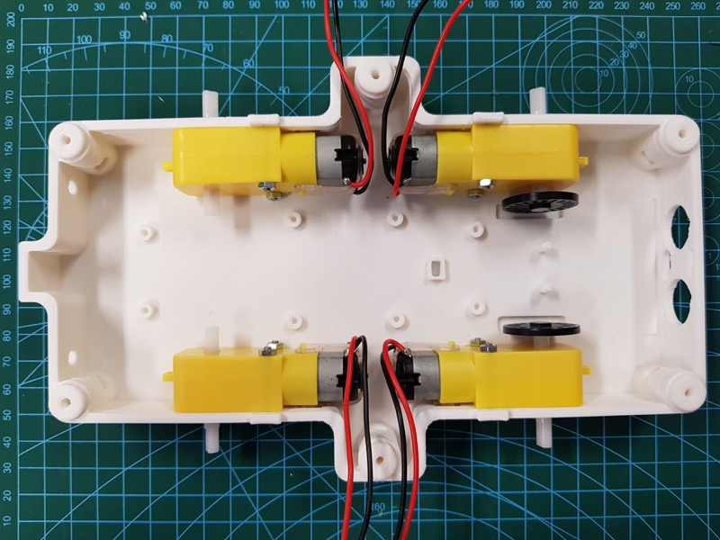
    

4. Mount the L298N with four M3x5 screws
5. (Optional) Install the ultrasonic sensor and replace the angled connector with a straigt one (or carefully bend the pins).
    

      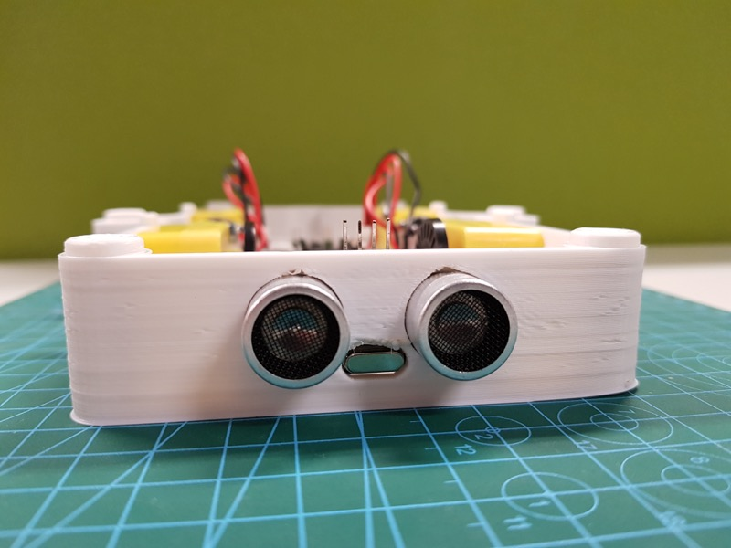
      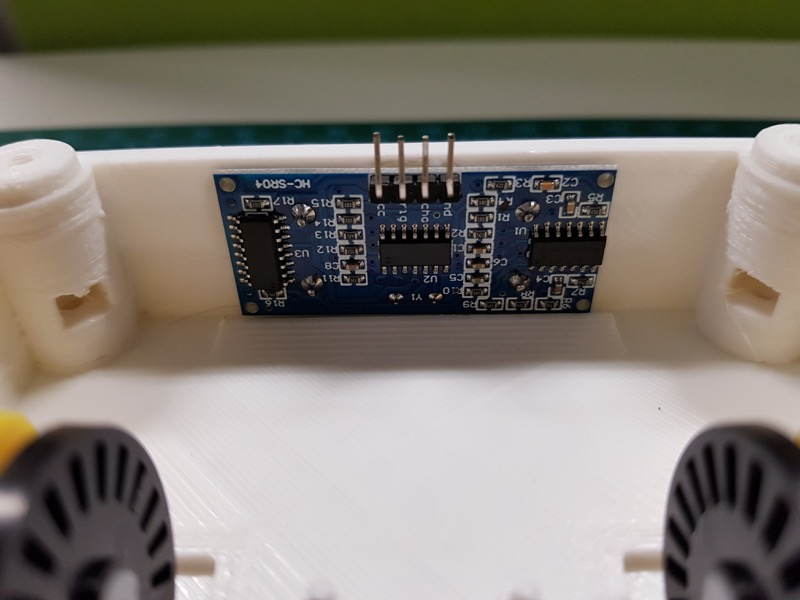 
      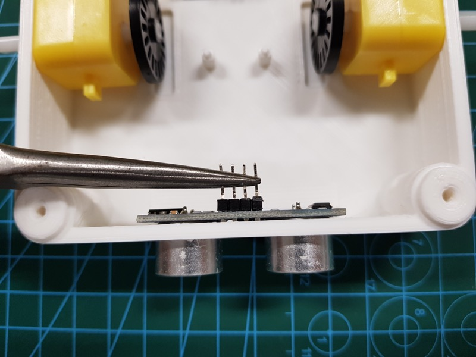
    

6. (Optional) Install the orange LEDs for the indicator signals.
    

      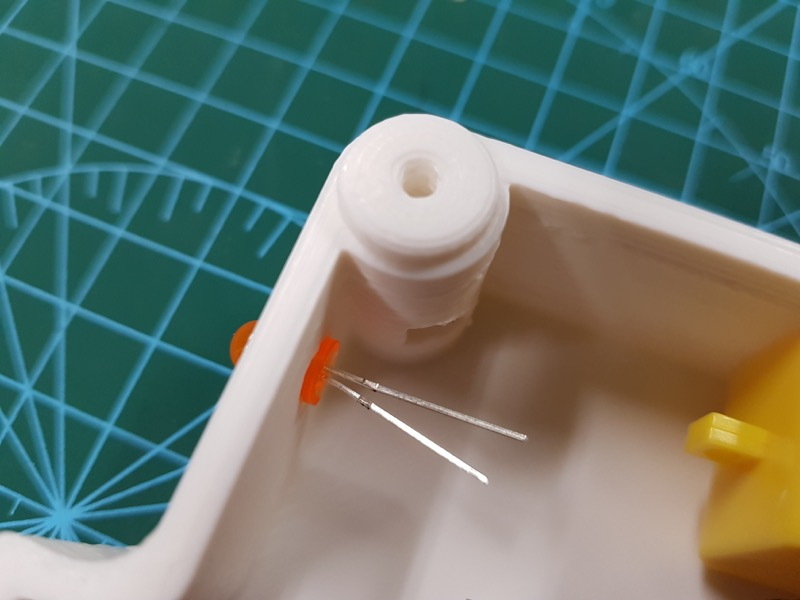
      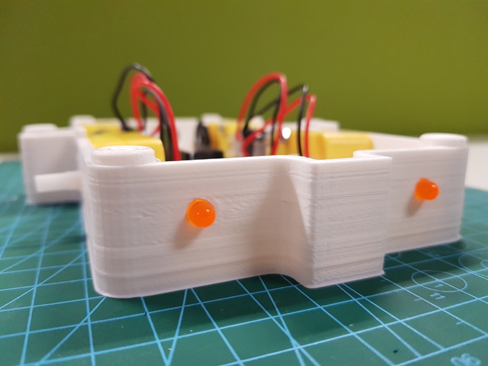 
      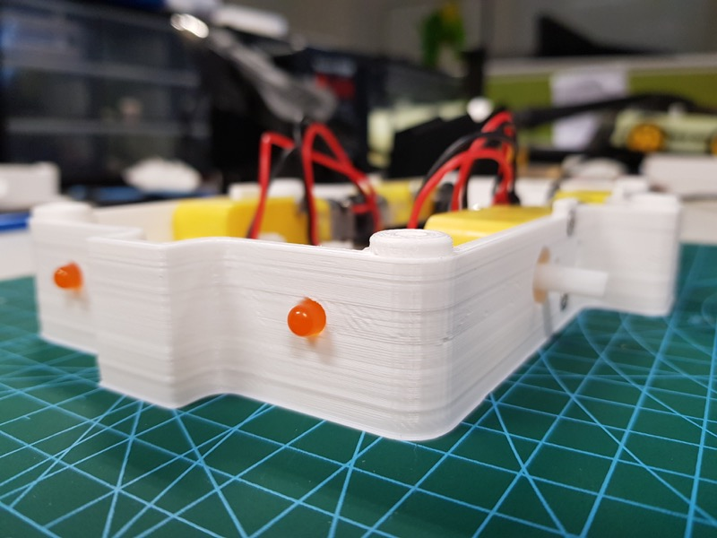
    

7. Mount the bottom of the phone mount to the top plate using two M3x25 screws and nuts.
    

      
       
      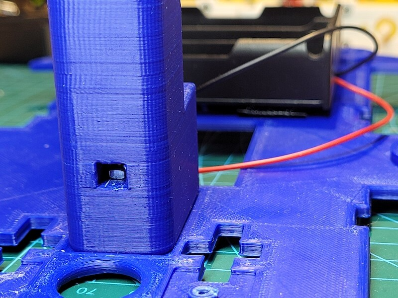
    

8. Insert the top of the phone mount and install the spring or rubber band.
    

      
       
    

9. Replace the angled connector with a straigt one (or carefully bend the pins) and then mount the speed sensors with one M3x5 screw each.
    

      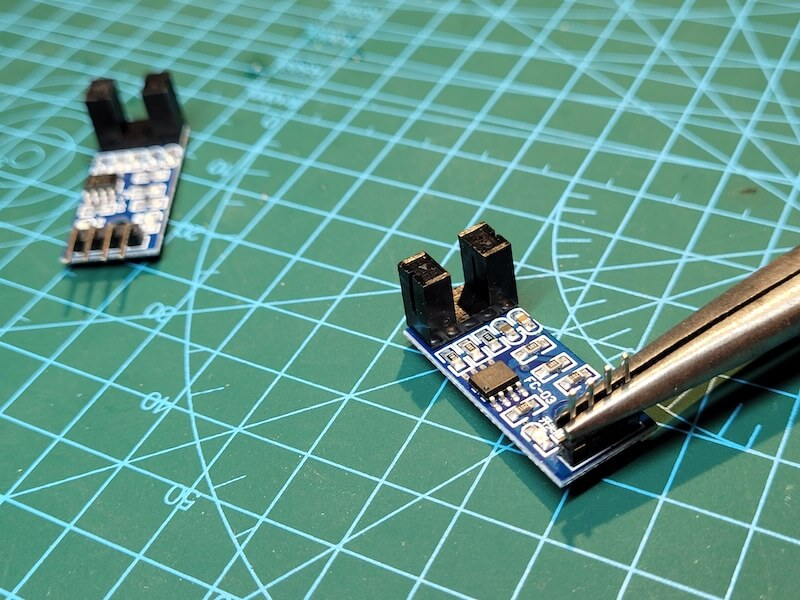
       
      
    

10. Install the battery case (e.g. velcro).
    

      
       
      
    

11. (Optional) Insert the on/off switch put it in the current path.
    1. Push the switch into the appropriate opening until you hear a click.
    2. Solder the red wires (12V) of the battery case and the power cable each to one of the pins of the switch. Connect the black wires (GND), and cover the connection with some heatshrink.
    3. Fix the cables with some tape.
    

      
       
      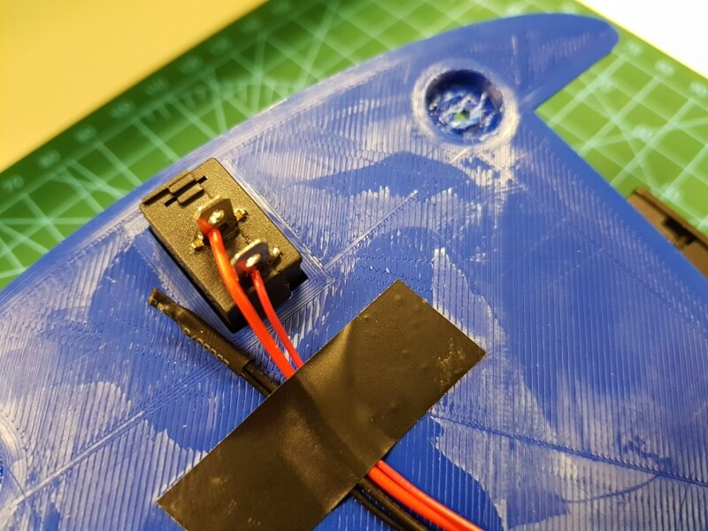
    

12. (Optional) Attach the OLED display.
13. Connect the PWM inputs of the L298N to pins D5, D6, D9 and D10 of the Arduino.
14. Connect the speed sensors and ultrasonic sensor to 5V and GND.
15. Connect pin D0 of the speed sensors to pins D2 (left) and D3 (right) of the Arduino.
16. Connect pins Echo and Trigger of the ultrasonic sensor to pins D11 and D12 of the Arduino respectively.
17. (Optional) Connect the LEDs to pins D4 (left) and D7 (right) of the Arduino and GND. We recommend to add a 150 Ohm resistor in series to limit the current draw.
18. (Optional) Connect the voltage divider to pin A7 of the Arduino. It is used to measure the battery voltage.
19. (Optional) Connect the OLED display (SSD1306 chip) via the I2C bus to the Arduino Nano
    1. Connect the VIN and GND pins of the display to 5V and GND.
    2. Connect the SCL pin of the display to the A5 pin.
    3. Connect the SDA pin of the display to the A4 pin.
20. Connect the power cables to +12V and GND of the L298N.
21. Connect the USB cable to the Arduino and route it through the top cover.
22. Insert six M3 nuts into the bottom plate and mount the top cover with six M3x25 screws.
23. Install the wheels.

#### Option 2: Custom PCB

1. Solder wires with Micro JST PH 2.0 connectors to the motors and add the encoder disks to the two front motors if you intend to use the speed sensors.
    

      
       
    

2. Mount the motors with eight M3x25 screws and nuts.
    

      
       
      
    

3. Connect the left two motors to M3 and M4 and the right two motors to M1 and M2.
    

      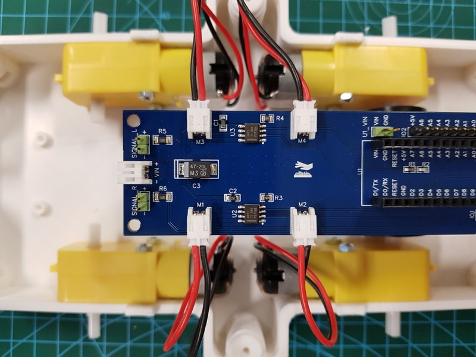
    

4. Mount the PCB with four M3x5 screws and the motors with eight M3x25 screws and nuts.
    

      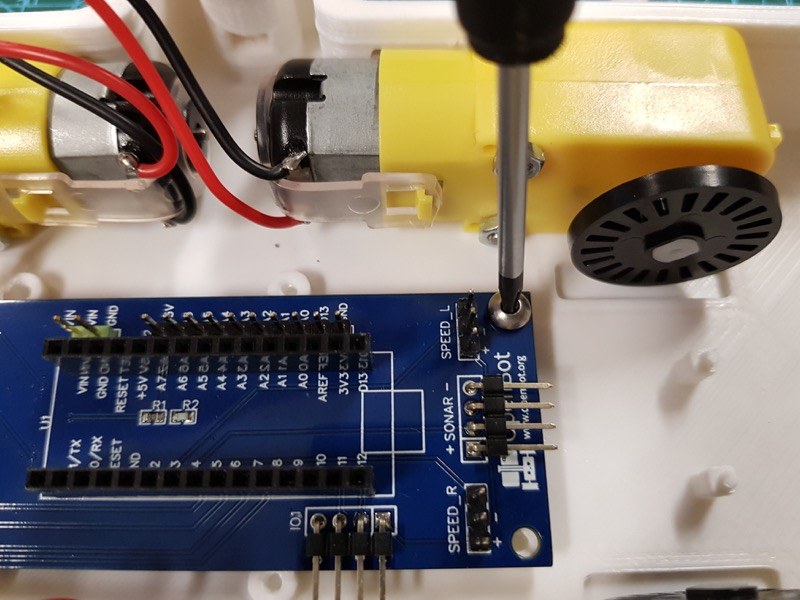
      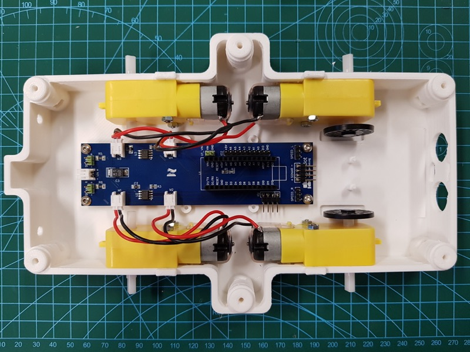
    

5. Follow steps 5-12 from the DIY option.
6. Connect the ultrasonic sensor (VCC/+, Trig, Echo, GND/-) to the 4-pin header labeled *SONAR* on the PCB.
    

      
    

7. Connect the left and right indicator signals (orange LEDs) to the 2-pin headers labeled *SIGNAL_L* and *SIGNAL_R* on the PCB. The longer leg is + and the shorter one -.
8. Connect the left and right speed sensors (VCC/+, GND/-, D0) to the 3-pin headers labeled *SPEED_L* and *SPEED_R*.
9. (Optional) Connect the OLED display (SSD1306 chip) to the IO2 header on the PCB.
    1. Connect the VIN and GND pins of the display to 5V and GND.
    2. Connect the SCL pin of the display to the A5 pin.
    3. Connect the SDA pin of the display to the A4 pin.
10. Connect the power cables to Vin (Micro JST PH 2.0 connector) of the PCB.
11. Follow steps 21-23 from the DIY option.

## Next

Flash the [Arduino Firmware](../firmware/README.md)
