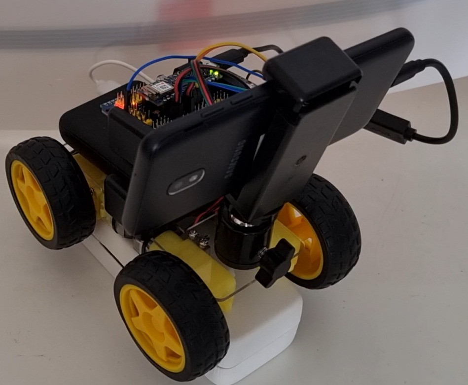
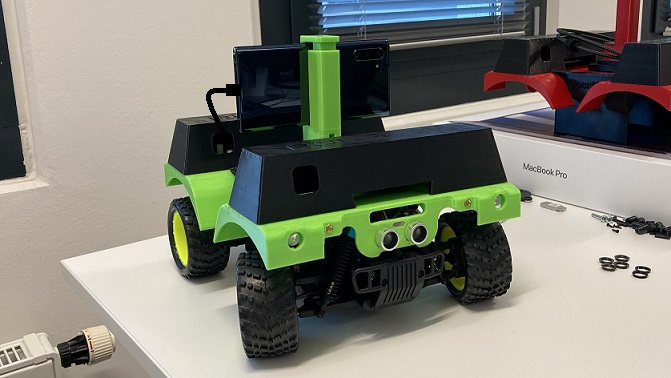
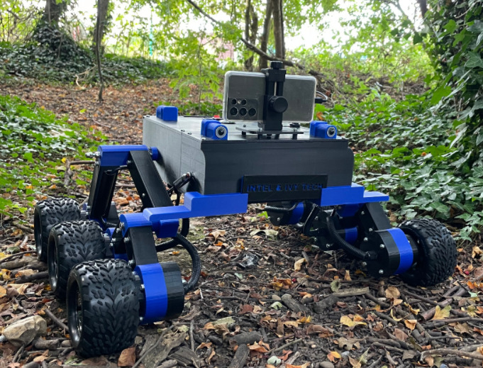

# OpenBot: Robot Body

  English |
  <a href="README.zh-CN.md">简体中文</a> |
  <a href="README.de-DE.md">Deutsch</a> |
  <a href="README.fr-FR.md">Français</a> |
  <a href="README.es-ES.md">Español</a>

You can buy a [ready-to-run (RTR)](rtr) OpenBot on Amazon:
- [RTR-TT](https://buy.openbot.org/rtr-tt)
- [RTR-520](https://buy.openbot.org/rtr-520)

For larger order requests, please contact us via email.

## Building your own

You can build any wheeled robot body around a microcontroller such as the Arduino Nano to use with the OpenBot software stack. We have designed a [3D-printed body](diy) for a wheeled robot which relies on low-cost, readily available hobby hardware. [OpenBot Lite](lite) is a smaller and simplified variant of the OpenBot DIY version developed for education. Even if you do not want to build it, you may find the [step-by-step video guides](lite/#step-by-step-video-guides) helpful. We have also designed a [3D-printed body](rc_truck) for commercially available 1:16 RC-Trucks (such as [this](https://www.amazon.de/dp/B00M3J7DJW) one). We also provide blueprints for building a [multi-terrain vehicle](mtv), as a general-purpose platform for outdoor projects using the OpenBot framework. 

Below are a number of examples with build instructions and further details:

<table style="width:100%;border:none;text-align:center">
  <tr>
  <td>  
  </td>
  <td>
  
  </td>
  <td>
  
  </td>
  <td>
  
  </td>
  <td>
  
  </td>
  </tr>
  <tr>
    <td><a href="diy"> DIY </a></td>
    <td><a href="lite"> Lite </a></td>
    <td><a href="rc_truck"> RC Truck </a></td>
    <td><a href="mtv"> Multi-Terrain Vehicle </a></td>
    <td><a href="rtr"> RTR </a></td>
  </tr>
</table>

## Next

Flash the [Arduino Firmware](../firmware/README.md)
