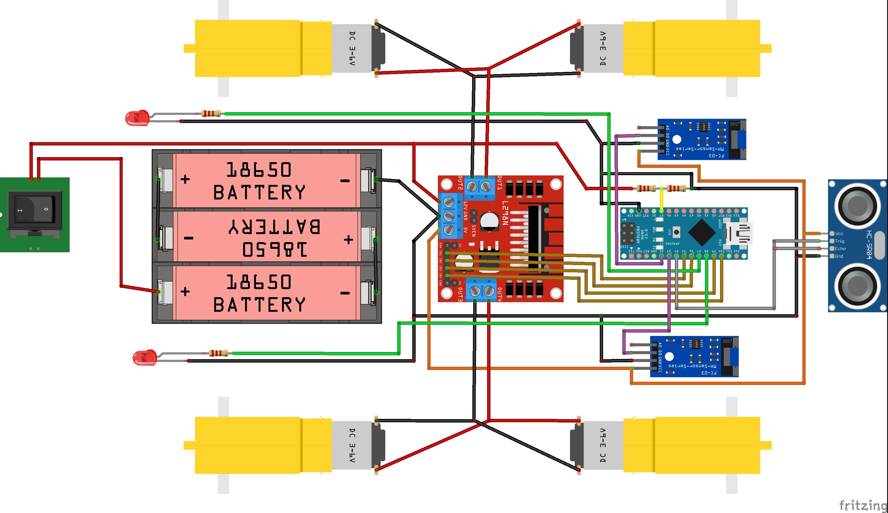

# OpenBot 中文版说明

我们为轮式机器人设计了一个车身，该车身依赖于低成本，随时可用的业余爱好硬件。

## 3D打印机身
您将需要打印以下部分用来组装您的OpenBot机器车。

1) 车身底部 ([STL](body_bottom.stl), [STEP](body_bottom.step))
2) 车身顶部 ([STL](body_top.stl), [STEP](body_top.step))
3) 手机支架底部 ([STL](phone_mount_bottom.stl), [STEP](phone_mount_bottom.step))
4) 手机支架顶部 ([STL](phone_mount_top.stl), [STEP](phone_mount_top.step))

在Ultimaker S5上，我们通过以下设置获得了良好的效果：

- 层高：0.2mm
- 壁厚：1.5mm
- 填充密度：20％
- 填充图案：网格
- 打印速度80毫米/秒
- 无支持

我们能够使用PLA，ABS和CPE打印机箱。 根据我们的经验，打印不受打印设置的影响很大。 但是，如果您有耐心，则打印速度较慢且层高度较小的纸张会改善打印质量。 另外，添加支撑结构可以改善打印效果，但是之后需要进行额外的工作才能删除。

由于许多常见的3D打印机的构建体积较小，因此我们还制作了一个[body_bottom_slim.stl](./body_bottom_slim.stl) 和[body_top_slim.stl](./body_top_slim.stl)，它们以45度安装在223x223构建板上。 这些未经测试，但应该可以正常工作。

## 配件购买：

### 必须
- 直流减速电机+智能小车车轮cbot 
    - 数量 4
    - 价格:¥10.00
    - [淘宝购买](https://s.click.taobao.com/GA955xu)
- L298N 开发板
    - 数量 1
    - 价格:¥14.92
    - [淘宝购买](https://s.click.taobao.com/pyt45xu) , [领券](https://s.click.taobao.com/C1nJ4xu)
- Arduino nano V3.0 CH340G 改进版 
    - 数量 1
    - 价格:¥5.49
    - [淘宝购买](https://s.click.taobao.com/iI1K4xu)
- 测速传感器 Tacho Sensor 3.3V-5V
    - 数量 2
    - 价格:¥3.80
    - [淘宝购买](https://s.click.taobao.com/jMA45xu)
- 18650大容量充电锂电池
    - 数量 3
    - 价格:¥16.80
    - [淘宝购买](https://s.click.taobao.com/5jj45xu) , [领券](https://s.click.taobao.com/ww855xu)
- BS电池盒 5号/五号/七号7号18650电池盒 
    - 数量 1
    - 价格:¥1.59
    - [淘宝购买](https://s.click.taobao.com/tzcJ4xu)
- USB OTG 数据线 Type-C/MICrO USB
    - 数量 1
    - 价格:¥29.27
    - [淘宝购买](https://s.click.taobao.com/vmo45xu) , [领券](https://s.click.taobao.com/zjmJ4xu)
- 304不锈钢拉簧拉力拉伸带钩弹簧 
    - 数量 1
    - 价格:¥0.60
    - [淘宝购买](https://s.click.taobao.com/nj1Kzwu)
- M2.5 M3 304不锈钢圆头一字螺丝*4x5x6x8x20x25x50mm
    - 数量 16
    - 价格:¥4.00
    - [淘宝购买](https://s.click.taobao.com/GGF45xu)
- 304不锈钢六角螺母小螺丝帽
    - 数量 16
    - 价格:¥18.00
    - [淘宝购买](https://s.click.taobao.com/3roD0xu)
- M3* 5 螺丝
    - 数量 6
    - 价格:￥2.18
    - [淘宝购买](https://s.click.taobao.com/WHO55xu) , [领券](https://s.click.taobao.com/6Np45xu)
- 杜邦线
    - 数量 1
    - 价格:¥2.80
    - [淘宝购买](https://s.click.taobao.com/nfSJ4xu)

### 可选
- HC-SR04超声波测距模块传感器
    - 数量 1
    - 价格:¥2.69
    - [淘宝购买](https://s.click.taobao.com/q5545xu)
- 10*15mm 开关
    - 数量 1
    - 价格:¥38.95
    - [淘宝购买](https://s.click.taobao.com/8YrJ4xu)
- 5mm发光二极管橘色 
    - 数量 2
    - 价格:¥1.98
    - [淘宝购买](https://s.click.taobao.com/rjXJ4xu)

## 制作说明

### 选项1：自己动手做

1. 如有必要，将线连接到电动机
2. 将两个电动机的正极和负极引线插入L298N板的OUT1（+）和OUT2（-）
3. 将其他两个电动机的正极和负极引线插入L298N板的OUT4（+）和OUT3（-）
4. 用四个M3x5螺钉安装L298N，用8个M3x25螺钉和螺母安装电动机。
5. （可选）安装超声波传感器和橙色LED
6. 使用两个M3x25螺钉和螺母将手机支架的底部安装到顶板上
7. 插入手机支架的顶部并安装弹簧或橡皮筋
8. 用一颗M3x5螺钉安装速度传感器
9. 安装电池盒（
10. （可选）插入电源开关
11. 将L298N的PWM输入连接到Arduino的引脚D5，D6，D9和D10
12. 将速度传感器和超声波传感器连接到5V和GND
13. 将速度传感器的D0连接到Arduino的D2引脚（左）和D3（右侧）
14. 将超声波传感器的回声和触发器连接到Arduino的D4引脚
15. 将USB电缆连接到Arduino，并将其穿过顶盖
16. （可选）将LED连接到Arduino和GND的D7引脚（左）和D8引脚（右）
17. （可选）将分压器连接至Arduino的A7引脚
18. 将电池电缆连接至L298N的Vin。如果安装了交换机，请将其放在当前路径中。
19. 将六个M3螺母插入底板，然后用六个M3x25螺钉安装顶盖
20. 安装车轮

### 选项2：定制PCB

警告：PCB已更新至版本2，尚未经过测试。 更改如下：
-将正确的速度传感器移至D3引脚以启用中断功能
-为主电池添加电源LED
-更新一些更常用的组件
-将分压器更新为20k / 10k，以获得更高的精度
-将电机连接器更改为直立版本，以便于操作

如果您已经订购了版本1的PCB（[2D视图]（../docs/images/pcb_2d_v1.png），[3D视图]（../docs/images/pcb_3d_v1.png))，则需要 调整固件以手动读取速度传感器。 有关更多信息，请参见此[issue]（https://github.com/intel-isl/OpenBot/issues/34)。

定制PCB包括以下步骤:
1) **购买 PCB**: 下载[Gerber](gerber_v2.zip) 文件 并选择供应商处订购PCB。 你也可以直接在[PCBWay](https://www.pcbway.com/project/shareproject/OpenBot__Turning_Smartphones_into_Robots.html)上订购PCB，在那里我们共享了一个OpenBot项目。
2) **订购组件:** 下载[BOM](BOM_v2.csv)并在您选择的供应商处订购组件，例如[LCSC](https://lcsc.com)。
3) **PCB组装:** 你可以自己组装PCB，也可以让供应商来组装。对于自动装配，您将需要[Centroid文件](centroid_file_v2.csv)

您还可以找到供应商，他们将为您提供涵盖所有3个步骤的全套解决方案。他们将生产PCB，提供组件和组装PCB。这非常方便，也不太贵。然而，交货时间通常很长(1-3个月)。

当在[PCBWay](https://www.pcbway.com/orderonline.aspx)请求报价时，您可以在上传Gerber文件后选择组装服务。

在下一步中，您将需要上传[BOM](BOM.csv)和[Centroid File](centroid_file.csv)。 您的报价将在几天之内进行审核和更新。 然后，您可以在查看成本和交货时间后选择继续付款。
