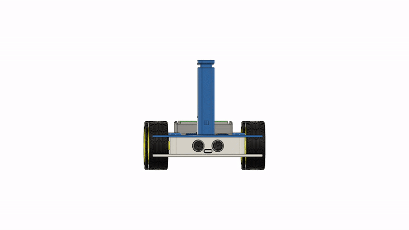
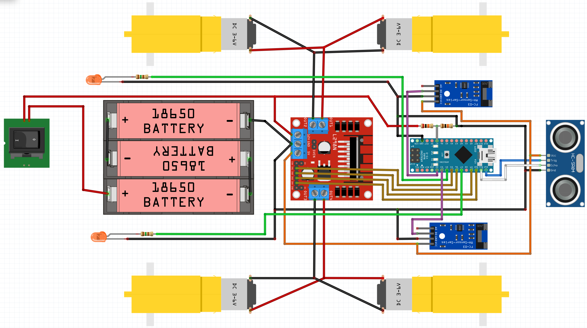

# OpenBot 中文版说明

  <a href="README.md">English</a> |
  简体中文

我们为轮式机器人设计了一个车身，该车身依赖于低成本，随时可用的业余爱好硬件。

## 3D打印机身

您将需要打印以下部分用来组装您的OpenBot机器车。

1) 车身底部 ([STL](cad/body_bottom.stl), [STEP](cad/body_bottom.step))
2) 车身顶部 ([STL](cad/body_top.stl), [STEP](cad/body_top.step))
3) 手机支架底部 ([STL](cad/phone_mount_bottom.stl), [STEP](cad/phone_mount_bottom.step))
4) 手机支架顶部 ([STL](cad/phone_mount_top.stl), [STEP](cad/phone_mount_top.step))

对于上述零件，你的构建板至少需要240mmx150mm。

由于很多常见的3D打印机的构建体积较小，我们还制作了一个[slim body](cad/slim_body/README_CN.md)，它适合在220mmx220mm的构建板上以45度的角度进行构建。

对于在3D打印机上打印更小的构建量，还有一个[glueable body](cad/glue_body/README_CN.md)，适合在150mmx140mm的构建板上打印。感谢@sloretz。

在Ultimaker S5上，我们通过以下设置获得了良好的效果：

- 层高：0.2mm
- 壁厚：1.5mm
- 填充密度：20％
- 填充图案：网格
- 打印速度80毫米/秒
- 无支持

我们能够使用PLA，ABS和CPE打印机箱。 根据我们的经验，打印设置不受打印设置的影响很大。 但是，如果您有耐心，则打印速度较慢且层高度较小的纸张会改善打印质量。 另外，添加支撑结构可以改善打印效果，但是添加的支撑之后需要进行额外的工作才能去除。

中国用户可以在淘宝找商家打印。注意以下事项：

- PLA材料 3D打印机身
  - 层高:0.2mm
  - 壁厚:1.5mm
  - 填充密度:20％
  - 填充图案:网格
  - 机身数量 共4块
  - 建议价格:¥120.00以内(含邮费)

## 部件

机器人的组装有两种不同的选择：DIY和PCB。 DIY方法依赖于流行的L298N电机驱动器，建议具有一定电子经验的业余爱好者使用。 它需要大量的接线，尤其是在安装所有传感器和LED的情况下。但是，在大多数情况下，所有组件都很容易获得，尤其是对于只需要制作一部车身或只是为了尝试项目，建议使用DIY选项。同时为了减少布线并简化组装，我们还开发了[custom PCB](pcb)。 如果您想要制作过程更简单或想要多个OpenBots车身，则建议这样做。

### 料清单

我们的机器人主体依靠随时可用的爱好电子设备。 我们提供快速运输到德国（EU）和美国（US）的链接。 如果您有耐心等待更长的时间，您也可以从速卖通（AE）那里购买便宜得多的组件。中国用户建议在淘宝购买。您将需要以下组件。

(通用)

- Arduino nano V3.0 CH340G 改进版
  - 数量 1
  - 价格:¥5.49
  - [淘宝购买](https://s.click.taobao.com/iI1K4xu)
- 直流减速电机+智能小车车轮cbot 
  - 数量 4
  - 价格:¥10.00
  - [淘宝购买](https://s.click.taobao.com/GA955xu)
- 18650大容量充电锂电池
  - 数量 3
  - 价格:¥16.80
  - [淘宝购买](https://s.click.taobao.com/5jj45xu) , [领券](https://s.click.taobao.com/ww855xu)
- BS电池盒 5号/五号/七号7号18650电池盒 
  - 数量 1
  - 价格:¥1.59
  - [淘宝购买](https://s.click.taobao.com/tzcJ4xu)
- T型口转type-c 连接线
  - 数量 1
  - 价格:¥25.00
  - [淘宝购买](https://s.click.taobao.com/FKmZVvu)
- 304不锈钢拉簧拉力拉伸带钩弹簧 
  - 数量 1
  - 价格:¥0.60
  - [淘宝购买](https://s.click.taobao.com/nj1Kzwu)
- M2.5 M3 304不锈钢圆头一字螺丝*25mm
  - 数量 16
  - 价格:¥4.00
  - [淘宝购买](https://s.click.taobao.com/GGF45xu)
- 304不锈钢六角螺母小螺丝帽
  - 数量 16
  - 价格:¥18.00
  - [淘宝购买](https://s.click.taobao.com/3roD0xu)
- M3* 5 螺丝
  - 数量 6
  - 价格:￥2.18
  - [淘宝购买](https://s.click.taobao.com/WHO55xu) , [领券](https://s.click.taobao.com/6Np45xu)
- 杜邦线
  - 数量 1
  - 价格:¥2.80
  - [淘宝购买](https://s.click.taobao.com/nfSJ4xu)

(仅DIY)

- L298N 开发板
  - 数量 1
  - 价格:¥14.92
  - [淘宝购买](https://s.click.taobao.com/pyt45xu) , [领券](https://s.click.taobao.com/C1nJ4xu)
- (可选) 电阻器(2x 150&#8486;用于LED，20k&#8486;和10k&#8486;用于分压器)
- (Combo) 4x TT马达和轮胎+2x L298N+dupont电缆 ([US](https://www.amazon.com/dp/B07ZT619TD))
- (Combo) 4x TT马达和轮胎+电线+螺丝 ([US](https://www.amazon.com/dp/B07DRGTCTP))

(仅PCB)

- 1x [自定义PCB](pcb)
- 5条Micro JST PH 2.0电缆([淘宝购买](https://s.click.taobao.com/HYyOTvu))

(可选)

- 测速传感器 Tacho Sensor 3.3V-5V
  - 数量 2
  - 价格:¥3.80
  - [淘宝购买](https://s.click.taobao.com/jMA45xu)
- HC-SR04超声波测距模块传感器
  - 数量 1
  - 价格:¥2.69
  - [淘宝购买](https://s.click.taobao.com/q5545xu)
- 21*15mm 开关
  - 数量 1  
  - 价格:¥1.60
  - [淘宝购买](https://m.tb.cn/h.VzbvV36)
- 5mm发光二极管橘色 (接线需要分压器, 新手不太建议)
  - 数量 2
  - 价格:¥1.98
  - [淘宝购买](https://s.click.taobao.com/rjXJ4xu)

## 制作说明

### 选项1：自己动手做

1. 如有必要，将线连接到电动机
2. 将两个电动机的正极和负极引线插入L298N板的OUT1（+）和OUT2（-）
3. 将其他两个电动机的正极和负极引线插入L298N板的OUT4（+）和OUT3（-）
4. 用4个M3x5螺钉安装L298N，用8个M3x25螺钉和螺母安装电动机。
5. （可选）安装超声波传感器和橙色LED
6. 使用两个M3x25螺钉和螺母将手机支架的底部安装到顶板上
7. 插入手机支架的顶部并安装弹簧或橡皮筋
8. 用一颗M3x5螺钉安装速度传感器
9. 安装电池盒
10. （可选）插入电源开关
11. 将L298N的PWM输入连接到Arduino的引脚D5，D6，D9和D10
12. 将速度传感器和超声波传感器连接到5V和GND
13. 将速度传感器的D0连接到Arduino的D2引脚（左）和D3（右侧）
14. 将超声波传感器的回声和触发器连接到Arduino的D11和D12引脚
15. 将USB电缆连接到Arduino，并将其穿过顶盖
16. （可选）将LED连接到Arduino和GND的D4引脚（左）和D7引脚（右）
17. （可选）将分压器连接至Arduino的A7引脚
18. 将电池电缆连接至L298N的Vin。如果安装了交换机，请将其放在当前路径中。
19. 将六个M3螺母插入底板，然后用六个M3x25螺钉安装顶盖
20. 安装车轮

### 选项2：定制PCB

1. 将带有Micro JST PH 2.0连接器的导线焊接到电机上。
2. 将左边两个电机连接到 M3 和 M4，右边两个电机连接到 M1 和 M2。
3. 用四个 M3x5 螺丝安装 PCB，用八个 M3x25 螺丝和螺母安装电机。
4. 按照DIY选项中的步骤5-10进行。
5. 将LED、速度传感器和超声波传感器连接到PCB上。
6. 将USB电缆连接到Arduino，并将其穿过顶盖。
7. 将电池连接到PCB的Vin（Micro JST PH 2.0连接器）。如果你安装了开关，把它放在电流路径上。
8. 按照DIY选项中的步骤19-20。

## 下一步

烧录[Arduino固件](../firmware/README_CN.md)

