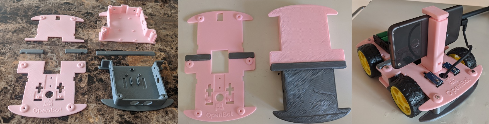

# Glueable Body

  English |
  <a href="README_CN.md">简体中文</a>

Some 3D printers have build volumes that are too small to print the full size OpenBot body.
This folder contains the OpenBot body split into 4 pieces.
It can be printed with a build plate as small as 150mmx140mm, and then glued together.

## Parts

Required parts:

1) `glue_body_bottom_A` ([STL](glue_body_bottom_A.stl), [STEP](glue_body_bottom_A.step))
2) `glue_body_bottom_B` ([STL](glue_body_bottom_B.stl), [STEP](glue_body_bottom_B.step))
3) `glue_body_top_A` ([STL](glue_body_top_A.stl), [STEP](glue_body_top_A.step))
4) `glue_body_top_B` ([STL](glue_body_top_B.stl), [STEP](glue_body_top_B.step))

Optional parts:

These pieces give extra surface area for gluing, which can help if your print experiences warping.

* `glue_connector_bottom` ([STL](glue_connector_bottom.stl), [STEP](glue_connector_bottom.step))
* `glue_connector_top_A` ([STL](glue_connector_top_A.stl), [STEP](glue_connector_top_A.step))
* `glue_connector_top_B` ([STL](glue_connector_top_B.stl), [STEP](glue_connector_top_B.step))
