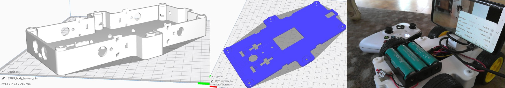

# Slim Body

  English |
  <a href="README_CN.md">简体中文</a>

Some 3D printers have build volumes that are too small to print the full size OpenBot body.
This folder contains the slim version of the OpenBot body.
It can be printed with a build plate of 220mmx220mm when the parts are rotated 45 degrees.

## Parts

1) `slim_body_bottom` ([STL](slim_body_bottom.stl), [STEP](slim_body_bottom.step))
2) `slim_body_top` ([STL](slim_body_top.stl), [STEP](slim_body_top.step))

In order to make it fit you may have to adjust the following settings to get the maximum print area.

- Set *Build Plate Adhesion Type* to "None" (Brim, Skirt and Raft increase the overall size of your print)
- Disable prime blob (in *Build Plate* section)
- Disable the second extruder (if your printer has one)

If you do have a little extra space (223mmx223mm), you can also print the `slim_body_top_rim` ([STL](slim_body_top_rim.stl), [STEP](slim_body_top_rim.step)). It has a slightly larger rim making it easier to take the top off.
