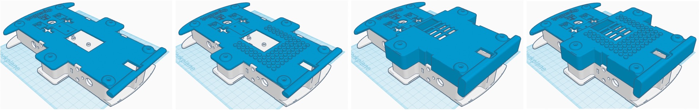
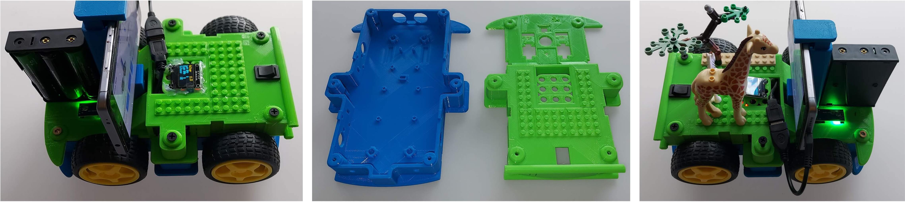

# Blocky Body with Additional Space and Lego Support

  English |
  <a href="README.zh-CN.md">简体中文</a> |
  <a href="README.de-DE.md">Deutsch</a> |
  <a href="README.fr-FR.md">Français</a> |
  <a href="README.es-ES.md">Español</a>

This robot chassis provides some extra height to make it easier to fit in all the electronics and a lego-compatible top. This version offers the same structural integrity capabilities as the [regular body](../regular_body/), with additional features such as extra space inside the OpenBot shell, a lego-compatible top for play and learning and a footprint suitable for smaller print bed sizes while maintaining bumpers. 

## Parts

You will need to print the bottom part and one of the top parts:

- `block_body_bottom`([STL](block_body_bottom.stl), [STEP](block_body_bottom.step)): bottom part of the body
- `block_body_top`([STL](block_body_top.stl), [STEP](block_body_top.step)): basic top part of the body
- `block_body_top_lego`([STL](block_body_top_lego.stl), [STEP](block_body_top_lego.step)): basic top part of the body with lego-compatible surface
- `block_body_top_big`([STL](block_body_top_big.stl), [STEP](block_body_top_big.step)): big top part of the body with additional volume for electronics
- `block_body_top_lego`([STL](block_body_top_big_lego.stl), [STEP](block_body_top_big_lego.step)): big top part of the body with lego-compatible surface

For the above parts, your build plate needs to be at least 221x150mm.

## Print Settings

For best results, we recommend using the following print settings:

- Layer height: 0.2mm
- Wall line count: 3 (more walls for better structural integrity of larger surfaces)
- Top Layers: 5
- Bottom Layers: 4
- Infill: 25%
- Infill Pattern: Concentric (this setting seems to save time and plastic)
- Print Speed: 50mm/sec
- Generate Support: Yes
- Support Pattern: Concentric
- Support density: 15%
- Enable Support Brim: Yes
- Build Plate Adhesion Type: None

Happy robot building!

