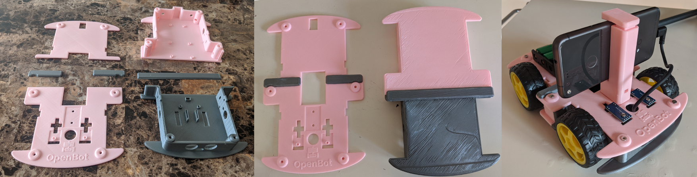

# Glueable OpenBot Body

Some 3D printers have build volumes that are too small to print the full size OpenBot body.
This folder contains the OpenBot body split into 4 pieces.
It can be printed with a build volume as small as 15cm x 14cm, and then glued together.

## Parts

Requird parts:

* `openbot_bottom_A` ([STL](openbot_bottom_A.stl), [STEP](openbot_bottom_A.step))
* `openbot_bottom_B` ([STL](openbot_bottom_B.stl), [STEP](openbot_bottom_B.step))
* `openbot_top_A` ([STL](openbot_top_A.stl), [STEP](openbot_top_A.step))
* `openbot_top_B` ([STL](openbot_top_B.stl), [STEP](openbot_top_B.step))

Optional parts:

These pieces give extra surface area for glueing, which can help if your print experiences warping.

* `bottom_glue` ([STL](bottom_glue.stl), [STEP](bottom_glue.step))
* `top_glue_A` ([STL](top_glue_A.stl), [STEP](top_glue_A.step))
* `top_glue_B` ([STL](top_glue_B.stl), [STEP](top_glue_B.step))
