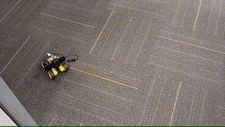

# OpenBot for Education

  <a href="README.md">English</a> |
  简体中文 |
  <a href="README.de-DE.md">Deutsch</a> |
  <a href="README.fr-FR.md">Français</a> |
  <a href="README.es-ES.md">Español</a>

ITE 的 eSpace 已经开发了一套围绕 OpenBot 软件栈的 [课程](#curriculum)，旨在提供经济且可扩展的 AI 和机器人教育。该课程以 [逐步指导的 YouTube 视频](#step-by-step-video-guides) 形式呈现，指导您组装 [OpenBot Lite](#openbot-lite-arduino)，安装必要的软件，使用跟随功能以及训练和部署您自己的自动驾驶策略。

## OpenBot Lite

OpenBot Lite 是 OpenBot DIY 版本的一个更小且简化的变体。这个极简版本由 ITE 的 eSpace 开发，旨在利用 OpenBot 软件栈的巨大潜力，为经济且可扩展的 AI 和机器人教育服务。OpenBot Lite 支持 [micro:bit](https://microbit.org/)（加上专有 IO 板）或 Arduino Nano。下图显示了左侧的 micro:bit 变体和右侧的 Arduino 变体。

  

## 课程

该课程已在韩国和德国的教育工作者中进行了测试，已有超过 100 名学生通过该课程学习了 AI 和机器人。以下是我们在线培训的一些成果：

* [韩国](https://fb.watch/bDK2Vjgm3g/)
* [德国](https://www.facebook.com/EspaceCW/posts/5087394677946975)

跟随功能展示：

  

策略学习基于一个 2.4m x 1.8m 的街道布局的游戏场地。机器人学习在这条街道上自主驾驶并避开障碍物。这使得课程适合家庭学习。

  

训练后的自动驾驶展示：

  

## 逐步视频指南

以下是按顺序排列的 YouTube 播放列表：

Arduino 版本：
1. [OpenBot Lite 组装（Arduino）](https://youtube.com/playlist?list=PLNKFHX5MRn52za5VeteCmvLNcL1Kowtw2)
2. [跟随功能](https://youtube.com/playlist?list=PLNKFHX5MRn501oWvPbKzP1zkcqhLU5TOh)
3. [策略学习](https://youtube.com/playlist?list=PLNKFHX5MRn5233AyCWhcn71JdB9qIEa-E)

micro:bit 版本：
1. [OpenBot Lite 组装（micro:bit）](https://youtube.com/playlist?list=PLNKFHX5MRn51xVKHo2VCY-KbOFQrkOm2R)
2. [跟随功能](https://youtube.com/playlist?list=PLNKFHX5MRn51crWis1lwFJXj69DN9evG1)
3. [micro:bit 代码解释](https://youtube.com/playlist?list=PLNKFHX5MRn51DfspxVo16BkfXz8y9uR7N)
4. [策略学习](https://youtube.com/playlist?list=PLNKFHX5MRn5233AyCWhcn71JdB9qIEa-E)

## 致谢

如果您觉得这些材料有帮助，请点赞视频并订阅 eSpace 频道。如果您成功组装了自己的 OpenBot Lite，并使跟随功能和/或自动驾驶功能正常工作，欢迎在社交媒体和 [Slack](https://join.slack.com/t/openbot-community/shared_invite/zt-jl8ygxqt-WNRNi9yzh7Lu60qui6Nh6w) 上分享您的成功故事和 OpenBot 视频。您还可以在社交媒体上支持和关注正在开发教育材料的 Willam Tan 和 eSpace 团队。

* [OpenBot Slack 频道](https://join.slack.com/t/openbot-community/shared_invite/zt-jl8ygxqt-WNRNi9yzh7Lu60qui6Nh6w)
* [eSpace 的 Facebook](https://www.facebook.com/EspaceCW)
* [eSpace 的 Instagram](https://www.instagram.com/EspaceCW/)

我们期待您的成功故事和视频。祝您玩得开心！

## 下一步

刷写 [Arduino 固件](../../firmware/README.md)