# OpenBot: Multi-Terrain Vehicle (MTV) Karosserie

  <a href="README.md">English</a> |
  <a href="README.zh-CN.md">简体中文</a> |
  Deutsch |
  <a href="README.fr-FR.md">Français</a> |
  <a href="README.es-ES.md">Español</a>

Wir schlagen hier eine Geländefahrzeug-Alternative zum ursprünglichen [OpenBot](https://www.openbot.org/) Fahrzeug vor. Entwickelt in Zusammenarbeit mit **Ivy Tech LTD**, basiert das Multi-Terrain Vehicle (MTV) ebenfalls auf kostengünstigen und leicht druckbaren Komponenten. Das MTV ist inspiriert von mehreren Erkundungsfahrzeugkonzepten, die in den letzten Jahrzehnten für die Mond- und Marsforschung entwickelt wurden. Das MTV ist um einen Satz von 6 angetriebenen Rädern herum konstruiert, die in einer Rocker-Bogie-Konfiguration angeordnet sind. Im Gegensatz zu den meisten Mond- oder Mars-Rovern können die Räder nicht radial rotieren. Das Fahrzeug funktioniert daher wie ein Panzer, was die manuelle Steuerung recht intuitiv macht.

  

## I. 3D-Druck

Sie müssen die folgenden Teile drucken, um Ihr OpenBot MTV zu bauen.

  

<table>
    <thead>
        <tr>
            <th>ID </th>
            <th>Gruppe</th>
            <th>Artikelname</th>
            <th>Menge</th>
            <th>Bild (nicht maßstabsgetreu)</th>
            <th>Material</th>
            <th>Dauer</th>
            <th>Kosten</th>
        </tr>
    </thead>
    <tbody>
        <tr>
            <td>A1</td>
            <td rowspan=3>Motorbaugruppe</td>
            <td>Motorabdeckung oben   (<a href="cad/MotorAssembly/MotorEnclosure_Top.stl">STL</a>, <a href="cad/MotorAssembly/MotorEnclosure_Top.step">STEP</a>) </td>
            <td>6</td>
            <td>
 
</td>
            <td rowspan=2>498g</td>
            <td rowspan=2>36h</td>
            <td rowspan=2>€23.51</td>
        </tr>
        <tr>
            <td>A2</td>
            <td>Motorabdeckung unten   (<a href="cad/MotorAssembly/MotorEnclosure_Bottom.stl">STL</a>, <a href="cad/MotorAssembly/MotorEnclosure_Bottom.step">STEP</a>) </td>
            <td>6</td>
            <td>
 
</td>
        </tr>
        <tr>
            <td>A3</td>
            <td>Motorhalterung   (<a href="cad/MotorAssembly/Motor_Bracket.stl">STL</a>, <a href="cad/MotorAssembly/Motor_Bracket.step">STEP</a>) </td>
            <td>6</td>
            <td>
 
</td>
            <td>251g</td>
            <td>17.5h</td>
            <td>€11.98</td>
        </tr>
        <tr>
            <td>A4</td>
            <td rowspan=4>Gelenke</td>
            <td>90 Grad Gelenk   (<a href="cad/Joints/90deg_Joint.stl">STL</a>, <a href="cad/Joints/90deg_Joint.step">STEP</a>) </td>
            <td>2</td>
            <td>
 
</td>
            <td rowspan=4>228g</td>
            <td rowspan=4>20.5h</td>
            <td rowspan=4>€15.05</td>
        </tr>
        <tr>
            <td>A5</td>
            <td>100 Grad Gelenk   (<a href="cad/Joints/100deg_Joint.stl">STL</a>, <a href="cad/Joints/100deg_Joint.step">STEP</a>) </td>
            <td>1</td>
            <td>
 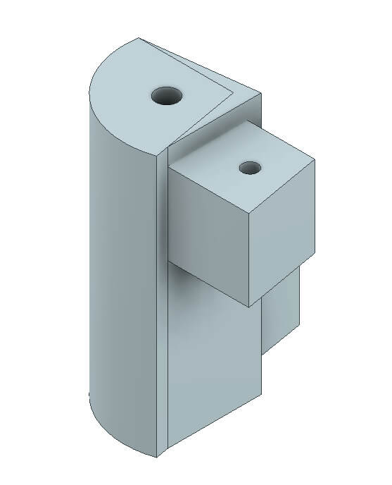
</td>
        </tr>
        <tr>
            <td>A6</td>
            <td>100 Grad Gelenk Spiegel   (<a href="cad/Joints/100deg_Joint_Mirror.stl">STL</a>, <a href="cad/Joints/100deg_Joint_Mirror.step">STEP</a>) </td>
            <td>1</td>
            <td>
 
</td>
        </tr>
        <tr>
            <td>A7</td>
            <td>Endgelenk   (<a href="cad/Joints/End_Joint.stl">STL</a>, <a href="cad/Joints/End_Joint.step">STEP</a>) </td>
            <td>2</td>
            <td>
 
</td>
        </tr>
        <tr>
            <td>A8</td>
            <td rowspan=3>Beine</td>
            <td>Vorderbein   (<a href="cad/Legs/Front_Leg.stl">STL</a>, <a href="cad/Legs/Front_Leg.step">STEP</a>) </td>
            <td>4</td>
            <td>
 
</td>
            <td rowspan=3>317g</td>
            <td rowspan=3>22.5h</td>
            <td rowspan=3>€14.97</td>
        </tr>
        <tr>
            <td>A9</td>
            <td>Mittelbein   (<a href="cad/Legs/Mid_Leg.stl">STL</a>, <a href="cad/Legs/Mid_Leg.step">STEP</a>) </td>
            <td>2</td>
            <td>
 
</td>
        </tr>
        <tr>
            <td>A10</td>
            <td>Hinterbein   (<a href="cad/Legs/Rear_Leg.stl">STL</a>, <a href="cad/Legs/Rear_Leg.step">STEP</a>) </td>
            <td>2</td>
            <td>
 
</td>
        </tr>
        <tr>
            <td>A11</td>
            <td>Lagerabdeckung</td>
            <td>Lagerabdeckung   (<a href="cad/BearingCover/BearingCover.stl">STL</a>, <a href="cad/BearingCover/BearingCover.step">STEP</a>) </td>
            <td>4</td>
            <td>
 
</td>
            <td>13g</td>
            <td>1.5h</td>
            <td>€0.60</td>
        </tr>
        <tr>
            <td>A12</td>
            <td>Handyhalterung Plattform</td>
            <td>Handyhalterung Plattform   (<a href="cad/PhoneMount/Phone_Mount.stl">STL</a>, <a href="cad/PhoneMount/Phone_Mount.step">STEP</a>) </td>
            <td>1</td>
            <td>
 
</td>
            <td>19g</td>
            <td>2h</td>
            <td>€0.91</td>
        </tr>
        <tr>
            <td>A13</td>
            <td rowspan=4>Vorderpuffer</td>
            <td>Name vorne   (<a href="cad/Buffer/Name_Front.stl">STL</a>, <a href="cad/Buffer/Name_Front.step">STEP</a>) </td>
            <td>1</td>
            <td>
 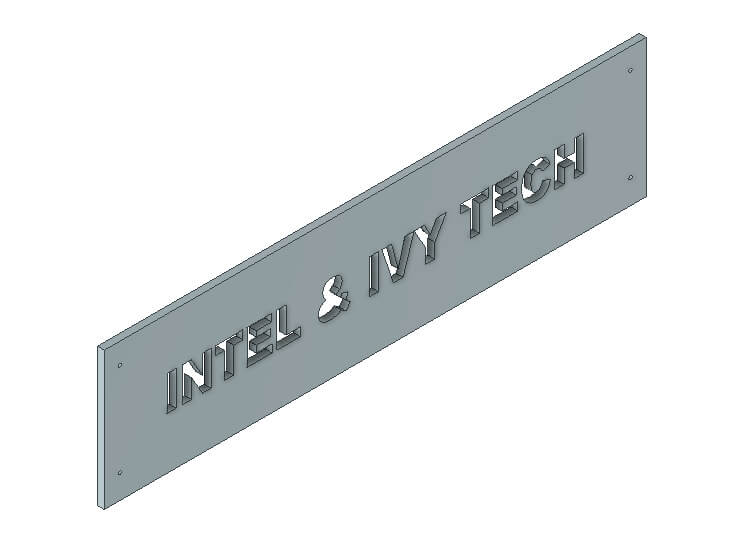
</td>
            <td rowspan=4>228g</td>
            <td rowspan=4>20.5h</td>
            <td rowspan=4>€15.04</td>
        </tr>
        <tr>
            <td>A14</td>
            <td>Name hinten   (<a href="cad/Buffer/Name_Back.stl">STL</a>, <a href="cad/Buffer/Name_Back.step">STEP</a>) </td>
            <td>1</td>
            <td>
 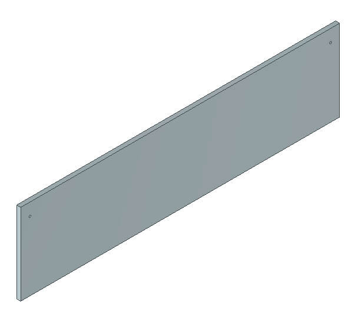
</td>
        </tr>
        <tr>
            <td>A15</td>
            <td>Puffer links   (<a href="cad/Buffer/Buffer_Left.stl">STL</a>, <a href="cad/Buffer/Buffer_Left.step">STEP</a>) </td>
            <td>1</td>
            <td>
 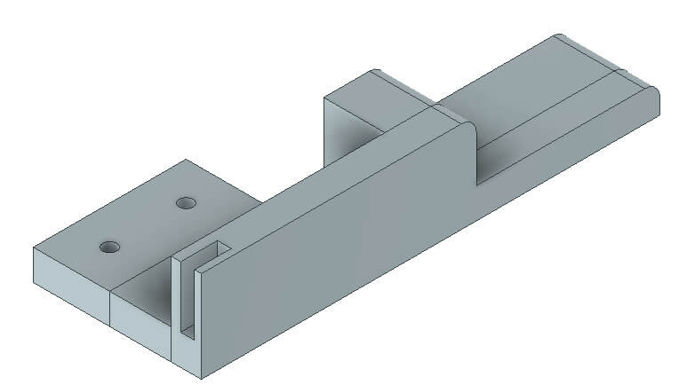
</td>
        </tr>
        <tr>
            <td>A16</td>
            <td>Puffer rechts   (<a href="cad/Buffer/Buffer_Right.stl">STL</a>, <a href="cad/Buffer/Buffer_Right.step">STEP</a>) </td>
            <td>1</td>
            <td>
 
</td>
        </tr>
        <tr>
            <td>A17</td>
            <td rowspan=8>Abteil</td>
            <td>Abteil hinten   (<a href="cad/Compartment/Compartment_Rear.stl">STL</a>, <a href="cad/Compartment/Compartment_Rear.step">STEP</a>) </td>
            <td>1</td>
            <td>
 
</td>
            <td>413g</td>
            <td>32h</td>
            <td>€22.75</td>
        </tr>
        <tr>
            <td>A18</td>
            <td>Abteil vorne   (<a href="cad/Compartment/Compartment_Front.stl">STL</a>, <a href="cad/Compartment/Compartment_Front.step">STEP</a>) </td>
            <td>1</td>
            <td>
 
</td>
            <td>316g</td>
            <td>22h</td>
            <td>€17.42</td>
        </tr>
        <tr>
            <td>A19</td>
            <td>Dach vorne   (<a href="cad/Compartment/Roof_Front.stl">STL</a>, <a href="cad/Compartment/Roof_Front.step">STEP</a>) </td>
            <td>1</td>
            <td>
 
</td>
            <td>58g</td>
            <td>5.5h</td>
            <td>€3.19</td>
        </tr>
        <tr>
            <td>A20</td>
            <td>Dach hinten   (<a href="cad/Compartment/Roof_Rear.stl">STL</a>, <a href="cad/Compartment/Roof_Rear.step">STEP</a>) </td>
            <td>1</td>
            <td>
 
</td>
            <td>140g</td>
            <td>13.5h</td>
            <td>€7.73</td>
        </tr>
        <tr>
            <td>A21ab</td>
            <td>Batteriehalterung P1 & P2   (<a href="cad/Compartment/Compartment_Battery_Mount-P1.stl">STL</a>, <a href="cad/Compartment/Compartment_Battery_Mount-P1.step">STEP</a>)
              (<a href="cad/Compartment/Compartment_Battery_Mount-P2.stl">STL</a>, <a href="cad/Compartment/Compartment_Battery_Mount-P2.step">STEP</a>) </td>
            <td>1</td>
            <td>
 
</td>
            <td>15g</td>
            <td>1.5h</td>
            <td>€0.80</td>
        </tr>
        <tr>
            <td>A22</td>
            <td>Endkappen für Licht   (<a href="cad/Compartment/Headlight_Rear.stl">STL</a>, <a href="cad/Compartment/Headlight_Rear.step">STEP</a>)</td>
            <td>4</td>
            <td>
 
</td>
            <td rowspan=3>47g</td>
            <td rowspan=3>4h</td>
            <td rowspan=3>€2.58</td>
        </tr>
        <tr>
            <td>A23</td>
            <td>Scheinwerfer   (<a href="cad/Compartment/Headlight_Front.stl">STL</a>, <a href="cad/Compartment/Headlight_Front.step">STEP</a>)</td>
            <td>4</td>
            <td>
 
</td>
        </tr>
        <tr>
            <td>A24</td>
            <td>Batteriezugangsklappe   (<a href="cad/Compartment/Compartment_Door.stl">STL</a>, <a href="cad/Compartment/Compartment_Door.step">STEP</a>)</td>
            <td>1</td>
            <td>
 
</td>
        </tr>
    </tbody>
</table>

Für die oben genannten Teile muss Ihre Bauplatte mindestens 240mm x 150mm groß sein.

Auf einem Ultimaker S5 haben wir mit den folgenden Einstellungen gute Ergebnisse erzielt:

- Schichthöhe: 0,2mm
- Wandstärke: 1,5mm
- Fülldichte: 20%
- Füllmuster: Gitter
- Druckgeschwindigkeit: 80 mm/s
- keine Unterstützung

## II. Elektro-Mechanische Montage

### II.1. Stückliste

Unser Roboterkörper basiert auf leicht verfügbaren Hobby-Elektronikkomponenten. Wir bieten Links für Deutschland (EU) und die Vereinigten Staaten (US) mit schneller Lieferung an. Wenn Sie die Geduld haben, etwas länger zu warten, können Sie die Komponenten auch viel günstiger bei AliExpress (AE) bekommen. Sie benötigen die folgenden Komponenten.

<table>
    <thead>
        <tr>
            <th>ID </th>
            <th>Beschreibung</th>
            <th>Bild</th>
            <th>Lieferant</th>
            <th>Stückpreis</th>
            <th>Menge</th>
            <th>Kosten</th>
        </tr>
    </thead>
    <tbody>
        <tr>
            <td>O1</td>
            <td>JGB37-520 DC-Motor mit Encodern - 12V | 178RPM </td>
            <td>
 
</td>
            <td>  <a href="https://de.aliexpress.com/item/4001339371886.html?gatewayAdapt=glo2deu&spm=a2g0s.9042311.0.0.1fe54c4dR1WTdj/">AE</a></td>
            <td>$8.93 | €8.12</td>
            <td>6</td>
            <td>$53.58 | €48.72</td>
        </tr>
        <tr>
            <td>O2</td>
            <td>2.8" Talon Reifen (2 Stk.)</td>
            <td>
 
</td>
            <td> <a href="https://www.robotshop.com/en/28-talon-tires-pair.html">US</a> | <a href="https://www.robotshop.com/eu/en/28-talon-tires-pair.html">EU</a></td>
            <td>$26.95 | €23.06</td>
            <td>6</td>
            <td>$161.7 | €138.36</td>
        </tr>
        <tr>
            <td>O3</td>
            <td>7-adriges Kabel 0.5 mm² (5m)</td>
            <td>
 
</td>
          <td>  <a href="https://www.amazon.com/Heavy-Gauge-Conductor-Trailer-Cable/dp/B01N3Q0YGS/ref=sr_1_16?crid=3SK9Y7DSOR0OL&keywords=caravan+cable+7+wire&qid=1649847035&sprefix=carava+cable+7+wire%2Caps%2C190&sr=8-16">US</a> | <a href="https://www.amazon.de/-/en/1119757-Classic-Control-Protective-Conductor/dp/B08CY2WPM4/ref=sr_1_5?crid=1QGOB5LF0GZYO&keywords=7+adriges+kabel+0%2C5mm%C2%B2&qid=1644173962&sprefix=7+core+cable+0.5mm+%2Caps%2C289&sr=8-5">EU</a></td>
            <td> $25.53 | €20.61</td>
            <td>0.25</td>
            <td>$6.38 | €5.15</td>
        </tr>
        <tr>
            <td>O4</td>
            <td>D-Line Kabelkanal. 20mm x 10mm x 1m (2 Stk.)</td>
            <td>
 
</td>
            <td>  <a href="https://www.amazon.com/D-Line-Raceway-1D3015W-Electrical-Paintable/dp/B07KFNYR7G/ref=sr_1_10?crid=137L39X59R8AQ&keywords=D-Line%2Bcable%2Bduct&qid=1649851731&refinements=p_36%3A1253503011&rnid=386442011&s=electronics&sprefix=d-line%2Bcable%2Bduct%2Caps%2C409&sr=1-10&th=1">US</a> | <a href="https://www.amazon.de/-/en/D-Line-Micro-Cable-Management-Strip-White/dp/B082WVQXT5/ref=sr_1_fkmr0_1?crid=3CBV1RRPR6K9B&keywords=d-line%2Bmicro%2B%2Bkabelkanal%2B(2%2Bmeter)%2C%2C%2Bselbstklebende%2Bkabelabdeckungen%2C%2Belektrische%2Bkabelf%C3%BChrung%2C%2Bbeliebte%2Bkabelmanagementl%C3%B6sung%2C%2B20%2Bmm%2B(b)%2Bx%2B10%2Bmm%2B(h)%2B-%2B2%2Bx%2B1%2Bm%2Bl%C3%A4nge%2B-%2Bschwarz&qid=1644149200&sprefix=d-line%2Bmicro%2B%2Bcable%2Btrunking%2B2-meter%2Bself-adhesive%2Bcable%2Bcovers%2Belectrical%2Bcable%2Btidy%2Bpopular%2Bcable%2Bmanagement%2Bsolution%2B20mm%2Bw%2Bx%2B10mm%2Bh%2B-%2B2%2Bx%2B1%2Bmeter%2Blengths%2B-%2Bblack%2B%2Caps%2C381&sr=8-1-fkmr0&th=1">EU</a></td>
            <td>$12.00 | €9.99</td>
            <td>1</td>
            <td>$12.00 | €9.99</td>
        </tr>
        <tr>
            <td>O5</td>
            <td>PG7 Kabelverschraubung 3~6.5mm (50 Stk.)</td>
            <td>
 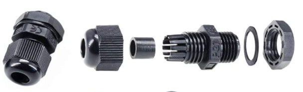
</td>
          <td>  <a href="https://www.amazon.com/ARTGEAR-Waterproof-Adjustable-Connector-Protector/dp/B07JH2LPZF/ref=sr_1_11?crid=1UH8URDCXAHJJ&keywords=Cable+Gland+Set+Plastic+Cable+Glands+Adjustable+PG7+Waterproof+Closure+Cable+Screw+Connection+for+Diameter+3.5+mm+-+6.5+mm+Black+Pack+of+50&qid=1649852081&sprefix=cable+gland+set+plastic+cable+glands+adjustable+pg7+waterproof+closure+cable+screw+connection+for+diameter+3.5+mm+-+6.5+mm+black+pack+of+50+%2Caps%2C243&sr=8-11"> US </a> | <a href="https://www.amazon.de/-/en/Plastic-Adjustable-Waterproof-Connection-Diameter/dp/B08Q458H3N/ref=sr_1_fkmr0_1?crid=1H5VCAQKXD2XZ&keywords=pg7+kabelverschraubung%2C+50+st%C3%BCck%2C+3-6%2C5+mm%2C+verstellbar%2C+wasserdicht%2C+kabelverschraubungen%2C+verbindungsst%C3%BCck+mit+dichtungen&qid=1644149525&sprefix=pg7+cable+gland+50+pack+3+6.5mm+adjustable+waterproof+cable+glands+joints+connector+with+gaskets+%2Caps%2C80&sr=8-1-fkmr0">EU</a></td>
            <td>$8.99 | €9.99</td>
            <td>0.5</td>
            <td>$4.49 | €4.99</td>
        </tr>
        <tr>
            <td>O6</td>
            <td>MR126ZZ Kugellager 6x12x4mm (4 Stk.)</td>
            <td>
 
</td>
            <td>  <a href="https://de.aliexpress.com/item/1005001697683913.html?gatewayAdapt=glo2deu&spm=a2g0s.9042311.0.0.1fe54c4dR1WTdj">AE</a></td>
            <td>$5.52 | €3.45</td>
            <td>1</td>
            <td>$5.52 | €3.45</td>
        </tr>
        <tr>
            <td>O7</td>
            <td>INJORA 90mm RC Auto Federdämpfer (2 Stk.)</td>
            <td>
 
</td>
            <td>  <a href="https://de.aliexpress.com/item/4000309686709.html?gatewayAdapt=glo2deu&spm=a2g0o.productlist.0.0.17b17ca7oMXyhJ&algo_pvid=c7d8ba55-28b2-4d27-97e4-f338994958f7&algo_exp_id=c7d8ba55-28b2-4d27-97e4-f338994958f7-14&pdp_ext_f=%7B%22sku_id%22%3A%2210000001286270094%22%7D&pdp_pi=-1%3B8.3%3B-1%3B-1%40salePrice%3BUSD%3Bsearch-mainSearch">AE</a></td>
            <td>$8.30 | €7.99</td>
            <td>1</td>
            <td>$8.30 | €7.99</td>
        </tr>
        <tr>
            <td>O8</td>
            <td>AXSPEED RC Auto LED 4.2v-6v Weiß 17mm (2 Stk.)</td>
            <td>
 
</td>
            <td>  <a href="https://www.aliexpress.com/item/1005003306484898.html?spm=a2g0s.9042311.0.0.d4954c4dpsjiiC">AE</a></td>
            <td>$7.43 | €6.87</td>
            <td>1</td>
            <td>$7.43 | €6.87</td>
        </tr>
        <tr>
            <td>O9</td>
            <td>AXSPEED RC Auto LED 4.2v-6v Rot 17mm (2 Stk.)</td>
            <td>
 
</td>
            <td>  <a href="https://www.aliexpress.com/item/1005003306484898.html?spm=a2g0s.9042311.0.0.d4954c4dpsjiiC">AE</a></td>
            <td>$7.43 | €6.87</td>
            <td>1</td>
            <td>$7.43 | €6.87</td>
        </tr>
        <tr>
            <td>O10</td>
            <td>Schwingungsdämpfer M3 x 8mm Gewindestifte (4 Stk.)</td>
            <td>
 
</td>
            <td>  <a href="https://www.amazon.com/MroMax-Rubber-Vibration-Isolator-Absorber/dp/B07Z76J5N5/ref=sr_1_5?crid=2LSR8ZMHRIL2O&keywords=m3+rubber+mount+shock+absorbers&qid=1649862366&sprefix=keesin+m3+rubber+mounts+shock+absorbers+%2Caps%2C362&sr=8-5">US</a> | <a href="https://www.amazon.de/-/en/gp/product/B076SSPHP6/ref=ppx_yo_dt_b_asin_title_o03_s01?ie=UTF8&psc=1">EU</a></td>
            <td>$8.09 | €9.49</td>
            <td>1</td>
            <td>$8.09 | €9.49</td>
        </tr>
        <tr>
            <td>O11</td>
            <td>Zeadio Universal Smartphone-Halter</td>
            <td>
 
</td>
            <td> <a href="https://www.amazon.com/SharingMoment-Smartphone-Horizontal-Rotatable-Adjustable/dp/B07S8TTH34/ref=sr_1_4?crid=X7XQ9LC110JJ&keywords=Zeadio+Smartphone+Tripod+Adapter%2C+Mobile+Phone+Holder&qid=1649862548&refinements=p_36%3A2491155011&rnid=2491154011&s=wireless&sprefix=zeadio+smartphone+tripod+adapter%2C+mobile+phone+holder+%2Caps%2C577&sr=1-4">US</a> | <a href="https://www.amazon.de/-/en/Zeadio-Smartphone-Tripod-Adapter-Mobile/dp/B06XDYJNSR/ref=sr_1_8?crid=2ZH6V545D45E3&keywords=zeadio%2Buniversal%2Bsmartphone%2Bhalterung&qid=1644150427&sprefix=zeadio%2Buniversal%2Bsmartphone%2Bholder%2Caps%2C104&sr=8-8&th=1">EU</a></td>
            <td>$11.99 | €10.99</td>
            <td>1</td>
            <td>$11.99 | €10.99</td>
        </tr>
        <tr>
            <td>O12</td>
            <td>DC 12-24 V Auto Voltmeter</td>
            <td>
 
</td>
            <td>  <a href="https://www.amazon.com/Nilight-Voltmeter-Waterproof-VoltVolt-Motorcycle/dp/B06ZZJ48VQ/ref=sr_1_fkmr1_2?crid=376857DCCJICB&keywords=mini+led+digital+voltmeter+batterietester+12+volt+%2F+24+volt+voltmeter&qid=1649862763&sprefix=mini+led+digital+voltmeter+batterietester+12+volt+%2F+24+volt+voltmeter%2Caps%2C404&sr=8-2-fkmr1">US</a> | <a href="https://www.amazon.de/-/en/Intckwan-Digital-Voltmeter-Waterproof-Motorcycle/dp/B09T5XRYM9/ref=sr_1_5?crid=1GPFOX9O2VX85&keywords=mini+led+digital+voltmeter+batterietester+12+volt+%2F+24+volt+voltmeter&qid=1649862700&sprefix=mini+led+digital+voltmeter+battery+tester+12+volt+%2F+24+volt+voltmeter%2Caps%2C91&sr=8-5">EU</a></td>
            <td>$10.99 | €11.88</td>
            <td>1</td>
            <td>$10.99 | €11.88</td>
        </tr>
        <tr>
            <td>O13</td>
            <td>Mini-Wippschalter (20 Stk.)</td>
            <td>
 
</td>
            <td>  <a href="https://www.amazon.com/DaierTek-250VAC-Rocker-KCD1-101-Plastic/dp/B07S2QJKTX/ref=sr_1_4?keywords=RUNCCI-YUN+20Pcs+Mini+Rocker+Switch&qid=1650638471&sr=8-4">US</a> | <a href="https://www.amazon.de/-/en/RUNCCI-Rocker-Switches-Household-Appliances/dp/B07MW92CW8/ref=sr_1_2?keywords=RUNCCI-YUN+20+St%C3%BCck+Mini-Wipps

Die Gesamtkosten der extern bezogenen Komponenten werden auf rund **500€** geschätzt, was zu Gesamtkosten von rund **600€** durch MTV führt.

### II.2. Mechanische Montage

#### II.2.1. Übersicht

Dieses Kapitel behandelt den Montageprozess des MTV. Beachten Sie, dass links und rechts die Backbord- und Steuerbordseiten des Roboters sind und in diesem Dokument austauschbar verwendet werden. Sofern nicht anders angegeben, wird davon ausgegangen, dass alle Schrauben Flachscheiben haben, um das 3D-gedruckte Plastik zu schützen. Es sollte außerdem betont werden, dass die Verwendung von Federscheiben und Nyloc-Muttern normalerweise ein Lösen der Muttern durch Vibrationen verhindert.

Der Montageprozess des MTV kann in sieben Hauptschritte unterteilt werden, nämlich:
1. Montage der 6 Motormodule
2. Montage der Beine
3. Montage des Chassis
4. Montage des Hauptfachs
5. Montage des Fahrzeugs
6. Montage der Energieeinheit, Steuereinheit und Verbindung der verschiedenen Komponenten
7. Testen, Programmieren und Nutzung.

  

#### II.2.2. Montage der Motormodule

Jedes der Motormodule besteht aus den folgenden Teilen:

- 1 x 3D-gedrucktes <a href="cad/MotorAssembly/MotorEnclosure_Top.stl">Motor-Gehäuse Oberteil</a> (A1)
- 1 x 3D-gedrucktes <a href="cad/MotorAssembly/MotorEnclosure_Bottom.stl">Motor-Gehäuse Unterteil</a> (A2)
- 1 x 3D-gedrucktes <a href="cad/MotorAssembly/Motor_Bracket.stl">Motorhalterung</a> (A3)
- 1 x JGB37-520 DC-Motor mit Encodern und Radadapter (O1)
- 1 x PG7 Kabelverschraubung (O5)

Um ein Motormodul zu montieren:

1. Beginnen Sie damit, das im Kit enthaltene Steuerkabel (O1) mit dem Motor zu verbinden. Es wird dringend empfohlen, diese Verbindung mit etwas Heißkleber zu sichern.
2. Richten Sie das Motorbefestigungsmuster sorgfältig mit dem Lochmuster des 3D-gedruckten Motorgehäuses (A1) aus. Achten Sie darauf, keinen Druck auf den Encoder auszuüben, um Beschädigungen zu vermeiden. Schrauben Sie den Motor mit den im Kit enthaltenen Schrauben (O1) an das 3D-gedruckte Motorgehäuse (A1).
3. Befestigen Sie die Kupplungshülse aus dem Kit (O1) mit dem mitgelieferten Inbusschlüssel an der Motorwelle. Lassen Sie die Mutter, die das Rad an der Kupplungshülse sichert, sicher im Sechskanthub eingeschraubt, da Sie diese später beim Anbringen der Reifen (O2) am Fahrzeug benötigen.
4. Schieben Sie die Motorhalterung (A3) über das Motor-Gehäuse Oberteil (A1). Dies ist eine Passung und erfordert möglicherweise eine sorgfältige Ausrichtung beim Einschieben. Beachten Sie, dass die Schulter der Motorhalterung (wie in der Abbildung unten gezeigt) zur Seite der Motorwelle zeigen sollte, um eine sauberere Montage zu gewährleisten. Stellen Sie sicher, dass die Motorhalterung (A3) fest mit dem Motor-Gehäuse Oberteil (A1) sitzt. Sichern Sie die Montage mit Heißkleber oder Sekundenkleber.
5. Fügen Sie die Kabelverschraubungen (O5) zum Motor-Gehäuse Unterteil (A2) hinzu und führen Sie das Motorkabel durch die Verschraubung.
6. Schieben Sie das Motor-Gehäuse Unterteil (A2) vorsichtig auf das Motor-Gehäuse Oberteil (A1), bis das Motor-Gehäuse Unterteil (A2) die volle Strecke zurückgelegt hat. Stellen Sie sicher, dass die Motorhalterung (A3) bündig mit dem Motor-Gehäuse Oberteil (A1) ist. Achten Sie darauf, die Kabel nicht gegen den Encoder zu klemmen - der Encoder muss frei drehbar sein.
7. Das Motor-Gehäuse Oberteil (A2) mit der Motorhalterung (A3) wird mit M4 x 60mm Schrauben (O23) und Nyloc-Muttern (O28) befestigt.

  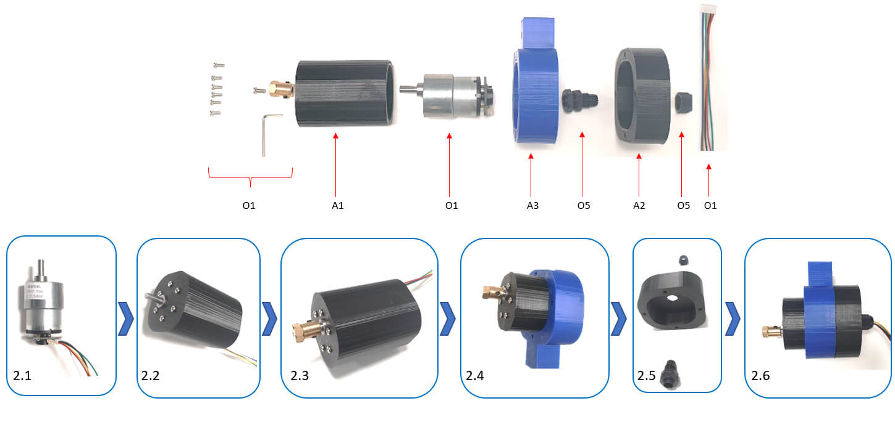

  

#### II.2.3. Montage der Beine

Das linke Bein des MTV besteht aus den folgenden Teilen:

- 1 x 3D-gedrucktes <a href="cad/Joints/90deg_Joint.stl">90 Grad Gelenk</a> (A4)
- 1 x 3D-gedrucktes <a href="cad/Joints/End_Joint.stl">Endgelenk</a> (A7)
- 1 x 3D-gedrucktes <a href="cad/Joints/BearingCover.stl">Lagerabdeckung</a> (A11)
- 1 x 3D-gedrucktes <a href="cad/Joints/100deg_Joint.stl">100 Grad Gelenk</a> (A5)
- 2 x 3D-gedrucktes <a href="cad/Legs/Front_Leg.stl">Vorderbein</a> (A8)
- 1 x 3D-gedrucktes <a href="cad/Legs/Mid_Leg.stl">Mittelbein</a> (A9)
- 1 x 3D-gedrucktes <a href="cad/Legs/Rear_Leg.stl">Hinterbein</a> (A10)
- 1 x D-Line Kabelkanal (O4)
- 1 x 7-adriges Kabel (O3)
- 1 x MR126ZZ Kugellager (O6)

Das rechte Bein des MTV besteht aus den folgenden Teilen:

- 1 x 3D-gedrucktes <a href="cad/Joints/90deg_Joint.stl">90 Grad Gelenk</a> (A4)
- 1 x 3D-gedrucktes <a href="cad/Joints/End_Joint.stl">Endgelenk</a> (A7)
- 1 x 3D-gedrucktes <a href="cad/Joints/BearingCover.stl">Lagerabdeckung</a> (A11)
- 1 x 3D-gedrucktes <a href="cad/Joints/100deg_Joint_Mirror.stl">100 Grad Gelenk Spiegel</a> (A6)
- 2 x 3D-gedrucktes <a href="cad/Legs/Front_Leg.stl">Vorderbein</a> (A8)
- 1 x 3D-gedrucktes <a href="cad/Legs/Mid_Leg.stl">Mittelbein</a> (A9)
- 1 x 3D-gedrucktes <a href="cad/Legs/Rear_Leg.stl">Hinterbein</a> (A10)
- 1 x D-Line Kabelkanal (O4)
- 1 x 7-adriges Kabel (O3)
- 1 x MR126ZZ Kugellager (O6)

Montieren Sie das 90-Grad-Gelenk (A4) und die zugehörigen Beine (A8) (2x vorne + Mitte), um die vordere Beinmontage (rechts und links) zu bilden. Die Beine werden mit M4 x 40mm Schrauben (O24), Flachscheiben (O30), Federscheiben (O30) und Muttern (O28) am Gelenk befestigt. Bohren Sie die geführten Löcher mit M4 in den Beinmontagen (im Mittelbein gibt es 3 geführte Löcher, die Enden sollten M4 und die Mitte sollte M3 sein, die zur Befestigung der Stoßdämpfer verwendet werden). Befestigen Sie das hintere Bein 100-Grad-Gelenk (A5) (bzw. Spiegel A6) und das hintere Bein, um die vollständigen Beinmontagen für Backbord und Steuerbord zu bilden, und sichern Sie das Bein mit M4 x 40mm Schrauben (O24), Flachscheiben (O30), Federscheiben (O30) und Muttern (O28).

  

#### II.2.4. Montage des Chassis

Befestigen Sie die Motorhalterungen an den freien Enden jedes Beins (2 x Vorder- und Hinterbein sowohl auf der linken als auch auf der rechten Seite) mit M4 x 40mm Schrauben (O24), Flach- und Federscheiben (O30) und Muttern (O28). Befestigen Sie die Reifen (O2) am Sechskanthub und sichern Sie sie mit der Radnabenmutter. Die MTV-Motoren enthalten einen integrierten Magnetencoder zur Geschwindigkeitsschätzung und haben eine 6-polige Schnittstelle, nämlich `[Motor power +, Motor power -, Encoder power +, Encoder power -, Encoder data 1, Encoder data 2]`. Die elektrische Verbindung zwischen den Motoren und den Steuer-PCBs sollte mit dem 7-adrigen Kabel (O3) erfolgen:

  

Vervollständigen Sie die Chassismontage, einschließlich der Befestigung des Kabelkanals (O4) nach Bedarf:

  

#### II.2.5. Montage des Hauptfachs

Das Hauptfach besteht aus den folgenden Teilen:

- 2 x 3D-gedruckte <a href="cad/Joints/BearingCover.stl">Lagerabdeckung</a> (A11)
- 1 x 3D-gedruckte <a href="cad/PhoneMount/Phone_Mount.stl">Telefonhalterungsplattform</a> (A12)
- 1 x 3D-gedrucktes <a href="cad/Buffer/Name_Front.stl">Namensschild vorne</a> (A13)
- 1 x 3D-gedrucktes <a href="cad/Buffer/Name_Back.stl">Namensschild hinten</a> (A14)
- 1 x 3D-gedrucktes <a href="cad/Buffer/Buffer_Left.stl">Puffer links</a> (A15)
- 1 x 3D-gedrucktes <a href="cad/Buffer/Buffer_Right.stl">Puffer rechts</a> (A16)
- 1 x 3D-gedrucktes <a href="cad/Compartment/Compartment_Rear.stl">Hauptfach hinten</a> (A17)
- 1 x 3D-gedrucktes <a href="cad/Compartment/Compartment_Front.stl">Hauptfach vorne</a> (A18)
- 1 x 3D-gedrucktes <a href="cad/Compartment/Roof_Front.stl">Dach vorne</a> (A19)
- 1 x 3D-gedrucktes <a href="cad/Compartment/Roof_Rear.stl">Dach hinten</a> (A20)
- 1 x 3D-gedrucktes <a href="cad/Compartment/Compartment_Battery_Mount-P1.stl">Batteriehalterung P1</a> (A21a)
- 1 x 3D-gedrucktes <a href="cad/Compartment/Compartment_Battery_Mount-P2.stl">Batteriehalterung P2</a> (A21b)
- 4 x M4 x 120mm Schrauben (O26)
- 6 x PG7 Kabelverschraubung (O5)
- 1 x M6 Gewindestange (O21)

Verbinden Sie das hintere Fach (A17) mit dem vorderen Fach (A18), um die Fachmontage mit M3 x 15mm Schrauben (O25), Flachscheiben (O28) und Nyloc-Muttern (O28) zu bilden. Verwenden Sie die geführten Löcher, um M3-Löcher für den Verbindungszweck zu bohren.

  

Bohren Sie die Lagerverbindungslöcher in das Chassis, wo die geführten Löcher vorhanden sind, und setzen Sie die Lager (O6) in die Lagerabdeckung (A11) ein und befestigen Sie die Lagerbaugruppe mit 4 M3 x 30mm Schrauben (O25), Federscheiben (O30), Scheiben (O28) und Nylocs (O28) an der Außenseite der Fachbaugruppe.

  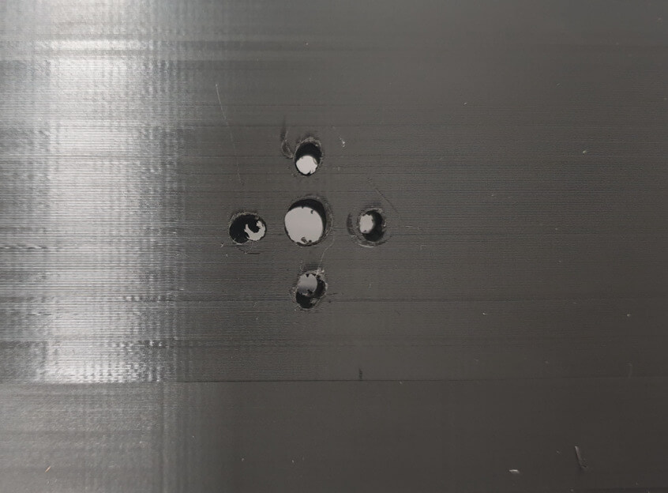

Befestigen Sie die Kabelverschraubungen (O5) an den sechs Löchern im hinteren Fach (A17). Die sechs Verschraubungen werden verwendet, um die Motorkabel in das Fach zu führen:

  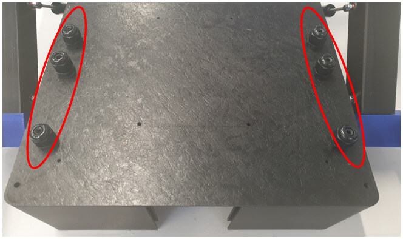

Befestigen Sie die linken und rechten Puffer (A15 & A16) an der Fachbaugruppe mit 4 M3 x 20mm Schrauben (O25), Federscheiben (O30), Scheiben (O28) und Nylocs (O28).

  

Befestigen Sie die Batteriehalterung P1 & P2 (A21 a & b) am hinteren Fach mit M3 x 15mm Schrauben (O25) und Nylocs (O28). Führen Sie die M6-Gewindestange (O21) in die Chassismontage durch das zentrale Loch der Lager und die Batteriehalterung P1 & P2 ein. Während die Gewindestange von einer Seite eingeführt wird, achten Sie darauf, die erforderlichen M6-Muttern (O29) hinzuzufügen, die sich im Inneren des Fachs befinden.
- Beachten Sie, dass sich zwei M6-Muttern (O29) an der Außenseite des Fachs befinden, die als Abstandshalter zwischen dem Chassis und der Fachbaugruppe dienen.
- Beachten Sie auch, dass die Gewindestange zwischen links und rechts ausbalanciert werden muss, um Platz für die Chassismontage zu gewährleisten.
- Es muss darauf geachtet werden, dass beim Einschrauben der Gewindestange in das Fach keine Vorspannung auf die Seitenwände ausgeübt wird.

  

#### II.2.6. Montage des Fahrzeugs

Befestigen Sie die Chassismontage an der M6-Gewindestange auf beiden Seiten des Fachs und sichern Sie sie mit M6-Muttern (O29):

  

Befestigen Sie die Stoßdämpfer (O7) zwischen dem Mittelbein und dem Chassis:

  

Tauschen Sie die werkseitig eingebauten Federn in den Stoßdämpfern gegen das mitgelieferte Set mit mittlerer Nachgiebigkeit (goldene Federn) aus, um sicherzustellen, dass der Körper des Roboters eben mit dem Boden bleibt. Befestigen Sie das Kolbenende mit dem mit dem Stoßdämpfer gelieferten Abstandshalter und der Schraube (O10) und einer M3-Sicherungsmutter (O28) am Roboterfach. Befestigen Sie das Stangenende mit M3 x 40 Schrauben (O25) und Nyloc (O28). Führen Sie die Kabel von der Beinmontage zum Hauptkörper und befestigen Sie sie gemäß den Verkabelungsrichtlinien (verwenden Sie auch den Kabelkanal entsprechend). Befestigen Sie die Telefonhalterung am Dach vorne (A19).
- Befestigen Sie die universelle Smartphone-Halterung (O11) an der Telefonhalterungsplattform (A12).
- Befestigen Sie die Schwingungsdämpfer (O11) an der Telefonhalterungsplattform (A12) und sichern Sie sie am Dach vorne (A19) mit Sicherungsmuttern und Scheiben wie dargestellt.

  

Befestigen Sie das Spannungsanzeigegerät (O12), die Leistungsschalter (O13) und das Micro-USB-Panel-Mount-Kabel (O14) in den dafür vorgesehenen Schlitzen des hinteren Dachs. Ziehen Sie die Scheinwerfer und Rücklichter (O8 & O9) durch die Dachauslässe und befestigen Sie das Dach vorne (A19) und das Dach hinten (A20) an der Fachbaugruppe. Setzen Sie die Scheinwerfer (O8) in die Scheinwerferfassung (A23) und die Rücklichter (O9) in die Rücklichtfassung (A24) ein und befestigen Sie sie in den jeweiligen Schlitzen im Dach vorne (A19) und Dach hinten (A20). Verschließen Sie die Lichtfassungen mit den Lichtendkappen (A22) wie in der Abbildung.

  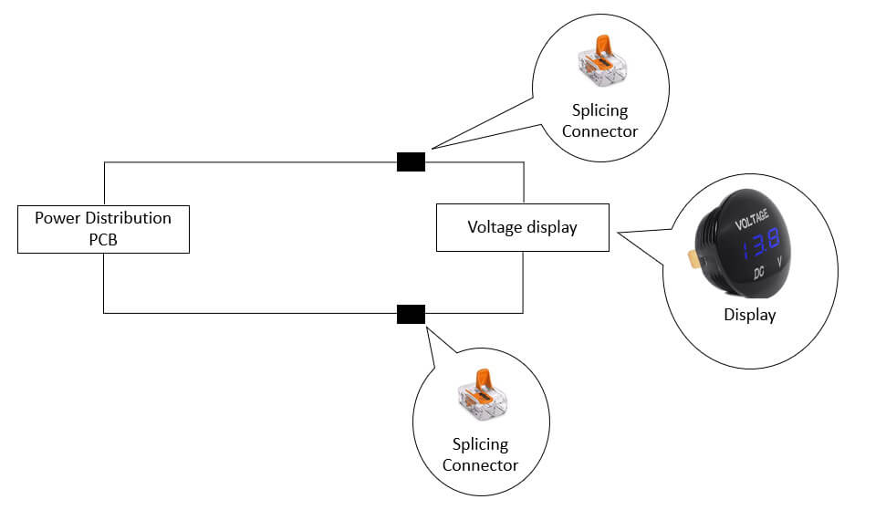

#### II.3.3. PCB – Lichtverbindung

Die Vorder- und Rücklichter sollten mit der Hauptplatine des MTV verbunden werden. Ein Schalter sollte auf dem Deckel des MTV angebracht werden, um sie zu steuern.

  

  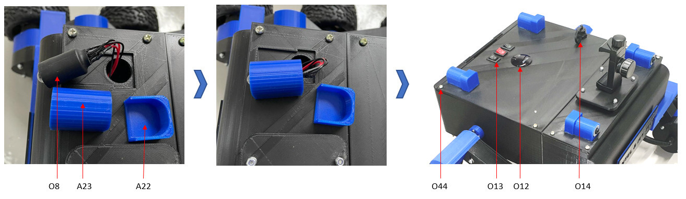

#### II.3.4. Montage der Stromverteilungsplatine

Die Stromverteilungsplatine wird im Hauptgehäuse des MTV montiert. Die Motorkabel werden durch die Montageschlitze gezogen, nachdem die Stromverteilungsplatine an ihrem Platz ist. Die Hauptplatine wird dann wie in der folgenden Abbildung gezeigt am MTV befestigt:

  

Sobald die Hauptplatine an ihrem Platz ist, werden die Motorkabel gekürzt und mit 2-poligen Schraubklemmen mit einem Rastermaß von 5,08 mm an die Hauptplatine angeschlossen. Als nächstes werden die Lichtverbindungen hergestellt. Die 12V- und 5V-Spannungsverbindungen der Stromverteilungsplatine werden im letzten Schritt mit dem MTV verbunden.

<table>
    <thead>
        <tr>
            <th>PCB</th>
            <th>Auf der Platine aufgedruckter Name</th>
            <th>Bild</th>
            <th>Kommentare</th>
        </tr>
    </thead>
    <tbody>
        <tr>
            <td rowspan=2>Stromverteilungsplatine</td>
            <td>
            Mount_1 
            Mount_2
            Mount_3
            Mount_4
            </td>
            <td>
 
</td>
            <td>Diese M3-Montagelöcher wurden entwickelt, um die Stromverteilungsplatine mit Schrauben und Muttern an den Verbindungspunkten des MTV zu befestigen.</td>
        </tr>
        <tr>
            <td>
            VC_Mount_1 
            VC_Mount_2
            VC_Mount_3
            VC_Mount_4
            </td>
            <td>
 
</td>
            <td>Diese M3-Montagelöcher wurden entwickelt, um den Spannungswandler mit Schrauben und Muttern an der Stromverteilungsplatine zu befestigen.</td>
        </tr>
        <tr>
            <td rowspan=2>Hauptplatine</td>
            <td>
            Mount_1 
            Mount_2
            Mount_3
            Mount_4
            </td>
            <td>
 
</td>
            <td>Diese M3-Montagelöcher wurden entwickelt, um die Hauptplatine mit Schrauben und Muttern an den Verbindungspunkten des MTV zu befestigen.</td>
        </tr>
        <tr>
            <td>
            MD_Mount_1 
            MD_Mount_2
            MD_Mount_3
            MD_Mount_4
            </td>
            <td>
 
</td>
            <td>Diese M3-Montagelöcher wurden entwickelt, um die Motorsteuerungen mit Schrauben und Muttern an der Hauptplatine zu befestigen.</td>
        </tr>
</table>

#### II.3.4. Montage der Kabel im MTV-Dach

Sobald die Hauptplatine befestigt war, wurden Schalter und Anzeigen im Dach/Deckel des MTV mit Spleißverbindern verbunden. Außerdem wurde der Micro-USB-Programmieranschluss des ESP 32 mit einem „links gewinkelten 90-Grad-Micro-USB-Verlängerungskabel (Stecker auf Buchse)“ verbunden. Das Buchsenende der USB-Verlängerung wurde am Deckel des MTV befestigt, sodass Benutzer die USB-Kabel anschließen können, ohne den Deckel abnehmen zu müssen.

  

### II.4. Sicherheitshinweis

*Es wird davon ausgegangen, dass der MTV von Personen mit mittlerem oder fortgeschrittenem Fachwissen im Zusammenbau mechanischer und elektronischer Geräte konstruiert wird. Bitte seien Sie sich Ihrer eigenen Sicherheit bewusst, während Sie den Roboter zusammenbauen und betreiben. Weder **Ivy Tech LTD** noch **Intel Deutschland GmbH** sind für Unfälle verantwortlich, die durch Fahrlässigkeit des Benutzers verursacht werden.*

- Lesen Sie das Handbuch vor dem Zusammenbau sorgfältig durch.
- Achten Sie auf die scharfen Kanten der 3D-gedruckten Komponenten.
- Halten Sie während des Betriebs einen sicheren Abstand zum Roboter.
- Achten Sie darauf, dass Ihre Finger nicht zwischen die Gelenke und Räder des Roboters geraten.
- Lagern Sie den Roboter nicht unter direkter Sonneneinstrahlung.
- Dieses Produkt ist **nicht wasserdicht**. Wir empfehlen nicht, den MTV bei Regen oder in feuchten Umgebungen zu betreiben.
- Verwenden Sie den MTV nicht in der Nähe von Feuer oder anderen Wärmequellen.
- Lassen Sie den MTV nicht aus großer Höhe fallen.
- Verwenden Sie nur die vorgesehenen/empfohlenen Werkzeuge zum Zusammenbau des Roboters.
- Üben Sie keinen übermäßigen Druck auf Muttern, Schrauben oder Roboterteile aus.
- Vermeiden Sie es, den Roboter in der Höhe zu aktivieren, um plötzliche Stürze zu verhindern.
- Beschädigen Sie den Li-Po-Akku nicht und legen Sie ihn nicht ins Wasser.
- Schließen Sie den Li-Po-Akku nur an die vorgeschlagenen Anschlüsse an und lassen Sie ihn nicht mit anderen Leitern in Kontakt kommen.
- Wenn der Roboter keinen Strom mehr hat, wird empfohlen, den Akku aus dem Roboter zu nehmen und ihn in einem Li-Po-Sicherheitsbeutel zu laden. Der vollständig geladene Akku kann dann wieder in den Roboter eingesetzt werden, wie unten gezeigt.

  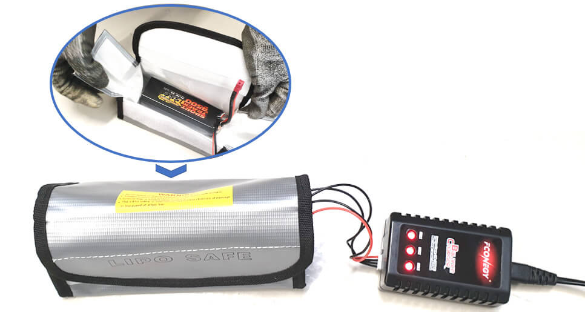

  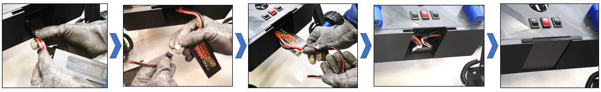

## III: Nächste Schritte

Flashen Sie die [Arduino Firmware](../../firmware/README.md)
