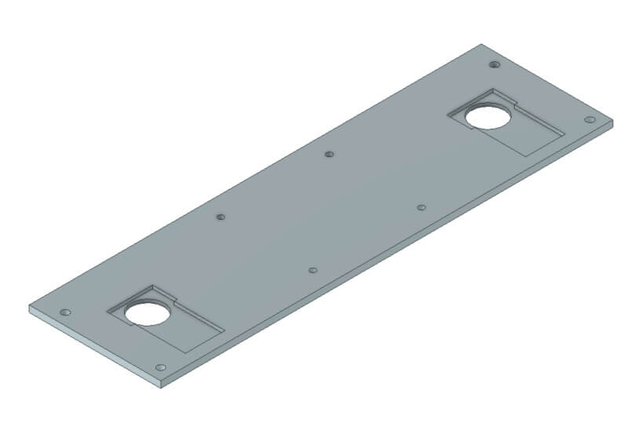
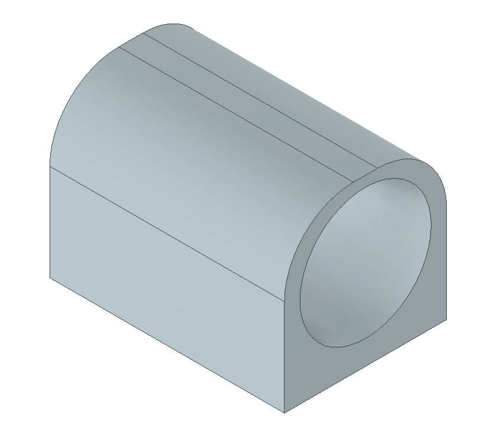

# OpenBot: Vehículo Multi-Terreno (MTV)

  <a href="README.md">English</a> |
  <a href="README.zh-CN.md">简体中文</a> |
  <a href="README.de-DE.md">Deutsch</a> |
  <a href="README.fr-FR.md">Français</a> |
  Español

Aquí proponemos una alternativa todoterreno al vehículo original [OpenBot](https://www.openbot.org/). Desarrollado en colaboración con **Ivy Tech LTD**, el Vehículo Multi-Terreno (MTV) también se basa en componentes económicos y fácilmente imprimibles. El MTV está inspirado en varios conceptos de vehículos de exploración desarrollados en las últimas décadas para la exploración lunar y marciana. El MTV está diseñado alrededor de un conjunto de 6 ruedas actuadas, organizadas en una configuración Rocker-Bogie. A diferencia de la mayoría de los rovers lunares o marcianos, las ruedas no pueden girar radialmente. Por lo tanto, el vehículo opera de la misma manera que un tanque, lo que hace que el control manual sea bastante intuitivo.

  

## I. Impresión 3D

Necesitarás imprimir las siguientes piezas para construir tu OpenBot MTV.

  

<table>
    <thead>
        <tr>
            <th>ID </th>
            <th>Grupo</th>
            <th>Nombre del Ítem</th>
            <th>Cantidad</th>
            <th>Imagen (no a escala)</th>
            <th>Material</th>
            <th>Duración</th>
            <th>Costo</th>
        </tr>
    </thead>
    <tbody>
        <tr>
            <td>A1</td>
            <td rowspan=3>Ensamblaje del motor</td>
            <td>Parte Superior de la Caja del Motor   (<a href="cad/MotorAssembly/MotorEnclosure_Top.stl">STL</a>, <a href="cad/MotorAssembly/MotorEnclosure_Top.step">STEP</a>) </td>
            <td>6</td>
            <td>
 
</td>
            <td rowspan=2>498g</td>
            <td rowspan=2>36h</td>
            <td rowspan=2>€23.51</td>
        </tr>
        <tr>
            <td>A2</td>
            <td>Parte Inferior de la Caja del Motor   (<a href="cad/MotorAssembly/MotorEnclosure_Bottom.stl">STL</a>, <a href="cad/MotorAssembly/MotorEnclosure_Bottom.step">STEP</a>) </td>
            <td>6</td>
            <td>
 
</td>
        </tr>
        <tr>
            <td>A3</td>
            <td>Soporte del Motor   (<a href="cad/MotorAssembly/Motor_Bracket.stl">STL</a>, <a href="cad/MotorAssembly/Motor_Bracket.step">STEP</a>) </td>
            <td>6</td>
            <td>
 
</td>
            <td>251g</td>
            <td>17.5h</td>
            <td>€11.98</td>
        </tr>
        <tr>
            <td>A4</td>
            <td rowspan=4>Juntas</td>
            <td>Junta de 90 grados   (<a href="cad/Joints/90deg_Joint.stl">STL</a>, <a href="cad/Joints/90deg_Joint.step">STEP</a>) </td>
            <td>2</td>
            <td>
 
</td>
            <td rowspan=4>228g</td>
            <td rowspan=4>20.5h</td>
            <td rowspan=4>€15.05</td>
        </tr>
        <tr>
            <td>A5</td>
            <td>Junta de 100 grados   (<a href="cad/Joints/100deg_Joint.stl">STL</a>, <a href="cad/Joints/100deg_Joint.step">STEP</a>) </td>
            <td>1</td>
            <td>
 
</td>
        </tr>
        <tr>
            <td>A6</td>
            <td>Junta de 100 grados Espejo   (<a href="cad/Joints/100deg_Joint_Mirror.stl">STL</a>, <a href="cad/Joints/100deg_Joint_Mirror.step">STEP</a>) </td>
            <td>1</td>
            <td>
 
</td>
        </tr>
        <tr>
            <td>A7</td>
            <td>Junta Final   (<a href="cad/Joints/End_Joint.stl">STL</a>, <a href="cad/Joints/End_Joint.step">STEP</a>) </td>
            <td>2</td>
            <td>
 
</td>
        </tr>
        <tr>
            <td>A8</td>
            <td rowspan=3>Patas</td>
            <td>Pata Delantera   (<a href="cad/Legs/Front_Leg.stl">STL</a>, <a href="cad/Legs/Front_Leg.step">STEP</a>) </td>
            <td>4</td>
            <td>
 
</td>
            <td rowspan=3>317g</td>
            <td rowspan=3>22.5h</td>
            <td rowspan=3>€14.97</td>
        </tr>
        <tr>
            <td>A9</td>
            <td>Pata Media   (<a href="cad/Legs/Mid_Leg.stl">STL</a>, <a href="cad/Legs/Mid_Leg.step">STEP</a>) </td>
            <td>2</td>
            <td>
 
</td>
        </tr>
        <tr>
            <td>A10</td>
            <td>Pata Trasera   (<a href="cad/Legs/Rear_Leg.stl">STL</a>, <a href="cad/Legs/Rear_Leg.step">STEP</a>) </td>
            <td>2</td>
            <td>
 
</td>
        </tr>
        <tr>
            <td>A11</td>
            <td>Cubierta del Rodamiento</td>
            <td>Cubierta del Rodamiento   (<a href="cad/BearingCover/BearingCover.stl">STL</a>, <a href="cad/BearingCover/BearingCover.step">STEP</a>) </td>
            <td>4</td>
            <td>
 
</td>
            <td>13g</td>
            <td>1.5h</td>
            <td>€0.60</td>
        </tr>
        <tr>
            <td>A12</td>
            <td>Plataforma de Montaje del Teléfono</td>
            <td>Plataforma de Montaje del Teléfono   (<a href="cad/PhoneMount/Phone_Mount.stl">STL</a>, <a href="cad/PhoneMount/Phone_Mount.step">STEP</a>) </td>
            <td>1</td>
            <td>
 
</td>
            <td>19g</td>
            <td>2h</td>
            <td>€0.91</td>
        </tr>
        <tr>
            <td>A13</td>
            <td rowspan=4>Parachoques Delantero</td>
            <td>Nombre Delantero   (<a href="cad/Buffer/Name_Front.stl">STL</a>, <a href="cad/Buffer/Name_Front.step">STEP</a>) </td>
            <td>1</td>
            <td>
 
</td>
            <td rowspan=4>228g</td>
            <td rowspan=4>20.5h</td>
            <td rowspan=4>€15.04</td>
        </tr>
        <tr>
            <td>A14</td>
            <td>Nombre Trasero   (<a href="cad/Buffer/Name_Back.stl">STL</a>, <a href="cad/Buffer/Name_Back.step">STEP</a>) </td>
            <td>1</td>
            <td>
 
</td>
        </tr>
        <tr>
            <td>A15</td>
            <td>Parachoques Izquierdo   (<a href="cad/Buffer/Buffer_Left.stl">STL</a>, <a href="cad/Buffer/Buffer_Left.step">STEP</a>) </td>
            <td>1</td>
            <td>
 
</td>
        </tr>
        <tr>
            <td>A16</td>
            <td>Parachoques Derecho   (<a href="cad/Buffer/Buffer_Right.stl">STL</a>, <a href="cad/Buffer/Buffer_Right.step">STEP</a>) </td>
            <td>1</td>
            <td>
 
</td>
        </tr>
        <tr>
            <td>A17</td>
            <td rowspan=8>Compartimento </td>
            <td>Parte Trasera del Compartimento   (<a href="cad/Compartment/Compartment_Rear.stl">STL</a>, <a href="cad/Compartment/Compartment_Rear.step">STEP</a>) </td>
            <td>1</td>
            <td>
 
</td>
            <td>413g</td>
            <td>32h</td>
            <td>€22.75</td>
        </tr>
        <tr>
            <td>A18</td>
            <td>Parte Delantera del Compartimento   (<a href="cad/Compartment/Compartment_Front.stl">STL</a>, <a href="cad/Compartment/Compartment_Front.step">STEP</a>) </td>
            <td>1</td>
            <td>
 
</td>
            <td>316g</td>
            <td>22h</td>
            <td>€17.42</td>
        </tr>
        <tr>
            <td>A19</td>
            <td>Techo Delantero   (<a href="cad/Compartment/Roof_Front.stl">STL</a>, <a href="cad/Compartment/Roof_Front.step">STEP</a>) </td>
            <td>1</td>
            <td>
 
</td>
            <td>58g</td>
            <td>5.5h</td>
            <td>€3.19</td>
        </tr>
        <tr>
            <td>A20</td>
            <td>Techo Trasero   (<a href="cad/Compartment/Roof_Rear.stl">STL</a>, <a href="cad/Compartment/Roof_Rear.step">STEP</a>) </td>
            <td>1</td>
            <td>
 
</td>
            <td>140g</td>
            <td>13.5h</td>
            <td>€7.73</td>
        </tr>
        <tr>
            <td>A21ab</td>
            <td>Montaje de la Batería P1 & P2   (<a href="cad/Compartment/Compartment_Battery_Mount-P1.stl">STL</a>, <a href="cad/Compartment/Compartment_Battery_Mount-P1.step">STEP</a>)
              (<a href="cad/Compartment/Compartment_Battery_Mount-P2.stl">STL</a>, <a href="cad/Compartment/Compartment_Battery_Mount-P2.step">STEP</a>) </td>
            <td>1</td>
            <td>
 
</td>
            <td>15g</td>
            <td>1.5h</td>
            <td>€0.80</td>
        </tr>
        <tr>
            <td>A22</td>
            <td>Tapas de los Faros   (<a href="cad/Compartment/Headlight_Rear.stl">STL</a>, <a href="cad/Compartment/Headlight_Rear.step">STEP</a>)</td>
            <td>4</td>
            <td>
 
</td>
            <td rowspan=3>47g</td>
            <td rowspan=3>4h</td>
            <td rowspan=3>€2.58</td>
        </tr>
        <tr>
            <td>A23</td>
            <td>Faro Delantero   (<a href="cad/Compartment/Headlight_Front.stl">STL</a>, <a href="cad/Compartment/Headlight_Front.step">STEP</a>)</td>
            <td>4</td>
            <td>
 
</td>
        </tr>
        <tr>
            <td>A24</td>
            <td>Tapa de Acceso a la Batería   (<a href="cad/Compartment/Compartment_Door.stl">STL</a>, <a href="cad/Compartment/Compartment_Door.step">STEP</a>)</td>
            <td>1</td>
            <td>
 
</td>
        </tr>
    </tbody>
</table>

Para las piezas anteriores, tu placa de construcción necesita ser al menos de 240mmx150mm.

En una Ultimaker S5, logramos buenos resultados con los siguientes ajustes:

- altura de capa: 0.2mm
- grosor de pared: 1.5mm
- densidad de relleno: 20%
- patrón de relleno: cuadrícula
- velocidad de impresión: 80 mm/s
- sin soporte

## II. Ensamblaje Electro-Mecánico

### II.1. Lista de materiales

Nuestro cuerpo de robot se basa en electrónica de hobby fácilmente disponible. Proporcionamos enlaces para Alemania (UE) y los Estados Unidos (EE.UU.) con envío rápido. Si tienes la paciencia de esperar un poco más, también puedes obtener los componentes mucho más baratos en AliExpress (AE). Necesitarás los siguientes componentes.

<table>
    <thead>
        <tr>
            <th>ID </th>
            <th>Descripción</th>
            <th>Imagen</th>
            <th>Proveedor</th>
            <th>Precio Unitario</th>
            <th>Cantidad</th>
            <th>Costo</th>
        </tr>
    </thead>
    <tbody>
        <tr>
            <td>O1</td>
            <td>Motor DC JGB37-520 con encoders - 12V | 178RPM </td>
            <td>
 <img src="../../docs/images/MTV/O