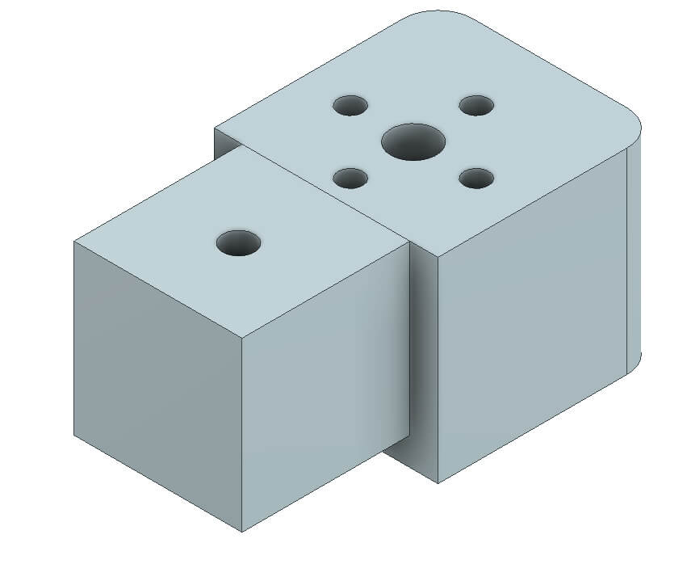
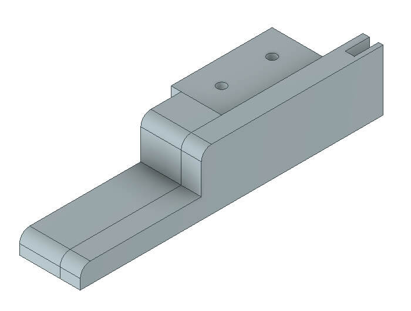
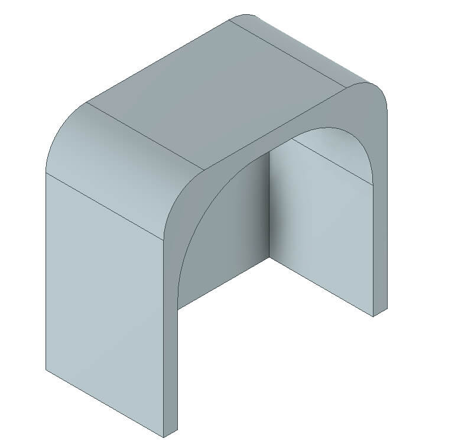
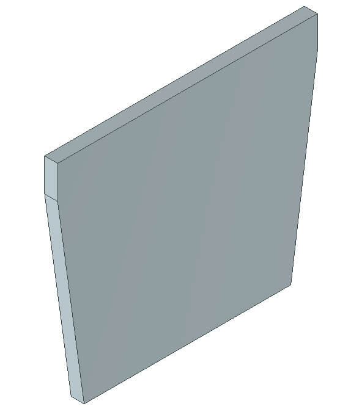
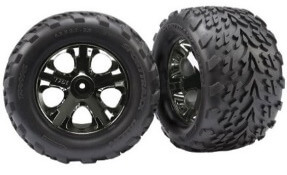
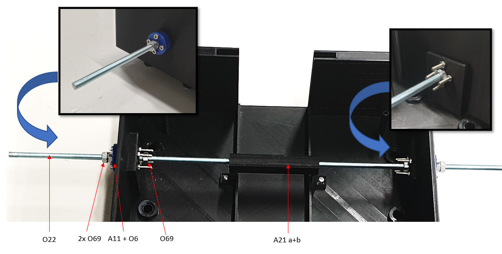

# OpenBot : Véhicule Multi-Terrain (MTV)

  <a href="README.md">English</a> |
  <a href="README.zh-CN.md">简体中文</a> |
  <a href="README.de-DE.md">Deutsch</a> |
  Français |
  <a href="README.es-ES.md">Español</a>

Nous proposons ici une alternative tout-terrain au véhicule original [OpenBot](https://www.openbot.org/). Développé en collaboration avec **Ivy Tech LTD**, le Véhicule Multi-Terrain (MTV) est également basé sur des composants peu coûteux et facilement imprimables. Le MTV s'inspire de plusieurs concepts de véhicules d'exploration développés au cours des dernières décennies pour l'exploration lunaire et martienne. Le MTV est conçu autour d'un ensemble de 6 roues actionnées, organisées en configuration Rocker-Bogie. Contrairement à la plupart des rovers lunaires ou martiens, les roues ne peuvent pas tourner radialement. Le véhicule fonctionne donc de la même manière qu'un char, ce qui rend le contrôle manuel assez intuitif.

  

## I. Impression 3D

Vous devrez imprimer les pièces suivantes pour construire votre OpenBot MTV.

  

<table>
    <thead>
        <tr>
            <th>ID </th>
            <th>Groupe</th>
            <th>Nom de l'article</th>
            <th>Quantité</th>
            <th>Image (non à l'échelle)</th>
            <th>Matériau</th>
            <th>Durée</th>
            <th>Coût</th>
        </tr>
    </thead>
    <tbody>
        <tr>
            <td>A1</td>
            <td rowspan=3>Assemblage du moteur</td>
            <td>Haut du boîtier du moteur   (<a href="cad/MotorAssembly/MotorEnclosure_Top.stl">STL</a>, <a href="cad/MotorAssembly/MotorEnclosure_Top.step">STEP</a>) </td>
            <td>6</td>
            <td>
 
</td>
            <td rowspan=2>498g</td>
            <td rowspan=2>36h</td>
            <td rowspan=2>€23.51</td>
        </tr>
        <tr>
            <td>A2</td>
            <td>Bas du boîtier du moteur   (<a href="cad/MotorAssembly/MotorEnclosure_Bottom.stl">STL</a>, <a href="cad/MotorAssembly/MotorEnclosure_Bottom.step">STEP</a>) </td>
            <td>6</td>
            <td>
 
</td>
        </tr>
        <tr>
            <td>A3</td>
            <td>Support du moteur   (<a href="cad/MotorAssembly/Motor_Bracket.stl">STL</a>, <a href="cad/MotorAssembly/Motor_Bracket.step">STEP</a>) </td>
            <td>6</td>
            <td>
 
</td>
            <td>251g</td>
            <td>17.5h</td>
            <td>€11.98</td>
        </tr>
        <tr>
            <td>A4</td>
            <td rowspan=4>Joints</td>
            <td>Joint à 90 degrés   (<a href="cad/Joints/90deg_Joint.stl">STL</a>, <a href="cad/Joints/90deg_Joint.step">STEP</a>) </td>
            <td>2</td>
            <td>
 
</td>
            <td rowspan=4>228g</td>
            <td rowspan=4>20.5h</td>
            <td rowspan=4>€15.05</td>
        </tr>
        <tr>
            <td>A5</td>
            <td>Joint à 100 degrés   (<a href="cad/Joints/100deg_Joint.stl">STL</a>, <a href="cad/Joints/100deg_Joint.step">STEP</a>) </td>
            <td>1</td>
            <td>
 
</td>
        </tr>
        <tr>
            <td>A6</td>
            <td>Joint à 100 degrés miroir   (<a href="cad/Joints/100deg_Joint_Mirror.stl">STL</a>, <a href="cad/Joints/100deg_Joint_Mirror.step">STEP</a>) </td>
            <td>1</td>
            <td>
 
</td>
        </tr>
        <tr>
            <td>A7</td>
            <td>Joint de fin   (<a href="cad/Joints/End_Joint.stl">STL</a>, <a href="cad/Joints/End_Joint.step">STEP</a>) </td>
            <td>2</td>
            <td>
 
</td>
        </tr>
        <tr>
            <td>A8</td>
            <td rowspan=3>Pieds</td>
            <td>Pied avant   (<a href="cad/Legs/Front_Leg.stl">STL</a>, <a href="cad/Legs/Front_Leg.step">STEP</a>) </td>
            <td>4</td>
            <td>
 
</td>
            <td rowspan=3>317g</td>
            <td rowspan=3>22.5h</td>
            <td rowspan=3>€14.97</td>
        </tr>
        <tr>
            <td>A9</td>
            <td>Pied du milieu   (<a href="cad/Legs/Mid_Leg.stl">STL</a>, <a href="cad/Legs/Mid_Leg.step">STEP</a>) </td>
            <td>2</td>
            <td>
 
</td>
        </tr>
        <tr>
            <td>A10</td>
            <td>Pied arrière   (<a href="cad/Legs/Rear_Leg.stl">STL</a>, <a href="cad/Legs/Rear_Leg.step">STEP</a>) </td>
            <td>2</td>
            <td>
 
</td>
        </tr>
        <tr>
            <td>A11</td>
            <td>Cache-roulement</td>
            <td>Cache-roulement   (<a href="cad/BearingCover/BearingCover.stl">STL</a>, <a href="cad/BearingCover/BearingCover.step">STEP</a>) </td>
            <td>4</td>
            <td>
 
</td>
            <td>13g</td>
            <td>1.5h</td>
            <td>€0.60</td>
        </tr>
        <tr>
            <td>A12</td>
            <td>Plateforme de montage pour téléphone</td>
            <td>Plateforme de montage pour téléphone   (<a href="cad/PhoneMount/Phone_Mount.stl">STL</a>, <a href="cad/PhoneMount/Phone_Mount.step">STEP</a>) </td>
            <td>1</td>
            <td>
 
</td>
            <td>19g</td>
            <td>2h</td>
            <td>€0.91</td>
        </tr>
        <tr>
            <td>A13</td>
            <td rowspan=4>Buffer avant</td>
            <td>Nom avant   (<a href="cad/Buffer/Name_Front.stl">STL</a>, <a href="cad/Buffer/Name_Front.step">STEP</a>) </td>
            <td>1</td>
            <td>
 
</td>
            <td rowspan=4>228g</td>
            <td rowspan=4>20.5h</td>
            <td rowspan=4>€15.04</td>
        </tr>
        <tr>
            <td>A14</td>
            <td>Nom arrière   (<a href="cad/Buffer/Name_Back.stl">STL</a>, <a href="cad/Buffer/Name_Back.step">STEP</a>) </td>
            <td>1</td>
            <td>
 
</td>
        </tr>
        <tr>
            <td>A15</td>
            <td>Buffer gauche   (<a href="cad/Buffer/Buffer_Left.stl">STL</a>, <a href="cad/Buffer/Buffer_Left.step">STEP</a>) </td>
            <td>1</td>
            <td>
 
</td>
        </tr>
        <tr>
            <td>A16</td>
            <td>Buffer droit   (<a href="cad/Buffer/Buffer_Right.stl">STL</a>, <a href="cad/Buffer/Buffer_Right.step">STEP</a>) </td>
            <td>1</td>
            <td>
 
</td>
        </tr>
        <tr>
            <td>A17</td>
            <td rowspan=8>Compartiment </td>
            <td>Compartiment arrière   (<a href="cad/Compartment/Compartment_Rear.stl">STL</a>, <a href="cad/Compartment/Compartment_Rear.step">STEP</a>) </td>
            <td>1</td>
            <td>
 
</td>
            <td>413g</td>
            <td>32h</td>
            <td>€22.75</td>
        </tr>
        <tr>
            <td>A18</td>
            <td>Compartiment avant   (<a href="cad/Compartment/Compartment_Front.stl">STL</a>, <a href="cad/Compartment/Compartment_Front.step">STEP</a>) </td>
            <td>1</td>
            <td>
 
</td>
            <td>316g</td>
            <td>22h</td>
            <td>€17.42</td>
        </tr>
        <tr>
            <td>A19</td>
            <td>Toit avant   (<a href="cad/Compartment/Roof_Front.stl">STL</a>, <a href="cad/Compartment/Roof_Front.step">STEP</a>) </td>
            <td>1</td>
            <td>
 
</td>
            <td>58g</td>
            <td>5.5h</td>
            <td>€3.19</td>
        </tr>
        <tr>
            <td>A20</td>
            <td>Toit arrière   (<a href="cad/Compartment/Roof_Rear.stl">STL</a>, <a href="cad/Compartment/Roof_Rear.step">STEP</a>) </td>
            <td>1</td>
            <td>
 
</td>
            <td>140g</td>
            <td>13.5h</td>
            <td>€7.73</td>
        </tr>
        <tr>
            <td>A21ab</td>
            <td>Support de batterie P1 & P2   (<a href="cad/Compartment/Compartment_Battery_Mount-P1.stl">STL</a>, <a href="cad/Compartment/Compartment_Battery_Mount-P1.step">STEP</a>)
              (<a href="cad/Compartment/Compartment_Battery_Mount-P2.stl">STL</a>, <a href="cad/Compartment/Compartment_Battery_Mount-P2.step">STEP</a>) </td>
            <td>1</td>
            <td>
 
</td>
            <td>15g</td>
            <td>1.5h</td>
            <td>€0.80</td>
        </tr>
        <tr>
            <td>A22</td>
            <td>Bouchons de lumière   (<a href="cad/Compartment/Headlight_Rear.stl">STL</a>, <a href="cad/Compartment/Headlight_Rear.step">STEP</a>)</td>
            <td>4</td>
            <td>
 
</td>
            <td rowspan=3>47g</td>
            <td rowspan=3>4h</td>
            <td rowspan=3>€2.58</td>
        </tr>
        <tr>
            <td>A23</td>
            <td>Phare avant   (<a href="cad/Compartment/Headlight_Front.stl">STL</a>, <a href="cad/Compartment/Headlight_Front.step">STEP</a>)</td>
            <td>4</td>
            <td>
 
</td>
        </tr>
        <tr>
            <td>A24</td>
            <td>Porte d'accès à la batterie   (<a href="cad/Compartment/Compartment_Door.stl">STL</a>, <a href="cad/Compartment/Compartment_Door.step">STEP</a>)</td>
            <td>1</td>
            <td>
 
</td>
        </tr>
    </tbody>
</table>

Pour les parties ci-dessus, votre plateau d'impression doit mesurer au moins 240mmx150mm.

Sur une Ultimaker S5, nous avons obtenu de bons résultats avec les paramètres suivants :

- hauteur de couche : 0,2mm
- épaisseur des parois : 1,5mm
- densité de remplissage : 20%
- motif de remplissage : grille
- vitesse d'impression : 80 mm/s
- sans support

## II. Assemblage Électro-Mécanique

### II.1. Liste des matériaux

Le corps de notre robot repose sur des composants électroniques de loisir facilement disponibles. Nous fournissons des liens pour l'Allemagne (UE) et les États-Unis (US) avec une livraison rapide. Si vous avez la patience d'attendre un peu plus longtemps, vous pouvez également obtenir les composants beaucoup moins chers sur AliExpress (AE). Vous aurez besoin des composants suivants.

<table>
    <thead>
        <tr>
            <th>ID </th>
            <th>Description</th>
            <th>Image</th>
            <th>Fournisseur</th>
            <th>Prix Unitaire</th>
            <th>Quantité</th>
            <th>Coût</th>
        </tr>
    </thead>
    <tbody>
        <tr>
            <td>O1</td>
            <td>Moteur DC JGB37-520 avec encodeurs - 12V | 178RPM </td>
            <td>
 
</td>
            <td>  <a href="https://de.aliexpress.com/item/4001339371886.html?gatewayAdapt=glo2deu&spm=a2g0s.9042311.0.0.1fe54c4dR1WTdj/">AE</a></td>
            <td>$8.93 | €8.12</td>
            <td>6</td>
            <td>$53.58 | €48.72</td>
        </tr>
        <tr>
            <td>O2</td>
            <td>Pneus Talon 2.8" (2 pcs)</td>
            <td>
 
</td>
            <td> <a href="https://www.robotshop.com/en/28-talon-tires-pair.html">US</a> | <a href="https://www.robotshop.com/eu/en/28-talon-tires-pair.html">EU</a></td>
            <td>$26.95 | €23.06</td>
            <td>6</td>
            <td>$161.7 | €138.36</td>
        </tr>
        <tr>
            <td>O3</td>
            <td>Câble 7 conducteurs 0.5 mm² (5m)</td>
            <td>
 
</td>
          <td>  <a href="https://www.amazon.com/Heavy-Gauge-Conductor-Trailer-Cable/dp/B01N3Q0YGS/ref=sr_1_16?crid=3SK9Y7DSOR0OL&keywords=caravan+cable+7+wire&qid=1649847035&sprefix=carava+cable+7+wire%2Caps%2C190&sr=8-16">US</a> | <a href="https://www.amazon.de/-/en/1119757-Classic-Control-Protective-Conductor/dp/B08CY2WPM4/ref=sr_1_5?crid=1QGOB5LF0GZYO&keywords=7+adriges+kabel+0%2C5mm%C2%B2&qid=1644173962&sprefix=7+core+cable+0.5mm+%2Caps%2C289&sr=8-5">EU</a></td>
            <td> $25.53 | €20.61</td>
            <td>0.25</td>
            <td>$6.38 | €5.15</td>
        </tr>
        <tr>
            <td>O4</td>
            <td>Goulotte de câbles D-Line. 20mm x 10mm x 1m (2 pcs)</td>
            <td>
 
</td>
            <td>  <a href="https://www.amazon.com/D-Line-Raceway-1D3015W-Electrical-Paintable/dp/B07KFNYR7G/ref=sr_1_10?crid=137L39X59R8AQ&keywords=D-Line%2Bcable%2Bduct&qid=1649851731&refinements=p_36%3A1253503011&rnid=386442011&s=electronics&sprefix=d-line%2Bcable%2Bduct%2Caps%2C409&sr=1-10&th=1">US</a> | <a href="https://www.amazon.de/-/en/D-Line-Micro-Cable-Management-Strip-White/dp/B082WVQXT5/ref=sr_1_fkmr0_1?crid=3CBV1RRPR6K9B&keywords=d-line%2Bmicro%2B%2Bkabelkanal%2B(2%2Bmeter)%2C%2Bselbstklebende%2Bkabelabdeckungen%2C%2Belektrische%2Bkabelf%C3%BChrung%2C%2Bbeliebte%2Bkabelmanagementl%C3%B6sung%2C%2B20%2Bmm%2B(b)%2Bx%2B10%2Bmm%2B(h)%2B-%2B2%2Bx%2B1%2Bm%2Bl%C3%A4nge%2B-%2Bschwarz&qid=1644149200&sprefix=d-line%2Bmicro%2B%2Bcable%2Btrunking%2B2-meter%2Bself-adhesive%2Bcable%2Bcovers%2Belectrical%2Bcable%2Btidy%2Bpopular%2Bcable%2Bmanagement%2Bsolution%2B20mm%2Bw%2Bx%2B10mm%2Bh%2B-%2B2%2Bx%2B1%2Bmeter%2Blengths%2B-%2Bblack%2B%2Caps%2C381&sr=8-1-fkmr0&th=1">EU</a></td>
            <td>$12.00 | €9.99</td>
            <td>1</td>
            <td>$12.00 | €9.99</td>
        </tr>
        <tr>
            <td>O5</td>
            <td>Presse-étoupe PG7 3~6.5mm (50 pcs)</td>
            <td>
 
</td>
          <td>  <a href="https://www.amazon.com/ARTGEAR-Waterproof-Adjustable-Connector-Protector/dp/B07JH2LPZF/ref=sr_1_11?crid=1UH8URDCXAHJJ&keywords=Cable+Gland+Set+Plastic+Cable+Glands+Adjustable+PG7+Waterproof+Closure+Cable+Screw+Connection+for+Diameter+3.5+mm+-+6.5+mm+Black+Pack+of+50&qid=1649852081&sprefix=cable+gland+set+plastic+cable+glands+adjustable+pg7+waterproof+closure+cable+screw+connection+for+diameter+3.5+mm+-+6.5+mm+black+pack+of+50+%2Caps%2C243&sr=8-11"> US </a> | <a href="https://www.amazon.de/-/en/Plastic-Adjustable-Waterproof-Connection-Diameter/dp/B08Q458H3N/ref=sr_1_fkmr0_1?crid=1H5VCAQKXD2XZ&keywords=pg7+kabelverschraubung%2C+50+st%C3%BCck%2C+3-6%2C5+mm%2C+verstellbar%2C+wasserdicht%2C+kabelverschraubungen%2C+verbindungsst%C3%BCck+mit+dichtungen&qid=1644149525&sprefix=pg7+cable+gland+50+pack+3+6.5mm+adjustable+waterproof+cable+glands+joints+connector+with+gaskets+%2Caps%2C80&sr=8-1-fkmr0">EU</a></td>
            <td>$8.99 | €9.99</td>
            <td>0.5</td>
            <td>$4.49 | €4.99</td>
        </tr>
        <tr>
            <td>O6</td>
            <td>Roulements à billes MR126ZZ 6x12x4mm (4 pcs)</td>
            <td>
 
</td>
            <td>  <a href="https://de.aliexpress.com/item/1005001697683913.html?gatewayAdapt=glo2deu&spm=a2g0s.9042311.0.0.1fe54c4dR1WTdj">AE</a></td>
            <td>$5.52 | €3.45</td>
            <td>1</td>
            <td>$5.52 | €3.45</td>
        </tr>
        <tr>
            <td>O7</td>
            <td>Amortisseur à ressort INJORA 90mm pour voiture RC (2pcs)</td>
            <td>
 
</td>
            <td>  <a href="https://de.aliexpress.com/item/4000309686709.html?gatewayAdapt=glo2deu&spm=a2g0o.productlist.0.0.17b17ca7oMXyhJ&algo_pvid=c7d8ba55-28b2-4d27-97e4-f338994958f7&algo_exp_id=c7d8ba55-28b2-4d27-97e4-f338994958f7-14&pdp_ext_f=%7B%22sku_id%22%3A%2210000001286270094%22%7D&pdp_pi=-1%3B8.3%3B-1%3B-1%40salePrice%3BUSD%3Bsearch-mainSearch">AE</a></td>
            <td>$8.30 | €7.99</td>
            <td>1</td>
            <td>$8.30 | €7.99</td>
        </tr>
        <tr>
            <td>O8</td>
            <td>LED blanche AXSPEED pour voiture RC 4.2v-6v 17mm (2 pcs)</td>
            <td>
 
</td>
            <td>  <a href="https://www.aliexpress.com/item/1005003306484898.html?spm=a2g0s.9042311.0.0.d4954c4dpsjiiC">AE</a></td>
            <td>$7.43 | €6.87</td>
            <td>1</td>
            <td>$7.43 | €6.87</td>
        </tr>
        <tr>
            <td>O9</td>
            <td>LED rouge AXSPEED pour voiture RC 4.2v-6v 17mm (2 pcs)</td>
            <td>
 
</td>
            <td>  <a href="https://www.aliexpress.com/item/1005003306484898.html?spm=a2g0s.9042311.0.0.d4954c4dpsjiiC">AE</a></td>
            <td>$7.43 | €6.87</td>
            <td>1</td>
            <td>$7.43 | €6.87</td>
        </tr>
        <tr>
            <td>O10</td>
            <td>Isolateurs de vibrations M3 x 8mm (4 pcs)</td>
            <td>
 
</td>
            <td>  <a href="https://www.amazon.com/MroMax-Rubber-Vibration-Isolator-Absorber/dp/B07Z76J5N5/ref=sr_1_5?crid=2LSR8ZMHRIL2O&keywords=m3+rubber+mount+shock+absorbers&qid=1649862366&sprefix=keesin+m3+rubber+mounts+shock+absorbers+%2Caps%2C362&sr=8-5">US</a> | <a href="https://www.amazon.de/-/en/gp/product/B076SSPHP6/ref=ppx_yo_dt_b_asin_title_o03_s01?ie=UTF8&psc=1">EU</a></td>
            <td>$8.09 | €9.49</td>
            <td>1</td>
            <td>$8.09 | €9.49</td>
        </tr>
        <tr>
            <td>O11</td>
            <td>Support universel pour smartphone Zeadio</td>
            <td>
 
</td>
            <td> <a href="https://www.amazon.com/SharingMoment-Smartphone-Horizontal-Rotatable-Adjustable/dp/B07S8TTH34/ref=sr_1_4?crid=X7XQ9LC110JJ&keywords=Zeadio+Smartphone+Tripod+Adapter%2C+Mobile+Phone+Holder&qid=1649862548&refinements=p_36%3A2491155011&rnid=2491154011&s=wireless&sprefix=zeadio+smartphone+tripod+adapter%2C+mobile+phone+holder+%2Caps%2C577&sr=1-4">US</a> | <a href="https://www.amazon.de/-/en/Zeadio-Smartphone-Tripod-Adapter-Mobile/dp/B06XDYJNSR/ref=sr_1_8?crid=2ZH6V545D45E3&keywords=zeadio%2Buniversal%2Bsmartphone%2Bhalterung&qid=1644150427&sprefix=zeadio%2Buniversal%2Bsmartphone%2Bholder%2Caps%2C104&sr=8-8&th=1">EU</a></td>
            <td>$11.99 | €10.99</td>
            <td>1</td>
            <td>$11.99 | €10.99</td>
        </tr>
        <tr>
            <td>O12</td>
            <td>Voltmètre de voiture DC 12-24 V</td>
            <td>
 
</td>
            <td>  <a href="https://www.amazon.com/Nilight-Voltmeter-Waterproof-VoltVolt-Motorcycle/dp/B06ZZJ48VQ/ref=sr_1_fkmr1_2?crid=376857DCCJICB&keywords=mini+led+digital+voltmeter+batterietester+12+volt+%2F+24+volt+voltmeter&qid=1649862763&sprefix=mini+led+digital+voltmeter+batterietester+12+volt+%2F+24+volt+voltmeter%2Caps%2C404&sr=8-2-fkmr1">US</a> | <a href="https://www.amazon.de/-/en/Intckwan-Digital-Voltmeter-Waterproof-Motorcycle/dp/B09T5XRYM9/ref=sr_1_5?crid=1GPFOX9O2VX85&keywords=mini+led+digital+voltmeter+batterietester+12+volt+%2F+24+volt+voltmeter&qid=1649862700&sprefix=mini+led+digital+voltmeter+battery+tester+12+volt+%2F+24+volt+voltmeter%2Caps%2C91&sr=8-5">EU</a></td>
            <td>$10.99 | €11.88</td>
            <td>1</td>
            <td>$10.99 | €11.88</td>
        </tr>
        <tr>
            <td>O13</td>
            <td>Mini interrupteur à bascule (20 pcs)</td>
            <td>
 
</td>
            <td>  <a href="https://www.amazon.com/DaierTek-250VAC-Rocker-KCD1-101-Plastic/dp/B07S2QJKTX/ref=sr_1_4?keywords=RUNCCI-YUN+20Pcs+Mini+Rocker+Switch&qid=1650638471&sr=8-4">US</a> | <a href="https://www.amazon.de/-/en/RUNCCI-Rocker-Switches-Household-Appliances/dp/B07MW92CW8/ref=sr_1_2?keywords=RUNCCI-YUN+20+St%C3%

Le coût total des composants externes est estimé à environ **500€**, ce qui donne un coût total d'environ **600€** pour MTV.

### II.2. Assemblage Mécanique

#### II.2.1. Vue d'ensemble

Ce chapitre couvre le processus d'assemblage du MTV. Notez que gauche et droite désignent les côtés bâbord et tribord du robot et seront utilisés de manière interchangeable dans ce document. Sauf indication contraire, tous les boulons sont supposés avoir des rondelles plates pour protéger le plastique imprimé en 3D. Il convient également de souligner que l'utilisation de rondelles élastiques et de nylocs permet généralement d'éviter tout desserrage des écrous dû aux vibrations.

Le processus d'assemblage du MTV peut être divisé en sept étapes principales, à savoir :
1. assemblage des 6 modules moteurs
2. assemblage des jambes
3. assemblage du châssis
4. assemblage du compartiment principal
5. assemblage du véhicule
6. assemblage de l'unité de puissance, de l'unité de contrôle et connexion des différents composants
7. Test, programmation et utilisation.

  

#### II.2.2. Assemblage des modules moteurs

Chacun des modules moteurs se compose des pièces suivantes :

- 1 x <a href="cad/MotorAssembly/MotorEnclosure_Top.stl">Boîtier Moteur Supérieur</a> imprimé en 3D (A1)
- 1 x <a href="cad/MotorAssembly/MotorEnclosure_Bottom.stl">Boîtier Moteur Inférieur</a> imprimé en 3D (A2)
- 1 x <a href="cad/MotorAssembly/Motor_Bracket.stl">Support Moteur</a> imprimé en 3D (A3)
- 1 x Moteur DC JGB37-520 avec encodeurs et adaptateur de roue (O1)
- 1 x Presse-étoupe PG7 (O5)

Pour assembler un module moteur :

1. Commencez par connecter le câble de contrôle fourni dans le kit (O1) au moteur. Il est fortement recommandé de sécuriser cette connexion avec un peu de colle chaude.
2. Alignez soigneusement le motif de fixation du moteur avec le motif de trou du boîtier moteur imprimé en 3D (A1). Assurez-vous de ne pas appliquer de force sur l'encodeur pour éviter de l'endommager. Vissez le moteur au boîtier moteur imprimé en 3D (A1) en utilisant les vis fournies dans le kit (O1).
3. Fixez le manchon de couplage du kit (O1) à l'arbre du moteur avec la clé Allen fournie. Gardez l'écrou qui fixe la roue au manchon de couplage bien vissé dans le moyeu hexagonal car vous en aurez besoin plus tard pour fixer les pneus (O2) au véhicule.
4. Insérez le support moteur (A3) sur le boîtier moteur supérieur (A1). C'est un ajustement par pression, et peut nécessiter un alignement soigneux lors du glissement. Notez que l'épaulement du support moteur (comme indiqué sur la figure ci-dessous) doit être orienté vers le côté de l'arbre du moteur pour un assemblage plus propre. Assurez-vous que le support moteur (A3) s'ajuste bien avec le boîtier moteur supérieur (A1). Sécurisez l'assemblage avec de la colle chaude ou de la super glue.
5. Ajoutez les joints de presse-étoupe (O5) au boîtier moteur inférieur (A2) et passez le fil du moteur à travers le presse-étoupe.
6. Insérez soigneusement le boîtier moteur inférieur (A2) sur le boîtier moteur supérieur (A1) jusqu'à ce que le boîtier moteur inférieur (A2) ait parcouru toute la distance. Assurez-vous que le support moteur (A3) est affleurant avec le boîtier moteur supérieur (A1). Prenez soin de ne pas coincer les fils contre l'encodeur - l'encodeur doit être libre de tourner.
7. Le boîtier moteur supérieur (A2) avec le support moteur (A3) sont fixés à l'aide de boulons M4 x 60mm (O23) et d'écrous nyloc (O28).

  

  

#### II.2.3. Assemblage des jambes

La jambe gauche du MTV se compose des pièces suivantes :

- 1 x <a href="cad/Joints/90deg_Joint.stl">Joint à 90 degrés</a> imprimé en 3D (A4)
- 1 x <a href="cad/Joints/End_Joint.stl">Joint de Fin</a> imprimé en 3D (A7)
- 1 x <a href="cad/Joints/BearingCover.stl">Couvercle de Roulement</a> imprimé en 3D (A11)
- 1 x <a href="cad/Joints/100deg_Joint.stl">Joint à 100 degrés</a> imprimé en 3D (A5)
- 2 x <a href="cad/Legs/Front_Leg.stl">Jambe Avant</a> imprimé en 3D (A8)
- 1 x <a href="cad/Legs/Mid_Leg.stl">Jambe Milieu</a> imprimé en 3D (A9)
- 1 x <a href="cad/Legs/Rear_Leg.stl">Jambe Arrière</a> imprimé en 3D (A10)
- 1 x Conduit de câble D-Line (O4)
- 1 x Câble à 7 conducteurs (O3)
- 1 x Roulement à billes MR126ZZ (O6)

La jambe droite du MTV se compose des pièces suivantes :

- 1 x <a href="cad/Joints/90deg_Joint.stl">Joint à 90 degrés</a> imprimé en 3D (A4)
- 1 x <a href="cad/Joints/End_Joint.stl">Joint de Fin</a> imprimé en 3D (A7)
- 1 x <a href="cad/Joints/BearingCover.stl">Couvercle de Roulement</a> imprimé en 3D (A11)
- 1 x <a href="cad/Joints/100deg_Joint_Mirror.stl">Joint à 100 degrés Miroir</a> imprimé en 3D (A6)
- 2 x <a href="cad/Legs/Front_Leg.stl">Jambe Avant</a> imprimé en 3D (A8)
- 1 x <a href="cad/Legs/Mid_Leg.stl">Jambe Milieu</a> imprimé en 3D (A9)
- 1 x <a href="cad/Legs/Rear_Leg.stl">Jambe Arrière</a> imprimé en 3D (A10)
- 1 x Conduit de câble D-Line (O4)
- 1 x Câble à 7 conducteurs (O3)
- 1 x Roulement à billes MR126ZZ (O6)

Assemblez le joint à 90 degrés (A4) et les jambes associées (A8) (2x avant + milieu) pour former l'assemblage de la jambe avant (droite et gauche). Les jambes sont fixées au joint par des boulons M4 x 40mm (O24), des rondelles plates (O30), des rondelles élastiques (O30) et des écrous (O28). Percez les trous guidés fournis avec M4 dans les assemblages de jambes (dans la jambe du milieu, il y a 3 trous guidés, les 2 extrémités doivent être M4 et le milieu doit être M3 qui sera utilisé pour monter les amortisseurs).
Fixez la jambe arrière au joint à 100 degrés (A5) (resp. miroir A6) et la jambe arrière pour former les assemblages complets des jambes bâbord et tribord et fixez la jambe à l'aide de boulons M4 x 40mm (O24), de rondelles plates (O30), de rondelles élastiques (O30) et d'écrous (O28).

  

#### II.2.4. Assemblage du châssis

Fixez les supports moteurs aux extrémités libres de chaque jambe (2 x jambe avant et arrière de chaque côté gauche et droit) à l'aide de boulons M4 x 40mm (O24), de rondelles plates et élastiques (O30) et d'écrous (O28). Fixez les pneus (O2) au moyeu hexagonal et sécurisez-les avec l'écrou du moyeu de roue. Les moteurs MTV contiennent un encodeur magnétique intégré pour l'estimation de la vitesse et ont une interface à 6 broches, à savoir `[Alimentation moteur +, Alimentation moteur -, Alimentation encodeur +, Alimentation encodeur -, Données encodeur 1, Données encodeur 2]`. La connexion électrique entre les moteurs et les PCBs de contrôle doit être effectuée à l'aide du câble à 7 conducteurs (O3) :

  

Complétez l'assemblage du châssis, y compris la fixation du conduit de câble (O4) si nécessaire :

  

#### II.2.5. Assemblage du compartiment principal

Le compartiment principal se compose des pièces suivantes :

- 2 x <a href="cad/Joints/BearingCover.stl">Couvercle de Roulement</a> imprimé en 3D (A11)
- 1 x <a href="cad/PhoneMount/Phone_Mount.stl">Plateforme de Montage Téléphone</a> imprimé en 3D (A12)
- 1 x <a href="cad/Buffer/Name_Front.stl">Nom Avant</a> imprimé en 3D (A13)
- 1 x <a href="cad/Buffer/Name_Back.stl">Nom Arrière</a> imprimé en 3D (A14)
- 1 x <a href="cad/Buffer/Buffer_Left.stl">Tampon Gauche</a> imprimé en 3D (A15)
- 1 x <a href="cad/Buffer/Buffer_Right.stl">Tampon Droit</a> imprimé en 3D (A16)
- 1 x <a href="cad/Compartment/Compartment_Rear.stl">Compartiment Arrière</a> imprimé en 3D (A17)
- 1 x <a href="cad/Compartment/Compartment_Front.stl">Compartiment Avant</a> imprimé en 3D (A18)
- 1 x <a href="cad/Compartment/Roof_Front.stl">Toit Avant</a> imprimé en 3D (A19)
- 1 x <a href="cad/Compartment/Roof_Rear.stl">Toit Arrière</a> imprimé en 3D (A20)
- 1 x <a href="cad/Compartment/Compartment_Battery_Mount-P1.stl">Support Batterie Compartiment P1</a> imprimé en 3D (A21a)
- 1 x <a href="cad/Compartment/Compartment_Battery_Mount-P2.stl">Support Batterie Compartiment P2</a> imprimé en 3D (A21b)
- 4 x Vis M4 x 120mm (O26)
- 6 x Presse-étoupe PG7 (O5)
- 1 x Barre filetée M6 (O21)

Joignez le compartiment arrière (A17) avec le compartiment avant (A18) pour former l'assemblage du compartiment à l'aide de vis M3 x 15mm (O25), de rondelles plates (O28) et d'écrous nyloc (O28). Utilisez les trous guidés pour percer des trous M3 à des fins de jonction.

  

Percez les trous de connexion des roulements sur le châssis où les trous guidés sont fournis et insérez les roulements (O6) dans le couvercle de roulement (A11) et fixez l'assemblage de roulement à l'extérieur de l'assemblage du compartiment à l'aide de 4 boulons M3 x 30mm (O25), de rondelles élastiques (O30), de rondelles (O28) et d'écrous nyloc (O28).

  

Fixez les joints de presse-étoupe (O5) aux six trous du compartiment arrière (A17). Les six joints de presse-étoupe sont utilisés pour passer les fils du moteur dans le compartiment :

  

Fixez les tampons gauche et droit (A15 & A16) à l'assemblage du compartiment à l'aide de 4 boulons M3 x 20mm (O25), de rondelles élastiques (O30), de rondelles (O28) et d'écrous nyloc (O28).

  

Fixez le support de batterie P1 & P2 (A21 a & b) sur le compartiment arrière à l'aide de boulons M3 x 15mm (O25) et d'écrous nyloc (O28). Insérez la barre filetée M6 (O21) dans l'assemblage du châssis à travers le trou central des roulements et l'assemblage du support de batterie P1 & P2. Lorsque la barre filetée est insérée d'un côté, prenez soin d'ajouter les écrous M6 nécessaires (O29) qui sont internes au compartiment.
- Notez qu'il y a deux écrous M6 (O29) à l'extérieur du compartiment qui agissent comme des entretoises entre le châssis et l'assemblage du compartiment.
- Notez également que la barre filetée doit être équilibrée entre la gauche et la droite pour assurer l'espace pour l'assemblage du châssis.
- Il faut prendre soin lors du vissage de la barre filetée dans le compartiment pour s'assurer qu'aucune pré-tension n'est ajoutée aux parois latérales.

  

#### II.2.6. Assemblage du véhicule

Fixez l'assemblage du châssis à la barre filetée M6 de chaque côté du compartiment et sécurisez à l'aide d'écrous M6 (O29) :

  

Fixez les amortisseurs (O7) entre la jambe du milieu et le châssis :

  

Remplacez les ressorts d'origine des amortisseurs par le jeu de ressorts de conformité moyenne fourni (ressorts dorés) pour garantir que le corps du robot reste à niveau avec le sol. Fixez l'extrémité du piston au compartiment du robot à l'aide de l'entretoise et du boulon fournis avec l'amortisseur (O10) et d'un écrou de blocage M3 (O28). Fixez l'extrémité de la tige à l'aide de boulons M3 x 40 (O25) et d'un écrou nyloc (O28). Faites passer les fils de l'assemblage des jambes au corps principal et fixez-les selon les directives de câblage (utilisez également de manière appropriée le chemin de câbles). Fixez le support de téléphone au toit avant (A19)
- Fixez le support universel pour smartphone (O11) à la plateforme de montage du téléphone (A12).
- Fixez les isolateurs de vibrations (O11) à la plateforme de montage du téléphone (A12) et fixez-la au toit avant (A19) à l'aide d'écrous de blocage et de rondelles comme illustré.

  

Fixez l'affichage de la tension (O12), les interrupteurs de contrôle de puissance (O13) et le câble de montage de panneau Micro USB (O14) dans les emplacements désignés du toit arrière. Sortez les phares et feux arrière (O8 & O9) à travers les découpes du toit et fixez le toit avant (A19) et le toit arrière (A20) à l'assemblage du compartiment. Insérez les phares (O8) dans la prise de phare (A23) et les feux arrière (O9) dans la prise de feu arrière (A24) et fixez-les aux emplacements respectifs dans le toit avant (A19) et le toit arrière (A20). Scellez les prises de lumière avec les embouts de lumière (A22) comme indiqué sur la figure ci-dessous et utilisez de la super glue pour les fixer. Insérez les plaques de nom personnalisées

  

#### II.3.3. PCB – connexion des lumières

Les lumières avant et arrière doivent être connectées au PCB principal du MTV. Un interrupteur doit être placé sur le couvercle du MTV pour les contrôler.

  

  

#### II.3.4. Assemblage du PCB de distribution d'énergie

La carte de distribution d'énergie est montée dans le boîtier principal du MTV. Les câbles du moteur sont tirés à travers les fentes de montage après que la carte de distribution d'énergie soit en place. Le PCB principal est ensuite fixé au MTV comme indiqué dans la figure suivante :

  

Une fois le PCB principal en place, les câbles de connexion du moteur sont raccourcis et connectés à la carte principale à l'aide de bornes à vis à 2 broches, pas de 5,08 mm. Ensuite, viennent les connexions d'éclairage. Les connexions de tension de 12V et 5V du PCB de distribution d'énergie sont connectées au MTV à l'étape finale.

<table>
    <thead>
        <tr>
            <th>PCB</th>
            <th>Nom imprimé sur le PCB</th>
            <th>Image</th>
            <th>Commentaires</th>
        </tr>
    </thead>
    <tbody>
        <tr>
            <td rowspan=2>PCB de distribution d'énergie</td>
            <td>
            Mount_1 
            Mount_2
            Mount_3
            Mount_4
            </td>
            <td>
 
</td>
            <td>Ces trous de montage de type M3 ont été conçus pour connecter le PCB de distribution d'énergie aux points de connexion sur le MTV à l'aide de vis et d'écrous.</td>
        </tr>
        <tr>
            <td>
            VC_Mount_1 
            VC_Mount_2
            VC_Mount_3
            VC_Mount_4
            </td>
            <td>
 
</td>
            <td>Ces trous de montage de type M3 ont été conçus pour connecter le convertisseur de tension au PCB de distribution d'énergie à l'aide de vis et d'écrous.</td>
        </tr>
        <tr>
            <td rowspan=2>PCB principal</td>
            <td>
            Mount_1 
            Mount_2
            Mount_3
            Mount_4
            </td>
            <td>
 
</td>
            <td>Ces trous de montage de type M3 ont été conçus pour connecter le PCB principal aux points de connexion sur le MTV à l'aide de vis et d'écrous.</td>
        </tr>
        <tr>
            <td>
            MD_Mount_1 
            MD_Mount_2
            MD_Mount_3
            MD_Mount_4
            </td>
            <td>
 
</td>
            <td>Ces trous de montage de type M3 ont été conçus pour connecter les pilotes de moteur au PCB principal à l'aide de vis et d'écrous.</td>
        </tr>
</table>

#### II.3.4. Assemblage des câbles du toit du MTV

Une fois le PCB principal fixé, les interrupteurs et les affichages dans le toit/couvercle du MTV ont été connectés à l'aide de connecteurs de raccordement. De plus, le port de programmation Micro USB de l'ESP 32 a été connecté à un câble d'extension Micro USB à angle droit à 90 degrés (mâle vers femelle). L'extrémité femelle du câble d'extension USB de montage sur panneau a été connectée au couvercle du MTV. Ainsi, les utilisateurs peuvent brancher les câbles USB sans avoir besoin de retirer le couvercle/toit.

  

### II.4. Avertissement de sécurité

*Il est supposé que le MTV sera construit par des individus ayant un niveau intermédiaire ou avancé d'expertise dans l'assemblage de dispositifs mécaniques et électroniques. Veuillez être conscient de votre propre sécurité lors de l'assemblage et de l'utilisation du robot. Ni **Ivy Tech LTD** ni **Intel Deutschland GmbH** ne sont responsables des accidents causés par la négligence de l'utilisateur.*

- Lisez attentivement le manuel avant l'assemblage.
- Faites attention aux bords tranchants des composants imprimés en 3D.
- Gardez une distance de sécurité avec le robot pendant son fonctionnement.
- Faites attention à ne pas coincer vos doigts entre les articulations et les roues du robot.
- Ne stockez pas le robot sous la lumière directe du soleil.
- Ce produit n'est **pas étanche**. Nous ne recommandons pas d'utiliser le MTV dans des environnements pluvieux ou humides.
- N'utilisez pas le MTV près du feu ou de toute source de chaleur.
- Ne laissez pas tomber le MTV de hauteurs.
- Utilisez uniquement les outils désignés/recommandés pour assembler le robot.
- N'utilisez pas de force excessive sur les écrous, les boulons ou les pièces du robot.
- Évitez d'activer le robot en hauteur pour prévenir une chute soudaine.
- Ne pas endommager ou placer la batterie Li-Po dans l'eau.
- Ne connectez pas et ne laissez pas la batterie Li-Po entrer en contact avec d'autres conducteurs à part les bornes suggérées.
- Lorsque le robot est déchargé, il est recommandé de retirer la batterie du robot et de la placer dans un sac de sécurité Li-Po avant de la charger. Une fois la batterie complètement chargée, elle peut être réinsérée dans le robot comme illustré ci-dessous.

  

  

## III: Suivant

Flashez le [Firmware Arduino](../../firmware/README.md)
