# OpenBot: Multi-Terrain Vehicle (MTV) body

  <a href="README.md">English</a> |
  <a href="README.zh-CN.md">简体中文</a> |
  <a href="README.de-DE.md">Deutsch</a> |
  <a href="README.fr-FR.md">Français</a> |
  <a href="README.es-ES.md">Español</a> |
  한국어

우리는 원래 [OpenBot](https://www.openbot.org/) 차량의 모든 지형에서 사용할 수 있는 대안을 제안합니다. **Ivy Tech LTD**와 협력하여 개발된 이 다목적 차량(MTV)은 저렴하고 쉽게 인쇄할 수 있는 부품을 기반으로 합니다. MTV는 지난 몇십 년 동안 달과 화성 탐사를 위해 개발된 여러 탐사 차량 개념에서 영감을 받았습니다. MTV는 6개의 구동 바퀴로 구성되어 있으며, 이 바퀴들은 Rocker-Bogie 구성을 따릅니다. 대부분의 달이나 화성 탐사 로버들과 달리, 이 바퀴들은 방사형으로 회전할 수 없습니다. 그래서 차량은 탱크처럼 작동하며, 수동 조작이 꽤 직관적이에요!

  

## I. 3D 프린팅

OpenBot MTV를 만들기 위해 다음 부품들을 프린트해야 해요!

  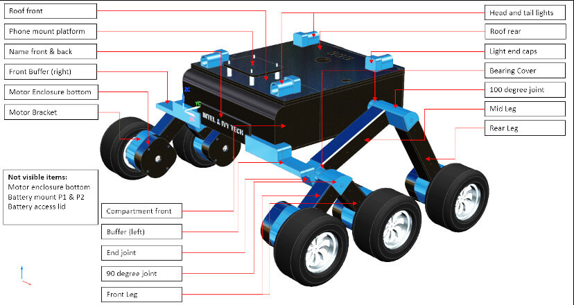

<table>
    <thead>
        <tr>
            <th>ID </th>
            <th>그룹</th>
            <th>아이템 이름</th>
            <th>수량</th>
            <th>사진 (스케일 아님)</th>
            <th>재료</th>
            <th>소요 시간</th>
            <th>비용</th>
        </tr>
    </thead>
    <tbody>
        <tr>
            <td>A1</td>
            <td rowspan=3>Motor assembly</td>
            <td>Motor Enclosure Top   (<a href="cad/MotorAssembly/MotorEnclosure_Top.stl">STL</a>, <a href="cad/MotorAssembly/MotorEnclosure_Top.step">STEP</a>) </td>
            <td>6</td>
            <td>
 
</td>
            <td rowspan=2>498g</td>
            <td rowspan=2>36h</td>
            <td rowspan=2>€23.51</td>
        </tr>
        <tr>
            <td>A2</td>
            <td>Motor Enclousre Bottom   (<a href="cad/MotorAssembly/MotorEnclosure_Bottom.stl">STL</a>, <a href="cad/MotorAssembly/MotorEnclosure_Bottom.step">STEP</a>) </td>
            <td>6</td>
            <td>
 
</td>
        </tr>
        <tr>
            <td>A3</td>
            <td>Motor Bracket   (<a href="cad/MotorAssembly/Motor_Bracket.stl">STL</a>, <a href="cad/MotorAssembly/Motor_Bracket.step">STEP</a>) </td>
            <td>6</td>
            <td>
 
</td>
            <td>251g</td>
            <td>17.5h</td>
            <td>€11.98</td>
        </tr>
        <tr>
            <td>A4</td>
            <td rowspan=4>Joints</td>
            <td>90 deg Joint   (<a href="cad/Joints/90deg_Joint.stl">STL</a>, <a href="cad/Joints/90deg_Joint.step">STEP</a>) </td>
            <td>2</td>
            <td>
 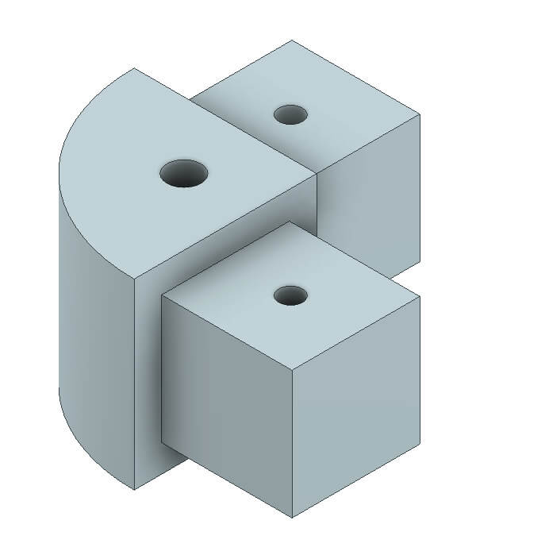
</td>
            <td rowspan=4>228g</td>
            <td rowspan=4>20.5h</td>
            <td rowspan=4>€15.05</td>
        </tr>
        <tr>
            <td>A5</td>
            <td>100 deg Joint   (<a href="cad/Joints/100deg_Joint.stl">STL</a>, <a href="cad/Joints/100deg_Joint.step">STEP</a>) </td>
            <td>1</td>
            <td>
 
</td>
        </tr>
        <tr>
            <td>A6</td>
            <td>100 deg Joint Mirror   (<a href="cad/Joints/100deg_Joint_Mirror.stl">STL</a>, <a href="cad/Joints/100deg_Joint_Mirror.step">STEP</a>) </td>
            <td>1</td>
            <td>
 
</td>
        </tr>
        <tr>
            <td>A7</td>
            <td>End Joint   (<a href="cad/Joints/End_Joint.stl">STL</a>, <a href="cad/Joints/End_Joint.step">STEP</a>) </td>
            <td>2</td>
            <td>
 
</td>
        </tr>
        <tr>
            <td>A8</td>
            <td rowspan=3>Legs</td>
            <td>Front Leg   (<a href="cad/Legs/Front_Leg.stl">STL</a>, <a href="cad/Legs/Front_Leg.step">STEP</a>) </td>
            <td>4</td>
            <td>
 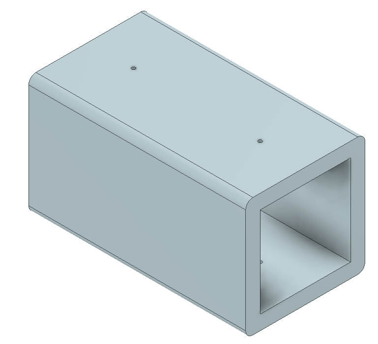
</td>
            <td rowspan=3>317g</td>
            <td rowspan=3>22.5h</td>
            <td rowspan=3>€14.97</td>
        </tr>
        <tr>
            <td>A9</td>
            <td>Mid Leg   (<a href="cad/Legs/Mid_Leg.stl">STL</a>, <a href="cad/Legs/Mid_Leg.step">STEP</a>) </td>
            <td>2</td>
            <td>
 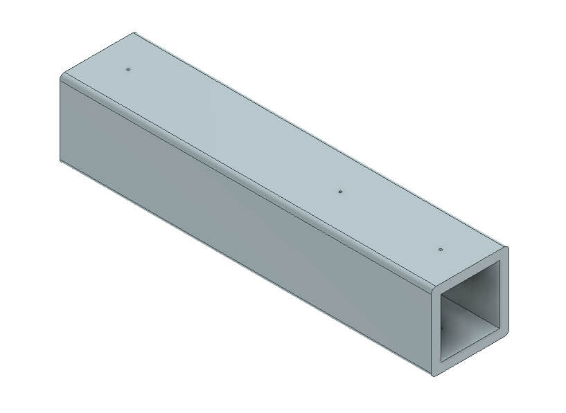
</td>
        </tr>
        <tr>
            <td>A10</td>
            <td>Rear Leg   (<a href="cad/Legs/Rear_Leg.stl">STL</a>, <a href="cad/Legs/Rear_Leg.step">STEP</a>) </td>
            <td>2</td>
            <td>
 
</td>
        </tr>
        <tr>
            <td>A11</td>
            <td>Bearing Cover</td>
            <td>Bearing Cover   (<a href="cad/BearingCover/BearingCover.stl">STL</a>, <a href="cad/BearingCover/BearingCover.step">STEP</a>) </td>
            <td>4</td>
            <td>
 
</td>
            <td>13g</td>
            <td>1.5h</td>
            <td>€0.60</td>
        </tr>
        <tr>
            <td>A12</td>
            <td>Phone Mount Platform</td>
            <td>Phone Mount Platform   (<a href="cad/PhoneMount/Phone_Mount.stl">STL</a>, <a href="cad/PhoneMount/Phone_Mount.step">STEP</a>) </td>
            <td>1</td>
            <td>
 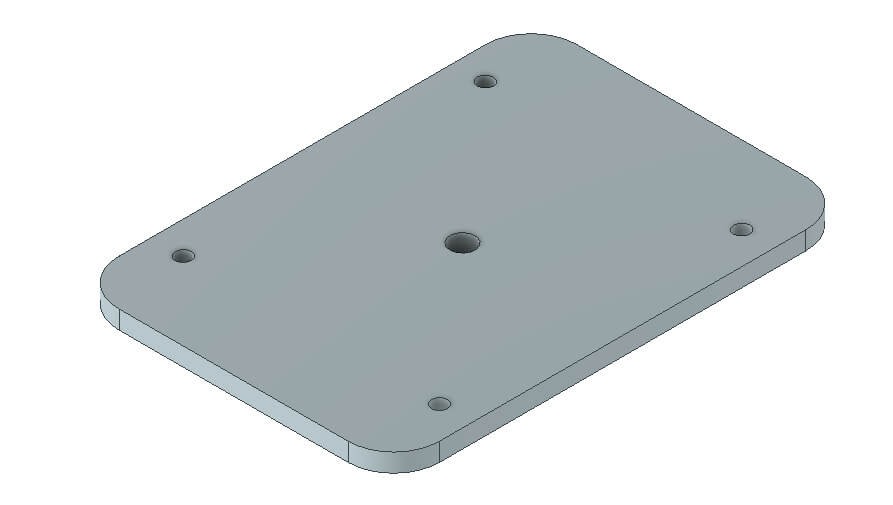
</td>
            <td>19g</td>
            <td>2h</td>
            <td>€0.91</td>
        </tr>
        <tr>
            <td>A13</td>
            <td rowspan=4>Front Buffer</td>
            <td>Name Front   (<a href="cad/Buffer/Name_Front.stl">STL</a>, <a href="cad/Buffer/Name_Front.step">STEP</a>) </td>
            <td>1</td>
            <td>
 
</td>
            <td rowspan=4>228g</td>
            <td rowspan=4>20.5h</td>
            <td rowspan=4>€15.04</td>
        </tr>
        <tr>
            <td>A14</td>
            <td>Name Back   (<a href="cad/Buffer/Name_Back.stl">STL</a>, <a href="cad/Buffer/Name_Back.step">STEP</a>) </td>
            <td>1</td>
            <td>
 
</td>
        </tr>
        <tr>
            <td>A15</td>
            <td>Buffer Left   (<a href="cad/Buffer/Buffer_Left.stl">STL</a>, <a href="cad/Buffer/Buffer_Left.step">STEP</a>) </td>
            <td>1</td>
            <td>
 
</td>
        </tr>
        <tr>
            <td>A16</td>
            <td>Buffer Right   (<a href="cad/Buffer/Buffer_Right.stl">STL</a>, <a href="cad/Buffer/Buffer_Right.step">STEP</a>) </td>
            <td>1</td>
            <td>
 
</td>
        </tr>
        <tr>
            <td>A17</td>
            <td rowspan=8>Compartment </td>
            <td>Compartment Rear   (<a href="cad/Compartment/Compartment_Rear.stl">STL</a>, <a href="cad/Compartment/Compartment_Rear.step">STEP</a>) </td>
            <td>1</td>
            <td>
 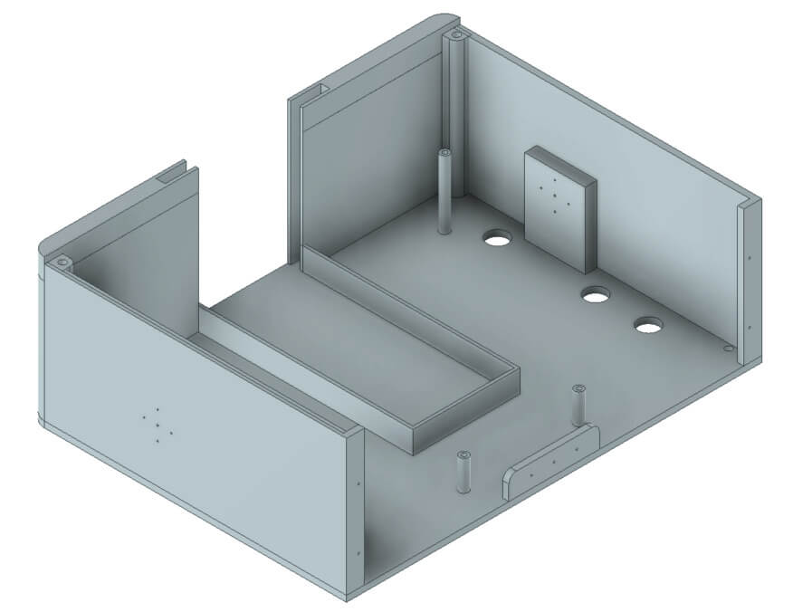
</td>
            <td>413g</td>
            <td>32h</td>
            <td>€22.75</td>
        </tr>
        <tr>
            <td>A18</td>
            <td>Compartment Front   (<a href="cad/Compartment/Compartment_Front.stl">STL</a>, <a href="cad/Compartment/Compartment_Front.step">STEP</a>) </td>
            <td>1</td>
            <td>
 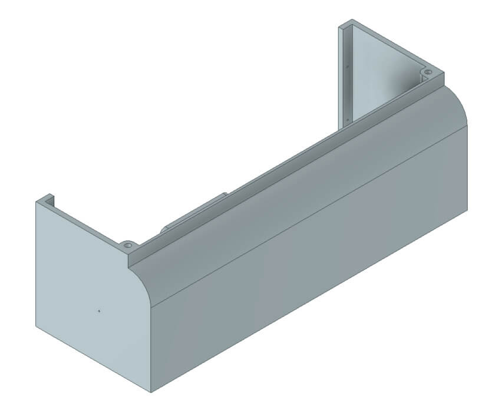
</td>
            <td>316g</td>
            <td>22h</td>
            <td>€17.42</td>
        </tr>
        <tr>
            <td>A19</td>
            <td>Roof Front   (<a href="cad/Compartment/Roof_Front.stl">STL</a>, <a href="cad/Compartment/Roof_Front.step">STEP</a>) </td>
            <td>1</td>
            <td>
 
</td>
            <td>58g</td>
            <td>5.5h</td>
            <td>€3.19</td>
        </tr>
        <tr>
            <td>A20</td>
            <td>Roof Rear   (<a href="cad/Compartment/Roof_Rear.stl">STL</a>, <a href="cad/Compartment/Roof_Rear.step">STEP</a>) </td>
            <td>1</td>
            <td>
 
</td>
            <td>140g</td>
            <td>13.5h</td>
            <td>€7.73</td>
        </tr>
        <tr>
            <td>A21ab</td>
            <td>Battery Mount P1 & P2   (<a href="cad/Compartment/Compartment_Battery_Mount-P1.stl">STL</a>, <a href="cad/Compartment/Compartment_Battery_Mount-P1.step">STEP</a>)
              (<a href="cad/Compartment/Compartment_Battery_Mount-P2.stl">STL</a>, <a href="cad/Compartment/Compartment_Battery_Mount-P2.step">STEP</a>) </td>
            <td>1</td>
            <td>
 
</td>
            <td>15g</td>
            <td>1.5h</td>
            <td>€0.80</td>
        </tr>
        <tr>
            <td>A22</td>
            <td>Light End Caps   (<a href="cad/Compartment/Headlight_Rear.stl">STL</a>, <a href="cad/Compartment/Headlight_Rear.step">STEP</a>)</td>
            <td>4</td>
            <td>
 
</td>
            <td rowspan=3>47g</td>
            <td rowspan=3>4h</td>
            <td rowspan=3>€2.58</td>
        </tr>
        <tr>
            <td>A23</td>
            <td>Head Light   (<a href="cad/Compartment/Headlight_Front.stl">STL</a>, <a href="cad/Compartment/Headlight_Front.step">STEP</a>)</td>
            <td>4</td>
            <td>
 
</td>
        </tr>
        <tr>
            <td>A24</td>
            <td>Battery Access Lid   (<a href="cad/Compartment/Compartment_Door.stl">STL</a>, <a href="cad/Compartment/Compartment_Door.step">STEP</a>)</td>
            <td>1</td>
            <td>
 
</td>
        </tr>
    </tbody>
</table>

위의 부품들을 위해서는 빌드 플레이트가 최소 240mm x 150mm 이상이어야 해요.

Ultimaker S5에서는 아래 설정으로 좋은 결과를 얻었어요:

- 레이어 높이: 0.2mm
- 벽 두께: 1.5mm
- 인필 밀도: 20%
- 인필 패턴: 그리드
- 출력 속도: 80 mm/s
- 서포트 없음

## II. 전자기계 조립

### II.1. 자재 목록

우리 로봇 바디는 쉽게 구할 수 있는 취미 전자 부품을 사용해요. 독일(EU)과 미국(US)에서 빠른 배송을 제공하는 링크를 제공해드려요. 조금 더 기다릴 수 있다면, AliExpress(AE)에서 부품을 훨씬 더 저렴하게 구할 수 있어요. 필요한 부품은 다음과 같아요.
<table>
    <thead>
        <tr>
            <th>ID</th>
            <th>설명</th>
            <th>사진</th>
            <th>공급업체</th>
            <th>단가</th>
            <th>수량</th>
            <th>비용</th>
        </tr>
    </thead>
    <tbody>
        <tr>
            <td>O1</td>
            <td>JGB37-520 DC-Motor with encoders - 12V | 178RPM </td>
            <td>
 
</td>
            <td>  <a href="https://de.aliexpress.com/item/4001339371886.html?gatewayAdapt=glo2deu&spm=a2g0s.9042311.0.0.1fe54c4dR1WTdj/">AE</a></td>
            <td>$8.93 | €8.12</td>
            <td>6</td>
            <td>$53.58 | €48.72</td>
        </tr>
        <tr>
            <td>O2</td>
            <td>2.8" Talon Tires (2 pcs)</td>
            <td>
 
</td>
            <td> <a href="https://www.robotshop.com/en/28-talon-tires-pair.html">US</a> | <a href="https://www.robotshop.com/eu/en/28-talon-tires-pair.html">EU</a></td>
            <td>$26.95 | €23.06</td>
            <td>6</td>
            <td>$161.7 | €138.36</td>
        </tr>
        <tr>
            <td>O3</td>
            <td>7-Core Cable 0.5 mm² (5m)</td>
            <td>
 
</td>
          <td>  <a href="https://www.amazon.com/Heavy-Gauge-Conductor-Trailer-Cable/dp/B01N3Q0YGS/ref=sr_1_16?crid=3SK9Y7DSOR0OL&keywords=caravan+cable+7+wire&qid=1649847035&sprefix=carava+cable+7+wire%2Caps%2C190&sr=8-16">US</a> | <a href="https://www.amazon.de/-/en/1119757-Classic-Control-Protective-Conductor/dp/B08CY2WPM4/ref=sr_1_5?crid=1QGOB5LF0GZYO&keywords=7+adriges+kabel+0%2C5mm%C2%B2&qid=1644173962&sprefix=7+core+cable+0.5mm+%2Caps%2C289&sr=8-5">EU</a></td>
            <td> $25.53 | €20.61</td>
            <td>0.25</td>
            <td>$6.38 | €5.15</td>
        </tr>
        <tr>
            <td>O4</td>
            <td>D-Line cable duct. 20mm x 10mm x 1m (2 pcs)</td>
            <td>
 
</td>
            <td>  <a href="https://www.amazon.com/D-Line-Raceway-1D3015W-Electrical-Paintable/dp/B07KFNYR7G/ref=sr_1_10?crid=137L39X59R8AQ&keywords=D-Line%2Bcable%2Bduct&qid=1649851731&refinements=p_36%3A1253503011&rnid=386442011&s=electronics&sprefix=d-line%2Bcable%2Bduct%2Caps%2C409&sr=1-10&th=1">US</a> | <a href="https://www.amazon.de/-/en/D-Line-Micro-Cable-Management-Strip-White/dp/B082WVQXT5/ref=sr_1_fkmr0_1?crid=3CBV1RRPR6K9B&keywords=d-line%2Bmicro%2B%2Bkabelkanal%2B(2%2Bmeter)%2C%2Bselbstklebende%2Bkabelabdeckungen%2C%2Belektrische%2Bkabelf%C3%BChrung%2C%2Bbeliebte%2Bkabelmanagementl%C3%B6sung%2C%2B20%2Bmm%2B(b)%2Bx%2B10%2Bmm%2B(h)%2B-%2B2%2Bx%2B1%2Bm%2Bl%C3%A4nge%2B-%2Bschwarz&qid=1644149200&sprefix=d-line%2Bmicro%2B%2Bcable%2Btrunking%2B2-meter%2Bself-adhesive%2Bcable%2Bcovers%2Belectrical%2Bcable%2Btidy%2Bpopular%2Bcable%2Bmanagement%2Bsolution%2B20mm%2Bw%2Bx%2B10mm%2Bh%2B-%2B2%2Bx%2B1%2Bmeter%2Blengths%2B-%2Bblack%2B%2Caps%2C381&sr=8-1-fkmr0&th=1">EU</a></td>
            <td>$12.00 | €9.99</td>
            <td>1</td>
            <td>$12.00 | €9.99</td>
        </tr>
        <tr>
            <td>O5</td>
            <td>PG7 Cable Gland 3~6.5mm (50 pcs)</td>
            <td>
 
</td>
          <td>  <a href="https://www.amazon.com/ARTGEAR-Waterproof-Adjustable-Connector-Protector/dp/B07JH2LPZF/ref=sr_1_11?crid=1UH8URDCXAHJJ&keywords=Cable+Gland+Set+Plastic+Cable+Glands+Adjustable+PG7+Waterproof+Closure+Cable+Screw+Connection+for+Diameter+3.5+mm+-+6.5+mm+Black+Pack+of+50&qid=1649852081&sprefix=cable+gland+set+plastic+cable+glands+adjustable+pg7+waterproof+closure+cable+screw+connection+for+diameter+3.5+mm+-+6.5+mm+black+pack+of+50+%2Caps%2C243&sr=8-11"> US </a> | <a href="https://www.amazon.de/-/en/Plastic-Adjustable-Waterproof-Connection-Diameter/dp/B08Q458H3N/ref=sr_1_fkmr0_1?crid=1H5VCAQKXD2XZ&keywords=pg7+kabelverschraubung%2C+50+st%C3%BCck%2C+3-6%2C5+mm%2C+verstellbar%2C+wasserdicht%2C+kabelverschraubungen%2C+verbindungsst%C3%BCck+mit+dichtungen&qid=1644149525&sprefix=pg7+cable+gland+50+pack+3+6.5mm+adjustable+waterproof+cable+glands+joints+connector+with+gaskets+%2Caps%2C80&sr=8-1-fkmr0">EU</a></td>
            <td>$8.99 | €9.99</td>
            <td>0.5</td>
            <td>$4.49 | €4.99</td>
        </tr>
        <tr>
            <td>O6</td>
            <td>MR126ZZ Ball Bearings 6x12x4mm (4 pcs)</td>
            <td>
 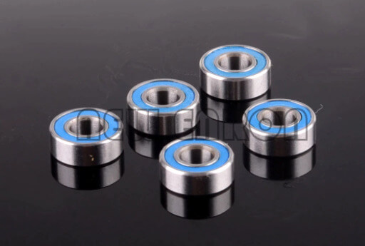
</td>
            <td>  <a href="https://de.aliexpress.com/item/1005001697683913.html?gatewayAdapt=glo2deu&spm=a2g0s.9042311.0.0.1fe54c4dR1WTdj">AE</a></td>
            <td>$5.52 | €3.45</td>
            <td>1</td>
            <td>$5.52 | €3.45</td>
        </tr>
        <tr>
            <td>O7</td>
            <td>INJORA 90mm RC Car Spring Shock Absorber (2pcs)</td>
            <td>
 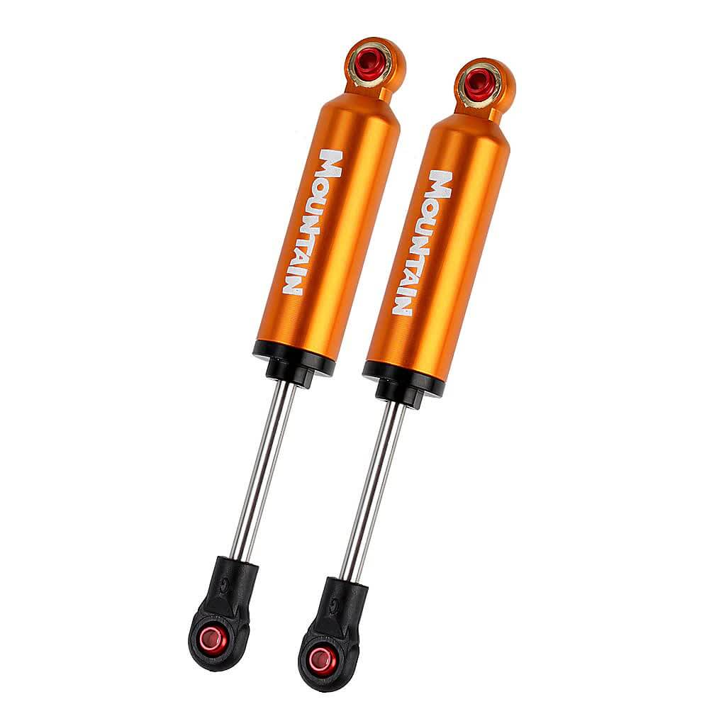
</td>
            <td>  <a href="https://de.aliexpress.com/item/4000309686709.html?gatewayAdapt=glo2deu&spm=a2g0o.productlist.0.0.17b17ca7oMXyhJ&algo_pvid=c7d8ba55-28b2-4d27-97e4-f338994958f7&algo_exp_id=c7d8ba55-28b2-4d27-97e4-f338994958f7-14&pdp_ext_f=%7B%22sku_id%22%3A%2210000001286270094%22%7D&pdp_pi=-1%3B8.3%3B-1%3B-1%40salePrice%3BUSD%3Bsearch-mainSearch">AE</a></td>
            <td>$8.30 | €7.99</td>
            <td>1</td>
            <td>$8.30 | €7.99</td>
        </tr>
        <tr>
            <td>O8</td>
            <td>AXSPEED RC Car LED 4.2v-6v White 17mm (2 pcs)</td>
            <td>
 
</td>
            <td>  <a href="https://www.aliexpress.com/item/1005003306484898.html?spm=a2g0s.9042311.0.0.d4954c4dpsjiiC">AE</a></td>
            <td>$7.43 | €6.87</td>
            <td>1</td>
            <td>$7.43 | €6.87</td>
        </tr>
        <tr>
            <td>O9</td>
            <td>AXSPEED RC Car LED 4.2v-6v Red 17mm (2 pcs)</td>
            <td>
 
</td>
            <td>  <a href="https://www.aliexpress.com/item/1005003306484898.html?spm=a2g0s.9042311.0.0.d4954c4dpsjiiC">AE</a></td>
            <td>$7.43 | €6.87</td>
            <td>1</td>
            <td>$7.43 | €6.87</td>
        </tr>
        <tr>
            <td>O10</td>
            <td>Vibration Isolators M3 x 8mm Studs (4 pcs)</td>
            <td>
 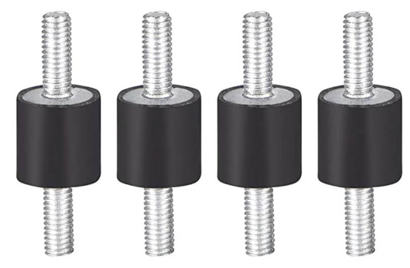
</td>
            <td>  <a href="https://www.amazon.com/MroMax-Rubber-Vibration-Isolator-Absorber/dp/B07Z76J5N5/ref=sr_1_5?crid=2LSR8ZMHRIL2O&keywords=m3+rubber+mount+shock+absorbers&qid=1649862366&sprefix=keesin+m3+rubber+mounts+shock+absorbers+%2Caps%2C362&sr=8-5">US</a> | <a href="https://www.amazon.de/-/en/gp/product/B076SSPHP6/ref=ppx_yo_dt_b_asin_title_o03_s01?ie=UTF8&psc=1">EU</a></td>
            <td>$8.09 | €9.49</td>
            <td>1</td>
            <td>$8.09 | €9.49</td>
        </tr>
        <tr>
            <td>O11</td>
            <td>Zeadio Universal Smartphone holder</td>
            <td>
 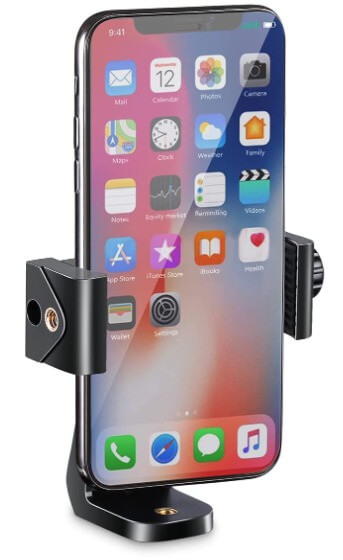
</td>
            <td> <a href="https://www.amazon.com/SharingMoment-Smartphone-Horizontal-Rotatable-Adjustable/dp/B07S8TTH34/ref=sr_1_4?crid=X7XQ9LC110JJ&keywords=Zeadio+Smartphone+Tripod+Adapter%2C+Mobile+Phone+Holder&qid=1649862548&refinements=p_36%3A2491155011&rnid=2491154011&s=wireless&sprefix=zeadio+smartphone+tripod+adapter%2C+mobile+phone+holder+%2Caps%2C577&sr=1-4">US</a> | <a href="https://www.amazon.de/-/en/Zeadio-Smartphone-Tripod-Adapter-Mobile/dp/B06XDYJNSR/ref=sr_1_8?crid=2ZH6V545D45E3&keywords=zeadio%2Buniversal%2Bsmartphone%2Bhalterung&qid=1644150427&sprefix=zeadio%2Buniversal%2Bsmartphone%2Bholder%2Caps%2C104&sr=8-8&th=1">EU</a></td>
            <td>$11.99 | €10.99</td>
            <td>1</td>
            <td>$11.99 | €10.99</td>
        </tr>
        <tr>
            <td>O12</td>
            <td>DC 12-24 V Car Voltmeter</td>
            <td>
 
</td>
            <td>  <a href="https://www.amazon.com/Nilight-Voltmeter-Waterproof-VoltVolt-Motorcycle/dp/B06ZZJ48VQ/ref=sr_1_fkmr1_2?crid=376857DCCJICB&keywords=mini+led+digital+voltmeter+batterietester+12+volt+%2F+24+volt+voltmeter&qid=1649862763&sprefix=mini+led+digital+voltmeter+batterietester+12+volt+%2F+24+volt+voltmeter%2Caps%2C404&sr=8-2-fkmr1">US</a> | <a href="https://www.amazon.de/-/en/Intckwan-Digital-Voltmeter-Waterproof-Motorcycle/dp/B09T5XRYM9/ref=sr_1_5?crid=1GPFOX9O2VX85&keywords=mini+led+digital+voltmeter+batterietester+12+volt+%2F+24+volt+voltmeter&qid=1649862700&sprefix=mini+led+digital+voltmeter+battery+tester+12+volt+%2F+24+volt+voltmeter%2Caps%2C91&sr=8-5">EU</a></td>
            <td>$10.99 | €11.88</td>
            <td>1</td>
            <td>$10.99 | €11.88</td>
        </tr>
        <tr>
            <td>O13</td>
            <td>Mini Rocker Switch (20 pcs)</td>
            <td>
 
</td>
            <td>  <a href="https://www.amazon.com/DaierTek-250VAC-Rocker-KCD1-101-Plastic/dp/B07S2QJKTX/ref=sr_1_4?keywords=RUNCCI-YUN+20Pcs+Mini+Rocker+Switch&qid=1650638471&sr=8-4">US</a> | <a href="https://www.amazon.de/-/en/RUNCCI-Rocker-Switches-Household-Appliances/dp/B07MW92CW8/ref=sr_1_2?keywords=RUNCCI-YUN+20+St%C3%BCck+Mini-Wippschalter&qid=1650638352&sr=8-2">EU</a></td>
            <td>$15.98 | €9.44</td>
            <td>0.15</td>
            <td>$2.4 | €1.42</td>
        </tr>
        <tr>
            <td>O14</td>
            <td>Duttek Micro USB Panel Mount Cable</td>
            <td>
 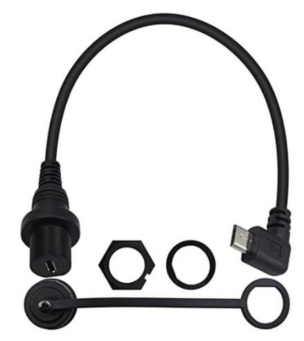
</td>
            <td>  <a href="https://www.amazon.com/Duttek-Angled-Extension-Motorcycle-Dashboard/dp/B08RSGYV1S/ref=sr_1_1?keywords=Duttek+90+Degree+Micro+USB+Panel+Mount+Cable+Micro+USB+Mount+Extension+Cable+Male+to+Female+for+Car+Boat+Motorcycle+Truck+Dashboard+30cm&qid=1650638585&sr=8-1">US</a> | <a href="https://www.amazon.de/-/en/Duttek-Degree-Extension-Motorcycle-Dashboard/dp/B08RSGYV1S/ref=psdc_1365661031_t1_B07ZCZ8NL1">EU</a></td>
            <td>$10.68 | €11.44</td>
            <td>1</td>
            <td>$10.68 | €11.44</td>
        </tr>
        <tr>
            <td>O15</td>
            <td>Custom PCB</td>
            <td>
 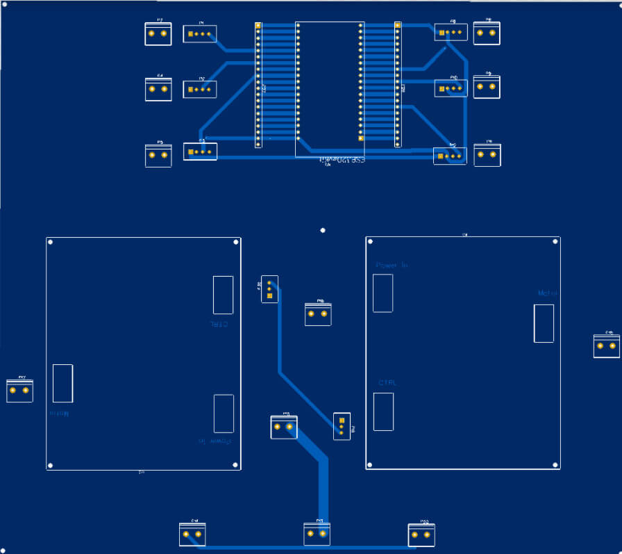
</td>
            <td>  <a href="https://www.eurocircuits.de/">US</a> | <a href="https://www.eurocircuits.de/">EU</a></td>
            <td>$10.00 | €10.00</td>
            <td>1</td>
            <td>$10.00 | €10.00</td>
        </tr>
        <tr>
            <td>O16</td>
            <td>Cytron 30A 5-30V Single Brushed DC Motor Driver</td>
            <td>
 
</td>
            <td>  <a href="https://www.robotshop.com/en/cytron-30a-5-30v-single-brushed-dc-motor-driver.html">US</a> | <a href="https://www.robotshop.com/eu/en/cytron-30a-5-30v-single-brushed-dc-motor-driver.html">EU </a></td>
            <td>$34.38 | €37.15</td>
            <td>2</td>
            <td>$68.76 | €74.30</td>
        </tr>
        <tr>
            <td>O17</td>
            <td>LM2596S DC-DC Converter 12V-36V to 5V | 2A (4 pcs)</td>
            <td>
 
</td>
            <td>  <a href="https://www.amazon.com/Adjustable-Converter-Step-Down-Regulator-Stabilizer/dp/B081N6WWJS/ref=sr_1_3?keywords=4+pieces+adjustable+LM2596S+DC-DC+down+converter&qid=1650638822&sr=8-3">US</a> | <a href="https://www.amazon.de/-/en/adjustable-converter-regulator-stabiliser-voltmeter/dp/B081N6WWJS/ref=pd_sbs_6/262-3535180-9041508?pd_rd_w=m3EIw&pf_rd_p=7cf49d79-ae26-401a-94b7-1dec7a725ba4&pf_rd_r=KEN7A8F4YCHEBXB3ZK9B&pd_rd_r=b6829a4e-476a-48dd-8821-a64b9945da1d&pd_rd_wg=m3HQp&pd_rd_i=B081N6WWJS&psc=1">EU</a></td>
            <td>$15.99 | €16.99</td>
            <td>0.25</td>
            <td>$3.99 | €4.25</td>
        </tr>
        <tr>
            <td>O18</td>
            <td>4500mAh 3S-25C 11.1V LiPo Battery in Hard Case</td>
            <td>
 
</td>
            <td>  <a href="https://www.amazon.com/HRB-50C-100C-Quadcopter-Helicopter-Airplane/dp/B06XNTHQRZ?ref_=ast_sto_dp&th=1&psc=1">US</a> | <a href="https://www.amazon.de/-/en/Roaring-Battery-Deans-Connection-Aeroplane/dp/B08Z3JYK1X/ref=sr_1_5?crid=3TW2SFFYW1BQY&keywords=4500%2Bmah%2B3s%2B11%2C1v%2B55c%2Blipo&qid=1644164015&sprefix=4500mah%2B3s%2B11.1v%2B55c%2Blipo%2Caps%2C82&sr=8-5&th=1">EU</a></td>
            <td>$46.99 | €29.97</td>
            <td>1</td>
            <td>$46.99 | €29.97</td>
        </tr>
        <tr>
            <td>O19</td>
            <td>AITRIP ESP32-DevKitC Development Board (3 pcs)</td>
            <td>
 
</td>
            <td>  <a href="https://www.amazon.com/Development-Microcontroller-Integrated-Antenna-Amplifiers/dp/B09GK74F7N/ref=sr_1_2?crid=2SK0PFZJXONGJ&keywords=3pcs+ESP32+DevKitC+Core&qid=1650638989&sprefix=3pcs+esp32+devkitc+core%2Caps%2C162&sr=8-2">US</a> | <a href="https://www.amazon.de/-/en/DevKitC-Development-ESP32-WROOM-32D-Bluetooth-Arduino/dp/B09LS6SCF7/ref=sr_1_2?crid=8EUG1EBFJ9AX&keywords=aitrip+esp32-devkitc&qid=1644164236&sprefix=aitrip+esp32-devkitc+core%2Caps%2C192&sr=8-2">EU</a></td>
            <td>$19.99 | €21.00</td>
            <td>0.33</td>
            <td>$6.66 | €7.00</td>
        </tr>
        <tr>
            <td>O20</td>
            <td>5.08mm PCB Terminal Block (11 x 2 Pin + 11 x 4 Pin)</td>
            <td>
 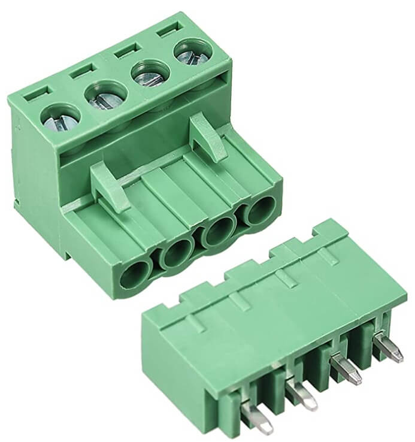
</td>
            <td>  <a href="https://www.amazon.com/LuoQiuFa10-4-Pin-5-08mm-Female-Terminal/dp/B093DNBV5D/ref=sr_1_2?crid=1W2RRUJFR1XY2&keywords=Cococity+22+Pairs+5.08+mm+2+Pins+PCB+Screw+Terminal+Connector+Pluggable+%2B+2+Pins+Plug+in+Screw+PCB+Terminal+Block+Plug+Right+Angle+%282+Pin+11+Pairs+4+Pin+11+Pairs%29+300V+10A+%28Green%29&qid=1650639050&sprefix=3pcs+esp32+devkitc+core%2Caps%2C186&sr=8-2">US</a> | <a href="https://www.amazon.de/-/en/Cococity-Pairs-Terminal-Connector-Pluggable/dp/B083GNB8BY/ref=sr_1_7?crid=SJKL0W8ANGUI&keywords=4-polige+leiterplatten-schraubklemmleiste%2C+5%2C08+mm&qid=1644165018&sprefix=4+pin+5.08mm+pitch+pcb+screw+terminal+block%2Caps%2C82&sr=8-7">EU</a></td>
            <td>$7.99 | €11.99</td>
            <td>1</td>
            <td>$7.99 | €11.99</td>
        </tr>
        <tr>
            <td>O21</td>
            <td>M6 x 1m (1000mm) Zinc Plated Threaded Rod/Bar</td>
            <td>
 
</td>
            <td>  <a href="https://www.amazon.com/Threaded-Plated-Thread-Length-Threads/dp/B00G3QM076/ref=sr_1_18?crid=1MBLSICIHE3FX&keywords=M6+x+1m+%281000mm%29+Zinc+Plated+Threaded+Rod%2FBar&qid=1650639302&sprefix=m6+x+1m+1000mm+zinc+plated+threaded+rod%2Fbar%2Caps%2C306&sr=8-18">US</a> | <a href="https://www.amazon.de/-/en/Threaded-quality-galvanised-standard-parts/dp/B07X3LX6RX/ref=sr_1_21?crid=3UFFWWONRN5FQ&keywords=gewindestange%2C%2Bverzinkt%2C%2Bm6%2Bx%2B1%2Bm%2B(1000%2Bmm)%2C%2B10%2Bst%C3%BCck&qid=1644165235&sprefix=pack%2Bof%2B10%2Bm6%2Bx%2B1m%2B1000mm%2Bzinc%2Bplated%2Bthreaded%2Brod%2Fbar%2Caps%2C170&sr=8-21&th=1">EU</a></td>
            <td>$22.73 | €4.31</td>
            <td>1</td>
            <td>$22.73 | €4.31</td>
        </tr>
        <tr>
            <td>O23</td>
            <td>M4 x 50mm screws (30 pcs)</td>
            <td>
 
</td>
            <td>  <a href="https://www.amazon.com/MroMax-M4x50mm-Machine-Stainless-Phillips/dp/B07ZPSWW24/ref=sr_1_2?crid=6FFC31FUFZC&keywords=M4+x+50mm+screws+30pcs&qid=1650639360&sprefix=m4+x+50mm+screws+30pc%2Caps%2C175&sr=8-2">US</a> | <a href="https://www.amazon.de/-/en/M4-50-stainless-cylinder-DIN912/dp/B07YW6Q5VT/ref=sr_1_10?crid=24VLWXHS6RUKJ&keywords=m4x50%2Bmm%2Bsechskant&qid=1644166982&sprefix=m4%2Bx%2B50mm%2Bhex%2B%2Caps%2C94&sr=8-10&th=1">EU</a></td>
            <td>$11.39 | €9.83</td>
            <td>1</td>
            <td>$11.39 | €9.83</td>
        </tr>
        <tr>
            <td>O24</td>
            <td>M4 x 40mm screws (30 pcs)</td>
            <td>
 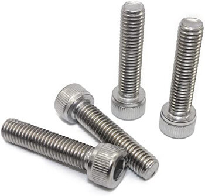
</td>
            <td>  <a href="https://www.amazon.com/Uxcell-a15111200ux1682-Cabinet-Handles-Phillips/dp/B019ZESG9I/ref=sr_1_5?crid=3FFNS1NMT4XPE&keywords=m4+x+40mm+screws+30+pcs&qid=1650639393&sprefix=m4+x+40mm+screws+30pcs%2Caps%2C163&sr=8-5">US</a> | <a href="https://www.amazon.de/-/en/M4-50-stainless-cylinder-DIN912/dp/B07YWDJS99/ref=sr_1_10?crid=24VLWXHS6RUKJ&keywords=m4x50%2Bmm%2Bsechskant&qid=1644166982&sprefix=m4%2Bx%2B50mm%2Bhex%2B%2Caps%2C94&sr=8-10&th=1">EU</a></td>
            <td>$10.56 | €9.13</td>
            <td>1</td>
            <td>$10.56 | €9.13</td>
        </tr>
        <tr>
            <td>O25</td>
            <td>M3 screws and nuts sets (440 pcs)</td>
            <td>
 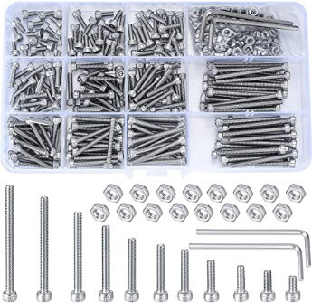
</td>
            <td>  <a href="https://www.amazon.com/Shapenty-100PCS-Stainless-Female-Fastener/dp/B071NLDW56/ref=sr_1_9?crid=I0ZQA6TBI3N9&keywords=M3+screws+and+nuts+sets+%28440+pcs%29&qid=1650639424&sprefix=m3+screws+and+nuts+sets+440+pcs+%2Caps%2C257&sr=8-9">US</a> | <a href="https://www.amazon.de/-/en/pieces-screws-stainless-hexagon-socket/dp/B093GNHWKR/ref=sr_1_3?crid=36NK6MT1K8LSC&keywords=satz+m3+innensechskant&qid=1644166735&s=diy&sprefix=set+m3+hex+socket%2Cdiy%2C87&sr=1-3">EU</a></td>
            <td>$6.49 | €11.99</td>
            <td>1</td>
            <td>$6.49 | €11.99</td>
        </tr>
        <tr>
            <td>O26</td>
            <td>M4 x 120mm screws (15 pcs)</td>
            <td>
 
</td>
            <td> <a href="https://www.amazon.com/XunLiu-Socket-Screws-Wrench-Knurled/dp/B07CHJ7ZPP/ref=sr_1_38?crid=1U3GJUWD14XQB&keywords=screw%2BM4%2Bx%2B120mm&qid=1650753655&sprefix=screw%2Bm4%2Bx%2B120mm%2Caps%2C167&sr=8-38&th=1">US</a> | <a href="https://www.amazon.de/-/en/sourcing-Phillips-Furniture-Hanging-External/dp/B08JYCP7TD/ref=sr_1_64?crid=25999O4GLCN83&keywords=m4+x+120+mm&qid=1644165946&sprefix=m4+x+120mm+socket%2Caps%2C109&sr=8-64">EU</a></td>
            <td>$15.29 | €15.64</td>
            <td>1</td>
            <td>$15.29 | €15.64</td>
        </tr>
        <tr>
            <td>O27</td>
            <td>M6 x 100mm screws (2 pcs)</td>
            <td>
 
</td>
            <td>  <a href="https://www.amazon.com/MroMax-Machine-Stainless-Phillips-Cabinet/dp/B07YFMN8FP/ref=sr_1_5?crid=3GFYNNIBEO5UA&keywords=M6+x+100mm+screws&qid=1650639588&sprefix=m6+x+100mm+screws+2+pcs+%2Caps%2C161&sr=8-5">US</a> | <a href="https://www.amazon.de/-/en/AG-BOX%C2%AE-Cylinder-Screws-Stainless-Steel/dp/B09N3DNDZK/ref=sr_1_5?crid=1NROTQHUR7F2K&keywords=m6x100+mm&qid=1644171138&sprefix=m6+x+100mm%2Caps%2C90&sr=8-5">EU</a></td>
            <td>$3.84 | €4.18</td>
            <td>1</td>
            <td>$3.84 | €4.18</td>
        </tr>
        <tr>
            <td>O28</td>
            <td>Assorted Nuts (Full and Self Locking) and Washers M3, M4 & M5 (45 pcs)</td>
            <td>
 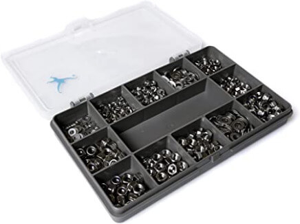
</td>
            <td> <a href="https://www.amazon.com/Assortment-AETTL-Stainless-Assorted-Wrenches/dp/B098ND1GW8/ref=sr_1_2?crid=3AFZPJ5SIBJD9&keywords=Assorted+Nuts+%28Full+and+Self+Locking%29+and+Washers+M3%2C+M4+%26+M5+%2845+pcs%29&qid=1650639662&sprefix=assorted+nuts+full+and+self+locking+and+washers+m3%2C+m4+%26+m5+45+pcs+%2Caps%2C226&sr=8-2">US</a> |  <a href="https://www.amazon.de/-/en/Assorted-Locking-Washers-Stainless-Steel/dp/B01CO9S1RI/ref=sr_1_98?crid=P8DDSVM9ZTG1&keywords=m3+m4+muttern+unterlegscheiben&qid=1644172060&sprefix=m3+m4+nuts+washers%2Caps%2C101&sr=8-98">EU</a></td>
            <td>$25.64 | €23.01</td>
            <td>1</td>
            <td>$25.64 | €23.01</td>
        </tr>
        <tr>
            <td>O29</td>
            <td>M6 Nuts/Washers Set (40 pcs)</td>
            <td>
 
</td>
            <td>  <a href="https://www.amazon.com/Stainless-Washer-Machine-Thread-Assortment/dp/B09HNJBX1G/ref=sr_1_3?crid=1N4R1D32PS8W6&keywords=40-Piece+Nuts%2FWashers+Set+for+M6&qid=1650639826&sprefix=40-piece+nuts%2Fwashers+set+for+m6+threaded+rods+a2+stainless+steel%2Caps%2C227&sr=8-3">US</a> | <a href="https://www.amazon.de/-/en/40-Piece-Washers-Threaded-Stainless-Steel/dp/B01G77C0DY/ref=sr_1_31?crid=EUR5CW3K5BLD&keywords=m6+muttern+und+unterlegscheiben&qid=1644172515&refinements=p_36%3A118557031&rnid=118555031&s=diy&sprefix=m6+nuts+and+washers%2Caps%2C87&sr=1-31">EU</a></td>
            <td>$13.99 | €8.99</td>
            <td>1</td>
            <td>€$13.99 | €8.99</td>
        </tr>
      <tr>
            <td>O30</td>
            <td>Stainless Steel Flat and Spring Washers Assortment </td>
            <td>
 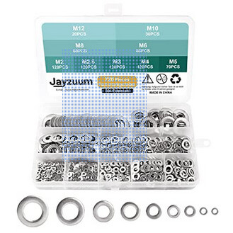
</td>
            <td>  <a href="https://www.amazon.com/Split-Washer-Assortment-Stainless-Silver/dp/B08QN3ZR23/ref=sr_1_35?keywords=Stainless+Steel+Flat+and+Spring+Washers+Assortment+Kit&qid=1650753391&sr=8-35">US</a> | <a href="https://www.amazon.de/-/en/300-pieces-Stainless-Washers-Assortment-M2-M3-M4-M5-M6/dp/B07CQX6NPP/ref=sr_1_15?keywords=m4+federscheibe&qid=1650753193&sr=8-15">EU</a></td>
            <td>$12.49 | €10.38</td>
            <td>1</td>
            <td>€$12.49 | €10.38</td>
        </tr>
    </tbody>
</table>

외부에서 구매한 부품의 총 비용은 약 **500€**로 추정되며, MTV의 전체 비용은 약 **600€**입니다.

### II.2. 기계적 조립

#### II.2.1. 개요

이 장에서는 MTV의 조립 과정을 다룹니다. 왼쪽과 오른쪽은 로봇의 포트와 스타보드 측을 의미하며, 본 문서에서는 서로 교차해서 사용됩니다. 별도로 언급되지 않는 한, 모든 볼트에는 3D 프린팅된 플라스틱을 보호하기 위해 평 와셔가 사용된다고 가정합니다. 또한, 스프링 와셔와 나일록을 사용하면 진동으로 인한 너트의 풀림을 방지할 수 있다는 점도 강조해야 합니다.

MTV의 조립 과정은 크게 7개의 주요 단계로 나눌 수 있습니다:
1. 6개의 모터 모듈 조립
2. 다리 조립
3. 차체 조립
4. 주요 컴파트먼트 조립
5. 차량 조립
6. 파워 유닛, 제어 유닛 및 다양한 부품 연결 조립
7. 테스트, 프로그래밍 및 사용

  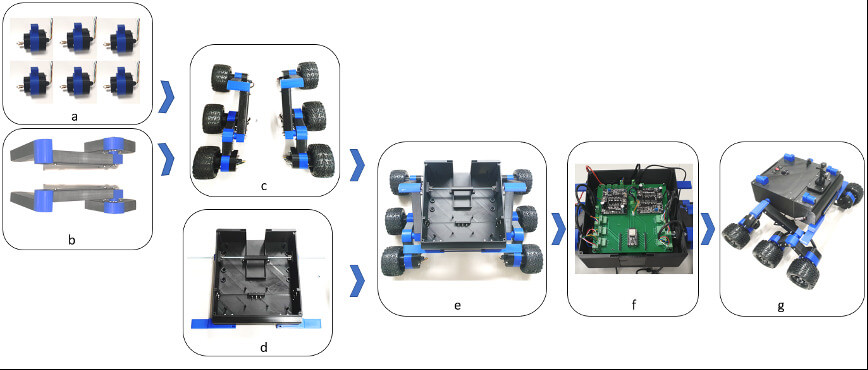

#### II.2.2. 모터 모듈 조립

각 모터 모듈은 다음 부품으로 구성되어 있어요:

- 1 x 3D 프린팅된 <a href="cad/MotorAssembly/MotorEnclosure_Top.stl">모터 인클로저 상단</a> (A1)
- 1 x 3D 프린팅된 <a href="cad/MotorAssembly/MotorEnclosure_Bottom.stl">모터 인클로저 하단</a> (A2)
- 1 x 3D 프린팅된 <a href="cad/MotorAssembly/Motor_Bracket.stl">모터 브래킷</a> (A3)
- 1 x JGB37-520 DC 모터와 인코더 및 휠 어댑터 (O1)
- 1 x PG7 케이블 글랜드 (O5)

모터 모듈을 조립하려면:

1. 키트에 제공된 제어 케이블 (O1)을 모터에 연결해요. 이 연결을 핫글루로 고정하는 것이 강력히 추천돼요.
2. 모터 장착 패턴을 3D 프린팅된 모터 하우징 (A1) 구멍 패턴에 맞게 조심스럽게 정렬해요. 인코더에 힘을 가하지 않도록 조심하세요, 아니면 손상될 수 있어요. 제공된 나사 (O1)를 사용해서 모터를 3D 프린팅된 모터 하우징 (A1)에 나사로 고정해요.
3. 키트에 있는 커플링 슬리브 (O1)를 모터 샤프트에 제공된 앨런 키로 고정해요. 휠을 커플링 슬리브에 고정하는 너트는 안전하게 헥스 허브에 나사로 잠가두세요. 나중에 타이어 (O2)를 차량에 부착할 때 필요할 거예요.
4. 모터 브래킷 (A3)을 모터 인클로저 상단 (A1) 위에 끼워요. 이것은 푸시 핏이라서 조심스럽게 정렬해서 끼워야 해요. 아래 그림처럼 모터 브래킷의 어깨 부분이 모터 샤프트 쪽을 향하도록 하여 조립이 깔끔하게 될 수 있도록 해주세요. 모터 브래킷 (A3)이 모터 인클로저 상단 (A1)과 꽉 맞는지 확인하고, 핫글루나 슈퍼글루로 조립을 고정해요.
5. 케이블 글랜드 조인트 (O5)를 모터 인클로저 하단 (A2)에 추가하고, 모터 와이어를 글랜드를 통해 통과시켜요.
6. 모터 인클로저 하단 (A2)을 모터 인클로저 상단 (A1)에 조심스럽게 끼워 넣어요. 이때, 모터 브래킷 (A3)이 모터 인클로저 상단 (A1)과 일치하는지 확인해요. 와이어가 인코더에 걸리지 않도록 주의하고, 인코더는 자유롭게 회전할 수 있어야 해요.
7. 모터 인클로저 상단 (A1)과 모터 브래킷 (A3)은 M4 x 60mm 볼트 (O23)와 나일락 너트 (O28)로 고정해요.

  

  

#### II.2.3. 다리 조립

MTV의 왼쪽 다리는 다음 부품들로 구성되어 있어요:

- 1 x 3D 프린트된 <a href="cad/Joints/90deg_Joint.stl">90도 조인트</a> (A4)
- 1 x 3D 프린트된 <a href="cad/Joints/End_Joint.stl">끝 조인트</a> (A7)
- 1 x 3D 프린트된 <a href="cad/Joints/BearingCover.stl">베어링 커버</a> (A11)
- 1 x 3D 프린트된 <a href="cad/Joints/100deg_Joint.stl">100도 조인트</a> (A5)
- 2 x 3D 프린트된 <a href="cad/Legs/Front_Leg.stl">앞 다리</a> (A8)
- 1 x 3D 프린트된 <a href="cad/Legs/Mid_Leg.stl">중간 다리</a> (A9)
- 1 x 3D 프린트된 <a href="cad/Legs/Rear_Leg.stl">뒷 다리</a> (A10)
- 1 x D-Line 케이블 덕트 (O4)
- 1 x 7-Core 케이블 (O3)
- 1 x MR126ZZ 볼 베어링 (O6)

MTV의 오른쪽 다리는 다음 부품들로 구성되어 있어요:

- 1 x 3D 프린트된 <a href="cad/Joints/90deg_Joint.stl">90도 조인트</a> (A4)
- 1 x 3D 프린트된 <a href="cad/Joints/End_Joint.stl">끝 조인트</a> (A7)
- 1 x 3D 프린트된 <a href="cad/Joints/BearingCover.stl">베어링 커버</a> (A11)
- 1 x 3D 프린트된 <a href="cad/Joints/100deg_Joint_Mirror.stl">100도 조인트 미러</a> (A6)
- 2 x 3D 프린트된 <a href="cad/Legs/Front_Leg.stl">앞 다리</a> (A8)
- 1 x 3D 프린트된 <a href="cad/Legs/Mid_Leg.stl">중간 다리</a> (A9)
- 1 x 3D 프린트된 <a href="cad/Legs/Rear_Leg.stl">뒷 다리</a> (A10)
- 1 x D-Line 케이블 덕트 (O4)
- 1 x 7-Core 케이블 (O3)
- 1 x MR126ZZ 볼 베어링 (O6)

90도 조인트 (A4)와 관련된 다리 (A8) (앞 다리 2개 + 중간 다리)를 조립해서 왼쪽과 오른쪽 앞 다리 조립을 만드세요. 다리는 M4 x 40mm 볼트 (O24), 플랫 와셔 (O30), 스프링 와셔 (O30), 너트 (O28)로 조여주세요. 다리 조립에 제공된 M4 구멍에 구멍을 뚫으세요 (중간 다리에는 3개의 구멍이 있는데, 끝 두 개는 M4, 가운데는 M3으로 드릴링하여 충격 흡수기를 장착할 수 있도록 해주세요).
뒷 다리 100도 조인트 (A5) (미러 A6)와 뒷 다리를 결합해 포트와 스타보드 전체 다리 조립을 만들고, 다리를 M4 x 40mm 볼트 (O24), 플랫 와셔 (O30), 스프링 와셔 (O30), 너트 (O28)로 고정하세요.

  

#### II.2.4. 섀시 조립

각 다리의 자유 끝에 모터 브래킷을 M4 x 40mm 볼트(O24), 평 와셔 및 스프링 와셔(O30), 너트(O28)를 사용하여 부착하세요. 타이어(O2)를 육각 허브에 부착하고 휠 허브 너트로 고정하세요. MTV 모터에는 속도 추정을 위한 내장형 자기 인코더가 있으며, 6핀 인터페이스가 있습니다. 이 핀은 `[모터 전원 +, 모터 전원 - , 인코더 전원 + , 인코더 전원 - , 인코더 데이터 1, 인코더 데이터 2]`로 구성됩니다. 모터와 제어 PCB 간의 전기 연결은 (O3) 7코어 케이블을 사용하여 이루어져야 합니다:

  

섀시 조립을 완료하고, 필요에 따라 케이블 덕트(O4)를 부착하세요:

  

#### II.2.5. 메인 컴파트먼트 조립

메인 컴파트먼트는 다음 부품들로 구성됩니다:

- 2 x 3D 프린트 <a href="cad/Joints/BearingCover.stl">베어링 커버</a> (A11)
- 1 x 3D 프린트 <a href="cad/PhoneMount/Phone_Mount.stl">폰 마운트 플랫폼</a> (A12)
- 1 x 3D 프린트 <a href="cad/Buffer/Name_Front.stl">이름 앞면</a> (A13)
- 1 x 3D 프린트 <a href="cad/Buffer/Name_Back.stl">이름 뒷면</a> (A14)
- 1 x 3D 프린트 <a href="cad/Buffer/Buffer_Left.stl">버퍼 왼쪽</a> (A15)
- 1 x 3D 프린트 <a href="cad/Buffer/Buffer_Right.stl">버퍼 오른쪽</a> (A16)
- 1 x 3D 프린트 <a href="cad/Compartment/Compartment_Rear.stl">컴파트먼트 뒷면</a> (A17)
- 1 x 3D 프린트 <a href="cad/Compartment/Compartment_Front.stl">컴파트먼트 앞면</a> (A18)
- 1 x 3D 프린트 <a href="cad/Compartment/Roof_Front.stl">천장 앞면</a> (A19)
- 1 x 3D 프린트 <a href="cad/Compartment/Roof_Rear.stl">천장 뒷면</a> (A20)
- 1 x 3D 프린트 <a href="cad/Compartment/Compartment_Battery_Mount-P1.stl">컴파트먼트 배터리 마운트 P1</a> (A21a)
- 1 x 3D 프린트 <a href="cad/Compartment/Compartment_Battery_Mount-P2.stl">컴파트먼트 배터리 마운트 P2</a> (A21b)
- 4 x M4 x 120mm 나사 (O26)
- 6 x PG7 케이블 글랜드 (O5)
- 1 x M6 나사바 (O21)

뒤쪽 컴파트먼트 (A17)와 앞쪽 컴파트먼트 (A18)를 M3 x 15mm 나사 (O25), 플랫 와셔 (O28), 나일록 너트 (O28)를 사용하여 결합하여 컴파트먼트 조립을 만듭니다. 결합을 위해 가이드된 구멍을 사용하여 M3 구멍을 뚫어주세요.

  

베어링 연결 구멍을 섀시에서 제공된 가이드된 구멍에 맞게 뚫고, 베어링 (O6)을 베어링 커버 (A11)에 삽입하여 4개의 M3 x 30mm 볼트 (O25), 스프링 와셔 (O30), 와셔 (O28), 나일록 (O28)을 사용하여 베어링 조립을 컴파트먼트 외부에 고정하세요.

  

뒤쪽 컴파트먼트 (A17)의 여섯 개 구멍에 케이블 글랜드 조인트 (O5)를 부착하세요. 여섯 개의 글랜드 조인트는 모터 전선이 컴파트먼트로 통과할 수 있도록 사용됩니다:

  

왼쪽과 오른쪽 버퍼 (A15 & A16)를 4개의 M3 x 20mm 볼트 (O25), 스프링 와셔 (O30), 와셔 (O28), 나일록 (O28)을 사용하여 컴파트먼트 조립에 부착하세요.

  

배터리 마운트 P1 & P2 (A21a & b)를 뒷면 컴파트먼트에 M3 x 15mm 볼트 (O25)와 나일록 (O28)을 사용하여 부착하세요. M6 나사바 (O21)를 베어링 중앙 구멍과 배터리 마운트 P1&P2 조립을 통해 섀시 조립에 삽입하세요. 나사바를 한쪽에서 삽입할 때, 컴파트먼트 내부에 필요한 M6 너트 (O29)를 추가하는 것을 잊지 마세요.
- 컴파트먼트 외부에는 섀시와 컴파트먼트 조립 사이에 간격을 두는 역할을 하는 M6 너트 (O29) 두 개가 있습니다.
- 또한, 나사바는 섀시 조립을 위한 공간을 확보하기 위해 왼쪽과 오른쪽에 균형을 맞추어야 합니다.
- 나사바를 컴파트먼트에 조일 때, 측면 벽에 과도한 장력을 주지 않도록 주의해야 합니다.

  

#### II.2.6. 차량 조립

차대 조립을 구획 양쪽의 M6 나사 바에 부착하고, M6 너트를 사용해 고정합니다 (O29):

  

충격 흡수기 (O7)를 중간 다리와 차대 사이에 부착합니다:

  

충격 흡수기에서 공장 기본 스프링을 중간 탄성 세트(금색 스프링)로 교체하여 로봇의 몸체가 지면과 평평하게 유지되도록 합니다. 피스톤 끝을 로봇 구획에 부착하고, 충격 흡수기와 함께 제공된 스페이서와 볼트를 사용하며, M3 잠금 너트 (O28)를 사용합니다. 로드 끝은 M3 x 40 볼트 (O25)와 나일록 (O28)을 사용하여 고정합니다. 다리 조립에서 본체로 전선을 연결하고 배선 지침에 따라 부착합니다 (케이블 관리 트렁킹을 적절히 사용하세요). 전화기 거치를 지붕 앞부분 (A19)에 부착합니다.
- 스마트폰 거치대 (O11)를 전화기 거치대 플랫폼 (A12)에 부착합니다.
- 진동 차단기 (O11)를 전화기 거치대 플랫폼 (A12)에 부착하고, 잠금 너트와 와셔를 사용해 지붕 앞부분 (A19)에 고정합니다.

  

전압 표시기 (O12), 전원 제어 스위치 (O13), 마이크로 USB 패널 마운트 케이블 (O14)을 지붕 뒤쪽 지정된 슬롯에 고정합니다. 지붕 컷아웃을 통해 헤드 라이트 (O8)와 테일 라이트 (O9)를 빼내고, 지붕 앞부분 (A19)과 지붕 뒷부분 (A20)을 구획 조립에 부착합니다. 헤드 라이트 (O8)는 헤드라이트 소켓 (A23)에, 테일 라이트 (O9)는 테일라이트 소켓 (A24)에 삽입하고, 각각 지붕 앞부분 (A19)과 지붕 뒷부분 (A20)의 슬롯에 고정합니다. 라이트 소켓을 라이트 엔드캡 (A22)으로 밀봉하고, 슈퍼글루로 부착합니다. 사용자 정의된 이름 전면 (A13)과 이름 후면 (A14) 플레이트를 삽입합니다.

  

### II.3. 전자 조립

이 부분은 차량에 전자 보드를 통합하는 과정만 다룹니다. 다양한 PCB의 아키텍처와 구성 요소에 대한 추가적인 정보는 [다음 링크](./pcb)를 통해 확인할 수 있습니다. 프로토타입 PCB들은 아래 그림들에서 확인할 수 있어요:

  

#### II.3.1. 배터리 – PCB 연결
MTV에 사용된 충전식 Lipo 배터리는 전원 분배 PCB와 전용 커넥터 세트를 통해 연결됩니다. 스위치를 사용하여 배터리 커넥터에서 발생할 수 있는 스파크로 인한 손상을 방지할 수 있습니다. 이 스위치는 MTV의 뚜껑에 장착되어 있으며, 유지보수 목적을 위해 스플라이싱 커넥터 세트를 사용할 수 있습니다.

  

#### II.3.2. PCB – 전압 표시 연결

전용 전압 표시 장치는 배터리 상태를 나타내는 중요한 정보를 제공합니다. 이 장치는 전원 분배 PCB에 연결되어야 합니다.

  

#### II.3.3. PCB – 조명 연결

앞뒤 조명은 MTV의 메인 PCB에 연결되어야 합니다. 이를 제어할 수 있는 스위치는 MTV의 뚜껑에 배치되어야 합니다.

  

  

#### II.3.4. 전원 배분 PCB 조립

전원 배분 보드는 MTV 메인 하우징에 장착됩니다. 전원 배분 보드가 제자리에 놓이면, 모터 케이블은 장착 슬롯을 통해 끌어당겨집니다. 그 후, 메인 PCB가 아래 그림과 같이 MTV에 부착됩니다:

  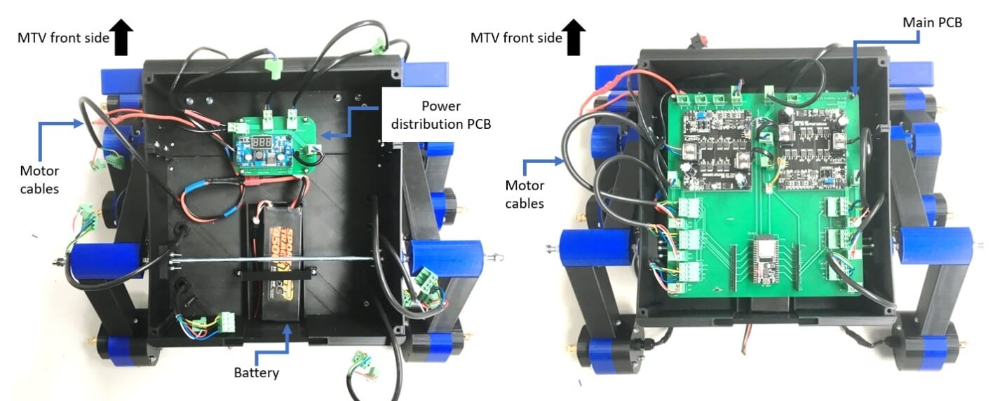

메인 PCB가 제자리에 놓이면, 모터 연결 케이블은 짧게 자르고 2핀, 5.08mm 피치 나사 단자를 사용하여 메인 보드에 연결합니다. 그 다음은 조명 연결입니다. 마지막으로 전원 배분 PCB의 12V 및 5V 전압 연결이 MTV에 연결됩니다.

<table>
    <thead>
        <tr>
            <th>PCB</th>
            <th>PCB에 인쇄된 이름</th>
            <th>사진</th>
            <th>댓글</th>
        </tr>
    </thead>
    <tbody>
        <tr>
            <td rowspan=2>전원 배분 PCB</td>
            <td>
            Mount_1 
            Mount_2
            Mount_3
            Mount_4
            </td>
            <td>
 
</td>
            <td>이 M3 타입의 장착 구멍은 전원 배분 PCB를 MTV의 연결 지점에 나사와 너트를 사용하여 연결할 수 있도록 설계되었습니다.</td>
        </tr>
        <tr>
            <td>
            VC_Mount_1 
            VC_Mount_2
            VC_Mount_3
            VC_Mount_4
            </td>
            <td>
 
</td>
            <td>이 M3 타입의 장착 구멍은 전압 변환기를 전원 배분 PCB에 나사와 너트를 사용하여 연결할 수 있도록 설계되었습니다.</td>
        </tr>
        <tr>
            <td rowspan=2>메인 PCB</td>
            <td>
            Mount_1 
            Mount_2
            Mount_3
            Mount_4
            </td>
            <td>
 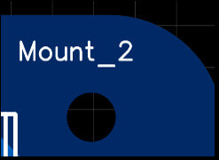
</td>
            <td>이 M3 타입의 장착 구멍은 메인 PCB를 MTV의 연결 지점에 나사와 너트를 사용하여 연결할 수 있도록 설계되었습니다.</td>
        </tr>
        <tr>
            <td>
            MD_Mount_1 
            MD_Mount_2
            MD_Mount_3
            MD_Mount_4
            </td>
            <td>
 
</td>
            <td>이 M3 타입의 장착 구멍은 모터 드라이버를 메인 PCB에 나사와 너트를 사용하여 연결할 수 있도록 설계되었습니다.</td>
        </tr>
    </tbody>
</table>

#### II.3.4. MTV 지붕 케이블 조립

메인 PCB가 부착된 후, MTV의 지붕/덮개에 있는 스위치와 디스플레이는 스플라이싱 커넥터를 사용하여 연결되었습니다. 또한, ESP 32의 마이크로 USB 프로그램 포트는 "왼쪽 각도 90도 마이크로 USB 마운트 연장 케이블 (수♂->암♀)"로 연결되었습니다. 패널 마운트 USB 연장 케이블의 암 단자는 MTV의 덮개에 연결되었습니다. 이렇게 하면 사용자가 덮개를 제거하지 않고도 USB 케이블을 꽂을 수 있어요! 😊

  

### II.4. 안전 주의사항

*MTV는 기계 및 전자 장치 조립에 대해 중급 이상 수준의 경험이 있는 사람들에 의해 조립될 것으로 가정합니다. 로봇을 조립하고 조작하는 동안 자신의 안전에 유의하세요. **Ivy Tech LTD**와 **Intel Deutschland GmbH**는 사용자의 부주의로 인해 발생한 사고에 대한 책임을 지지 않습니다.*

- 조립 전에 매뉴얼을 꼼꼼히 읽어보세요.
- 3D 프린팅된 부품의 날카로운 가장자리에 주의하세요.
- 로봇 작동 중에는 안전 거리를 유지하세요.
- 로봇 관절과 바퀴 사이에 손가락이 끼지 않도록 조심하세요.
- 로봇을 직사광선 아래에 두지 마세요.
- 이 제품은 **방수**가 아닙니다. MTV를 비 오는 날이나 물이 있는 환경에서 작동시키는 것은 권장하지 않습니다.
- 로봇을 불이나 열원 근처에서 사용하지 마세요.
- 로봇을 높은 곳에서 떨어뜨리지 마세요.
- 로봇 조립에는 지정된/권장된 도구만 사용하세요.
- 너트, 볼트, 로봇 부품에 과도한 힘을 가하지 마세요.
- 로봇을 높은 곳에서 작동시키지 말고 갑작스런 낙하를 방지하세요.
- Li-Po 배터리를 손상시키거나 물에 넣지 마세요.
- Li-Po 배터리를 다른 전도체와 접촉시키지 않도록 하세요.
- 로봇의 배터리가 방전되었을 경우, 배터리를 로봇에서 꺼내 Li-Po 안전 가방에 넣어 충전하는 것이 좋습니다. 배터리가 완전히 충전되면 아래와 같이 로봇에 다시 장착할 수 있어요.

  

  

## III: 다음

[Arduino 펌웨어](../../firmware/README.ko-KR.md)를 플래시하세요!

