# OpenBot: Multi-Terrain Vehicle (MTV) body

  English |
  <a href="README.zh-CN.md">简体中文</a> |
  <a href="README.de-DE.md">Deutsch</a> |
  <a href="README.fr-FR.md">Français</a> |
  <a href="README.es-ES.md">Español</a>

We here propose an all-terrain alternative to the original [OpenBot](https://www.openbot.org/) vehicle. Developed in collaboration with **Ivy Tech LTD**, the Multi-Terrain Vehicle (MTV) is also based on inexpensive and easily printable components. The MTV is inspired by several exploration vehicle concepts developed over the past decades for lunar and Martian exploration. The MTV is designed around a set of 6 actuated wheels, organized in a Rocker-Bogie configuration. Unlike most lunar or Martian rovers, the wheels cannot rotate radially. The vehicle therefore operates in the same way as a tank, which makes manual control rather intuitive.

  

## I. 3D printing

You will need to print the following parts in order to build your OpenBot MTV.

  

<table>
    <thead>
        <tr>
            <th>ID </th>
            <th>Group</th>
            <th>Item Name</th>
            <th>Quantity</th>
            <th>Picture (not to scale)</th>
            <th>Material</th>
            <th>Duration</th>
            <th>Cost</th>
        </tr>
    </thead>
    <tbody>
        <tr>
            <td>A1</td>
            <td rowspan=3>Motor assembly</td>
            <td>Motor Enclosure Top   (<a href="cad/MotorAssembly/MotorEnclosure_Top.stl">STL</a>, <a href="cad/MotorAssembly/MotorEnclosure_Top.step">STEP</a>) </td>
            <td>6</td>
            <td>
 
</td>
            <td rowspan=2>498g</td>
            <td rowspan=2>36h</td>
            <td rowspan=2>€23.51</td>
        </tr>
        <tr>
            <td>A2</td>
            <td>Motor Enclousre Bottom   (<a href="cad/MotorAssembly/MotorEnclosure_Bottom.stl">STL</a>, <a href="cad/MotorAssembly/MotorEnclosure_Bottom.step">STEP</a>) </td>
            <td>6</td>
            <td>
 
</td>
        </tr>
        <tr>
            <td>A3</td>
            <td>Motor Bracket   (<a href="cad/MotorAssembly/Motor_Bracket.stl">STL</a>, <a href="cad/MotorAssembly/Motor_Bracket.step">STEP</a>) </td>
            <td>6</td>
            <td>
 
</td>
            <td>251g</td>
            <td>17.5h</td>
            <td>€11.98</td>
        </tr>
        <tr>
            <td>A4</td>
            <td rowspan=4>Joints</td>
            <td>90 deg Joint   (<a href="cad/Joints/90deg_Joint.stl">STL</a>, <a href="cad/Joints/90deg_Joint.step">STEP</a>) </td>
            <td>2</td>
            <td>
 
</td>
            <td rowspan=4>228g</td>
            <td rowspan=4>20.5h</td>
            <td rowspan=4>€15.05</td>
        </tr>
        <tr>
            <td>A5</td>
            <td>100 deg Joint   (<a href="cad/Joints/100deg_Joint.stl">STL</a>, <a href="cad/Joints/100deg_Joint.step">STEP</a>) </td>
            <td>1</td>
            <td>
 
</td>
        </tr>
        <tr>
            <td>A6</td>
            <td>100 deg Joint Mirror   (<a href="cad/Joints/100deg_Joint_Mirror.stl">STL</a>, <a href="cad/Joints/100deg_Joint_Mirror.step">STEP</a>) </td>
            <td>1</td>
            <td>
 
</td>
        </tr>
        <tr>
            <td>A7</td>
            <td>End Joint   (<a href="cad/Joints/End_Joint.stl">STL</a>, <a href="cad/Joints/End_Joint.step">STEP</a>) </td>
            <td>2</td>
            <td>
 
</td>
        </tr>
        <tr>
            <td>A8</td>
            <td rowspan=3>Legs</td>
            <td>Front Leg   (<a href="cad/Legs/Front_Leg.stl">STL</a>, <a href="cad/Legs/Front_Leg.step">STEP</a>) </td>
            <td>4</td>
            <td>
 
</td>
            <td rowspan=3>317g</td>
            <td rowspan=3>22.5h</td>
            <td rowspan=3>€14.97</td>
        </tr>
        <tr>
            <td>A9</td>
            <td>Mid Leg   (<a href="cad/Legs/Mid_Leg.stl">STL</a>, <a href="cad/Legs/Mid_Leg.step">STEP</a>) </td>
            <td>2</td>
            <td>
 
</td>
        </tr>
        <tr>
            <td>A10</td>
            <td>Rear Leg   (<a href="cad/Legs/Rear_Leg.stl">STL</a>, <a href="cad/Legs/Rear_Leg.step">STEP</a>) </td>
            <td>2</td>
            <td>
 
</td>
        </tr>
        <tr>
            <td>A11</td>
            <td>Bearing Cover</td>
            <td>Bearing Cover   (<a href="cad/BearingCover/BearingCover.stl">STL</a>, <a href="cad/BearingCover/BearingCover.step">STEP</a>) </td>
            <td>4</td>
            <td>
 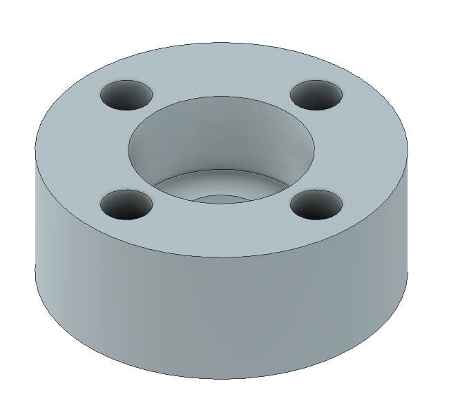
</td>
            <td>13g</td>
            <td>1.5h</td>
            <td>€0.60</td>
        </tr>
        <tr>
            <td>A12</td>
            <td>Phone Mount Platform</td>
            <td>Phone Mount Platform   (<a href="cad/PhoneMount/Phone_Mount.stl">STL</a>, <a href="cad/PhoneMount/Phone_Mount.step">STEP</a>) </td>
            <td>1</td>
            <td>
 
</td>
            <td>19g</td>
            <td>2h</td>
            <td>€0.91</td>
        </tr>
        <tr>
            <td>A13</td>
            <td rowspan=4>Front Buffer</td>
            <td>Name Front   (<a href="cad/Buffer/Name_Front.stl">STL</a>, <a href="cad/Buffer/Name_Front.step">STEP</a>) </td>
            <td>1</td>
            <td>
 
</td>
            <td rowspan=4>228g</td>
            <td rowspan=4>20.5h</td>
            <td rowspan=4>€15.04</td>
        </tr>
        <tr>
            <td>A14</td>
            <td>Name Back   (<a href="cad/Buffer/Name_Back.stl">STL</a>, <a href="cad/Buffer/Name_Back.step">STEP</a>) </td>
            <td>1</td>
            <td>
 
</td>
        </tr>
        <tr>
            <td>A15</td>
            <td>Buffer Left   (<a href="cad/Buffer/Buffer_Left.stl">STL</a>, <a href="cad/Buffer/Buffer_Left.step">STEP</a>) </td>
            <td>1</td>
            <td>
 
</td>
        </tr>
        <tr>
            <td>A16</td>
            <td>Buffer Right   (<a href="cad/Buffer/Buffer_Right.stl">STL</a>, <a href="cad/Buffer/Buffer_Right.step">STEP</a>) </td>
            <td>1</td>
            <td>
 
</td>
        </tr>
        <tr>
            <td>A17</td>
            <td rowspan=8>Compartment </td>
            <td>Compartment Rear   (<a href="cad/Compartment/Compartment_Rear.stl">STL</a>, <a href="cad/Compartment/Compartment_Rear.step">STEP</a>) </td>
            <td>1</td>
            <td>
 
</td>
            <td>413g</td>
            <td>32h</td>
            <td>€22.75</td>
        </tr>
        <tr>
            <td>A18</td>
            <td>Compartment Front   (<a href="cad/Compartment/Compartment_Front.stl">STL</a>, <a href="cad/Compartment/Compartment_Front.step">STEP</a>) </td>
            <td>1</td>
            <td>
 
</td>
            <td>316g</td>
            <td>22h</td>
            <td>€17.42</td>
        </tr>
        <tr>
            <td>A19</td>
            <td>Roof Front   (<a href="cad/Compartment/Roof_Front.stl">STL</a>, <a href="cad/Compartment/Roof_Front.step">STEP</a>) </td>
            <td>1</td>
            <td>
 
</td>
            <td>58g</td>
            <td>5.5h</td>
            <td>€3.19</td>
        </tr>
        <tr>
            <td>A20</td>
            <td>Roof Rear   (<a href="cad/Compartment/Roof_Rear.stl">STL</a>, <a href="cad/Compartment/Roof_Rear.step">STEP</a>) </td>
            <td>1</td>
            <td>
 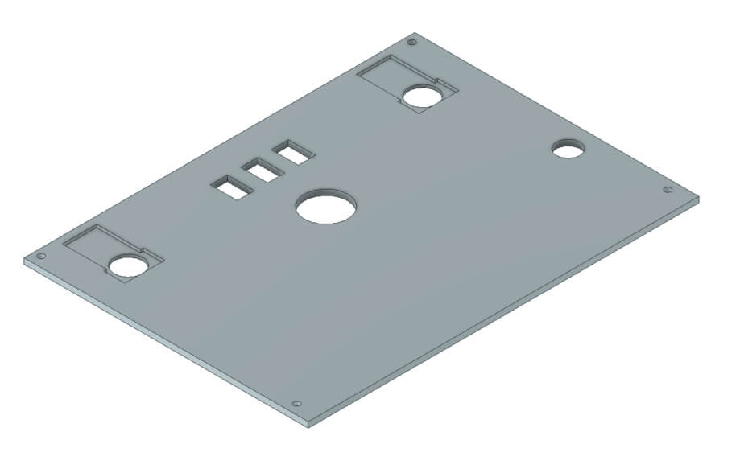
</td>
            <td>140g</td>
            <td>13.5h</td>
            <td>€7.73</td>
        </tr>
        <tr>
            <td>A21ab</td>
            <td>Battery Mount P1 & P2   (<a href="cad/Compartment/Compartment_Battery_Mount-P1.stl">STL</a>, <a href="cad/Compartment/Compartment_Battery_Mount-P1.step">STEP</a>)
              (<a href="cad/Compartment/Compartment_Battery_Mount-P2.stl">STL</a>, <a href="cad/Compartment/Compartment_Battery_Mount-P2.step">STEP</a>) </td>
            <td>1</td>
            <td>
 
</td>
            <td>15g</td>
            <td>1.5h</td>
            <td>€0.80</td>
        </tr>
        <tr>
            <td>A22</td>
            <td>Light End Caps   (<a href="cad/Compartment/Headlight_Rear.stl">STL</a>, <a href="cad/Compartment/Headlight_Rear.step">STEP</a>)</td>
            <td>4</td>
            <td>
 
</td>
            <td rowspan=3>47g</td>
            <td rowspan=3>4h</td>
            <td rowspan=3>€2.58</td>
        </tr>
        <tr>
            <td>A23</td>
            <td>Head Light   (<a href="cad/Compartment/Headlight_Front.stl">STL</a>, <a href="cad/Compartment/Headlight_Front.step">STEP</a>)</td>
            <td>4</td>
            <td>
 
</td>
        </tr>
        <tr>
            <td>A24</td>
            <td>Battery Access Lid   (<a href="cad/Compartment/Compartment_Door.stl">STL</a>, <a href="cad/Compartment/Compartment_Door.step">STEP</a>)</td>
            <td>1</td>
            <td>
 
</td>
        </tr>
    </tbody>
</table>

For the above parts, your build plate needs to be at least 240mmx150mm.

On an Ultimaker S5, we achieved good results with the following settings:

- layer height: 0.2mm
- wall thickness: 1.5mm
- infill density: 20%
- infill pattern: grid
- print speed 80 mm/s
- no support

## II. Electro-Mechanical Assembly

### II.1. Bill of materials

Our robot body relies on readily available hobby electronics. We provide links for Germany (EU) and the United States (US) with fast shipping. If you have the patience to wait a bit longer, you can also get the components a lot cheaper from AliExpress (AE). You will need the following components.

<table>
    <thead>
        <tr>
            <th>ID </th>
            <th>Description</th>
            <th>Picture</th>
            <th>Supplier</th>
            <th>Unit Price</th>
            <th>Quantity</th>
            <th>Cost</th>
        </tr>
    </thead>
    <tbody>
        <tr>
            <td>O1</td>
            <td>JGB37-520 DC-Motor with encoders - 12V | 178RPM </td>
            <td>
 
</td>
            <td>  <a href="https://de.aliexpress.com/item/4001339371886.html?gatewayAdapt=glo2deu&spm=a2g0s.9042311.0.0.1fe54c4dR1WTdj/">AE</a></td>
            <td>$8.93 | €8.12</td>
            <td>6</td>
            <td>$53.58 | €48.72</td>
        </tr>
        <tr>
            <td>O2</td>
            <td>2.8" Talon Tires (2 pcs)</td>
            <td>
 
</td>
            <td> <a href="https://www.robotshop.com/en/28-talon-tires-pair.html">US</a> | <a href="https://www.robotshop.com/eu/en/28-talon-tires-pair.html">EU</a></td>
            <td>$26.95 | €23.06</td>
            <td>6</td>
            <td>$161.7 | €138.36</td>
        </tr>
        <tr>
            <td>O3</td>
            <td>7-Core Cable 0.5 mm² (5m)</td>
            <td>
 
</td>
          <td>  <a href="https://www.amazon.com/Heavy-Gauge-Conductor-Trailer-Cable/dp/B01N3Q0YGS/ref=sr_1_16?crid=3SK9Y7DSOR0OL&keywords=caravan+cable+7+wire&qid=1649847035&sprefix=carava+cable+7+wire%2Caps%2C190&sr=8-16">US</a> | <a href="https://www.amazon.de/-/en/1119757-Classic-Control-Protective-Conductor/dp/B08CY2WPM4/ref=sr_1_5?crid=1QGOB5LF0GZYO&keywords=7+adriges+kabel+0%2C5mm%C2%B2&qid=1644173962&sprefix=7+core+cable+0.5mm+%2Caps%2C289&sr=8-5">EU</a></td>
            <td> $25.53 | €20.61</td>
            <td>0.25</td>
            <td>$6.38 | €5.15</td>
        </tr>
        <tr>
            <td>O4</td>
            <td>D-Line cable duct. 20mm x 10mm x 1m (2 pcs)</td>
            <td>
 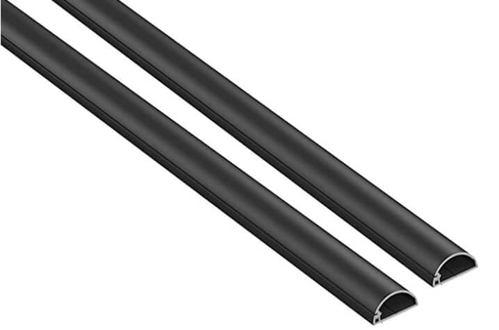
</td>
            <td>  <a href="https://www.amazon.com/D-Line-Raceway-1D3015W-Electrical-Paintable/dp/B07KFNYR7G/ref=sr_1_10?crid=137L39X59R8AQ&keywords=D-Line%2Bcable%2Bduct&qid=1649851731&refinements=p_36%3A1253503011&rnid=386442011&s=electronics&sprefix=d-line%2Bcable%2Bduct%2Caps%2C409&sr=1-10&th=1">US</a> | <a href="https://www.amazon.de/-/en/D-Line-Micro-Cable-Management-Strip-White/dp/B082WVQXT5/ref=sr_1_fkmr0_1?crid=3CBV1RRPR6K9B&keywords=d-line%2Bmicro%2B%2Bkabelkanal%2B(2%2Bmeter)%2C%2Bselbstklebende%2Bkabelabdeckungen%2C%2Belektrische%2Bkabelf%C3%BChrung%2C%2Bbeliebte%2Bkabelmanagementl%C3%B6sung%2C%2B20%2Bmm%2B(b)%2Bx%2B10%2Bmm%2B(h)%2B-%2B2%2Bx%2B1%2Bm%2Bl%C3%A4nge%2B-%2Bschwarz&qid=1644149200&sprefix=d-line%2Bmicro%2B%2Bcable%2Btrunking%2B2-meter%2Bself-adhesive%2Bcable%2Bcovers%2Belectrical%2Bcable%2Btidy%2Bpopular%2Bcable%2Bmanagement%2Bsolution%2B20mm%2Bw%2Bx%2B10mm%2Bh%2B-%2B2%2Bx%2B1%2Bmeter%2Blengths%2B-%2Bblack%2B%2Caps%2C381&sr=8-1-fkmr0&th=1">EU</a></td>
            <td>$12.00 | €9.99</td>
            <td>1</td>
            <td>$12.00 | €9.99</td>
        </tr>
        <tr>
            <td>O5</td>
            <td>PG7 Cable Gland 3~6.5mm (50 pcs)</td>
            <td>
 
</td>
          <td>  <a href="https://www.amazon.com/ARTGEAR-Waterproof-Adjustable-Connector-Protector/dp/B07JH2LPZF/ref=sr_1_11?crid=1UH8URDCXAHJJ&keywords=Cable+Gland+Set+Plastic+Cable+Glands+Adjustable+PG7+Waterproof+Closure+Cable+Screw+Connection+for+Diameter+3.5+mm+-+6.5+mm+Black+Pack+of+50&qid=1649852081&sprefix=cable+gland+set+plastic+cable+glands+adjustable+pg7+waterproof+closure+cable+screw+connection+for+diameter+3.5+mm+-+6.5+mm+black+pack+of+50+%2Caps%2C243&sr=8-11"> US </a> | <a href="https://www.amazon.de/-/en/Plastic-Adjustable-Waterproof-Connection-Diameter/dp/B08Q458H3N/ref=sr_1_fkmr0_1?crid=1H5VCAQKXD2XZ&keywords=pg7+kabelverschraubung%2C+50+st%C3%BCck%2C+3-6%2C5+mm%2C+verstellbar%2C+wasserdicht%2C+kabelverschraubungen%2C+verbindungsst%C3%BCck+mit+dichtungen&qid=1644149525&sprefix=pg7+cable+gland+50+pack+3+6.5mm+adjustable+waterproof+cable+glands+joints+connector+with+gaskets+%2Caps%2C80&sr=8-1-fkmr0">EU</a></td>
            <td>$8.99 | €9.99</td>
            <td>0.5</td>
            <td>$4.49 | €4.99</td>
        </tr>
        <tr>
            <td>O6</td>
            <td>MR126ZZ Ball Bearings 6x12x4mm (4 pcs)</td>
            <td>
 
</td>
            <td>  <a href="https://de.aliexpress.com/item/1005001697683913.html?gatewayAdapt=glo2deu&spm=a2g0s.9042311.0.0.1fe54c4dR1WTdj">AE</a></td>
            <td>$5.52 | €3.45</td>
            <td>1</td>
            <td>$5.52 | €3.45</td>
        </tr>
        <tr>
            <td>O7</td>
            <td>INJORA 90mm RC Car Spring Shock Absorber (2pcs)</td>
            <td>
 
</td>
            <td>  <a href="https://de.aliexpress.com/item/4000309686709.html?gatewayAdapt=glo2deu&spm=a2g0o.productlist.0.0.17b17ca7oMXyhJ&algo_pvid=c7d8ba55-28b2-4d27-97e4-f338994958f7&algo_exp_id=c7d8ba55-28b2-4d27-97e4-f338994958f7-14&pdp_ext_f=%7B%22sku_id%22%3A%2210000001286270094%22%7D&pdp_pi=-1%3B8.3%3B-1%3B-1%40salePrice%3BUSD%3Bsearch-mainSearch">AE</a></td>
            <td>$8.30 | €7.99</td>
            <td>1</td>
            <td>$8.30 | €7.99</td>
        </tr>
        <tr>
            <td>O8</td>
            <td>AXSPEED RC Car LED 4.2v-6v White 17mm (2 pcs)</td>
            <td>
 
</td>
            <td>  <a href="https://www.aliexpress.com/item/1005003306484898.html?spm=a2g0s.9042311.0.0.d4954c4dpsjiiC">AE</a></td>
            <td>$7.43 | €6.87</td>
            <td>1</td>
            <td>$7.43 | €6.87</td>
        </tr>
        <tr>
            <td>O9</td>
            <td>AXSPEED RC Car LED 4.2v-6v Red 17mm (2 pcs)</td>
            <td>
 
</td>
            <td>  <a href="https://www.aliexpress.com/item/1005003306484898.html?spm=a2g0s.9042311.0.0.d4954c4dpsjiiC">AE</a></td>
            <td>$7.43 | €6.87</td>
            <td>1</td>
            <td>$7.43 | €6.87</td>
        </tr>
        <tr>
            <td>O10</td>
            <td>Vibration Isolators M3 x 8mm Studs (4 pcs)</td>
            <td>
 
</td>
            <td>  <a href="https://www.amazon.com/MroMax-Rubber-Vibration-Isolator-Absorber/dp/B07Z76J5N5/ref=sr_1_5?crid=2LSR8ZMHRIL2O&keywords=m3+rubber+mount+shock+absorbers&qid=1649862366&sprefix=keesin+m3+rubber+mounts+shock+absorbers+%2Caps%2C362&sr=8-5">US</a> | <a href="https://www.amazon.de/-/en/gp/product/B076SSPHP6/ref=ppx_yo_dt_b_asin_title_o03_s01?ie=UTF8&psc=1">EU</a></td>
            <td>$8.09 | €9.49</td>
            <td>1</td>
            <td>$8.09 | €9.49</td>
        </tr>
        <tr>
            <td>O11</td>
            <td>Zeadio Universal Smartphone holder</td>
            <td>
 
</td>
            <td> <a href="https://www.amazon.com/SharingMoment-Smartphone-Horizontal-Rotatable-Adjustable/dp/B07S8TTH34/ref=sr_1_4?crid=X7XQ9LC110JJ&keywords=Zeadio+Smartphone+Tripod+Adapter%2C+Mobile+Phone+Holder&qid=1649862548&refinements=p_36%3A2491155011&rnid=2491154011&s=wireless&sprefix=zeadio+smartphone+tripod+adapter%2C+mobile+phone+holder+%2Caps%2C577&sr=1-4">US</a> | <a href="https://www.amazon.de/-/en/Zeadio-Smartphone-Tripod-Adapter-Mobile/dp/B06XDYJNSR/ref=sr_1_8?crid=2ZH6V545D45E3&keywords=zeadio%2Buniversal%2Bsmartphone%2Bhalterung&qid=1644150427&sprefix=zeadio%2Buniversal%2Bsmartphone%2Bholder%2Caps%2C104&sr=8-8&th=1">EU</a></td>
            <td>$11.99 | €10.99</td>
            <td>1</td>
            <td>$11.99 | €10.99</td>
        </tr>
        <tr>
            <td>O12</td>
            <td>DC 12-24 V Car Voltmeter</td>
            <td>
 
</td>
            <td>  <a href="https://www.amazon.com/Nilight-Voltmeter-Waterproof-VoltVolt-Motorcycle/dp/B06ZZJ48VQ/ref=sr_1_fkmr1_2?crid=376857DCCJICB&keywords=mini+led+digital+voltmeter+batterietester+12+volt+%2F+24+volt+voltmeter&qid=1649862763&sprefix=mini+led+digital+voltmeter+batterietester+12+volt+%2F+24+volt+voltmeter%2Caps%2C404&sr=8-2-fkmr1">US</a> | <a href="https://www.amazon.de/-/en/Intckwan-Digital-Voltmeter-Waterproof-Motorcycle/dp/B09T5XRYM9/ref=sr_1_5?crid=1GPFOX9O2VX85&keywords=mini+led+digital+voltmeter+batterietester+12+volt+%2F+24+volt+voltmeter&qid=1649862700&sprefix=mini+led+digital+voltmeter+battery+tester+12+volt+%2F+24+volt+voltmeter%2Caps%2C91&sr=8-5">EU</a></td>
            <td>$10.99 | €11.88</td>
            <td>1</td>
            <td>$10.99 | €11.88</td>
        </tr>
        <tr>
            <td>O13</td>
            <td>Mini Rocker Switch (20 pcs)</td>
            <td>
 
</td>
            <td>  <a href="https://www.amazon.com/DaierTek-250VAC-Rocker-KCD1-101-Plastic/dp/B07S2QJKTX/ref=sr_1_4?keywords=RUNCCI-YUN+20Pcs+Mini+Rocker+Switch&qid=1650638471&sr=8-4">US</a> | <a href="https://www.amazon.de/-/en/RUNCCI-Rocker-Switches-Household-Appliances/dp/B07MW92CW8/ref=sr_1_2?keywords=RUNCCI-YUN+20+St%C3%BCck+Mini-Wippschalter&qid=1650638352&sr=8-2">EU</a></td>
            <td>$15.98 | €9.44</td>
            <td>0.15</td>
            <td>$2.4 | €1.42</td>
        </tr>
        <tr>
            <td>O14</td>
            <td>Duttek Micro USB Panel Mount Cable</td>
            <td>
 
</td>
            <td>  <a href="https://www.amazon.com/Duttek-Angled-Extension-Motorcycle-Dashboard/dp/B08RSGYV1S/ref=sr_1_1?keywords=Duttek+90+Degree+Micro+USB+Panel+Mount+Cable+Micro+USB+Mount+Extension+Cable+Male+to+Female+for+Car+Boat+Motorcycle+Truck+Dashboard+30cm&qid=1650638585&sr=8-1">US</a> | <a href="https://www.amazon.de/-/en/Duttek-Degree-Extension-Motorcycle-Dashboard/dp/B08RSGYV1S/ref=psdc_1365661031_t1_B07ZCZ8NL1">EU</a></td>
            <td>$10.68 | €11.44</td>
            <td>1</td>
            <td>$10.68 | €11.44</td>
        </tr>
        <tr>
            <td>O15</td>
            <td>Custom PCB</td>
            <td>
 
</td>
            <td>  <a href="https://www.eurocircuits.de/">US</a> | <a href="https://www.eurocircuits.de/">EU</a></td>
            <td>$10.00 | €10.00</td>
            <td>1</td>
            <td>$10.00 | €10.00</td>
        </tr>
        <tr>
            <td>O16</td>
            <td>Cytron 30A 5-30V Single Brushed DC Motor Driver</td>
            <td>
 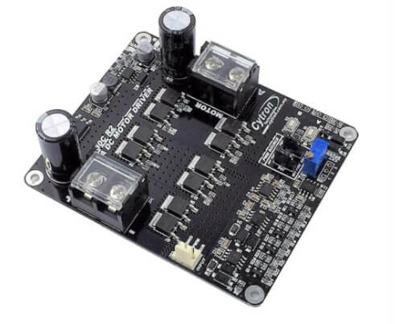
</td>
            <td>  <a href="https://www.robotshop.com/en/cytron-30a-5-30v-single-brushed-dc-motor-driver.html">US</a> | <a href="https://www.robotshop.com/eu/en/cytron-30a-5-30v-single-brushed-dc-motor-driver.html">EU </a></td>
            <td>$34.38 | €37.15</td>
            <td>2</td>
            <td>$68.76 | €74.30</td>
        </tr>
        <tr>
            <td>O17</td>
            <td>LM2596S DC-DC Converter 12V-36V to 5V | 2A (4 pcs)</td>
            <td>
 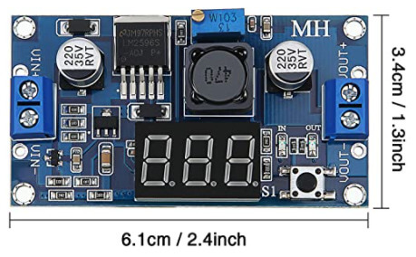
</td>
            <td>  <a href="https://www.amazon.com/Adjustable-Converter-Step-Down-Regulator-Stabilizer/dp/B081N6WWJS/ref=sr_1_3?keywords=4+pieces+adjustable+LM2596S+DC-DC+down+converter&qid=1650638822&sr=8-3">US</a> | <a href="https://www.amazon.de/-/en/adjustable-converter-regulator-stabiliser-voltmeter/dp/B081N6WWJS/ref=pd_sbs_6/262-3535180-9041508?pd_rd_w=m3EIw&pf_rd_p=7cf49d79-ae26-401a-94b7-1dec7a725ba4&pf_rd_r=KEN7A8F4YCHEBXB3ZK9B&pd_rd_r=b6829a4e-476a-48dd-8821-a64b9945da1d&pd_rd_wg=m3HQp&pd_rd_i=B081N6WWJS&psc=1">EU</a></td>
            <td>$15.99 | €16.99</td>
            <td>0.25</td>
            <td>$3.99 | €4.25</td>
        </tr>
        <tr>
            <td>O18</td>
            <td>4500mAh 3S-25C 11.1V LiPo Battery in Hard Case</td>
            <td>
 
</td>
            <td>  <a href="https://www.amazon.com/HRB-50C-100C-Quadcopter-Helicopter-Airplane/dp/B06XNTHQRZ?ref_=ast_sto_dp&th=1&psc=1">US</a> | <a href="https://www.amazon.de/-/en/Roaring-Battery-Deans-Connection-Aeroplane/dp/B08Z3JYK1X/ref=sr_1_5?crid=3TW2SFFYW1BQY&keywords=4500%2Bmah%2B3s%2B11%2C1v%2B55c%2Blipo&qid=1644164015&sprefix=4500mah%2B3s%2B11.1v%2B55c%2Blipo%2Caps%2C82&sr=8-5&th=1">EU</a></td>
            <td>$46.99 | €29.97</td>
            <td>1</td>
            <td>$46.99 | €29.97</td>
        </tr>
        <tr>
            <td>O19</td>
            <td>AITRIP ESP32-DevKitC Development Board (3 pcs)</td>
            <td>
 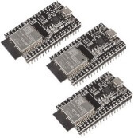
</td>
            <td>  <a href="https://www.amazon.com/Development-Microcontroller-Integrated-Antenna-Amplifiers/dp/B09GK74F7N/ref=sr_1_2?crid=2SK0PFZJXONGJ&keywords=3pcs+ESP32+DevKitC+Core&qid=1650638989&sprefix=3pcs+esp32+devkitc+core%2Caps%2C162&sr=8-2">US</a> | <a href="https://www.amazon.de/-/en/DevKitC-Development-ESP32-WROOM-32D-Bluetooth-Arduino/dp/B09LS6SCF7/ref=sr_1_2?crid=8EUG1EBFJ9AX&keywords=aitrip+esp32-devkitc&qid=1644164236&sprefix=aitrip+esp32-devkitc+core%2Caps%2C192&sr=8-2">EU</a></td>
            <td>$19.99 | €21.00</td>
            <td>0.33</td>
            <td>$6.66 | €7.00</td>
        </tr>
        <tr>
            <td>O20</td>
            <td>5.08mm PCB Terminal Block (11 x 2 Pin + 11 x 4 Pin)</td>
            <td>
 
</td>
            <td>  <a href="https://www.amazon.com/LuoQiuFa10-4-Pin-5-08mm-Female-Terminal/dp/B093DNBV5D/ref=sr_1_2?crid=1W2RRUJFR1XY2&keywords=Cococity+22+Pairs+5.08+mm+2+Pins+PCB+Screw+Terminal+Connector+Pluggable+%2B+2+Pins+Plug+in+Screw+PCB+Terminal+Block+Plug+Right+Angle+%282+Pin+11+Pairs+4+Pin+11+Pairs%29+300V+10A+%28Green%29&qid=1650639050&sprefix=3pcs+esp32+devkitc+core%2Caps%2C186&sr=8-2">US</a> | <a href="https://www.amazon.de/-/en/Cococity-Pairs-Terminal-Connector-Pluggable/dp/B083GNB8BY/ref=sr_1_7?crid=SJKL0W8ANGUI&keywords=4-polige+leiterplatten-schraubklemmleiste%2C+5%2C08+mm&qid=1644165018&sprefix=4+pin+5.08mm+pitch+pcb+screw+terminal+block%2Caps%2C82&sr=8-7">EU</a></td>
            <td>$7.99 | €11.99</td>
            <td>1</td>
            <td>$7.99 | €11.99</td>
        </tr>
        <tr>
            <td>O21</td>
            <td>M6 x 1m (1000mm) Zinc Plated Threaded Rod/Bar</td>
            <td>
 
</td>
            <td>  <a href="https://www.amazon.com/Threaded-Plated-Thread-Length-Threads/dp/B00G3QM076/ref=sr_1_18?crid=1MBLSICIHE3FX&keywords=M6+x+1m+%281000mm%29+Zinc+Plated+Threaded+Rod%2FBar&qid=1650639302&sprefix=m6+x+1m+1000mm+zinc+plated+threaded+rod%2Fbar%2Caps%2C306&sr=8-18">US</a> | <a href="https://www.amazon.de/-/en/Threaded-quality-galvanised-standard-parts/dp/B07X3LX6RX/ref=sr_1_21?crid=3UFFWWONRN5FQ&keywords=gewindestange%2C%2Bverzinkt%2C%2Bm6%2Bx%2B1%2Bm%2B(1000%2Bmm)%2C%2B10%2Bst%C3%BCck&qid=1644165235&sprefix=pack%2Bof%2B10%2Bm6%2Bx%2B1m%2B1000mm%2Bzinc%2Bplated%2Bthreaded%2Brod%2Fbar%2Caps%2C170&sr=8-21&th=1">EU</a></td>
            <td>$22.73 | €4.31</td>
            <td>1</td>
            <td>$22.73 | €4.31</td>
        </tr>
        <tr>
            <td>O23</td>
            <td>M4 x 50mm screws (30 pcs)</td>
            <td>
 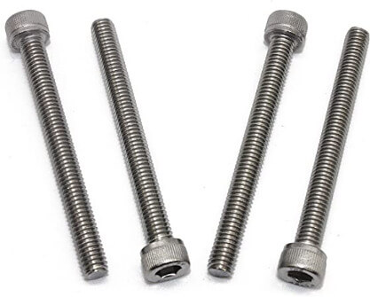
</td>
            <td>  <a href="https://www.amazon.com/MroMax-M4x50mm-Machine-Stainless-Phillips/dp/B07ZPSWW24/ref=sr_1_2?crid=6FFC31FUFZC&keywords=M4+x+50mm+screws+30pcs&qid=1650639360&sprefix=m4+x+50mm+screws+30pc%2Caps%2C175&sr=8-2">US</a> | <a href="https://www.amazon.de/-/en/M4-50-stainless-cylinder-DIN912/dp/B07YW6Q5VT/ref=sr_1_10?crid=24VLWXHS6RUKJ&keywords=m4x50%2Bmm%2Bsechskant&qid=1644166982&sprefix=m4%2Bx%2B50mm%2Bhex%2B%2Caps%2C94&sr=8-10&th=1">EU</a></td>
            <td>$11.39 | €9.83</td>
            <td>1</td>
            <td>$11.39 | €9.83</td>
        </tr>
        <tr>
            <td>O24</td>
            <td>M4 x 40mm screws (30 pcs)</td>
            <td>
 
</td>
            <td>  <a href="https://www.amazon.com/Uxcell-a15111200ux1682-Cabinet-Handles-Phillips/dp/B019ZESG9I/ref=sr_1_5?crid=3FFNS1NMT4XPE&keywords=m4+x+40mm+screws+30+pcs&qid=1650639393&sprefix=m4+x+40mm+screws+30pcs%2Caps%2C163&sr=8-5">US</a> | <a href="https://www.amazon.de/-/en/M4-50-stainless-cylinder-DIN912/dp/B07YWDJS99/ref=sr_1_10?crid=24VLWXHS6RUKJ&keywords=m4x50%2Bmm%2Bsechskant&qid=1644166982&sprefix=m4%2Bx%2B50mm%2Bhex%2B%2Caps%2C94&sr=8-10&th=1">EU</a></td>
            <td>$10.56 | €9.13</td>
            <td>1</td>
            <td>$10.56 | €9.13</td>
        </tr>
        <tr>
            <td>O25</td>
            <td>M3 screws and nuts sets (440 pcs)</td>
            <td>
 
</td>
            <td>  <a href="https://www.amazon.com/Shapenty-100PCS-Stainless-Female-Fastener/dp/B071NLDW56/ref=sr_1_9?crid=I0ZQA6TBI3N9&keywords=M3+screws+and+nuts+sets+%28440+pcs%29&qid=1650639424&sprefix=m3+screws+and+nuts+sets+440+pcs+%2Caps%2C257&sr=8-9">US</a> | <a href="https://www.amazon.de/-/en/pieces-screws-stainless-hexagon-socket/dp/B093GNHWKR/ref=sr_1_3?crid=36NK6MT1K8LSC&keywords=satz+m3+innensechskant&qid=1644166735&s=diy&sprefix=set+m3+hex+socket%2Cdiy%2C87&sr=1-3">EU</a></td>
            <td>$6.49 | €11.99</td>
            <td>1</td>
            <td>$6.49 | €11.99</td>
        </tr>
        <tr>
            <td>O26</td>
            <td>M4 x 120mm screws (15 pcs)</td>
            <td>
 
</td>
            <td> <a href="https://www.amazon.com/XunLiu-Socket-Screws-Wrench-Knurled/dp/B07CHJ7ZPP/ref=sr_1_38?crid=1U3GJUWD14XQB&keywords=screw%2BM4%2Bx%2B120mm&qid=1650753655&sprefix=screw%2Bm4%2Bx%2B120mm%2Caps%2C167&sr=8-38&th=1">US</a> | <a href="https://www.amazon.de/-/en/sourcing-Phillips-Furniture-Hanging-External/dp/B08JYCP7TD/ref=sr_1_64?crid=25999O4GLCN83&keywords=m4+x+120+mm&qid=1644165946&sprefix=m4+x+120mm+socket%2Caps%2C109&sr=8-64">EU</a></td>
            <td>$15.29 | €15.64</td>
            <td>1</td>
            <td>$15.29 | €15.64</td>
        </tr>
        <tr>
            <td>O27</td>
            <td>M6 x 100mm screws (2 pcs)</td>
            <td>
 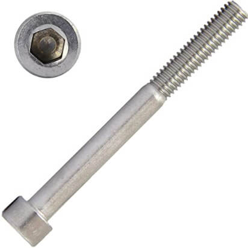
</td>
            <td>  <a href="https://www.amazon.com/MroMax-Machine-Stainless-Phillips-Cabinet/dp/B07YFMN8FP/ref=sr_1_5?crid=3GFYNNIBEO5UA&keywords=M6+x+100mm+screws&qid=1650639588&sprefix=m6+x+100mm+screws+2+pcs+%2Caps%2C161&sr=8-5">US</a> | <a href="https://www.amazon.de/-/en/AG-BOX%C2%AE-Cylinder-Screws-Stainless-Steel/dp/B09N3DNDZK/ref=sr_1_5?crid=1NROTQHUR7F2K&keywords=m6x100+mm&qid=1644171138&sprefix=m6+x+100mm%2Caps%2C90&sr=8-5">EU</a></td>
            <td>$3.84 | €4.18</td>
            <td>1</td>
            <td>$3.84 | €4.18</td>
        </tr>
        <tr>
            <td>O28</td>
            <td>Assorted Nuts (Full and Self Locking) and Washers M3, M4 & M5 (45 pcs)</td>
            <td>
 
</td>
            <td> <a href="https://www.amazon.com/Assortment-AETTL-Stainless-Assorted-Wrenches/dp/B098ND1GW8/ref=sr_1_2?crid=3AFZPJ5SIBJD9&keywords=Assorted+Nuts+%28Full+and+Self+Locking%29+and+Washers+M3%2C+M4+%26+M5+%2845+pcs%29&qid=1650639662&sprefix=assorted+nuts+full+and+self+locking+and+washers+m3%2C+m4+%26+m5+45+pcs+%2Caps%2C226&sr=8-2">US</a> |  <a href="https://www.amazon.de/-/en/Assorted-Locking-Washers-Stainless-Steel/dp/B01CO9S1RI/ref=sr_1_98?crid=P8DDSVM9ZTG1&keywords=m3+m4+muttern+unterlegscheiben&qid=1644172060&sprefix=m3+m4+nuts+washers%2Caps%2C101&sr=8-98">EU</a></td>
            <td>$25.64 | €23.01</td>
            <td>1</td>
            <td>$25.64 | €23.01</td>
        </tr>
        <tr>
            <td>O29</td>
            <td>M6 Nuts/Washers Set (40 pcs)</td>
            <td>
 
</td>
            <td>  <a href="https://www.amazon.com/Stainless-Washer-Machine-Thread-Assortment/dp/B09HNJBX1G/ref=sr_1_3?crid=1N4R1D32PS8W6&keywords=40-Piece+Nuts%2FWashers+Set+for+M6&qid=1650639826&sprefix=40-piece+nuts%2Fwashers+set+for+m6+threaded+rods+a2+stainless+steel%2Caps%2C227&sr=8-3">US</a> | <a href="https://www.amazon.de/-/en/40-Piece-Washers-Threaded-Stainless-Steel/dp/B01G77C0DY/ref=sr_1_31?crid=EUR5CW3K5BLD&keywords=m6+muttern+und+unterlegscheiben&qid=1644172515&refinements=p_36%3A118557031&rnid=118555031&s=diy&sprefix=m6+nuts+and+washers%2Caps%2C87&sr=1-31">EU</a></td>
            <td>$13.99 | €8.99</td>
            <td>1</td>
            <td>€$13.99 | €8.99</td>
        </tr>
      <tr>
            <td>O30</td>
            <td>Stainless Steel Flat and Spring Washers Assortment </td>
            <td>
 
</td>
            <td>  <a href="https://www.amazon.com/Split-Washer-Assortment-Stainless-Silver/dp/B08QN3ZR23/ref=sr_1_35?keywords=Stainless+Steel+Flat+and+Spring+Washers+Assortment+Kit&qid=1650753391&sr=8-35">US</a> | <a href="https://www.amazon.de/-/en/300-pieces-Stainless-Washers-Assortment-M2-M3-M4-M5-M6/dp/B07CQX6NPP/ref=sr_1_15?keywords=m4+federscheibe&qid=1650753193&sr=8-15">EU</a></td>
            <td>$12.49 | €10.38</td>
            <td>1</td>
            <td>€$12.49 | €10.38</td>
        </tr>
    </tbody>
</table>

The total cost of the externally sourced components is estimated to around **500€**, therefore resulting in a total cost of around **600€** by MTV.

### II.2. Mechanical Assembly

#### II.2.1. Overview

This chapter covers the assembly process of the MTV. Note that left and right are the port and starboard sides of the robot and will be used interchangeably in this document. Unless stated otherwise, all bolts are assumed to have flat washers to protect the 3D printed plastic. It should moreover be emphasized that the use of spring washers and nylocs usually allows preventing any loosening of the nuts due to vibrations. 

The assembly process of the MTV can be divided into seven main steps, namely:
1. assembly of the the 6 motor modules
2. assembly of the legs
3. assembly of the chassis
4. assembly of the main compartment 
5. assembly of the vehicle
6. assembly of the power unit, control unit and connection of the different components
7. Testing, programming and use. 

  

#### II.2.2. Assembly of the the motor modules

Each of the motor modules consist of the following parts:

- 1 x 3D-printed <a href="cad/MotorAssembly/MotorEnclosure_Top.stl">Motor Enclosure Top</a> (A1)
- 1 x 3D-printed <a href="cad/MotorAssembly/MotorEnclosure_Bottom.stl">Motor Enclousre Bottom</a> (A2)
- 1 x 3D-printed <a href="cad/MotorAssembly/Motor_Bracket.stl">Motor Bracket</a> (A3)
- 1 x JGB37-520 DC-Motor with encoders and wheel adapter (O1)
- 1 x PG7 Cable Gland (O5)

To assemble a motor module:

1. Start by connecting the control cable provided in the kit (O1) to the motor. It is strongly recommended to secure this connection with a bit of hot glue. 
2. Carefully align the motor fixture pattern with the 3D-printed motor housing (A1) hole pattern. Make sure not to apply any force onto the encoder, to avoid damaging it. Screw the motor to the 3D-printed motor housing (A1), using the screws provided in the kit (O1). 
3. Fix the coupling sleeve from the kit (01) to the motor shaft with the supplied allen key. Keep the nut that secures the wheel to the coupling sleeve safely screwed in the hex hub as you will later need this when attaching the tires (O2) to the vehicle.  
4. Slot in the Motor bracket (A3) over the motor enclosure top (A1). This is a push fit, and may require some careful alignment when sliding. Note that the shoulder of the Motor bracket (as shown in figure below) should be facing towards the side of the motor shaft for a cleaner assembly. Make sure the Motor bracket (A3) has a tight fit with motor enclosure top (A1). Secure the assembly with hot glue or super glue.  
5. Add the cable glands joints (O5) to the motor enclosure bottom (A2) and run the motor wire thought the gland.
6. Carefully slot in the motor enclosure bottom (A2) onto the motor enclosure top (A1) until the motor enclosure bottom (A2) has travelled the full distance. Make sure the Motor bracket (A3) is flush with the motor enclosure top (A1). Take care not to jam the wires against the encoder - the encoder needs to be free to spin. 
7. The motor enclosure top (A2) with the motor bracket (A3) are fastened using M4 x 60mm bolts (O23) and nyloc nuts (O28)

  

  

#### II.2.3. Assembly of the legs

The left leg of the MTV consists of the following parts:

- 1 x 3D-printed <a href="cad/Joints/90deg_Joint.stl">90 deg Joint </a> (A4)
- 1 x 3D-printed <a href="cad/Joints/End_Joint.stl">End Joint  </a> (A7)
- 1 x 3D-printed <a href="cad/Joints/BearingCover.stl">Bearing Cover </a> (A11)
- 1 x 3D-printed <a href="cad/Joints/100deg_Joint.stl">100 deg Joint </a> (A5)
- 2 x 3D-printed <a href="cad/Legs/Front_Leg.stl">Front Leg </a> (A8)
- 1 x 3D-printed <a href="cad/Legs/Mid_Leg.stl">Mid Leg </a> (A9)
- 1 x 3D-printed <a href="cad/Legs/Rear_Leg.stl">Rear Leg </a> (A10) 
- 1 x D-Line cable duct (O4)
- 1 x 7-Core Cable (O3)
- 1 x MR126ZZ Ball Bearing (O6)

The right leg of the MTV consists of the following parts:

- 1 x 3D-printed <a href="cad/Joints/90deg_Joint.stl">90 deg Joint </a> (A4)
- 1 x 3D-printed <a href="cad/Joints/End_Joint.stl">End Joint  </a> (A7)
- 1 x 3D-printed <a href="cad/Joints/BearingCover.stl">Bearing Cover </a> (A11)
- 1 x 3D-printed <a href="cad/Joints/100deg_Joint_Mirror.stl">100 deg Joint Mirror</a> (A6)
- 2 x 3D-printed <a href="cad/Legs/Front_Leg.stl">Front Leg </a> (A8)
- 1 x 3D-printed <a href="cad/Legs/Mid_Leg.stl">Mid Leg </a> (A9)
- 1 x 3D-printed <a href="cad/Legs/Rear_Leg.stl">Rear Leg </a> (A10)
- 1 x D-Line cable duct (O4)
- 1 x 7-Core Cable (O3)
- 1 x MR126ZZ Ball Bearing (O6)

Assemble the 90 degree joint (A4) and related legs (A8) (2x forward + mid) to form the forward leg assembly (right and left). The legs are secured to the joint by M4 x 40mm bolts (O24), flat washer (O30), spring washer (O30), and nuts (O28). Drill the guided holes provided with M4 in the leg assemblies (in the mid leg there are 3 guided holes, end 2 should be M4 and mid should be M3 which will be used to mount the shock absorbers).
Attach the rear leg 100degree joint (A5) (resp. mirror A6) and the rear leg to form the port and starboard full leg assemblies and secure the leg using M4 x 40mm bolts (O24), flat washer (O30), spring washer (O30), and nuts (O28).  

  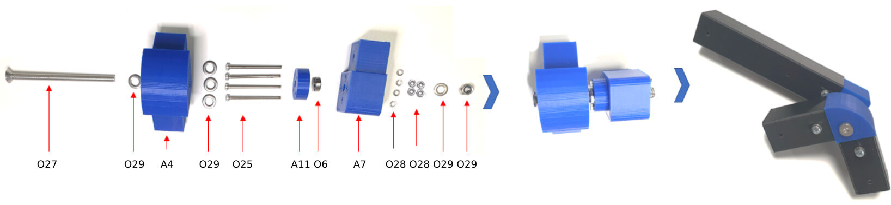

#### II.2.4. Assembly of the chassis

Attach the motor brackets to the free ends of each leg (2 x forward and rear leg of both Left and right side) using M4 x 40mm bolts (O24), flat and spring washers (O30), and nuts (O28). Attach the tires (O2) to the hex hub and secure them with the wheel hub nut. The MTV motors contain an integrated magnetic encoder for velocity estimation and have a 6-pin interface, for namely `[Motor power +, Motor power - , Encoder power + , Encoder power - , Encoder data 1, Encoder data 2]`. Electrical connection between the motors and the control PCBs should be done using the (O3) 7-core cable:

  

Complete the chassis assembly, including attaching the cable duct (O4) as required:

  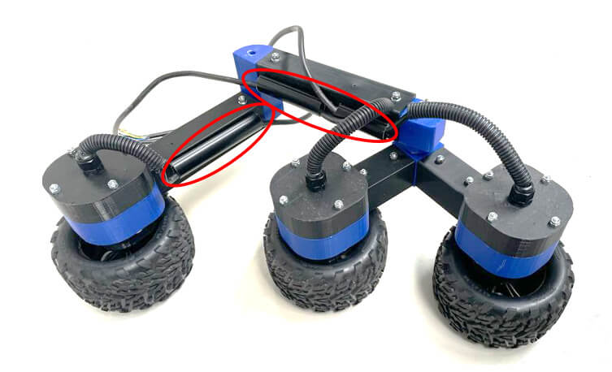

#### II.2.5. Assembly of the main compartment

The main compartment consist of the following parts:

- 2 x 3D-printed <a href="cad/Joints/BearingCover.stl">Bearing Cover </a> (A11)
- 1 x 3D-printed <a href="cad/PhoneMount/Phone_Mount.stl">Phone Mount Platform </a> (A12)
- 1 x 3D-printed <a href="cad/Buffer/Name_Front.stl">Name Front </a> (A13)
- 1 x 3D-printed <a href="cad/Buffer/Name_Back.stl">Name Back </a> (A14)
- 1 x 3D-printed <a href="cad/Buffer/Buffer_Left.stl">Buffer Left </a> (A15)
- 1 x 3D-printed <a href="cad/Buffer/Buffer_Right.stl">Buffer Right </a> (A16)
- 1 x 3D-printed <a href="cad/Compartment/Compartment_Rear.stl">Compartment Rear </a> (A17)
- 1 x 3D-printed <a href="cad/Compartment/Compartment_Front.stl">Compartment Front </a> (A18)
- 1 x 3D-printed <a href="cad/Compartment/Roof_Front.stl">Roof Front </a> (A19)
- 1 x 3D-printed <a href="cad/Compartment/Roof_Rear.stl">Roof Rear </a> (A20)
- 1 x 3D-printed <a href="cad/Compartment/Compartment_Battery_Mount-P1.stl">Compartment Battery Mount P1 </a> (A21a)
- 1 x 3D-printed <a href="cad/Compartment/Compartment_Battery_Mount-P2.stl">Compartment Battery Mount P2 </a> (A21b)
- 4 x M4 x 120mm screws (O26)
- 6 x PG7 Cable Gland (O5)
- 1 x M6 threaded bar (O21) 

Join the rear compartment (A17) with the forward compartment (A18) to form compartment assembly using M3 x 15mm (O25), flat washers (O28) nyloc nuts (O28). Use the guided holes to drill M3 holes for the joining purpose.

  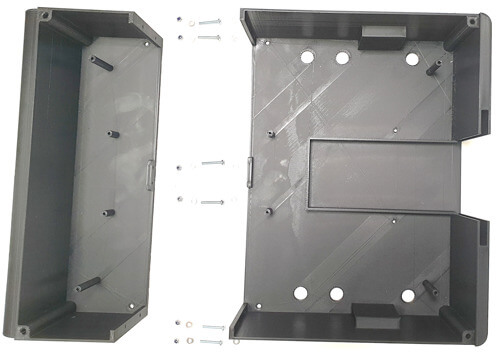

Drill the bearing connection holes onto the chassis where the guided holes are provided and insert the bearings (O6) into the bearing cover (A11) and secure the bearing assembly to the outside of the compartment assembly by the use of 4 M3 x 30mm bolts (O25), spring washers (O30), washers (O28) and nylocs (O28).

  

Attach the cable gland joints (O5) to the six holes on the rear compartment (A17). The six gland joints are used to pass the motor wires into the compartment:

  

Attach the left and right buffers (A15 & A16) to the compartment assembly using 4 M3 x 20mm bolts (O25), spring washers (O30), washers (O28) and nylocs (O28). 

  

Attach the battery mount P1 & P2 (A21 a & b) on to the rear compartment using M3 x 15mm bolts (O25) and nylocs (O28). Insert the M6 threaded bar (O21) into the chassis assembly though the centre hole of the bearings and the Battery mount P1&P2 assembly. As the threaded bar is inserted from one side, take care to add the required M6 nuts (O29) that are internal to the compartment.  
- Note that there are two M6 nuts (O29) on the outside of the compartment that act as spacers between the chassis and the compartment assembly. 
- Also note that the threaded bar needs to be balanced between the left and the right to ensure space for chassis assembly. 
- Care must be taken when screwing in the threaded bar into the compartment to ensure no pretension is added to the side walls.

  

#### II.2.6. Assembly of the vehicle

Attach the chassis assembly to the M6 threaded bar either side of the compartment and secure using M6 Nuts (O29):

  

Attach the shock absorbers (O7) between the mid leg and the chassis:

  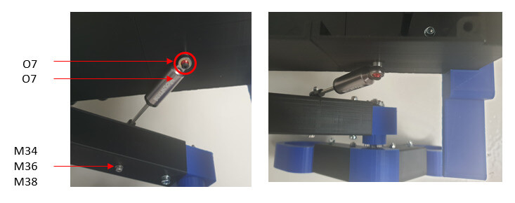

Swap the factory default springs in the shock absorbers with the medium compliance set provided (gold springs) to ensure the body of the robot remains leveled with the ground. Attach the piston end to the robot compartment using the spacer and bolt provided with the shock absorber (O10) and an M3 lock nut (O28). Fix the rod end using M3 x 40 bolts (O25) and nyloc (O28). Run the wires from the leg assembly to the main body and attach as per wiring guidelines (also make appropriate use of the cable management trunking). Attach the phone mount to the roof front (A19) 
- Attach the universal smart phone holder (O11) to the phone mount platform (A12). 
- Attach the vibration isolators (O11) to the phone mount platform (A12) and secure it to the roof front (A19) using lock nuts and washers as illustrated.   

  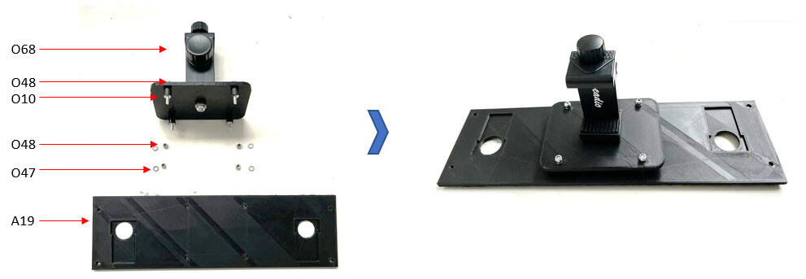

Fix the voltage display (O12), power control switches (O13), and Micro USB Panel Mount Cable (O14) on the roof rear's designated slots. Pull out the head and tail lights (O8 & O9) though the roof cut outs and attach the roof front (A19) and roof rear (A20) to the compartment assembly. Insert the head lights (O8) into headlight socket (A23), and tail lights (O9) into the taillight socket (A24) and fix to the respective slots in roof front (A19) and roof rear (A20). Seal the light sockets with light endcaps (A22) as shown in figure below and use super glue to attach them. Slide in the customised Name Front (A13) and Name Back (A14) plates. 

  

### II.3. Electronics Assembly 

This part only covers the integration of the electronic boards into the vehicle. The reader will find complementary details about the architecture and components of the different PCBs via the the [following link](./pcb). The pototyped PCBs are illustrated in the following figures: 

  

#### II.3.1. Battery – PCB connection 
The rechargeable Lipo battery selected for the MTV is connected to the Power distribution PCB using a set of dedicated connectors. A switch allows preventing spark damages on the battery connectors. Since this switch is mounted on the lid of the MTV, a set of splicing connectors can be used for maintenance purposes:

  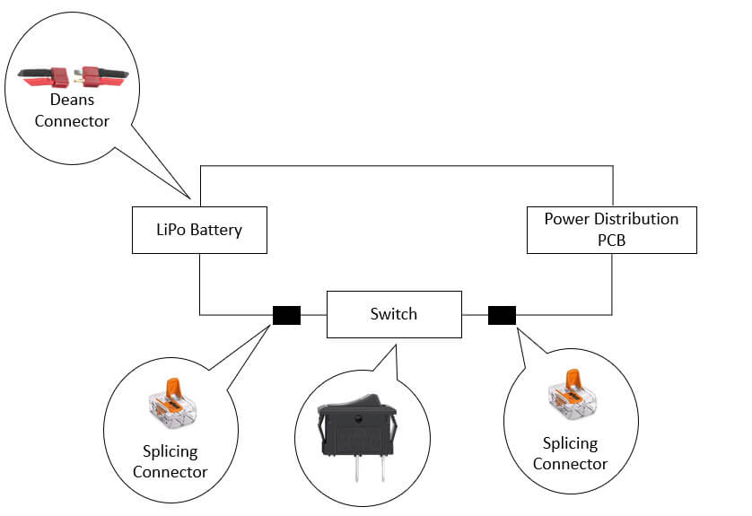

#### II.3.2. PCB – voltage display connection 

A dedicated voltage display provides relevant indication of the battery state. It should be connected to the Power distribution PCB.

  

#### II.3.3. PCB – lights connection 

The front and rear lights should be connected to the MTV's main PCB. A switch should placed on the lid of the MTV to control them.  

  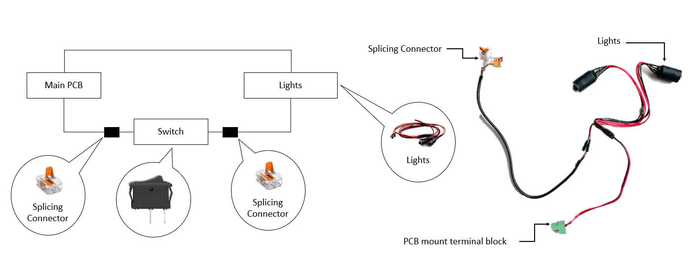

  

#### II.3.4. Power distribution PCB assembly

The power distribution board is mounted into the MTV main housing. The motor cables are pulled through the mounting slots after the power distribution board is in place. The main PCB is then attached to the MTV as shown in the following figure:

  

Once the main PCB is in place, the motor connection cables are shortened and connected to the main board using 2-pin, 5.08 mm pitch screw terminals. Next are the lighting connections.  The 12V and 5V voltage connections of the power distribution PCB are connected to the MTV in the final step. 

<table>
    <thead>
        <tr>
            <th>PCB </th>
            <th>Name printed on the PCB</th>
            <th>Picture</th>
            <th>Comments </th>
        </tr>
    </thead>
    <tbody>
        <tr>
            <td rowspan=2>Power Distribution PCB </td>
            <td>
            Mount_1 
            Mount_2
            Mount_3
            Mount_4
            </td>
            <td>
 
</td>
            <td>These M3 type mounting holes were designed to connect the Power distribution PCB to the connection points on the MTV with the use of screws and nuts.  </td>
        </tr>
        <tr>
            <td>
            VC_Mount_1 
            VC_Mount_2
            VC_Mount_3
            VC_Mount_4
            </td>
            <td>
 
</td>
            <td>These M3 type mounting holes were designed to connect the Voltage converter on to the power distribution PCB with the use of screws and nuts.</td>
        </tr>
        <tr>
            <td rowspan=2>Main PCB </td>
            <td>
            Mount_1 
            Mount_2
            Mount_3
            Mount_4
            </td>
            <td>
 
</td>
            <td>These M3 type mounting holes were designed to connect the Main PCB to the connection points on the MTV with the use of screws and nuts.</td>
        </tr>
        <tr>
            <td>
            MD_Mount_1 
            MD_Mount_2
            MD_Mount_3
            MD_Mount_4
            </td>
            <td>
 
</td>
            <td>These M3 type mounting holes were designed to connect the motor drivers on to the Main PCB with the use of screws and nuts. </td>
        </tr>
</table>

#### II.3.4. MTV roof cables assembly 

Once the main PCB was attached, switches and displays in the roof / lid of the of the MTV were connected using Splicing Connectors.  Also, the Micro USB program port of the ESP 32 was connected to a “left angled 90 Degree Micro USB mount extension cable (Male to Female). The Female end of the panel mount USB extension was connected on to the lid of the MTV. So, users can plug the USB cables without the need of removing the lid / roof. 

  

### II.4. Safety disclaimer 

*It is assumed that the MTV will be constructed by individuals who have an intermediate or advanced level of expertise in assembling mechanical and electronic devices. Please be aware of your own safety as you assemble and operate the robot. Neither **Ivy Tech LTD** nor **Intel Deutschland GmbH** are responsible for the result of any accidents caused by the user's negligence.*

- Read through the manual carefully before assembly.
- Beware of the sharp edges of 3D printed components. 
- Keep a safe distance from the robot during operation.
- Be careful to not get fingers stuck between the robot joints and wheels.
- Do not store the robot under direct sunlight.
- This product is **not waterproof**. We do not recommend operating the MTV in rainy or wet environments. 
- Do not use the MTV near fire or any source of heat.
- Do not drop the MTV from hights.
- Use only the designated/recommended tools to assemble the robot.
- Do not use excessive force on nuts, bolts or robot parts.
- Avoid activating the robot at heights to prevent sudden drop.
- Do not damage or place the Li-Po battery in water. 
- Do not connect or let the Li-Po battery come in contact with other conductors apart from the suggested terminals.
- When the robot is out of charge, it is recommended to take the battery out of the robot and to place it in a Li-Po Safe Bag before charging it. The battery, once fully charged can be inserted back into the robot as illustrated below

  

  

## III: Next

Flash the [Arduino Firmware](../../firmware/README.md)

