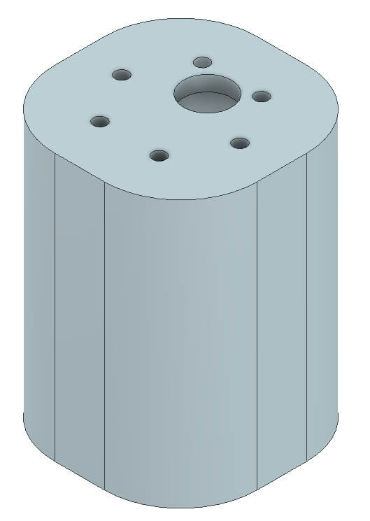
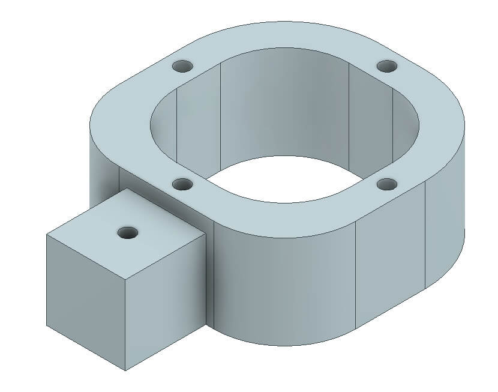
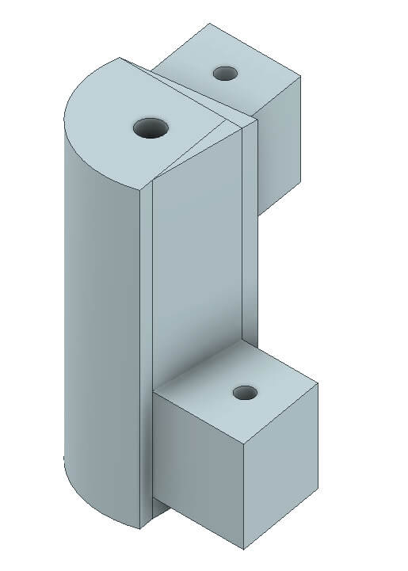
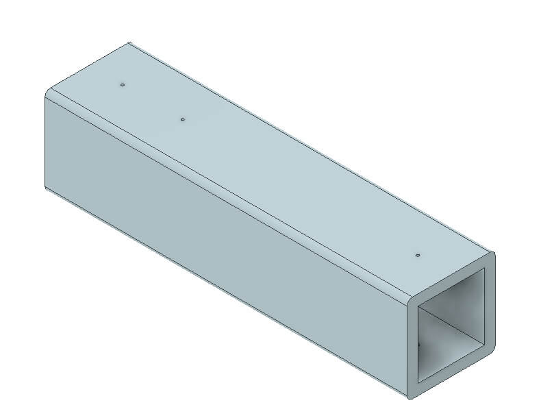
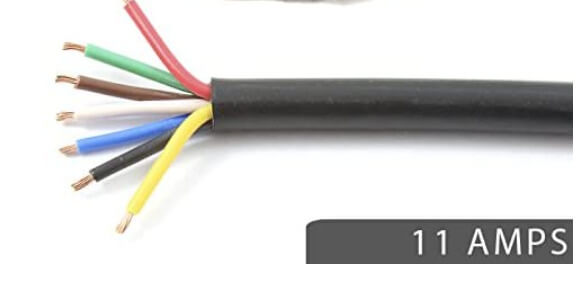
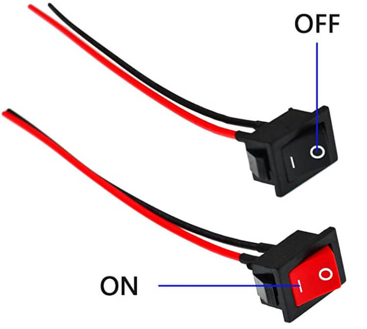
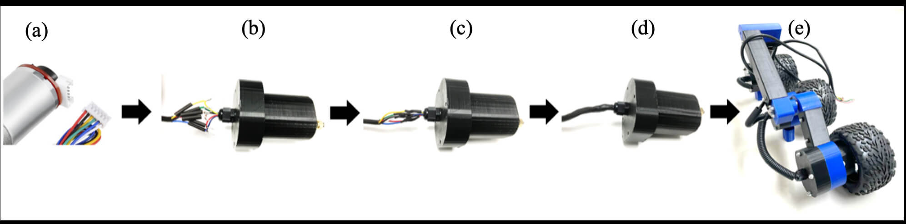
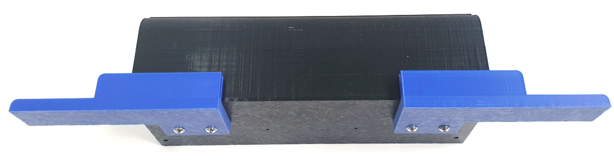
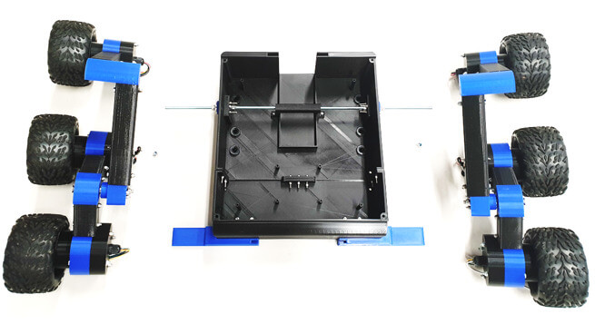
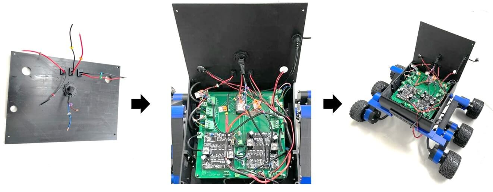

# OpenBot: 多地形车辆 (MTV) 车身

  <a href="README.md">English</a> |
  简体中文 |
  <a href="README.de-DE.md">Deutsch</a> |
  <a href="README.fr-FR.md">Français</a> |
  <a href="README.es-ES.md">Español</a>

我们在此提出了一个原始 [OpenBot](https://www.openbot.org/) 车辆的全地形替代方案。由 **Ivy Tech LTD** 合作开发的多地形车辆 (MTV) 也基于廉价且易于打印的组件。MTV 的设计灵感来自过去几十年为月球和火星探索开发的多个探测车概念。MTV 采用 6 个驱动轮，按照摇杆-摇臂配置排列。与大多数月球或火星探测车不同，这些轮子不能径向旋转。因此，该车辆的操作方式类似于坦克，使得手动控制相当直观。

  

## I. 3D 打印

您需要打印以下部件以组装您的 OpenBot MTV。

  

<table>
    <thead>
        <tr>
            <th>ID </th>
            <th>组别</th>
            <th>项目名称</th>
            <th>数量</th>
            <th>图片（不按比例）</th>
            <th>材料</th>
            <th>时长</th>
            <th>成本</th>
        </tr>
    </thead>
    <tbody>
        <tr>
            <td>A1</td>
            <td rowspan=3>电机组件</td>
            <td>电机外壳顶部   (<a href="cad/MotorAssembly/MotorEnclosure_Top.stl">STL</a>, <a href="cad/MotorAssembly/MotorEnclosure_Top.step">STEP</a>) </td>
            <td>6</td>
            <td>
 
</td>
            <td rowspan=2>498g</td>
            <td rowspan=2>36小时</td>
            <td rowspan=2>€23.51</td>
        </tr>
        <tr>
            <td>A2</td>
            <td>电机外壳底部   (<a href="cad/MotorAssembly/MotorEnclosure_Bottom.stl">STL</a>, <a href="cad/MotorAssembly/MotorEnclosure_Bottom.step">STEP</a>) </td>
            <td>6</td>
            <td>
 
</td>
        </tr>
        <tr>
            <td>A3</td>
            <td>电机支架   (<a href="cad/MotorAssembly/Motor_Bracket.stl">STL</a>, <a href="cad/MotorAssembly/Motor_Bracket.step">STEP</a>) </td>
            <td>6</td>
            <td>
 
</td>
            <td>251g</td>
            <td>17.5小时</td>
            <td>€11.98</td>
        </tr>
        <tr>
            <td>A4</td>
            <td rowspan=4>关节</td>
            <td>90度关节   (<a href="cad/Joints/90deg_Joint.stl">STL</a>, <a href="cad/Joints/90deg_Joint.step">STEP</a>) </td>
            <td>2</td>
            <td>
 
</td>
            <td rowspan=4>228g</td>
            <td rowspan=4>20.5小时</td>
            <td rowspan=4>€15.05</td>
        </tr>
        <tr>
            <td>A5</td>
            <td>100度关节   (<a href="cad/Joints/100deg_Joint.stl">STL</a>, <a href="cad/Joints/100deg_Joint.step">STEP</a>) </td>
            <td>1</td>
            <td>
 
</td>
        </tr>
        <tr>
            <td>A6</td>
            <td>100度关节镜像   (<a href="cad/Joints/100deg_Joint_Mirror.stl">STL</a>, <a href="cad/Joints/100deg_Joint_Mirror.step">STEP</a>) </td>
            <td>1</td>
            <td>
 
</td>
        </tr>
        <tr>
            <td>A7</td>
            <td>端部关节   (<a href="cad/Joints/End_Joint.stl">STL</a>, <a href="cad/Joints/End_Joint.step">STEP</a>) </td>
            <td>2</td>
            <td>
 
</td>
        </tr>
        <tr>
            <td>A8</td>
            <td rowspan=3>腿部</td>
            <td>前腿   (<a href="cad/Legs/Front_Leg.stl">STL</a>, <a href="cad/Legs/Front_Leg.step">STEP</a>) </td>
            <td>4</td>
            <td>
 
</td>
            <td rowspan=3>317g</td>
            <td rowspan=3>22.5小时</td>
            <td rowspan=3>€14.97</td>
        </tr>
        <tr>
            <td>A9</td>
            <td>中腿   (<a href="cad/Legs/Mid_Leg.stl">STL</a>, <a href="cad/Legs/Mid_Leg.step">STEP</a>) </td>
            <td>2</td>
            <td>
 
</td>
        </tr>
        <tr>
            <td>A10</td>
            <td>后腿   (<a href="cad/Legs/Rear_Leg.stl">STL</a>, <a href="cad/Legs/Rear_Leg.step">STEP</a>) </td>
            <td>2</td>
            <td>
 
</td>
        </tr>
        <tr>
            <td>A11</td>
            <td>轴承盖</td>
            <td>轴承盖   (<a href="cad/BearingCover/BearingCover.stl">STL</a>, <a href="cad/BearingCover/BearingCover.step">STEP</a>) </td>
            <td>4</td>
            <td>
 
</td>
            <td>13g</td>
            <td>1.5小时</td>
            <td>€0.60</td>
        </tr>
        <tr>
            <td>A12</td>
            <td>手机支架平台</td>
            <td>手机支架平台   (<a href="cad/PhoneMount/Phone_Mount.stl">STL</a>, <a href="cad/PhoneMount/Phone_Mount.step">STEP</a>) </td>
            <td>1</td>
            <td>
 
</td>
            <td>19g</td>
            <td>2小时</td>
            <td>€0.91</td>
        </tr>
        <tr>
            <td>A13</td>
            <td rowspan=4>前缓冲器</td>
            <td>前部名称   (<a href="cad/Buffer/Name_Front.stl">STL</a>, <a href="cad/Buffer/Name_Front.step">STEP</a>) </td>
            <td>1</td>
            <td>
 
</td>
            <td rowspan=4>228g</td>
            <td rowspan=4>20.5小时</td>
            <td rowspan=4>€15.04</td>
        </tr>
        <tr>
            <td>A14</td>
            <td>后部名称   (<a href="cad/Buffer/Name_Back.stl">STL</a>, <a href="cad/Buffer/Name_Back.step">STEP</a>) </td>
            <td>1</td>
            <td>
 
</td>
        </tr>
        <tr>
            <td>A15</td>
            <td>左缓冲器   (<a href="cad/Buffer/Buffer_Left.stl">STL</a>, <a href="cad/Buffer/Buffer_Left.step">STEP</a>) </td>
            <td>1</td>
            <td>
 
</td>
        </tr>
        <tr>
            <td>A16</td>
            <td>右缓冲器   (<a href="cad/Buffer/Buffer_Right.stl">STL</a>, <a href="cad/Buffer/Buffer_Right.step">STEP</a>) </td>
            <td>1</td>
            <td>
 
</td>
        </tr>
        <tr>
            <td>A17</td>
            <td rowspan=8>隔间</td>
            <td>隔间后部   (<a href="cad/Compartment/Compartment_Rear.stl">STL</a>, <a href="cad/Compartment/Compartment_Rear.step">STEP</a>) </td>
            <td>1</td>
            <td>
 
</td>
            <td>413g</td>
            <td>32小时</td>
            <td>€22.75</td>
        </tr>
        <tr>
            <td>A18</td>
            <td>隔间前部   (<a href="cad/Compartment/Compartment_Front.stl">STL</a>, <a href="cad/Compartment/Compartment_Front.step">STEP</a>) </td>
            <td>1</td>
            <td>
 
</td>
            <td>316g</td>
            <td>22小时</td>
            <td>€17.42</td>
        </tr>
        <tr>
            <td>A19</td>
            <td>前屋顶   (<a href="cad/Compartment/Roof_Front.stl">STL</a>, <a href="cad/Compartment/Roof_Front.step">STEP</a>) </td>
            <td>1</td>
            <td>
 
</td>
            <td>58g</td>
            <td>5.5小时</td>
            <td>€3.19</td>
        </tr>
        <tr>
            <td>A20</td>
            <td>后屋顶   (<a href="cad/Compartment/Roof_Rear.stl">STL</a>, <a href="cad/Compartment/Roof_Rear.step">STEP</a>) </td>
            <td>1</td>
            <td>
 
</td>
            <td>140g</td>
            <td>13.5小时</td>
            <td>€7.73</td>
        </tr>
        <tr>
            <td>A21ab</td>
            <td>电池安装P1 & P2   (<a href="cad/Compartment/Compartment_Battery_Mount-P1.stl">STL</a>, <a href="cad/Compartment/Compartment_Battery_Mount-P1.step">STEP</a>)
              (<a href="cad/Compartment/Compartment_Battery_Mount-P2.stl">STL</a>, <a href="cad/Compartment/Compartment_Battery_Mount-P2.step">STEP</a>) </td>
            <td>1</td>
            <td>
 
</td>
            <td>15g</td>
            <td>1.5小时</td>
            <td>€0.80</td>
        </tr>
        <tr>
            <td>A22</td>
            <td>灯罩端盖   (<a href="cad/Compartment/Headlight_Rear.stl">STL</a>, <a href="cad/Compartment/Headlight_Rear.step">STEP</a>)</td>
            <td>4</td>
            <td>
 
</td>
            <td rowspan=3>47g</td>
            <td rowspan=3>4小时</td>
            <td rowspan=3>€2.58</td>
        </tr>
        <tr>
            <td>A23</td>
            <td>前灯   (<a href="cad/Compartment/Headlight_Front.stl">STL</a>, <a href="cad/Compartment/Headlight_Front.step">STEP</a>)</td>
            <td>4</td>
            <td>
 
</td>
        </tr>
        <tr>
            <td>A24</td>
            <td>电池访问盖   (<a href="cad/Compartment/Compartment_Door.stl">STL</a>, <a href="cad/Compartment/Compartment_Door.step">STEP</a>)</td>
            <td>1</td>
            <td>
 
</td>
        </tr>
    </tbody>
</table>

# II. 机电装配

### II.1. 材料清单

我们的机器人主体依赖于现成的业余电子产品。我们提供了德国（EU）和美国（US）的链接，快速发货。如果你有耐心等待更长时间，你也可以从AliExpress（AE）以更便宜的价格购买这些组件。你将需要以下组件。

# 物料清单

<table>
    <thead>
        <tr>
            <th>ID </th>
            <th>描述</th>
            <th>图片</th>
            <th>供应商</th>
            <th>单价</th>
            <th>数量</th>
            <th>总成本</th>
        </tr>
    </thead>
    <tbody>
        <tr>
            <td>O1</td>
            <td>JGB37-520 直流电机带编码器 - 12V | 178RPM </td>
            <td>
 
</td>
            <td>  <a href="https://de.aliexpress.com/item/4001339371886.html?gatewayAdapt=glo2deu&spm=a2g0s.9042311.0.0.1fe54c4dR1WTdj/">AE</a></td>
            <td>$8.93 | €8.12</td>
            <td>6</td>
            <td>$53.58 | €48.72</td>
        </tr>
        <tr>
            <td>O2</td>
            <td>2.8" Talon 轮胎 (2 个)</td>
            <td>
 
</td>
            <td> <a href="https://www.robotshop.com/en/28-talon-tires-pair.html">US</a> | <a href="https://www.robotshop.com/eu/en/28-talon-tires-pair.html">EU</a></td>
            <td>$26.95 | €23.06</td>
            <td>6</td>
            <td>$161.7 | €138.36</td>
        </tr>
        <tr>
            <td>O3</td>
            <td>7 芯电缆 0.5 mm² (5m)</td>
            <td>
 
</td>
          <td>  <a href="https://www.amazon.com/Heavy-Gauge-Conductor-Trailer-Cable/dp/B01N3Q0YGS/ref=sr_1_16?crid=3SK9Y7DSOR0OL&keywords=caravan+cable+7+wire&qid=1649847035&sprefix=carava+cable+7+wire%2Caps%2C190&sr=8-16">US</a> | <a href="https://www.amazon.de/-/en/1119757-Classic-Control-Protective-Conductor/dp/B08CY2WPM4/ref=sr_1_5?crid=1QGOB5LF0GZYO&keywords=7+adriges+kabel+0%2C5mm%C2%B2&qid=1644173962&sprefix=7+core+cable+0.5mm+%2Caps%2C289&sr=8-5">EU</a></td>
            <td> $25.53 | €20.61</td>
            <td>0.25</td>
            <td>$6.38 | €5.15</td>
        </tr>
        <tr>
            <td>O4</td>
            <td>D-Line 电缆槽。20mm x 10mm x 1m (2 个)</td>
            <td>
 
</td>
            <td>  <a href="https://www.amazon.com/D-Line-Raceway-1D3015W-Electrical-Paintable/dp/B07KFNYR7G/ref=sr_1_10?crid=137L39X59R8AQ&keywords=D-Line%2Bcable%2Bduct&qid=1649851731&refinements=p_36%3A1253503011&rnid=386442011&s=electronics&sprefix=d-line%2Bcable%2Bduct%2Caps%2C409&sr=1-10&th=1">US</a> | <a href="https://www.amazon.de/-/en/D-Line-Micro-Cable-Management-Strip-White/dp/B082WVQXT5/ref=sr_1_fkmr0_1?crid=3CBV1RRPR6K9B&keywords=d-line%2Bmicro%2B%2Bkabelkanal%2B(2%2Bmeter)%2C%2Bselbstklebende%2Bkabelabdeckungen%2C%2Belektrische%2Bkabelf%C3%BChrung%2C%2Bbeliebte%2Bkabelmanagementl%C3%B6sung%2C%2B20%2Bmm%2B(b)%2Bx%2B10%2Bmm%2B(h)%2B-%2B2%2Bx%2B1%2Bm%2Bl%C3%A4nge%2B-%2Bschwarz&qid=1644149200&sprefix=d-line%2Bmicro%2B%2Bcable%2Btrunking%2B2-meter%2Bself-adhesive%2Bcable%2Bcovers%2Belectrical%2Bcable%2Btidy%2Bpopular%2Bcable%2Bmanagement%2Bsolution%2B20mm%2Bw%2Bx%2B10mm%2Bh%2B-%2B2%2Bx%2B1%2Bmeter%2Blengths%2B-%2Bblack%2B%2Caps%2C381&sr=8-1-fkmr0&th=1">EU</a></td>
            <td>$12.00 | €9.99</td>
            <td>1</td>
            <td>$12.00 | €9.99</td>
        </tr>
        <tr>
            <td>O5</td>
            <td>PG7 电缆接头 3~6.5mm (50 个)</td>
            <td>
 
</td>
          <td>  <a href="https://www.amazon.com/ARTGEAR-Waterproof-Adjustable-Connector-Protector/dp/B07JH2LPZF/ref=sr_1_11?crid=1UH8URDCXAHJJ&keywords=Cable+Gland+Set+Plastic+Cable+Glands+Adjustable+PG7+Waterproof+Closure+Cable+Screw+Connection+for+Diameter+3.5+mm+-+6.5+mm+Black+Pack+of+50&qid=1649852081&sprefix=cable+gland+set+plastic+cable+glands+adjustable+pg7+waterproof+closure+cable+screw+connection+for+diameter+3.5+mm+-+6.5+mm+black+pack+of+50+%2Caps%2C243&sr=8-11"> US </a> | <a href="https://www.amazon.de/-/en/Plastic-Adjustable-Waterproof-Connection-Diameter/dp/B08Q458H3N/ref=sr_1_fkmr0_1?crid=1H5VCAQKXD2XZ&keywords=pg7+kabelverschraubung%2C+50+st%C3%BCck%2C+3-6%2C5+mm%2C+verstellbar%2C+wasserdicht%2C+kabelverschraubungen%2C+verbindungsst%C3%BCck+mit+dichtungen&qid=1644149525&sprefix=pg7+cable+gland+50+pack+3+6.5mm+adjustable+waterproof+cable+glands+joints+connector+with+gaskets+%2Caps%2C80&sr=8-1-fkmr0">EU</a></td>
            <td>$8.99 | €9.99</td>
            <td>0.5</td>
            <td>$4.49 | €4.99</td>
        </tr>
        <tr>
            <td>O6</td>
            <td>MR126ZZ 轴承 6x12x4mm (4 个)</td>
            <td>
 
</td>
            <td>  <a href="https://de.aliexpress.com/item/1005001697683913.html?gatewayAdapt=glo2deu&spm=a2g0s.9042311.0.0.1fe54c4dR1WTdj">AE</a></td>
            <td>$5.52 | €3.45</td>
            <td>1</td>
            <td>$5.52 | €3.45</td>
        </tr>
        <tr>
            <td>O7</td>
            <td>INJORA 90mm RC 车弹簧减震器 (2 个)</td>
            <td>
 
</td>
            <td>  <a href="https://de.aliexpress.com/item/4000309686709.html?gatewayAdapt=glo2deu&spm=a2g0o.productlist.0.0.17b17ca7oMXyhJ&algo_pvid=c7d8ba55-28b2-4d27-97e4-f338994958f7&algo_exp_id=c7d8ba55-28b2-4d27-97e4-f338994958f7-14&pdp_ext_f=%7B%22sku_id%22%3A%2210000001286270094%22%7D&pdp_pi=-1%3B8.3%3B-1%3B-1%40salePrice%3BUSD%3Bsearch-mainSearch">AE</a></td>
            <td>$8.30 | €7.99</td>
            <td>1</td>
            <td>$8.30 | €7.99</td>
        </tr>
        <tr>
            <td>O8</td>
            <td>AXSPEED RC 车 LED 4.2v-6v 白色 17mm (2 个)</td>
            <td>
 
</td>
            <td>  <a href="https://www.aliexpress.com/item/1005003306484898.html?spm=a2g0s.9042311.0.0.d4954c4dpsjiiC">AE</a></td>
            <td>$7.43 | €6.87</td>
            <td>1</td>
            <td>$7.43 | €6.87</td>
        </tr>
        <tr>
            <td>O9</td>
            <td>AXSPEED RC 车 LED 4.2v-6v 红色 17mm (2 个)</td>
            <td>
 
</td>
            <td>  <a href="https://www.aliexpress.com/item/1005003306484898.html?spm=a2g0s.9042311.0.0.d4954c4dpsjiiC">AE</a></td>
            <td>$7.43 | €6.87</td>
            <td>1</td>
            <td>$7.43 | €6.87</td>
        </tr>
        <tr>
            <td>O10</td>
            <td>减震器 M3 x 8mm 螺柱 (4 个)</td>
            <td>
 
</td>
            <td>  <a href="https://www.amazon.com/MroMax-Rubber-Vibration-Isolator-Absorber/dp/B07Z76J5N5/ref=sr_1_5?crid=2LSR8ZMHRIL2O&keywords=m3+rubber+mount+shock+absorbers&qid=1649862366&sprefix=keesin+m3+rubber+mounts+shock+absorbers+%2Caps%2C362&sr=8-5">US</a> | <a href="https://www.amazon.de/-/en/gp/product/B076SSPHP6/ref=ppx_yo_dt_b_asin_title_o03_s01?ie=UTF8&psc=1">EU</a></td>
            <td>$8.09 | €9.49</td>
            <td>1</td>
            <td>$8.09 | €9.49</td>
        </tr>
        <tr>
            <td>O11</td>
            <td>Zeadio 通用智能手机支架</td>
            <td>
 
</td>
            <td> <a href="https://www.amazon.com/SharingMoment-Smartphone-Horizontal-Rotatable-Adjustable/dp/B07S8TTH34/ref=sr_1_4?crid=X7XQ9LC110JJ&keywords=Zeadio+Smartphone+Tripod+Adapter%2C+Mobile+Phone+Holder&qid=1649862548&refinements=p_36%3A2491155011&rnid=2491154011&s=wireless&sprefix=zeadio+smartphone+tripod+adapter%2C+mobile+phone+holder+%2Caps%2C577&sr=1-4">US</a> | <a href="https://www.amazon.de/-/en/Zeadio-Smartphone-Tripod-Adapter-Mobile/dp/B06XDYJNSR/ref=sr_1_8?crid=2ZH6V545D45E3&keywords=zeadio%2Buniversal%2Bsmartphone%2Bhalterung&qid=1644150427&sprefix=zeadio%2Buniversal%2Bsmartphone%2Bholder%2Caps%2C104&sr=8-8&th=1">EU</a></td>
            <td>$11.99 | €10.99</td>
            <td>1</td>
            <td>$11.99 | €10.99</td>
        </tr>
        <tr>
            <td>O12</td>
            <td>DC 12-24 V 车用电压表</td>
            <td>
 
</td>
            <td>  <a href="https://www.amazon.com/Nilight-Voltmeter-Waterproof-VoltVolt-Motorcycle/dp/B06ZZJ48VQ/ref=sr_1_fkmr1_2?crid=376857DCCJICB&keywords=mini+led+digital+voltmeter+batterietester+12+volt+%2F+24+volt+voltmeter&qid=1649862763&sprefix=mini+led+digital+voltmeter+batterietester+12+volt+%2F+24+volt+voltmeter%2Caps%2C404&sr=8-2-fkmr1">US</a> | <a href="https://www.amazon.de/-/en/Intckwan-Digital-Voltmeter-Waterproof-Motorcycle/dp/B09T5XRYM9/ref=sr_1_5?crid=1GPFOX9O2VX85&keywords=mini+led+digital+voltmeter+batterietester+12+volt+%2F+24+volt+voltmeter&qid=1649862700&sprefix=mini+led+digital+voltmeter+battery+tester+12+volt+%2F+24+volt+voltmeter%2Caps%2C91&sr=8-5">EU</a></td>
            <td>$10.99 | €11.88</td>
            <td>1</td>
            <td>$10.99 | €11.88</td>
        </tr>
        <tr>
            <td>O13</td>
            <td>迷你摇杆开关 (20 个)</td>
            <td>
 
</td>
            <td>  <a href="https://www.amazon.com/DaierTek-250VAC-Rocker-KCD1-101-Plastic/dp/B07S2QJKTX/ref=sr_1_4?keywords=RUNCCI-YUN+20Pcs+Mini+Rocker+Switch&qid=1650638471&sr=8-4">US</a> | <a href="https://www.amazon.de/-/en/RUNCCI-Rocker-Switches-Household-Appliances/dp/B07MW92CW8/ref=sr_1_2?keywords=RUNCCI-YUN+20+St%C3%BCck+Mini-Wippschalter&qid=1650638352&sr=8-2">EU

# MTV 组装指南

外部采购组件的总成本估计约为 **500€**，因此 MTV 的总成本约为 **600€**。

### II.2. 机械组装

#### II.2.1. 概述

本章涵盖了 MTV 的组装过程。请注意，文中提到的左侧和右侧分别是机器人的左舷和右舷，可以互换使用。除非另有说明，否则所有螺栓都假定配有平垫圈以保护 3D 打印的塑料。此外，使用弹簧垫圈和尼龙锁通常可以防止由于振动导致的螺母松动。

MTV 的组装过程可以分为七个主要步骤，即：
1. 组装 6 个电机模块
2. 组装腿部
3. 组装底盘
4. 组装主舱
5. 组装车辆
6. 组装电源单元、控制单元并连接不同组件
7. 测试、编程和使用

  

#### II.2.2. 电机模块的组装

每个电机模块由以下部分组成：

- 1 x 3D 打印的 <a href="cad/MotorAssembly/MotorEnclosure_Top.stl">电机外壳顶部</a> (A1)
- 1 x 3D 打印的 <a href="cad/MotorAssembly/MotorEnclosure_Bottom.stl">电机外壳底部</a> (A2)
- 1 x 3D 打印的 <a href="cad/MotorAssembly/Motor_Bracket.stl">电机支架</a> (A3)
- 1 x 带编码器和轮子适配器的 JGB37-520 直流电机 (O1)
- 1 x PG7 电缆接头 (O5)

组装电机模块：

1. 首先将套件中提供的控制电缆 (O1) 连接到电机。强烈建议使用一点热熔胶固定此连接。
2. 小心对齐电机固定图案与 3D 打印的电机外壳 (A1) 孔图案。确保不要对编码器施加任何力，以免损坏它。使用套件中提供的螺钉 (O1) 将电机固定到 3D 打印的电机外壳 (A1) 上。
3. 使用提供的内六角扳手将套件中的联轴器套筒 (O1) 固定到电机轴上。将固定轮子的螺母安全地拧在六角轮毂中，因为稍后在将轮胎 (O2) 安装到车辆上时需要用到它。
4. 将电机支架 (A3) 插入电机外壳顶部 (A1)。这是一个推合配合，滑动时可能需要一些小心对齐。请注意，电机支架的肩部（如下图所示）应面向电机轴的一侧，以便更整洁的组装。确保电机支架 (A3) 与电机外壳顶部 (A1) 紧密配合。使用热熔胶或强力胶固定组件。
5. 将电缆接头 (O5) 添加到电机外壳底部 (A2)，并通过接头穿过电机线。
6. 小心地将电机外壳底部 (A2) 插入电机外壳顶部 (A1)，直到电机外壳底部 (A2) 完全插入。确保电机支架 (A3) 与电机外壳顶部 (A1) 齐平。注意不要将电线卡在编码器上——编码器需要自由旋转。
7. 使用 M4 x 60mm 螺栓 (O23) 和尼龙锁螺母 (O28) 将电机外壳顶部 (A2) 与电机支架 (A3) 固定。

  

  

#### II.2.3. 腿部的组装

MTV 的左腿由以下部分组成：

- 1 x 3D 打印的 <a href="cad/Joints/90deg_Joint.stl">90 度接头</a> (A4)
- 1 x 3D 打印的 <a href="cad/Joints/End_Joint.stl">端接头</a> (A7)
- 1 x 3D 打印的 <a href="cad/Joints/BearingCover.stl">轴承盖</a> (A11)
- 1 x 3D 打印的 <a href="cad/Joints/100deg_Joint.stl">100 度接头</a> (A5)
- 2 x 3D 打印的 <a href="cad/Legs/Front_Leg.stl">前腿</a> (A8)
- 1 x 3D 打印的 <a href="cad/Legs/Mid_Leg.stl">中腿</a> (A9)
- 1 x 3D 打印的 <a href="cad/Legs/Rear_Leg.stl">后腿</a> (A10)
- 1 x D-Line 电缆槽 (O4)
- 1 x 7 芯电缆 (O3)
- 1 x MR126ZZ 球轴承 (O6)

MTV 的右腿由以下部分组成：

- 1 x 3D 打印的 <a href="cad/Joints/90deg_Joint.stl">90 度接头</a> (A4)
- 1 x 3D 打印的 <a href="cad/Joints/End_Joint.stl">端接头</a> (A7)
- 1 x 3D 打印的 <a href="cad/Joints/BearingCover.stl">轴承盖</a> (A11)
- 1 x 3D 打印的 <a href="cad/Joints/100deg_Joint_Mirror.stl">100 度接头镜像</a> (A6)
- 2 x 3D 打印的 <a href="cad/Legs/Front_Leg.stl">前腿</a> (A8)
- 1 x 3D 打印的 <a href="cad/Legs/Mid_Leg.stl">中腿</a> (A9)
- 1 x 3D 打印的 <a href="cad/Legs/Rear_Leg.stl">后腿</a> (A10)
- 1 x D-Line 电缆槽 (O4)
- 1 x 7 芯电缆 (O3)
- 1 x MR126ZZ 球轴承 (O6)

组装 90 度接头 (A4) 和相关的腿部 (A8)（2x 前腿 + 中腿）以形成前腿组件（左右）。使用 M4 x 40mm 螺栓 (O24)、平垫圈 (O30)、弹簧垫圈 (O30) 和螺母 (O28) 将腿部固定到接头上。在腿部组件中使用 M4 钻导孔（在中腿中有 3 个导孔，端部 2 个应为 M4，中部应为 M3，将用于安装减震器）。将后腿 100 度接头 (A5)（或镜像 A6）和后腿连接，形成左舷和右舷完整的腿部组件，并使用 M4 x 40mm 螺栓 (O24)、平垫圈 (O30)、弹簧垫圈 (O30) 和螺母 (O28) 固定腿部。

  

#### II.2.4. 底盘的组装

使用 M4 x 40mm 螺栓 (O24)、平垫圈和弹簧垫圈 (O30) 以及螺母 (O28) 将电机支架固定到每条腿的自由端（左右两侧的前腿和后腿）。将轮胎 (O2) 安装到六角轮毂上，并用轮毂螺母固定。MTV 电机包含一个集成的磁编码器用于速度估计，并具有 6 针接口，分别为 `[电机电源 +, 电机电源 -, 编码器电源 +, 编码器电源 -, 编码器数据 1, 编码器数据 2]`。电机与控制 PCB 之间的电气连接应使用 (O3) 7 芯电缆进行：

  

完成底盘组装，包括根据需要安装电缆槽 (O4)：

  

#### II.2.5. 主舱的组装

主舱由以下部分组成：

- 2 x 3D 打印的 <a href="cad/Joints/BearingCover.stl">轴承盖</a> (A11)
- 1 x 3D 打印的 <a href="cad/PhoneMount/Phone_Mount.stl">手机支架平台</a> (A12)
- 1 x 3D 打印的 <a href="cad/Buffer/Name_Front.stl">前名牌</a> (A13)
- 1 x 3D 打印的 <a href="cad/Buffer/Name_Back.stl">后名牌</a> (A14)
- 1 x 3D 打印的 <a href="cad/Buffer/Buffer_Left.stl">左缓冲器</a> (A15)
- 1 x 3D 打印的 <a href="cad/Buffer/Buffer_Right.stl">右缓冲器</a> (A16)
- 1 x 3D 打印的 <a href="cad/Compartment/Compartment_Rear.stl">后舱</a> (A17)
- 1 x 3D 打印的 <a href="cad/Compartment/Compartment_Front.stl">前舱</a> (A18)
- 1 x 3D 打印的 <a href="cad/Compartment/Roof_Front.stl">前车顶</a> (A19)
- 1 x 3D 打印的 <a href="cad/Compartment/Roof_Rear.stl">后车顶</a> (A20)
- 1 x 3D 打印的 <a href="cad/Compartment/Compartment_Battery_Mount-P1.stl">电池安装支架 P1</a> (A21a)
- 1 x 3D 打印的 <a href="cad/Compartment/Compartment_Battery_Mount-P2.stl">电池安装支架 P2</a> (A21b)
- 4 x M4 x 120mm 螺钉 (O26)
- 6 x PG7 电缆接头 (O5)
- 1 x M6 螺纹杆 (O21)

使用 M3 x 15mm (O25)、平垫圈 (O28) 和尼龙锁螺母 (O28) 将后舱 (A17) 与前舱 (A18) 连接，形成舱体组件。使用导孔钻 M3 孔以进行连接。

  

在底盘上钻轴承连接孔，并将轴承 (O6) 插入轴承盖 (A11)，使用 4 个 M3 x 30mm 螺栓 (O25)、弹簧垫圈 (O30)、垫圈 (O28) 和尼龙锁 (O28) 将轴承组件固定到舱体组件的外侧。

  

将电缆接头 (O5) 安装到后舱 (A17) 的六个孔上。这六个接头用于将电机线穿入舱内：

  

使用 4 个 M3 x 20mm 螺栓 (O25)、弹簧垫圈 (O30)、垫圈 (O28) 和尼龙锁 (O28) 将左缓冲器 (A15) 和右缓冲器 (A16) 固定到舱体组件上。

  

使用 M3 x 15mm 螺栓 (O25) 和尼龙锁 (O28) 将电池安装支架 P1 和 P2 (A21 a & b) 固定到后舱上。将 M6 螺纹杆 (O21) 插入底盘组件，通过轴承的中心孔和电池安装支架 P1&P2 组件。插入螺纹杆时，注意添加舱内所需的 M6 螺母 (O29)。
- 请注意，舱外有两个 M6 螺母 (O29)，它们作为底盘和舱体组件之间的间隔。
- 还要注意，螺纹杆需要在左右之间平衡，以确保底盘组装的空间。
- 插入螺纹杆时必须小心，以确保不会对侧壁施加预紧力。

  

#### II.2.6. 车辆的组装

将底盘组件固定到舱体两侧的 M6 螺纹杆上，并用 M6 螺母 (O29) 固定：

  

将减震器 (O7) 安装在中腿和底盘之间：

  

将减震器中的出厂默认弹簧更换为提供的中等弹性套装（黄金弹簧），以确保机器人的车身保持水平。使用减震器 (O10) 和 M3 锁紧螺母 (O28) 提供的垫片和螺栓将活塞端固定到机器人舱体上。使用 M3 x 40 螺栓 (O25) 和尼龙锁 (O28) 固定杆端。按照布线指南将腿部组件的电线引入主机体，并适当使用电缆管理槽。将手机支架安装到前车顶 (A19) 上：
- 将通用智能手机支架 (O11) 安装到手机支架平台 (A12) 上。
- 将减震器 (O11) 安装到手机支架平台 (A12) 上，并使用锁紧螺母和垫圈将其固定到前车顶 (A19) 上，如图所示。

  

将电压显示器 (O12)、电源控制开关 (O13) 和 Micro USB 面板安装电缆 (O14) 安装到后车顶的指定插槽中。通过车顶切口拉出前后灯 (O8 & O9)，并将前车顶 (A19) 和后车顶 (A20) 固定到舱体组件上。将前灯 (O8) 插入前灯插座 (A23)，将后灯 (O9) 插入后灯插座 (A24)，并固定到前车顶 (A19) 和后车顶 (A20) 的相应插槽中。使用灯罩 (A22) 密封灯座，如下图所示，并使用强力胶将其固定。插入定制的前名牌 (A13) 和后名牌 (A14) 板。

  

### II.3. 电子组装

本部分仅涵盖电子板在车辆中的集成。读者可以通过[以下链接](./pcb)找到有关不同 PCB 的架构和组件的补充详细信息。原型 PCB 如下图所示：

  

#### II.3.1. 电池与 PCB 的连接

MTV 选用的可充电锂聚合物电池通过一组专用连接器连接到电源分配 PCB。一个开关可以防止电池连接器受到火花损坏。由于此开

  

#### II.3.3. PCB – 灯光连接

前后灯应连接到MTV的主PCB上。开关应放置在MTV的盖子上以控制它们。

  

  

#### II.3.4. 电源分配PCB组装

电源分配板安装在MTV主机壳内。电机电缆在电源分配板就位后通过安装槽拉出。然后将主PCB按如下图所示连接到MTV上：

  

主PCB就位后，电机连接电缆被缩短并使用2针、5.08毫米间距的螺钉端子连接到主板。接下来是灯光连接。电源分配PCB的12V和5V电压连接在最后一步连接到MTV。

<table>
    <thead>
        <tr>
            <th>PCB</th>
            <th>PCB上印刷的名称</th>
            <th>图片</th>
            <th>备注</th>
        </tr>
    </thead>
    <tbody>
        <tr>
            <td rowspan=2>电源分配PCB</td>
            <td>
            Mount_1 
            Mount_2
            Mount_3
            Mount_4
            </td>
            <td>
 
</td>
            <td>这些M3类型的安装孔设计用于通过螺钉和螺母将电源分配PCB连接到MTV的连接点。</td>
        </tr>
        <tr>
            <td>
            VC_Mount_1 
            VC_Mount_2
            VC_Mount_3
            VC_Mount_4
            </td>
            <td>
 
</td>
            <td>这些M3类型的安装孔设计用于通过螺钉和螺母将电压转换器连接到电源分配PCB上。</td>
        </tr>
        <tr>
            <td rowspan=2>主PCB</td>
            <td>
            Mount_1 
            Mount_2
            Mount_3
            Mount_4
            </td>
            <td>
 
</td>
            <td>这些M3类型的安装孔设计用于通过螺钉和螺母将主PCB连接到MTV的连接点。</td>
        </tr>
        <tr>
            <td>
            MD_Mount_1 
            MD_Mount_2
            MD_Mount_3
            MD_Mount_4
            </td>
            <td>
 
</td>
            <td>这些M3类型的安装孔设计用于通过螺钉和螺母将电机驱动器连接到主PCB上。</td>
        </tr>
</table>

#### II.3.4. MTV顶盖电缆组装

主PCB连接好后，MTV顶盖的开关和显示器通过拼接连接器连接。ESP 32的Micro USB编程端口连接到一个“左弯90度Micro USB安装延长线（公对母）”。面板安装USB延长线的母端连接到MTV的盖子上。因此，用户可以插入USB电缆而无需拆下盖子。

  

### II.4. 安全声明

*假设MTV将由具有中级或高级机械和电子设备组装技能的个人组装。请在组装和操作机器人时注意自身安全。**Ivy Tech LTD**和**Intel Deutschland GmbH**对用户疏忽造成的任何事故结果不承担责任。*

- 在组装前仔细阅读手册。
- 注意3D打印组件的锋利边缘。
- 操作期间与机器人保持安全距离。
- 小心不要让手指卡在机器人关节和轮子之间。
- 不要将机器人存放在阳光直射下。
- 本产品**不防水**。我们不建议在雨天或潮湿环境中操作MTV。
- 不要在火源或任何热源附近使用MTV。
- 不要从高处掉落MTV。
- 仅使用指定/推荐的工具组装机器人。
- 不要对螺母、螺栓或机器人部件施加过大的力。
- 避免在高处激活机器人以防止突然掉落。
- 不要损坏或将Li-Po电池放入水中。
- 不要将Li-Po电池连接或接触除建议的端子以外的其他导体。
- 当机器人没电时，建议将电池从机器人中取出并放入Li-Po安全袋中充电。电池充满电后可以按照下图插回机器人中。

  

  

## III: 下一步

刷写 [Arduino 固件](../../firmware/README.md)