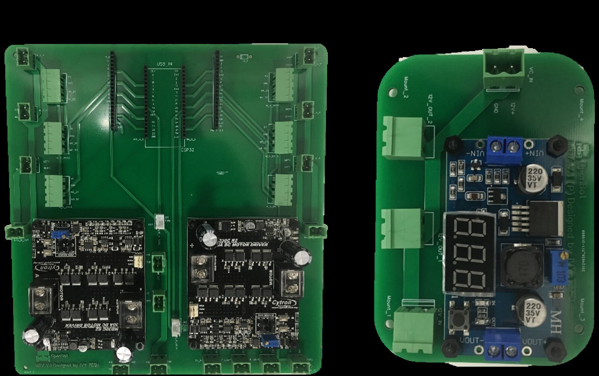

## Elektronik- und Steuerungsentwicklung

  <a href="README.md">English</a> |
  <a href="README.zh-CN.md">简体中文</a> |
  Deutsch |
  <a href="README.fr-FR.md">Français</a> |
  <a href="README.es-ES.md">Español</a>

### Übersicht der Steuerungsarchitektur des MTV

Die Steuerungsarchitektur des MTV ist vom kaskadierten Typ. Die hochrangigen Befehle werden auf einem Smartphone berechnet, das das Intel [OpenBot](https://www.openbot.org/) Framework ausführt. Diese Befehle werden dann an ein ESP32 Low-Level-Steuerungsboard weitergegeben, das die PWM-Generierung sowie die Kommunikation mit den verschiedenen MTV-Sensoren (z.B. Encoder, Sonare usw.) übernimmt.

  

Das ESP32 Low-Level-Steuerungsboard kommuniziert über eine dedizierte Seriell-USB-Schnittstelle mit dem Smartphone.

### Komponentenarchitektur und PCB-Entwicklung

Die Fortbewegung des MTV basiert auf sechs 12V Gleichstrommotoren, nämlich drei Motoren auf jeder Seite des Rovers. Jeder Motor ist mit einem Planetengetriebe sowie einem eingebauten magnetischen Encoder ausgestattet, der die Geschwindigkeitsabschätzung ermöglicht. Daher wurden für die Entwicklung zwei einzelne Motortreiber ausgewählt. Aufgrund des erforderlichen hohen Stromverbrauchs wurden robuste Motortreiber in das Design aufgenommen. Für diese Entwicklung wurden handelsübliche Motortreiber vorgeschlagen, da sie modular sind, d.h. die Möglichkeit bieten, Motortreiber bei Bedarf auszutauschen. Die gesamte Komponentenarchitektur des MTV ist in der folgenden Abbildung dargestellt:

  

Die Gesamtgröße wurde als einer der begrenzenden Faktoren bei der Gestaltung der PCB berücksichtigt. Daher wurde das Design der PCB in zwei Hauptteile aufgeteilt, wie unten dargestellt. Das heißt, Haupt-PCB und Stromverteilungs-PCB. Die Haupt-PCB beherbergt die Hauptkomponenten des Systems, wie ESP32 MCU, 2 Motortreiber, Motoranschlüsse usw. Die Stromverteilungs-PCB wurde entwickelt, um die 11,1V-12V Eingangsbatterieversorgung in 12V und 5V umzuwandeln. Das heißt, 12V Versorgung: Motortreiber. 5V Versorgung: ESP 32, Motor-Encoder, Front- und Rücklichter. Für das Design des MTV wurde eine wiederaufladbare 11,1V LiPo-Batterie verwendet. Daher wurde ein Spannungsanzeige als Batterieanzeige hinzugefügt.

  

Ein Satz maßgeschneiderter 2-lagiger PCBs wurde für die Stromerzeugung und Steuerungszwecke entworfen:

  

  

  

Alle Schnittstellenanschlüsse der PCB wurden mit Modularität und einfacher Plug-and-Play-Fähigkeit entworfen. Darüber hinaus wurden 12V Stromleitungen und 5V Signalleitungen getrennt gehalten, um potenzielle Störungen zu minimieren. Einige zusätzliche 5V und 12V Stromausgangsanschlüsse wurden in das Design aufgenommen, um zukünftige Erweiterungen zu ermöglichen. Darüber hinaus wurden zusätzliche Stiftleisten parallel zum ESP32 hinzugefügt, sodass die Benutzer die PCB als Entwicklungsboard für zukünftige Erweiterungsaktivitäten verwenden können. Prototypisierte (teilweise verdrahtete und mit ESP 32 und Motortreibern) PCBs sind in den folgenden Abbildungen dargestellt:

  

  

