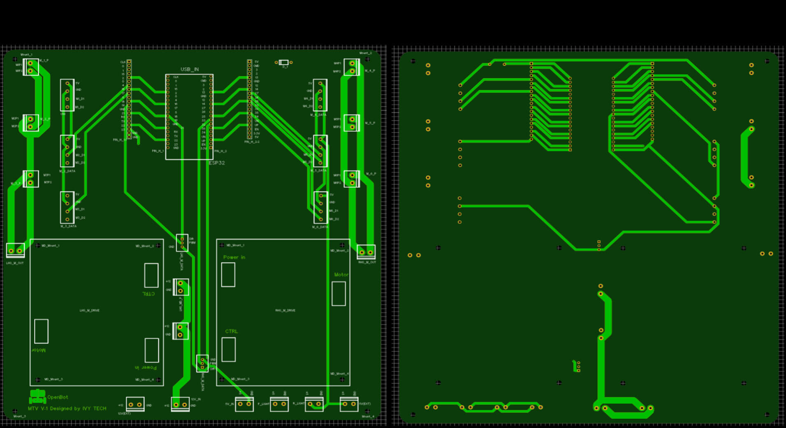

## Desarrollo de Electrónica y Control

  <a href="README.md">English</a> |
  <a href="README.zh-CN.md">简体中文</a> |
  <a href="README.de-DE.md">Deutsch</a> |
  <a href="README.fr-FR.md">Français</a> |
  Español

### Resumen de la arquitectura de control del MTV

La arquitectura de control del MTV es de tipo en cascada. Los comandos de alto nivel se calculan en un smartphone que ejecuta el marco de trabajo de Intel [OpenBot](https://www.openbot.org/). Estos comandos se pasan a una placa de control de bajo nivel ESP32 que maneja la generación de PWM así como la comunicación con los diferentes sensores del MTV (por ejemplo, encoders, sonares, etc.).

  

La placa de control de bajo nivel ESP32 se comunica con el smartphone a través de una interfaz serial-USB dedicada.

### Arquitectura de componentes y desarrollo de PCB

La locomoción del MTV se basa en seis motores de corriente continua de 12V, es decir, tres motores en cada lado del rover. Cada motor está equipado con una caja de engranajes planetarios y un encoder magnético incorporado, lo que permite la estimación de la velocidad. Por lo tanto, se seleccionaron dos controladores de motor individuales para el desarrollo. Debido al alto consumo de corriente requerido, se añadieron controladores de motor de alta resistencia al diseño. Se propusieron controladores de motor comerciales para este desarrollo debido a la modularidad, es decir, la capacidad de cambiar los controladores de motor cuando sea necesario. La arquitectura general de componentes del MTV se ilustra en la siguiente figura:

  

El tamaño general se consideró como uno de los factores limitantes al diseñar la PCB. Por lo tanto, el diseño de la PCB se dividió en dos partes principales como se ilustra a continuación, es decir, PCB principal y PCB de distribución de energía. La PCB principal acomoda los componentes principales del sistema, como el MCU ESP32, 2 controladores de motor, conexiones de motor, etc. La PCB de distribución de energía se diseñó para convertir el suministro de batería de entrada de 11.1V-12V en 12V y 5V. Es decir, suministro de 12V: controladores de motor. Suministro de 5V: ESP 32, encoders de motor, luces delanteras y traseras. Se utilizó una batería recargable LiPo de 11.1V para el diseño del MTV. Por lo tanto, se añadió una pantalla de voltaje como indicador del nivel de batería.

  

Se diseñó un conjunto de PCBs personalizadas de 2 capas para propósitos de generación de energía y control:

  

  

  

Todos los puertos de interfaz de componentes de la PCB se diseñaron con modularidad y capacidad de fácil conexión y desconexión. Además, las líneas de alimentación de 12V y las líneas de señal de 5V se mantuvieron separadas para minimizar posibles interferencias. Se añadieron algunos puertos de salida de energía adicionales de 5V y 12V al diseño para permitir futuras expansiones. Además, se añadieron pines adicionales en paralelo con el ESP32, para que los usuarios puedan usar la PCB como una placa de desarrollo para actividades de expansión futuras. Las PCBs prototipadas (parcialmente cableadas y con ESP 32 y controladores de motor) se ilustran en las siguientes figuras:

  

  

