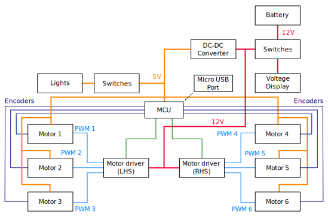

## Développement d'électronique et de contrôle

  <a href="README.md">English</a> |
  <a href="README.zh-CN.md">简体中文</a> |
  <a href="README.de-DE.md">Deutsch</a> |
  Français |
  <a href="README.es-ES.md">Español</a>

### Vue d'ensemble de l'architecture de contrôle du MTV

L'architecture de contrôle du MTV est de type en cascade. Les commandes de haut niveau sont calculées sur un smartphone, utilisant le framework Intel [OpenBot](https://www.openbot.org/). Ces commandes sont ensuite transmises à une carte de contrôle de bas niveau ESP32 qui gère la génération de PWM ainsi que la communication avec les différents capteurs du MTV (par exemple, les encodeurs, les sonars, etc.).

  

La carte de contrôle de bas niveau ESP32 communique avec le smartphone via une interface série-USB dédiée.

### Architecture des composants et développement de PCB

La locomotion du MTV est construite autour de six moteurs à courant continu de 12V, soit trois moteurs de chaque côté du rover. Chaque moteur est équipé d'une boîte de vitesses planétaire ainsi que d'un encodeur magnétique intégré, permettant l'estimation de la vitesse. Par conséquent, deux pilotes de moteur simples ont été sélectionnés pour le développement. En raison de la consommation de courant élevée requise, des pilotes de moteur robustes ont été ajoutés à la conception. Des pilotes de moteur prêts à l'emploi ont été proposés pour ce développement en raison de la modularité, c'est-à-dire la capacité de changer les pilotes de moteur si nécessaire. L'architecture globale des composants du MTV est illustrée dans la figure suivante :

  

La taille globale a été considérée comme l'un des facteurs limitants lors de la conception du PCB. Par conséquent, la conception du PCB a été divisée en deux parties principales comme illustré ci-dessous, à savoir le PCB principal et le PCB de distribution de puissance. Le PCB principal accueille les principaux composants du système, tels que le MCU ESP32, 2 pilotes de moteur, les connexions des moteurs, etc. Le PCB de distribution de puissance a été conçu pour convertir l'alimentation de la batterie d'entrée de 11,1V-12V en 12V et 5V. c'est-à-dire alimentation 12V : pilotes de moteur. Alimentation 5V : ESP 32, encodeurs de moteur, feux avant et arrière. Une batterie LiPo rechargeable de 11,1V a été utilisée pour la conception du MTV. Par conséquent, un affichage de la tension a été ajouté comme indicateur de niveau de batterie.

  

Un ensemble de PCBs personnalisés à 2 couches ont été conçus pour la génération de puissance et les fins de contrôle :

  

  

  

Tous les ports d'interface des composants du PCB ont été conçus avec la modularité et la capacité de plug-and-play facile. De plus, les lignes d'alimentation 12V et les lignes de signal 5V ont été séparées afin de minimiser les interférences potentielles. Quelques ports de sortie d'alimentation supplémentaires de 5V et 12V ont été ajoutés à la conception pour permettre des extensions futures. De plus, des broches supplémentaires ont été ajoutées en parallèle avec l'ESP32, afin que les utilisateurs puissent utiliser le PCB comme une carte de développement pour des activités d'expansion futures. Les PCBs prototypés (partiellement câblés et avec ESP 32 et pilotes de moteur) sont illustrés dans les figures suivantes :

  

  

