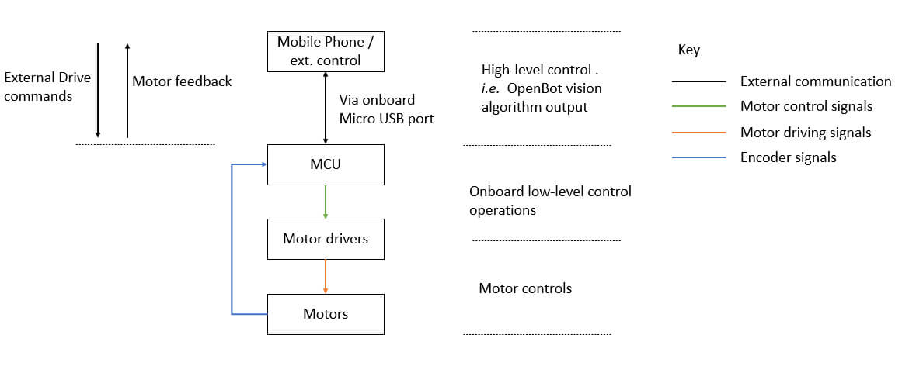
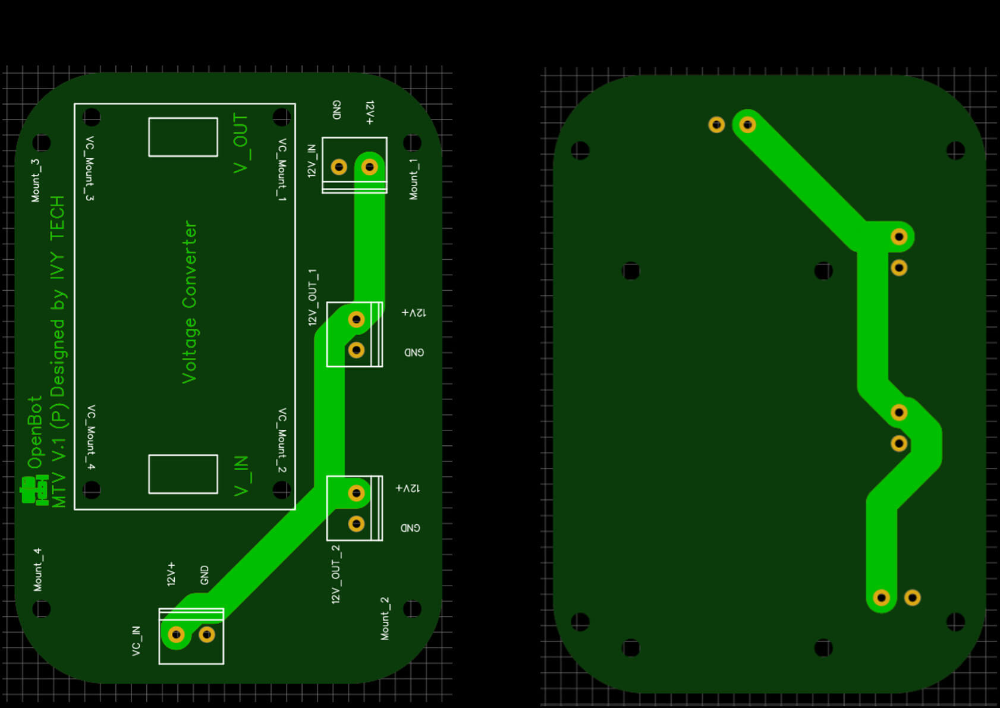
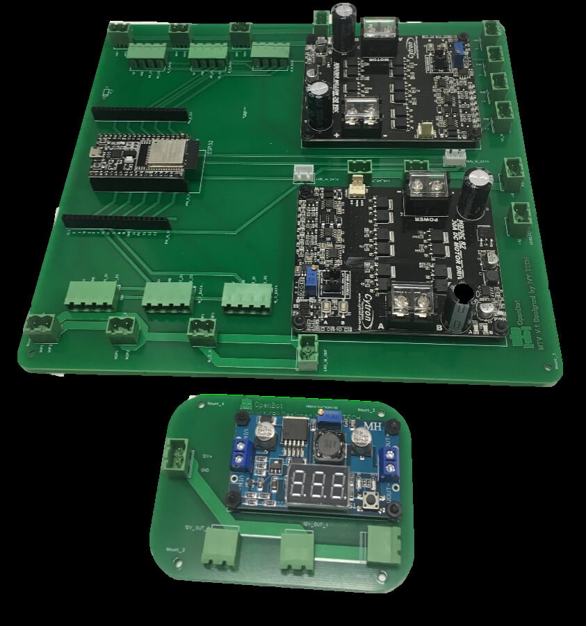

## 전자 및 제어 개발

  <a href="README.md">English</a> |
  <a href="README.zh-CN.md">简体中文</a> |
  <a href="README.de-DE.md">Deutsch</a> |
  <a href="README.fr-FR.md">Français</a> |
  <a href="README.es-ES.md">Español</a> |
  한국어

### MTV 제어 아키텍처 개요

MTV의 제어 아키텍처는 계단식 구조입니다. 고급 명령은 스마트폰에서 계산되며, 여기서는 Intel의 [OpenBot](https://www.openbot.org/) 프레임워크가 실행됩니다. 이 명령은 ESP32 저수준 제어 보드로 전달되어 PWM 생성과 다양한 MTV 센서(예: 인코더, 소나 등)와의 통신을 처리합니다.

  

ESP32 저수준 제어 보드는 전용 직렬-USB 인터페이스를 통해 스마트폰과 통신합니다.

### 컴포넌트 아키텍처 및 PCB 개발

MTV의 이동은 총 6개의 12V DC 모터를 중심으로 구성되어 있습니다. 즉, 로버의 각 측면에 3개의 모터가 배치되어 있습니다. 각 모터는 속도 추정이 가능한 자이로스코프와 내장된 자석 엔코더를 갖춘 플래네터리 기어박스를 장착하고 있습니다. 따라서 2개의 단일 모터 드라이버가 개발을 위해 선택되었습니다. 높은 전류 소모가 요구되기 때문에, 고강도 모터 드라이버가 설계에 추가되었습니다. 모듈화(필요할 때 모터 드라이버를 변경할 수 있는 능력)가 가능하기 때문에, 기존의 모터 드라이버를 제안하여 개발하였습니다. MTV의 전체적인 컴포넌트 아키텍처는 아래 그림과 같습니다:

  

전체 크기는 PCB를 설계하는 데 있어 중요한 제한 요소로 고려되었습니다. 그래서 PCB 설계는 두 가지 주요 부분으로 나누어졌습니다. 즉, 메인 PCB와 전원 분배 PCB입니다. 메인 PCB는 시스템의 주요 컴포넌트인 ESP32 MCU, 2개의 모터 드라이버, 모터 연결 등을 수용합니다. 전원 분배 PCB는 11.1V-12V 입력 배터리 전원을 12V와 5V로 변환하는 역할을 합니다. 즉, 12V 공급은 모터 드라이버에, 5V 공급은 ESP32, 모터 엔코더, 전/후면 라이트에 공급됩니다. MTV 설계를 위해 11.1V 리포 배터리가 사용되었습니다. 그래서 배터리 잔량을 표시할 수 있도록 전압 표시기가 추가되었습니다.

  

전력 생성 및 제어 용도로 사용될 맞춤형 2층 PCB 세트가 설계되었습니다:

  

  

  

PCB의 모든 컴포넌트 인터페이스 포트는 모듈화 및 쉽게 플러그 앤 플레이가 가능하도록 설계되었습니다. 또한, 12V 전원선과 5V 신호선을 분리하여 잠재적인 간섭을 최소화했습니다. 미래의 확장을 위해 몇 가지 추가적인 5V 및 12V 전원 출력 포트가 설계에 추가되었습니다. 또한, ESP32와 병렬로 추가 핀 헤더가 추가되어 사용자가 이 PCB를 미래의 확장 활동을 위한 개발 보드로 사용할 수 있도록 했습니다. 프로토타입(부분적으로 배선이 연결된 ESP32와 모터 드라이버가 포함된) PCB는 아래 그림에서 확인할 수 있습니다:

  

  

