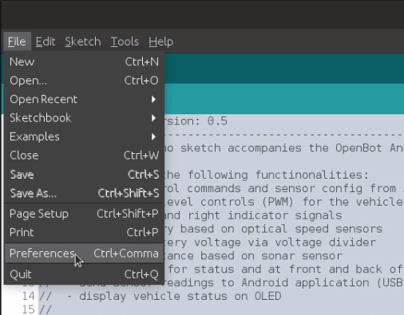

## Programming the MTV

### Prerequisites: Arduino IDE Installed

Before starting this installation procedure, make sure you have the latest version of the Arduino IDE installed in your computer. If you don’t, uninstall it and install it again. Otherwise, it may not work.

Having the latest Arduino IDE software installed from [arduino.cc/en/Main/Software](https://www.arduino.cc/en/software), continue with this tutorial.

### Installing ESP32 Add-on in Arduino IDE

To install the ESP32 board in your Arduino IDE, follow these next instructions:

1. In your Arduino IDE, go to **File> Preferences**:

  

2. Enter *https://dl.espressif.com/dl/package_esp32_index.json* into the “*Additional Board Manager URLs*” field as shown in the figure below. Then, click the “OK” button:

  

**Note:** if you already have the ESP8266 boards URL, you can separate the URLs with a comma as follows:

    https://dl.espressif.com/dl/package_esp32_index.json, 
    http://arduino.esp8266.com/stable/package_esp8266com_index.json

3. Open the Boards Manager. Go to **Tools > Board > Boards Manager**:

  

4. Search for ESP32 and press install button for the “ESP32 by Espressif Systems“:

  

5. You should now have everything to successfully flash the ESP32 board of the MTV using the Arduino development envinronment

  

6. To flash the MTV with your new code, simply select **ESP32 Dev Module** in the menu **Tools > Board > ESP32 Arduino**. Note that additional content as well as troubleshooting of the ESP32 flashing prcess can be found in the following [link](https://randomnerdtutorials.com/installing-the-esp32-board-in-arduino-ide-windows-instructions/).

## Electronics and Control Development 

### Control architecture overview of the MTV

The MTV is inspired by several exploration vehicle concepts developed over the past decades for lunar and Martian exploration. The MTV is designed around a set of 6 actuated wheels, organized in a Rocker-Bogie configuration. Unlike most lunar or Martian rovers, the wheels cannot rotate radially. The vehicle therefore operates in the same way as a tank, which makes manual control rather intuitive. The MTV control architecture is of cascaded type. The high level commands are computed on a smartphone, running the Intel [OpenBot](https://www.openbot.org/) deep reinforcement learning framework. These commands are then passed to a ESP32 low-level control board which handles PWM generation as well as communication with the different MTV sensors (e.g. encoders, sonars and so on).

  

The ESP32 low-level control board communicates with the smartphone through a dedicated serial-USB interface. The command strings have the following structure: 

- | **Drive letter** | **LHS speed** | **RHS speed** |

The velocity signal within a given command string is encoded as a pair of values ranging from 0 to 255, where 0 represent a stop state and 255 represent the maximum possible speed. 

| Example external commands (Serial input via Micro-USB) | Function |
|:---------|:---------|
|W.255.255| Move forward with full speed |
|S.255.255| Move backward with full speed |
|A.255.255| Turn Left (like a tank) with full speed  |
|D.255.255| Turn Right (like a tank) with full speed  |
|X.255.255| Stop (speed irrelevant) |
|W.100.255| Turn left with a radius (speeds will determine the radius) |
|W.255.100| Turn right with a radius (speeds will determine the radius) |

### Component architecture and PCB development  

The locomotion of the MTV is built around six 12V DC motors, namely three motors on each side of the rover. Each motor is equipped with a planetary gearbox as well as an inbuilt magnetic encoder, allowing velocity estimation. Therefore, 2 single motor drivers were selected for the development.  Due to the required high current consummation, heavy duty motor drivers were added to the design. Off-the-shelf motor drivers were proposed for this development due to the modularity i.e., ability to change motor drivers when needed. The overall component architecture of the MTV is illustrated in the follwing figure:

  

The Overall size was a considered as one of the limiting factors while designing the PCB. Therefore, the design of the PCB was split in to two main parts as illustrated below. i.e., Main PCB and Power distribution PCB. The Main PCB accommodates the main components of the system, such as ESP32 MCU, 2 Motor drivers, motor connections, etc. The power distribution PCB was designed to covert the 11.1V-12V input battery supply in to 12V and 5V. i.e. 12V supply: Motor drivers. 5V supply: ESP 32, Motor Encoders, Front & rear lights. A rechargeable 11.1V LiPo battery was used for the design of the MTV. Therefore, a voltage display was added as a battery level indicator.

  

A set of custom build 2-layer PCBs were designed for power generation and control purposes:

  

  

  

All the component interface ports of the PCB were designed with the modularity and easy plug-and-play capability. Moreover, 12V power lines and 5V signal lines were kept apart in order to minimize potential interferences. Few additional 5V and 12 V power output ports were added to the design in order to allow future expansions. Moreover, additional pin headers were added in parallel with the ESP32, so the users can use the PCB as a development board for future expansion activities. Prototyped (partially wired and with ESP 32 and motor drivers) PCBs are illustrated in the following figures: 

  

  

## 3. Component List 

The items required for the assembly of MTV are broken down into the following categories:
1. 3D printed parts 
2. Externally sourced components
3. PCB components
  
### 3D printed parts 

### PCB components

<table>
    <thead>
        <tr>
            <th>PCB </th>
            <th>Port Name printed on the PCB</th>
            <th>Component to be mounted</th>
            <th>Picture</th>
            <th>Comments </th>
        </tr>
    </thead>
    <tbody>
        <tr>
            <td rowspan=32>Main PCB </td>
            <td>M_1_P </td>
            <td>2 Pin 5.08mm Pitch PCB Screw Terminal Block </td>
            <td>
 
</td>
            <td>Connection for the Motor 1 power terminal (≈ 11-12V)</td>
        </tr>
        <tr>
            <td>M_2_P </td>
            <td>2 Pin 5.08mm Pitch PCB Screw Terminal Block </td>
            <td>
 
</td>
            <td>Connection for the Motor 2 power terminal (≈ 11-12V)</td>
        </tr>
        <tr>
            <td>M_3_P </td>
            <td>2 Pin 5.08mm Pitch PCB Screw Terminal Block </td>
            <td>
 
</td>
            <td>Connection for the Motor 3 power terminal (≈ 11-12V)</td>
        </tr>
        <tr>
            <td>M_4_P </td>
            <td>2 Pin 5.08mm Pitch PCB Screw Terminal Block </td>
            <td>
 
</td>
            <td>Connection for the Motor 4 power terminal (≈ 11-12V)</td>
        </tr>
        <tr>
            <td>M_5_P </td>
            <td>2 Pin 5.08mm Pitch PCB Screw Terminal Block </td>
            <td>
 
</td>
            <td>Connection for the Motor 5 power terminal (≈ 11-12V)</td>
        </tr>
        <tr>
            <td>M_6_P </td>
            <td>2 Pin 5.08mm Pitch PCB Screw Terminal Block </td>
            <td>
 
</td>
            <td>Connection for the Motor 6 power terminal (≈ 11-12V)</td>
        </tr>
        <tr>
            <td>M_1_DATA </td>
            <td>2 Pin 5.08mm Pitch PCB Screw Terminal Block </td>
            <td>
 
</td>
            <td>Connection for the Motor 1 encoder terminal (≈ 5V). Encoder power & readings </td>
        </tr>
        <tr>
            <td>M_2_DATA </td>
            <td>2 Pin 5.08mm Pitch PCB Screw Terminal Block </td>
            <td>
 
</td>
            <td>Connection for the Motor 2 encoder terminal (≈ 5V). Encoder power & readings </td>
        </tr>
        <tr>
            <td>M_3_DATA </td>
            <td>2 Pin 5.08mm Pitch PCB Screw Terminal Block </td>
            <td>
 
</td>
            <td>Connection for the Motor 3 encoder terminal (≈ 5V). Encoder power & readings </td>
        </tr>
        <tr>
            <td>M_4_DATA </td>
            <td>2 Pin 5.08mm Pitch PCB Screw Terminal Block </td>
            <td>
 
</td>
            <td>Connection for the Motor 4 encoder terminal (≈ 5V). Encoder power & readings </td>
        </tr>
        <tr>
            <td>M_5_DATA </td>
            <td>2 Pin 5.08mm Pitch PCB Screw Terminal Block </td>
            <td>
 
</td>
            <td>Connection for the Motor 5 encoder terminal (≈ 5V). Encoder power & readings </td>
        </tr>
        <tr>
            <td>M_6_DATA </td>
            <td>2 Pin 5.08mm Pitch PCB Screw Terminal Block </td>
            <td>
 
</td>
            <td>Connection for the Motor 6 encoder terminal (≈ 5V). Encoder power & readings </td>
        </tr>
        <tr>
            <td>PIN_H_1 </td>
            <td>2.54mm PCB Female Header Connector </td>
            <td>
 
</td>
            <td>Plug the ESP 32 MCU</td>
        </tr>
        <tr>
            <td>PIN_H_2 </td>
            <td>2.54mm PCB Female Header Connector </td>
            <td>
 
</td>
            <td>Plug the ESP 32 MCU</td>
        </tr>
        <tr>
            <td>PIN_H_1.1 </td>
            <td>2.54mm PCB Female Header Connector </td>
            <td>
 
</td>
            <td>Additional development connections for ESP 32 </td>
        </tr>
        <tr>
            <td>PIN_H_2.1</td>
            <td>2.54mm PCB Female Header Connector </td>
            <td>
 
</td>
            <td>Additional development connections for ESP 32 </td>
        </tr>
        <tr>
            <td>ESP 32 </td>
            <td>ESP32 Development Board</td>
            <td>
 
</td>
            <td>MCU selected for this development. To be connected to the PCB using  PIN_H_1 and PIN_H_2</td>
        </tr>
        <tr>
            <td>D_1 </td>
            <td>1N4001 Diode</td>
            <td>
 
</td>
            <td>Diode between the ESP 32 5V power terminal and PCB 5V power line. To stop voltage flow into the PCB when the EPS 32 is connected to a USB</td>
        </tr>
        <tr>
            <td>LHS_M_OUT </td>
            <td>2 Pin 5.08mm Pitch PCB Screw Terminal Block </td>
            <td>
 
</td>
            <td>Connection for the output of the LHS motor driver </td>
        </tr>
        <tr>
            <td>RHS_M_OUT </td>
            <td>2 Pin 5.08mm Pitch PCB Screw Terminal Block </td>
            <td>
 
</td>
            <td>Connection for the output of the RHS motor driver </td>
        </tr>
        <tr>
            <td>LHS_MD_P </td>
            <td>2 Pin 5.08mm Pitch PCB Screw Terminal Block </td>
            <td>
 
</td>
            <td>Connection for the power terminal of the LHS motor driver </td>
        </tr>
        <tr>
            <td>RHS_MD_P </td>
            <td>2 Pin 5.08mm Pitch PCB Screw Terminal Block </td>
            <td>
 
</td>
            <td>Connection for the power terminal of the LHS motor driver </td>
        </tr>
        <tr>
            <td>LHS_M_DATA </td>
            <td>2 Pin 5.08mm Pitch PCB Screw Terminal Block </td>
            <td>
 
</td>
            <td>Connection for the LHS motor driver control signals </td>
        </tr>
        <tr>
            <td>RHS_M_DATA </td>
            <td>2 Pin 5.08mm Pitch PCB Screw Terminal Block </td>
            <td>
 
</td>
            <td>Connection for the LHS motor driver control signals </td>
        </tr>
        <tr>
            <td>LHS_M_DRIVE </td>
            <td>2 Pin 5.08mm Pitch PCB Screw Terminal Block </td>
            <td>
 
</td>
            <td>Motor driver to be mounted on PCB (LHS). Check the orientation of the driver before placement </td>
        </tr>
        <tr>
            <td>RHS_M_DRIVE </td>
            <td>2 Pin 5.08mm Pitch PCB Screw Terminal Block </td>
            <td>
 
</td>
            <td>Motor driver to be mounted on PCB (RHS). Check the orientation of the driver before placement </td>
        </tr>
        <tr>
            <td>12V_IN </td>
            <td>2 Pin 5.08mm Pitch PCB Screw Terminal Block </td>
            <td>
 
</td>
            <td>12V power supply input for the Main PCB </td>
        </tr>
        <tr>
            <td>12V(EXT) </td>
            <td>2 Pin 5.08mm Pitch PCB Screw Terminal Block </td>
            <td>
 
</td>
            <td>Additional 12V output terminal for future expansions</td>
        </tr>
        <tr>
            <td>5V_IN </td>
            <td>2 Pin 5.08mm Pitch PCB Screw Terminal Block </td>
            <td>
 
</td>
            <td>5V power supply input for the Main PCB</td>
        </tr>
        <tr>
            <td>5V(EXT) </td>
            <td>2 Pin 5.08mm Pitch PCB Screw Terminal Block </td>
            <td>
 
</td>
            <td>Additional 5V output terminal for future expansions</td>
        </tr>
        <tr>
            <td>F_LIGHT </td>
            <td>2 Pin 5.08mm Pitch PCB Screw Terminal Block </td>
            <td>
 
</td>
            <td>Connection for the front lights </td>
        </tr>
        <tr>
            <td>R_LIGHT </td>
            <td>2 Pin 5.08mm Pitch PCB Screw Terminal Block </td>
            <td>
 
</td>
            <td>Connection for the rear lights </td>
        </tr>
        <tr>
            <td rowspan=5>Power Distribution PCB </td>
            <td>12V_IN </td>
            <td>2 Pin 5.08mm Pitch PCB Screw Terminal Block </td>
            <td>
 
</td>
            <td>Connection for the battery output </td>
        </tr>
        <tr>
            <td>12V_OUT_1 </td>
            <td>2 Pin 5.08mm Pitch PCB Screw Terminal Block </td>
            <td>
 
</td>
            <td>Connection for the voltage meter (display) </td>
        </tr>
        <tr>
            <td>12V_OUT_2 </td>
            <td>2 Pin 5.08mm Pitch PCB Screw Terminal Block </td>
            <td>
 
</td>
            <td>Connection for the Main PCB 12V supply  </td>
        </tr>
        <tr>
            <td>VC_IN </td>
            <td>2 Pin 5.08mm Pitch PCB Screw Terminal Block </td>
            <td>
 
</td>
            <td>Voltage converter input power supply connection   </td>
        </tr>
        <tr>
            <td>DC-DC converter </td>
            <td>Adjustable LM2596S DC-DC Buck Converter</td>
            <td>
 
</td>
            <td>Voltage Converter to convert voltage battery to 5V ( output of the  voltage converter  should be adjusted to 5V before connected to the main PCB) </td>
        </tr>
</table>

