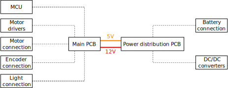

## Electronics and Control Development 

  English |
  <a href="README.zh-CN.md">简体中文</a> |
  <a href="README.de-DE.md">Deutsch</a> |
  <a href="README.fr-FR.md">Français</a> |
  <a href="README.es-ES.md">Español</a>

### Control architecture overview of the MTV

The MTV control architecture is of cascaded type. The high level commands are computed on a smartphone, running the Intel [OpenBot](https://www.openbot.org/) framework. These commands are then passed to a ESP32 low-level control board which handles PWM generation as well as communication with the different MTV sensors (e.g. encoders, sonars and so on).

  

The ESP32 low-level control board communicates with the smartphone through a dedicated serial-USB interface. 

### Component architecture and PCB development  

The locomotion of the MTV is built around six 12V DC motors, namely three motors on each side of the rover. Each motor is equipped with a planetary gearbox as well as an inbuilt magnetic encoder, allowing velocity estimation. Therefore, 2 single motor drivers were selected for the development.  Due to the required high current consummation, heavy duty motor drivers were added to the design. Off-the-shelf motor drivers were proposed for this development due to the modularity i.e., ability to change motor drivers when needed. The overall component architecture of the MTV is illustrated in the follwing figure:

  

The Overall size was a considered as one of the limiting factors while designing the PCB. Therefore, the design of the PCB was split in to two main parts as illustrated below. i.e., Main PCB and Power distribution PCB. The Main PCB accommodates the main components of the system, such as ESP32 MCU, 2 Motor drivers, motor connections, etc. The power distribution PCB was designed to covert the 11.1V-12V input battery supply in to 12V and 5V. i.e. 12V supply: Motor drivers. 5V supply: ESP 32, Motor Encoders, Front & rear lights. A rechargeable 11.1V LiPo battery was used for the design of the MTV. Therefore, a voltage display was added as a battery level indicator.

  

A set of custom build 2-layer PCBs were designed for power generation and control purposes:

  

  

  

All the component interface ports of the PCB were designed with the modularity and easy plug-and-play capability. Moreover, 12V power lines and 5V signal lines were kept apart in order to minimize potential interferences. Few additional 5V and 12 V power output ports were added to the design in order to allow future expansions. Moreover, additional pin headers were added in parallel with the ESP32, so the users can use the PCB as a development board for future expansion activities. Prototyped (partially wired and with ESP 32 and motor drivers) PCBs are illustrated in the following figures: 

  

  

