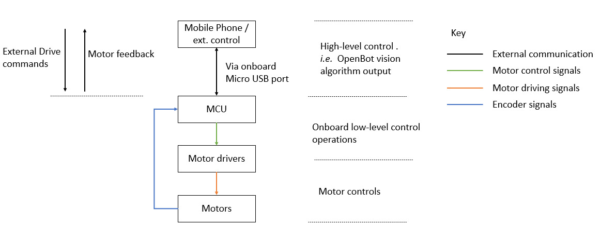
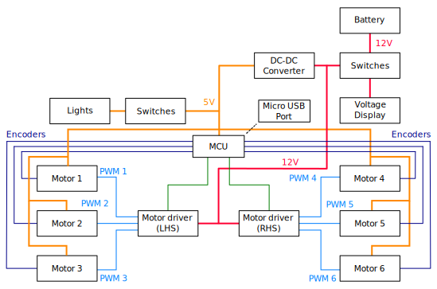
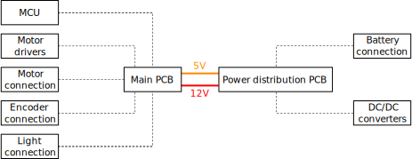
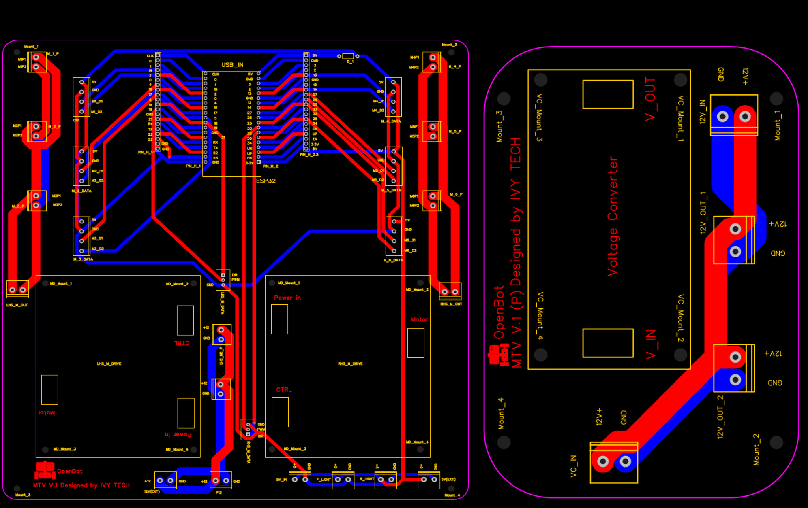
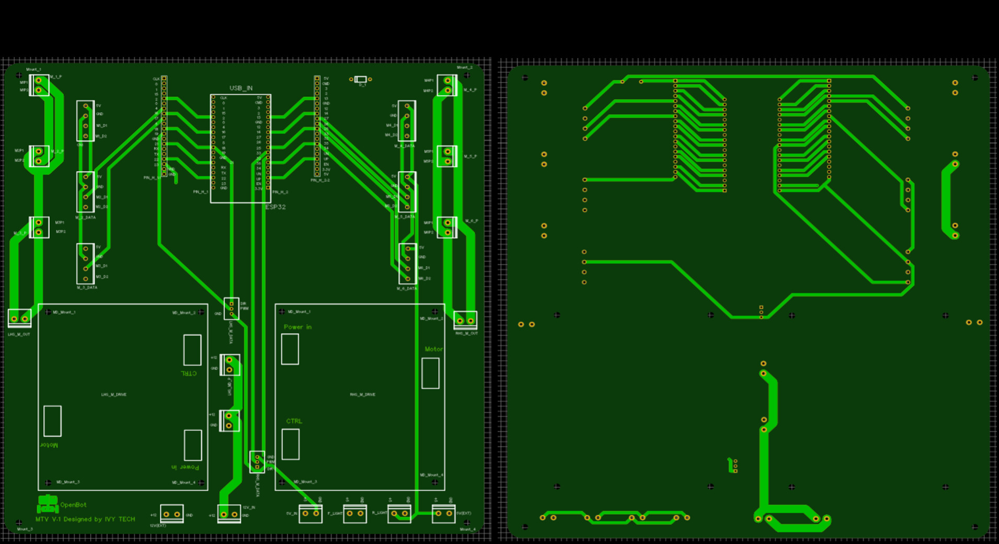
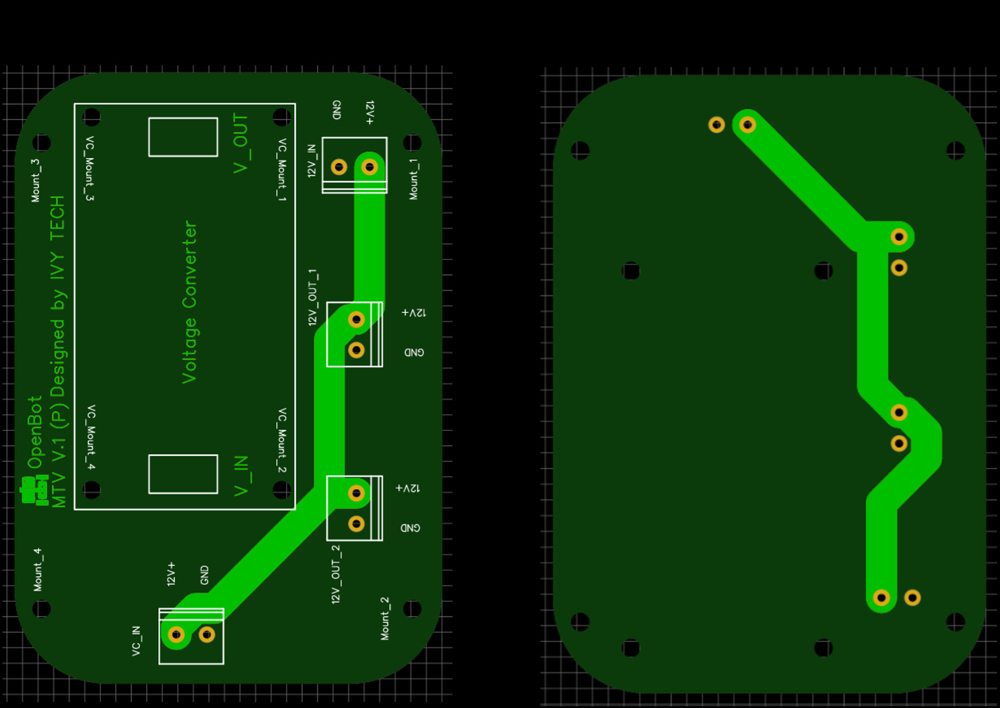
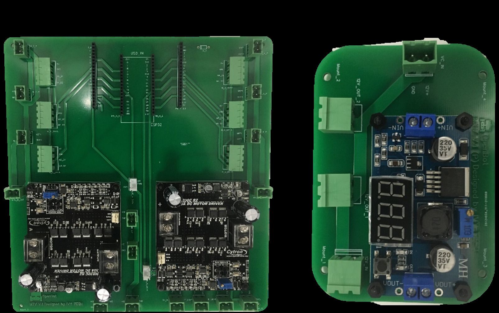
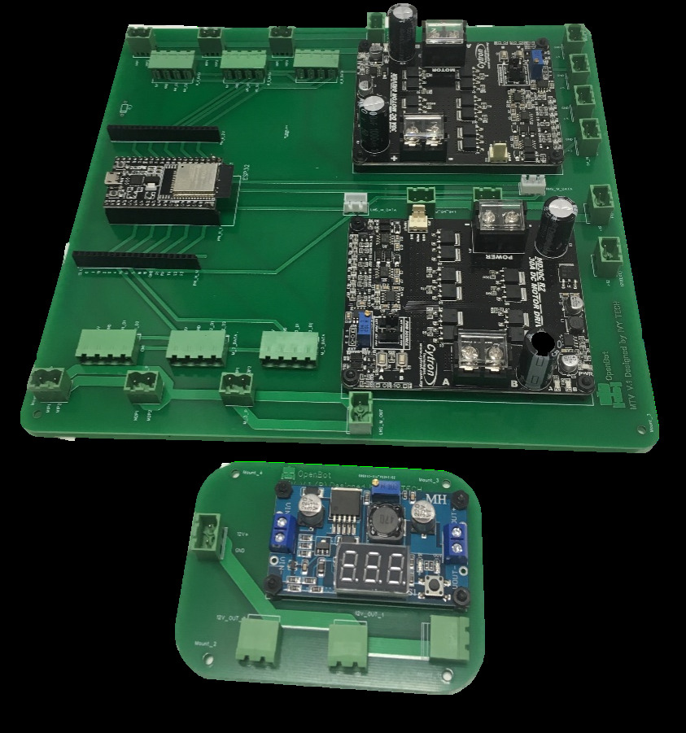

## 电子与控制开发

  <a href="README.md">English</a> |
  简体中文 |
  <a href="README.de-DE.md">Deutsch</a> |
  <a href="README.fr-FR.md">Français</a> |
  <a href="README.es-ES.md">Español</a>

### MTV控制架构概述

MTV的控制架构是级联类型的。高层命令由运行Intel [OpenBot](https://www.openbot.org/)框架的智能手机计算。这些命令然后传递给ESP32低级控制板，该控制板负责PWM生成以及与不同MTV传感器（如编码器、声纳等）的通信。

  

ESP32低级控制板通过专用的串行-USB接口与智能手机通信。

### 组件架构和PCB开发

MTV的运动系统围绕六个12V直流电机构建，即漫游车每侧三个电机。每个电机都配有行星齿轮箱以及内置磁编码器，允许速度估计。因此，选择了两个单电机驱动器进行开发。由于需要高电流消耗，设计中添加了重型电机驱动器。由于模块化的原因，即在需要时能够更换电机驱动器，提出了使用现成的电机驱动器进行开发。MTV的整体组件架构如下图所示：

  

在设计PCB时，整体尺寸被认为是一个限制因素。因此，PCB的设计被分为两个主要部分，如下所示。即主PCB和电源分配PCB。主PCB容纳系统的主要组件，如ESP32 MCU、2个电机驱动器、电机连接等。电源分配PCB被设计为将11.1V-12V输入电池电源转换为12V和5V。即12V电源：电机驱动器。5V电源：ESP32、电机编码器、前后灯。MTV的设计使用了可充电的11.1V LiPo电池。因此，添加了一个电压显示器作为电池电量指示器。

  

一组定制的2层PCB被设计用于电力生成和控制目的：

  

  

  

PCB的所有组件接口端口都设计为模块化和易于即插即用。此外，12V电源线和5V信号线分开布置，以尽量减少潜在的干扰。设计中还添加了一些额外的5V和12V电源输出端口，以便将来扩展。此外，还在ESP32并行添加了额外的针头，以便用户可以将PCB用作开发板进行未来的扩展活动。原型（部分布线并带有ESP32和电机驱动器）PCB如下图所示：

  

  

