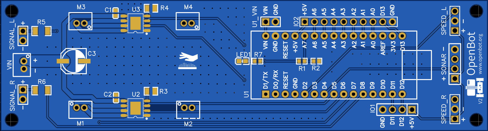
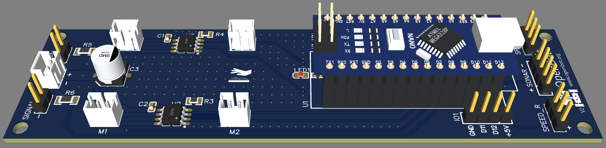
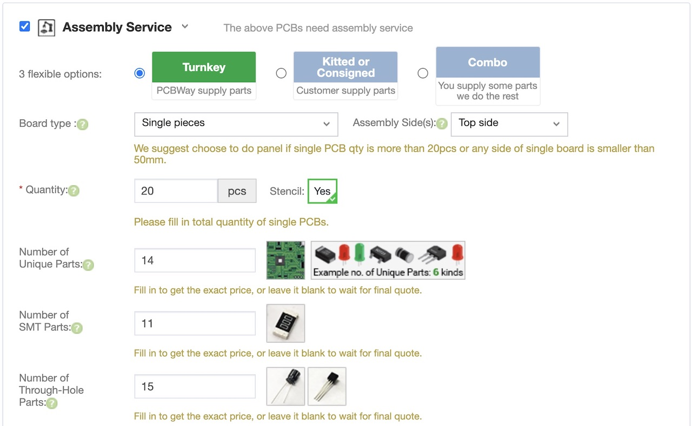

# Custom PCB

  English |
  <a href="README_CN.md">简体中文</a>

The custom PCB acts as a carrier board for the Arduino Nano and integrates modern motor drivers, the voltage divider circuit and resistors for the LEDs. The Arduino is simply plugged into the pin header and all sensors and LEDs are connected via Dupont cables to the appropriate connectors.

The latest PCB is [version 2](v2). Here are the changes compared to [version 1](v1):

- Move the right speed sensor to pin D3 to enable interrupt functionality
- Add Power LED for main battery
- Update some components which are more commonly available
- Update voltage divider to 20k/10k for better precision
- Change motor connectors to upright version for easier access

If you have already ordered [version 1](v1) of the PCB ([2D view](../docs/images/pcb_2d_v1.png), [3D view](../docs/images/pcb_3d_v1.png)), don't worry it will work fine. Just make sure to set the correct flag in the firmware.

The custom PCB involves the following steps:

1) **Order the PCB**: Download the [Gerber](v2/gerber_v2.zip) files and order the PCB at the vendor of your choice. You can also order the PCB directly on [PCBWay](https://www.pcbway.com/project/shareproject/OpenBot__Turning_Smartphones_into_Robots.html) where we have shared a project for OpenBot.
2) **Order the components:** Download the [BOM](v2/BOM_v2.csv) and order the compenents at the vendor of your choice, for example [LCSC](https://lcsc.com).
3) **Assembly of the PCB:** You can either assemble the PCB yourself or have them assembled by a vendor. For automated assembly you will need the [Centroid File](v2/centroid_file_v2.csv). If you order the PCB at [JLCPCB](https://jlcpcb.com/), you can use their SMT assembly service. Then you will only need to order and solder the through-hole components yourself. We found this to be the most convenient, cheapest and fastest option. In [version 2](v2) of the PCB, we have updated the components to make sure all of them are available from [JLCPCB](https://jlcpcb.com/) directly.

You can also find vendors that will provide you a TurnKey solution covering all 3 steps. They will manufacture the PCB, source the components and assemble the PCB. This is very convenient and also not too expensive. However, delivery times are often very long (1-3 months).

When requesting a quote at [PCBWay](https://www.pcbway.com/orderonline.aspx), you can select the assembly service after uploading the Gerber file.

In the next step, you will need to upload the [BOM](v2/BOM_v2.csv) and the [Centroid File](v2/centroid_file_v2.csv). Your quote will then be reviewed and updated within a few days. You can then choose to proceed with payment after reviewing cost and delivery time.