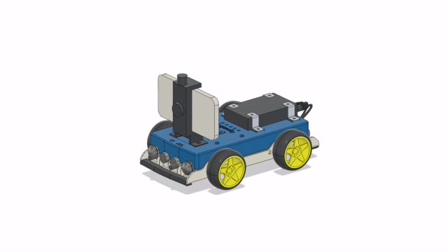

# OpenBot: 即插即用 (RTR) 车辆

<p align="center">
  <a href="README.md">English</a> |
  <span>简体中文</span> |
  <a href="README.de-DE.md">Deutsch</a> |
  <a href="README.fr-FR.md">Français</a> |
  <a href="README.es-ES.md">Español</a>
</p>

即插即用 (RTR) 版本的 OpenBot 车辆是面向那些没有意愿或时间自己组装机器人的用户。RTR 车辆配备了完全集成的电子设备，已经在固件层面得到了支持，并且从软件和硬件角度都经过了彻底测试。RTR 车辆有两种不同的版本，分别称为 "RTR_TT" 和 "RTR_520"。两种车辆都基于相同的防溅 ABS 外壳，但用途不同。RTR_TT 主要用于室内，而 RTR_520 配备了更强大的处理器、更好的电机、更坚固的金属齿轮箱，并且还配有一套全地形轮胎，支持室内和室外使用。
<p align="center">
  <a>  &nbsp
  </a>
  <a> 
  </a>
</p>

### 订购

RTR OpenBot 车辆可以在[这里](http://www.openbot.info/)订购。

## 自己组装 RTR

如果你想自己组装 OpenBot RTR，你需要打印底盘、制造 PCB 并购买电机和手机支架。

### 3D 打印

如果你仍然想打印自己的 OpenBot RTR，你需要打印以下部件。

1) ```shell_bottom``` ([STL](cad/rtr_bottom.stl), [STEP](cad/rtr_bottom.step))
2) ```shell_top``` ([STL](cad/rtr_top.stl), [STEP](cad/rtr_top.step)) 
3) ```phone_mount``` ([STL](cad/rtr_mount.stl), [STEP](cad/rtr_mount.step))

<p align="center">
  
</p>

### PCB

每个 PCB 都有三个文件。gerber 文件包含实际的 PCB，BOM（材料清单）文件包含所有要焊接到 PCB 上的组件，centroid 文件包含每个组件的坐标，用于自动 PCB 组装。基础板包含大多数组件。基础板有三种变体。变体 A 是一个带有外部电机驱动板和外部微控制器板连接器的裸板。变体 B 是一个带有外部微控制器针头的模块化板。变体 C 是完全集成的基础板，我们推荐大多数用户使用。前碰撞传感器板包含两个碰撞传感器、一个声纳传感器和 USB 驱动器。前碰撞传感器板有两种变体，一种是更便宜的 CH340G USB 驱动器，另一种是更可靠的 CP2102N USB 驱动器。根据你想要组装的版本（TT 电机或 520 电机），你将需要以下 PCB。

#### TT 电机

- 1x 基础板 (Arduino)
- 1x 状态 LED 板
- 1x 前/顶/后碰撞传感器板
- 4x 速度传感器板 (Arduino)

#### 520 电机

- 1x 基础板 (ESP32)
- 1x 状态 LED 板
- 1x 前/顶/后碰撞传感器板

#### 板参考

- 状态 LED 板 ([gerber](https://github.com/isl-org/OpenBot/blob/thias15/rtr/body/rtr/pcb/Gerber_Status_LED_Board_V1.zip),[bom](https://github.com/isl-org/OpenBot/blob/thias15/rtr/body/rtr/pcb/BOM_Status_LED_Board_V1.csv),[centroid](https://github.com/isl-org/OpenBot/blob/thias15/rtr/body/rtr/pcb/PickAndPlace_Status_LED_Board_V1.csv))
- 顶部碰撞传感器板 ([gerber](https://github.com/isl-org/OpenBot/blob/thias15/rtr/body/rtr/pcb/Gerber_BumpSensorTop_V1.zip),[bom](https://github.com/isl-org/OpenBot/blob/thias15/rtr/body/rtr/pcb/BOM_BumpSensorTop_V1.csv),[centroid](https://github.com/isl-org/OpenBot/blob/thias15/rtr/body/rtr/pcb/PickAndPlace_BumpSensorTop_V1.csv))
- 后部碰撞传感器板 ([gerber](https://github.com/isl-org/OpenBot/blob/thias15/rtr/body/rtr/pcb/Gerber_BumpSensorBack_V1.zip),[bom](https://github.com/isl-org/OpenBot/blob/thias15/rtr/body/rtr/pcb/BOM_BumpSensorBack_V1.csv),[centroid](https://github.com/isl-org/OpenBot/blob/thias15/rtr/body/rtr/pcb/PickAndPlace_BumpSensorBack_V1.csv))
- 前碰撞传感器板 (CH340G) ([gerber](https://github.com/isl-org/OpenBot/blob/thias15/rtr/body/rtr/pcb/Gerber_SensorBoardFront_CH340G_V1.zip),[bom](https://github.com/isl-org/OpenBot/blob/thias15/rtr/body/rtr/pcb/BOM_SensorBoardFront_CH340G_V1.csv),[centroid](https://github.com/isl-org/OpenBot/blob/thias15/rtr/body/rtr/pcb/PickAndPlace_SensorBoardFront_CH340G_V1.csv))
- 前碰撞传感器板 (CP2102N) ([gerber](https://github.com/isl-org/OpenBot/blob/thias15/rtr/body/rtr/pcb/Gerber_SensorBoardFront_CP2102N_V1.zip),[bom](https://github.com/isl-org/OpenBot/blob/thias15/rtr/body/rtr/pcb/BOM_SensorBoardFront_CP2102N_V1.csv),[centroid](https://github.com/isl-org/OpenBot/blob/thias15/rtr/body/rtr/pcb/PickAndPlace_SensorBoardFront_CP2102N_V1.csv))
- 速度传感器板 (Arduino) ([gerber](https://github.com/isl-org/OpenBot/blob/thias15/rtr/body/rtr/pcb/Gerber_SpeedSensor_Arduino_V1.zip),[bom](https://github.com/isl-org/OpenBot/blob/thias15/rtr/body/rtr/pcb/BOM_SpeedSensor_Arduino_V1.csv),[centroid](https://github.com/isl-org/OpenBot/blob/thias15/rtr/body/rtr/pcb/PickAndPlace_SpeedSensor_Arduino_V1.csv))
- 集成基础板 C (Arduino) ([gerber](https://github.com/isl-org/OpenBot/blob/thias15/rtr/body/rtr/pcb/Gerber_BaseBoard_Arduino_V1C.zip),[bom](https://github.com/isl-org/OpenBot/blob/thias15/rtr/body/rtr/pcb/BOM_BaseBoard_Arduino_V1C.csv),[centroid](https://github.com/isl-org/OpenBot/blob/thias15/rtr/body/rtr/pcb/PickAndPlace_BaseBoard_Arduino_V1C.csv))
- 集成基础板 C (ESP32) ([gerber](https://github.com/isl-org/OpenBot/blob/thias15/rtr/body/rtr/pcb/Gerber_BaseBoard_ESP32_V1C.zip),[bom](https://github.com/isl-org/OpenBot/blob/thias15/rtr/body/rtr/pcb/BOM_BaseBoard_ESP32_V1C.csv),[centroid](https://github.com/isl-org/OpenBot/blob/thias15/rtr/body/rtr/pcb/PickAndPlace_BaseBoard_ESP32_V1C.csv))
- 模块化基础板 B (Arduino) ([gerber](https://github.com/isl-org/OpenBot/blob/thias15/rtr/body/rtr/pcb/Gerber_BaseBoard_Arduino_V1B.zip),[bom](https://github.com/isl-org/OpenBot/blob/thias15/rtr/body/rtr/pcb/BOM_BaseBoard_Arduino_V1B.csv),[centroid](https://github.com/isl-org/OpenBot/blob/thias15/rtr/body/rtr/pcb/PickAndPlace_BaseBoard_Arduino_V1B.csv))
- 模块化基础板 B (ESP32) ([gerber](https://github.com/isl-org/OpenBot/blob/thias15/rtr/body/rtr/pcb/Gerber_BaseBoard_ESP32_V1B.zip),[bom](https://github.com/isl-org/OpenBot/blob/thias15/rtr/body/rtr/pcb/BOM_BaseBoard_ESP32_V1B.csv),[centroid](https://github.com/isl-org/OpenBot/blob/thias15/rtr/body/rtr/pcb/PickAndPlace_BaseBoard_ESP32_V1B.csv))
- 裸基础板 A (Arduino) ([gerber](https://github.com/isl-org/OpenBot/blob/thias15/rtr/body/rtr/pcb/Gerber_BaseBoard_Arduino_V1A.zip),[bom](https://github.com/isl-org/OpenBot/blob/thias15/rtr/body/rtr/pcb/BOM_BaseBoard_Arduino_V1A.csv),[centroid](https://github.com/isl-org/OpenBot/blob/thias15/rtr/body/rtr/pcb/PickAndPlace_BaseBoard_Arduino_V1A.csv))
- 电机驱动 DRV8870 板 (Arduino) ([gerber](https://github.com/isl-org/OpenBot/blob/thias15/rtr/body/rtr/pcb/Gerber_MotorBoard_Arduino_V1_DRV8870.zip),[bom](https://github.com/isl-org/OpenBot/blob/thias15/rtr/body/rtr/pcb/BOM_MotorBoard_Arduino_V1_DRV8870.csv),[centroid](https://github.com/isl-org/OpenBot/blob/thias15/rtr/body/rtr/pcb/PickAndPlace_MotorBoard_Arduino_V1_DRV8870.csv))
- 裸基础板 A (ESP32) ([gerber](https://github.com/isl-org/OpenBot/blob/thias15/rtr/body/rtr/pcb/Gerber_BaseBoard_ESP32_V1A.zip),[bom](https://github.com/isl-org/OpenBot/blob/thias15/rtr/body/rtr/pcb/BOM_BaseBoard_ESP32_V1A.csv),[centroid](https://github.com/isl-org/OpenBot/blob/thias15/rtr/body/rtr/pcb/PickAndPlace_BaseBoard_ESP32_V1A.csv))
- 电机驱动 DRV8870 板 (ESP32) ([gerber](https://github.com/isl-org/OpenBot/blob/thias15/rtr/body/rtr/pcb/Gerber_MotorBoard_ESP32_V1_DRV8870.zip),[bom](https://github.com/isl-org/OpenBot/blob/thias15/rtr/body/rtr/pcb/BOM_MotorBoard_ESP32_V1_DRV8870.csv),[centroid](https://github.com/isl-org/OpenBot/blob/thias15/rtr/body/rtr/pcb/PickAndPlace_MotorBoard_ESP32_V1_DRV8870.csv))

## 下一步

刷入 [Arduino 固件](../../firmware/README.md)