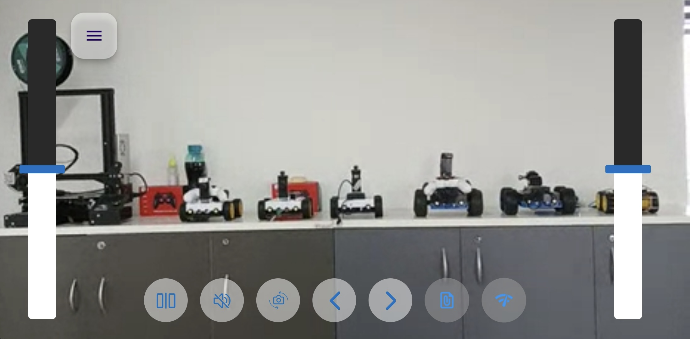

# Application de Contrôleur Flutter

<p align="center">
  <a href="README.md">English</a> |
  <a href="README.zh-CN.md">简体中文</a> |
  <a href="README.de-DE.md">Deutsch</a> |
  <span>Français</span> |
  <a href="README.es-ES.md">Español</a>
</p>

Cette application de contrôleur sert de `télécommande` pour le véhicule [OpenBot](https://www.openbot.org), similaire à une manette BT (par exemple, PS3/4 ou Xbox). Elle fonctionne sur un autre appareil Android/iOS et prend en charge la diffusion en direct de vidéo/audio en plus du contrôle.

## Pour Commencer
Commencez par installer [Flutter](https://flutter.dev/) sur votre système. Choisissez le téléchargement approprié pour votre système d'exploitation, qui inclut des options pour Windows, macOS, Linux et ChromeOS. Suivez le guide d'installation officiel de Flutter pour des instructions détaillées : [Guide d'Installation Flutter](https://docs.flutter.dev/get-started/install)

### Utilisation du Terminal
- Une fois Flutter installé avec succès, ouvrez votre **terminal** ou **invite de commande**.
- Changez votre répertoire actuel à l'emplacement où le projet OpenBot est stocké, puis naviguez vers `OpenBot/controller/flutter`.
- Utilisez les commandes suivantes pour exécuter l'application Flutter depuis le terminal.

  #### Installer les Dépendances :
    ```bash
     flutter pub get 
    ```
    Exécuter le projet :
    ```bash
     flutter run
    ```
    Si vous rencontrez des problèmes, exécutez la commande suivante :
    ```bash
     flutter doctor
    ```
### Utilisation de l'Éditeur
- Suivez le guide officiel de Flutter pour configurer un éditeur : [Configurer un éditeur](https://docs.flutter.dev/tools/android-studio)
- Assurez-vous que votre éditeur est configuré pour le développement Flutter. Installez tous les plugins ou extensions nécessaires, en suivant les instructions spécifiques à l'éditeur dans la documentation Flutter pour une meilleure expérience de développement.

- Une fois que vous ouvrez votre projet dans l'éditeur après la configuration, il apparaîtra comme montré dans l'image suivante.

  <p float="left">
    
  </p>

- Veuillez suivre les instructions similaires à celles mentionnées ci-dessus pour exécuter Flutter dans le terminal et exécuter directement en utilisant le bouton ``run`` pour les répétitions futures.

  <p float="left">
    
  </p>

## Connexion

Lorsque l'application de contrôleur est démarrée, elle essaie immédiatement de se connecter au robot et affiche l'écran suivant :

<p float="left">
  
</p>

Pour connecter le contrôleur au robot, réglez le mode de contrôle du robot sur **Téléphone**.
Par exemple, dans le `FreeRoamFragment`, le mode téléphone est activé comme ceci :

<p float="left">
  
</p>

Une fois connecté, l'application de contrôleur ressemblera à ceci :

<p float="left">
  
</p>

Ici, vous pouvez choisir de conduire le robot en inclinant le téléphone ou en utilisant les commandes à l'écran.

***Remarque :*** Cela devrait suffire pour se connecter, mais si la connexion ne peut pas être établie après 30 secondes, basculez
le paramètre `Control` sur l'application du robot à `Gamepad` puis à `Phone` à nouveau pour réinitialiser la connexion. Si cela
échoue, quittez l'application de contrôleur et redémarrez-la. Basculez à nouveau le mode de contrôle sur l'application du robot.

## Fonctionnement

### Commandes à l'écran

Ce mode permet à l'utilisateur de contrôler la voiture robot via deux curseurs en mode `Dual Drive`. Vous pouvez tourner à gauche/droite en
déplaçant le curseur vers le haut et vers le bas de chaque côté. Les roues de chaque côté tournent vers l'avant/l'arrière lorsque vous déplacez le curseur
au-dessus/en dessous du centre du curseur.

<p float="left">
  
</p>

- ``Indicateurs`` : Vous pouvez également régler les indicateurs de virage gauche/droite   en cliquant sur les flèches en haut à gauche de l'écran.

- ``Changer de caméra`` : basculer entre les modes caméra avant et arrière.
- ``Muet`` : activer/désactiver la transmission audio.
- ``Vue miroir`` : inverser le flux vidéo.

### Incliner pour conduire

Le contrôleur peut également utiliser son capteur de mouvement accéléromètre pour conduire le robot. Si vous sélectionnez cette option, le
contrôleur entrera en mode plein écran (Zen) avec uniquement la vidéo affichée et les pédales de `frein` et `accélérateur`. Pour
quitter ce mode, double-cliquez sur l'écran.

Voici une image de l'écran en `mode inclinaison` :

<p float="left">
  
</p>

Utilisez les boutons `accélérateur` et `frein` pour avancer/reculer.

- Appuyer sur l'`accélérateur` accélérera le robot à pleine vitesse en 2 secondes. Lorsque vous relâchez le bouton, le
  robot ralentira jusqu'à s'arrêter (vitesse d'arrêt réglée à 0% de la vitesse maximale, peut être ajustée).
- Appuyer sur le bouton `frein` arrêtera immédiatement le robot. Si nous maintenons le frein pendant une autre seconde, le robot commencera
  à reculer jusqu'à atteindre la vitesse maximale en marche arrière en une seconde. Lorsque nous relâchons le frein, le
  robot s'arrêtera.
- Le robot est dirigé en inclinant le téléphone contrôleur à gauche ou à droite.

Voici une [Vue d'ensemble technique](../../docs/technical/OpenBotController.pdf) de l'application de contrôleur.