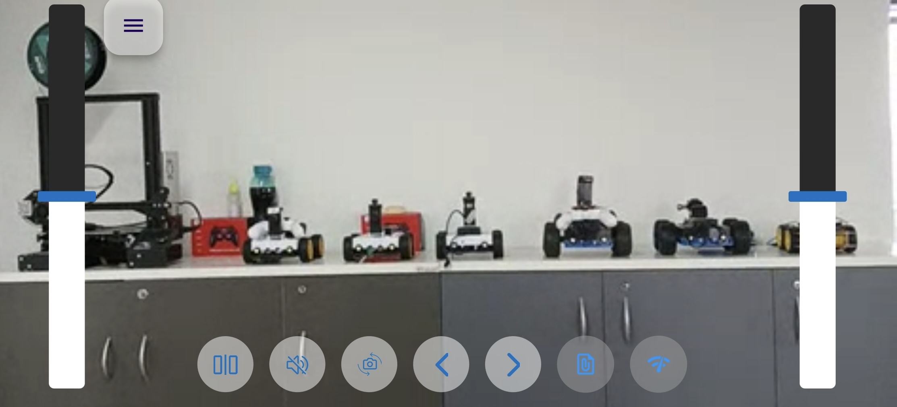
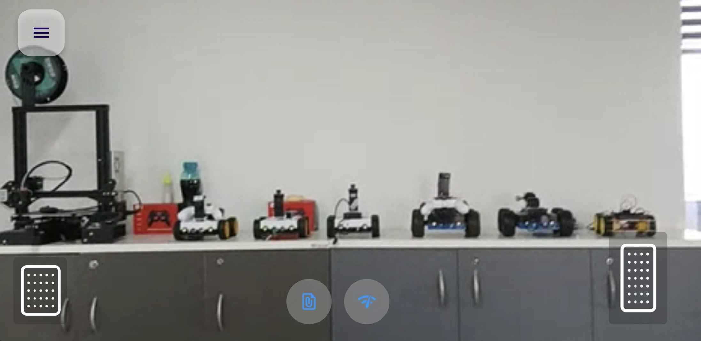

# Flutter Controller App

This Controller app serves as a `remote controller` for the [OpenBot](https://www.openbot.org) vehicle. Basically it
performs similar function as PS3/4 or Xbox remote controller, but running on another Android/iOS device.

 ## Getting Started
Begin by installing [Flutter](https://flutter.dev/) on your system. Choose the appropriate download for your operating system, which includes options for Windows, macOS, Linux, and ChromeOS. Follow the official Flutter installation guide for detailed instructions: [Flutter Installation Guide](https://docs.flutter.dev/get-started/install)

### Using Terminal
- Once Flutter is installed successfully, open your **terminal** or **command prompt**.
- Change your current directory to the location where the OpenBot project is stored then navigate to `openBot/controller/flutter` folder.
- Use the following commands to run the Flutter application from the terminal.

  ####  Install Dependencies:
    ```bash
     flutter pub get 
    ```
    Run the project:
    ```bash
     flutter run
    ```
    If you encounter any issues, run the following command:
    ```bash
     flutter doctor
    ```
### Using Editor
- Follow the official Flutter guide for setting up an editor:  [Set up an editor ](https://docs.flutter.dev/tools/android-studio) 
- Ensure that your editor is configured for Flutter development. Install any required plugins or extensions, following the editor-specific instructions in the Flutter documentation for the best development experience.

- Once you open your project in editor after the setup, it will appear as shown in the following image.

  <p float="left">
    
  </p>

- Please follow the instructions similar to the ones mentioned above for running Flutter in the terminal and directly run from the ``run`` button for future repetitions.

  <p float="left">
    
  </p>

## Connection 

When the controller app is started, it immediately tries to connect to the robot. We see the following screen:

<p float="left">
  
</p>

To connect the controller to the robot, place the robot's app control setting into the **Phone** mode.
You can also connect to the controller from the `FreeRoamFragment` by selecting the phone as the controller:

<p float="left">
  
</p>

In a few seconds, the controller will change its screen to:

<p float="left">
  
</p>

Here you can select to drive the robot by tilting the phone, or by using the on-screen controls.

***Note:*** This should be sufficient to connect, but if the connection cannot be established after 30 seconds, toggle
the `Control` setting on the bot app to `Gamepad` and then to `Phone` again to re-initiate the connection. If that
fails, exit the controller app and start it again. Toggle the Control mode again on the robot app.

## Operation

### On-screen controls

This mode allows the user to control the robot car via two sliders in `Dual Drive` mode. You can turn left/right by
moving the slider thumb up and down on each side. The wheels on each side turn forward/backward when moving the thumb
above/below the center of the slider.

<p float="left">
  
</p>

- ``Indicators``: You can also set the left/right turn indicators   by clicking on the arrows on the top-left of the screen.

- ``Switch Camera``: You can choose the camera option to switch between the front and back camera modes.
- ``Mute``: Select the sound option to activate sound mode, and simply tap on it to mute if needed.
- ``Mirror view``: This allows you to display the view in a mirrored or flipped form. 

### Tilt to drive

The controller can also use its accelerometer motion sensor to drive the robot. If you select this option, the
controller will enter a full-screen (Zen) mode with only the video showing and a `brake` and `accelerator` pedals. To
exit this mode, double-tap on the screen.

Here is a picture of the `tilt mode` screen:

<p float="left">
  
</p>

Use the `accelerator` and `brake` buttons to move forward/backward.

- Pressing the `accelerator` will accelerate the robot to full speed within 2 seconds. When you release the button, the
  robot will slow down to a stop (stop speed set to 0% of the maximum speed, can be adjusted).
- Pressing the `brake` button will immediately stop the robot. If we hold the brake for another second, the robot will
  start moving backwards until it reaches the maximum reverse speed in one second. When we let go of the brake, the
  robot will come to a stop.
- We steer the robot by tilting the controller left or right.

Here is a [Technical Overview](../../docs/technical/OpenBotController.pdf) of the controller app.