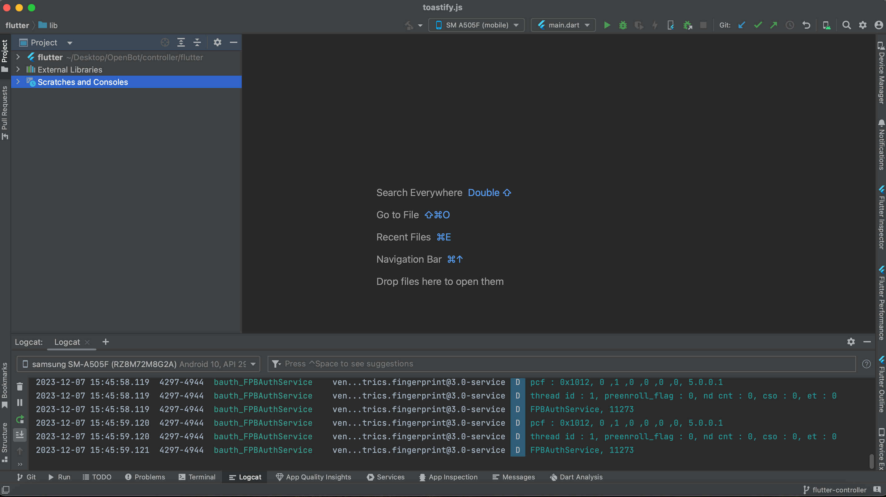
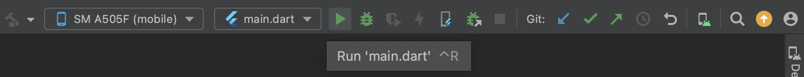
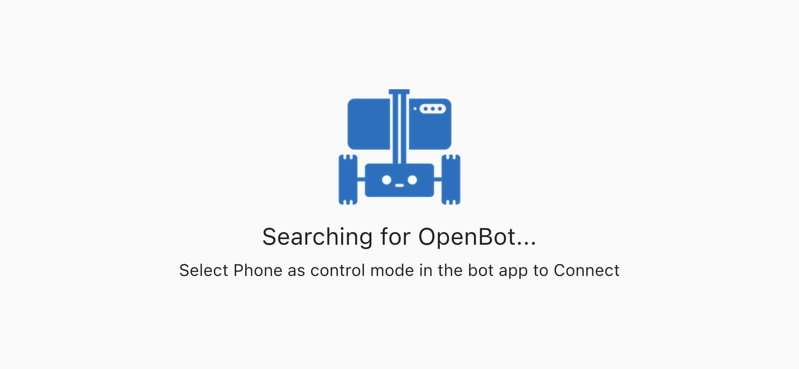
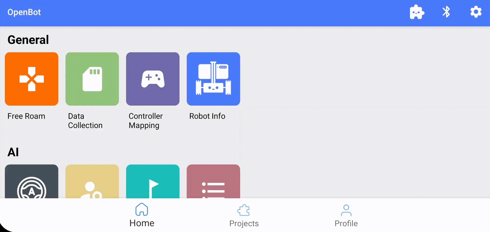
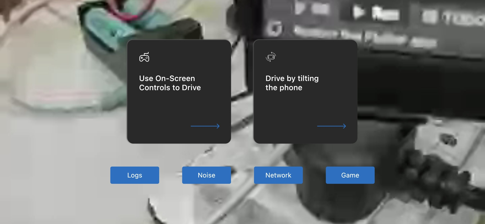
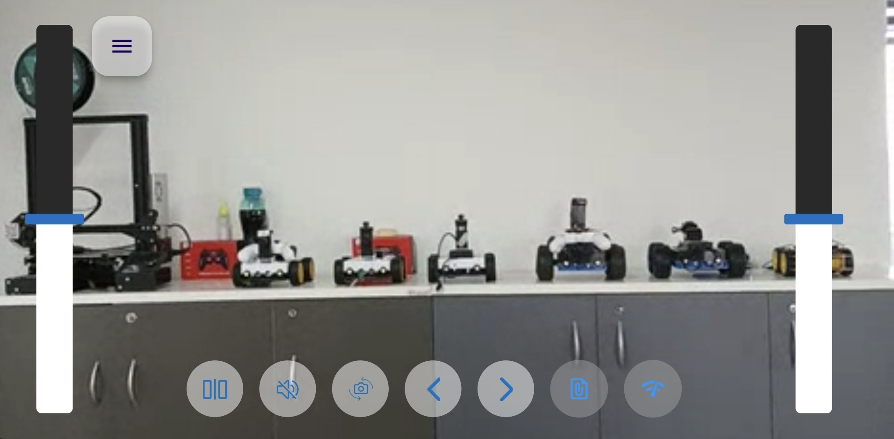
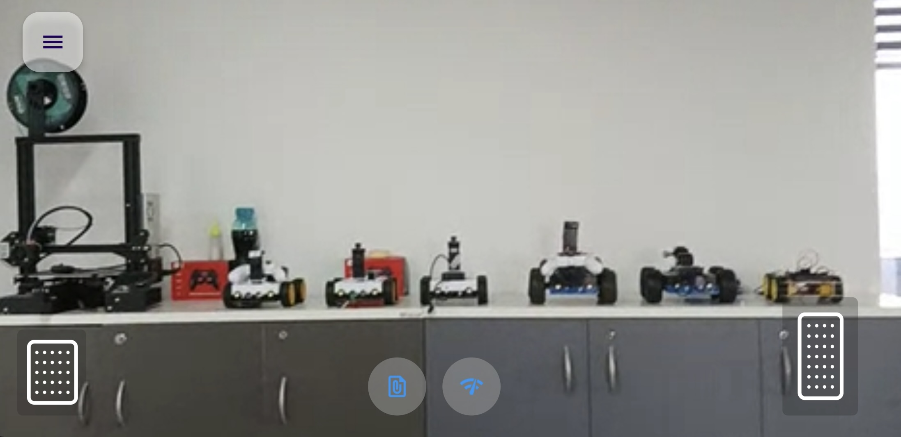

# Flutter 控制器应用

<p align="center">
  <a href="README.md">English</a> |
  <span>简体中文</span> |
  <a href="README.de-DE.md">Deutsch</a> |
  <a href="README.fr-FR.md">Français</a> |
  <a href="README.es-ES.md">Español</a>
</p>

这个控制器应用程序作为 [OpenBot](https://www.openbot.org) 车辆的 `远程控制器`，类似于 BT 控制器（例如 PS3/4 或 Xbox）。它运行在另一台 Android/iOS 设备上，除了控制功能外，还支持实时视频/音频流。

## 入门指南
首先在你的系统上安装 [Flutter](https://flutter.dev/)。选择适合你操作系统的下载选项，包括 Windows、macOS、Linux 和 ChromeOS。请按照官方 Flutter 安装指南进行详细安装：[Flutter 安装指南](https://docs.flutter.dev/get-started/install)

### 使用终端
- 成功安装 Flutter 后，打开你的 **终端** 或 **命令提示符**。
- 将当前目录更改为存储 OpenBot 项目的位置，然后导航到 `OpenBot/controller/flutter`。
- 使用以下命令从终端运行 Flutter 应用程序。

  #### 安装依赖项：
    ```bash
     flutter pub get 
    ```
    运行项目：
    ```bash
     flutter run
    ```
    如果遇到任何问题，请运行以下命令：
    ```bash
     flutter doctor
    ```
### 使用编辑器
- 按照官方 Flutter 指南设置编辑器：[设置编辑器](https://docs.flutter.dev/tools/android-studio)
- 确保你的编辑器已配置为 Flutter 开发。安装任何所需的插件或扩展，按照 Flutter 文档中的编辑器特定说明进行设置，以获得最佳开发体验。

- 设置完成后，在编辑器中打开项目，它将显示如下图所示。

  <p float="left">
    
  </p>

- 请按照上述类似的指示运行 Flutter 在终端中的命令，并直接使用 ``run`` 按钮进行后续运行。

  <p float="left">
    
  </p>

## 连接

启动控制器应用程序时，它会立即尝试连接到机器人并显示以下屏幕：

<p float="left">
  
</p>

要将控制器连接到机器人，请将机器人的控制模式设置为 **Phone**。
例如，在 `FreeRoamFragment` 中，手机模式如下激活：

<p float="left">
  
</p>

连接后，控制器应用程序将如下所示：

<p float="left">
  
</p>

在这里，你可以选择通过倾斜手机或使用屏幕上的控件来驾驶机器人。

***注意：*** 这应该足以连接，但如果在 30 秒后仍无法建立连接，请将机器人应用程序中的 `Control` 设置切换到 `Gamepad`，然后再切换回 `Phone` 以重新启动连接。如果仍然失败，请退出控制器应用程序并重新启动。再次在机器人应用程序中切换控制模式。

## 操作

### 屏幕控件

此模式允许用户通过 `双驱动` 模式中的两个滑块控制机器人车。你可以通过在每侧上下移动滑块拇指来左转/右转。当拇指移动到滑块中心以上/以下时，每侧的轮子将向前/向后转动。

<p float="left">
  
</p>

- ``指示灯``：你还可以通过点击屏幕左上角的箭头来设置左/右转向指示灯  。

- ``切换摄像头``：在前置和后置摄像头模式之间切换。
- ``静音``：启用/禁用音频传输。
- ``镜像视图``：镜像视频流。

### 倾斜驾驶

控制器还可以使用其加速度计运动传感器来驾驶机器人。如果选择此选项，控制器将进入全屏（Zen）模式，仅显示视频和 `刹车` 和 `加速` 踏板。要退出此模式，请双击屏幕。

以下是 `倾斜模式` 屏幕的图片：

<p float="left">
  
</p>

使用 `加速` 和 `刹车` 按钮前进/后退。

- 按下 `加速` 按钮，机器人将在 2 秒内加速到全速。当你松开按钮时，机器人将减速至停止（停止速度设置为最大速度的 0%，可以调整）。
- 按下 `刹车` 按钮，机器人将立即停止。如果我们再按住刹车一秒钟，机器人将开始倒退，直到在一秒钟内达到最大倒车速度。当我们松开刹车时，机器人将停止。
- 通过左右倾斜控制器手机来转向机器人。

这里有一个控制器应用程序的 [技术概述](../../docs/technical/OpenBotController.pdf)。