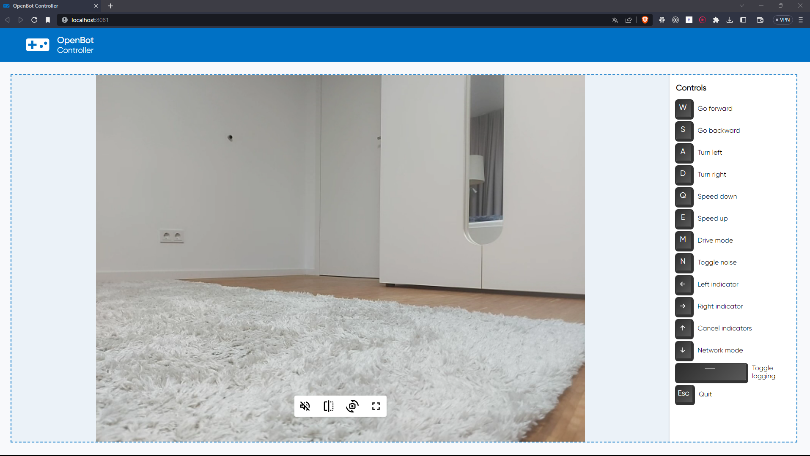

# Controlador OpenBot Nodejs

<p align="center">
  <a href="README.md">English</a> |
  <a href="README.zh-CN.md">简体中文</a> |
  <a href="README.de-DE.md">Deutsch</a> |
  <a href="README.fr-FR.md">Français</a> |
  <span>Español</span>
</p>

## Nomenclatura

Aquí hay algunos términos que utilizaremos en este documento:

* ```Robot, bot``` - este es el software de Android que se ejecuta en el teléfono en el vehículo [OpenBot](https://www.openbot.org/).
* ```Servidor``` - el servidor node, la parte del servidor de este proyecto.
* ```Cliente, UI``` - esta es la parte del cliente de este proyecto. Se ejecuta en el navegador.

## Introducción

Este es un proyecto basado en [Node.js](https://nodejs.org/) que actúa como controlador para el vehículo [OpenBot](https://www.openbot.org/). El software consta de dos partes: un servidor y un cliente. El servidor es una aplicación Node.js que se ejecuta en una computadora en la misma red que el Robot. La parte del cliente se ejecuta en el navegador.

Aquí hay una captura de pantalla del navegador:



## Empezando

Puedes ejecutar este software en una PC, un dispositivo tipo RaspberryPi o incluso en dispositivos [Pi Zero](https://www.raspberrypi.com/products/raspberry-pi-zero/) que soporten el entorno ```Node.js```. Primero asegúrate de haber instalado [Node.js](https://nodejs.org/), versión 10 o más reciente. Verifica la versión:

    node --version

El software se encuentra en el directorio ```/controller/node-js``` del proyecto OpenBot. Después de clonar el código desde [github](https://github.com/isl-org/OpenBot), cambia a este directorio y ejecuta los siguientes comandos:

    npm install
    npm start

El último comando iniciará el servidor. Si deseas ejecutar el servidor sin una terminal en segundo plano, en ```Linux/MacOS``` puedes ejecutar:

    npm run start-nohup

o simplemente:

    nohup npm start

Apunta tu navegador a la dirección IP del servidor en el puerto 8081, por ejemplo [http://localhost:8081](http://localhost:8081), o [http://192.168.1.100:8081](http://192.168.1.100:8081). Ten en cuenta que puedes acceder al servidor desde una computadora diferente, pero el Robot, el servidor y la PC del navegador deben estar en la misma red. En el futuro, podemos agregar la capacidad de acceder al servidor de forma remota.

Asegúrate de que tu Robot esté conectado a la misma red. En la aplicación Android del Robot, ve al panel ```General``` y selecciona ```Phone``` como el controlador. Esto conectará la aplicación de Android al servidor Node, y un video aparecerá en la UI.

## Cómo Funciona

1. El servidor Node crea y publica un servicio DNS de tipo ```openbot.tcp``` y un nombre ```OPEN_BOT_CONTROLLER``` en el puerto 19400. Esto permite que el Robot encuentre automáticamente el servidor sin conocer su dirección IP. El Robot está buscando este servicio y establecerá una conexión Socket cuando se ponga en el modo de controlador ```Phone```.

2. El servidor Node crea un servidor HTTP en el puerto 8081 y comienza a atender solicitudes del navegador.

3. Además, el servidor Node crea un servidor WebSocket en el puerto 7071. Esto se utilizará para comunicarse directamente con el navegador. Entonces, para resumir hasta ahora, el servidor ha creado dos conexiones Socket, una para el Robot y otra para el Navegador.

4. El usuario ingresa comandos de teclado desde el navegador. Estas pulsaciones de teclas se envían al Servidor a través del WebSocket. El servidor convierte estos comandos en comandos que el Robot puede entender, como ```{driveCmd: {r:0.4, l:0.34}}``` (una lista de todos los comandos se puede encontrar en la documentación para el controlador de Android [aquí](https://github.com/isl-org/OpenBot/blob/master/docs/technical/OpenBotController.pdf)). Estos comandos se envían al Robot a través de la conexión Socket.

5. El Robot envía información de estado de vuelta al servidor en la conexión Socket, y el servidor la reenvía a la UI. La UI puede usar esta información para mejorar su apariencia, como mostrar indicadores parpadeantes, etc., pero actualmente este estado se ignora.

6. El servidor Node también actúa como un proxy de señalización WebRTC. Reenvía comandos de negociación WebRTC entre el robot y el navegador. Reutiliza las conexiones socket abiertas para ese propósito, por lo que no se requiere una conexión o configuración adicional.


## Desarrollo

Este código utiliza [snowpack](https://www.snowpack.dev/) para una herramienta de construcción rápida y ligera.

Usamos [eslint](https://eslint.org/) para el linting y formateo automático de tu código. Se recomienda que ejecutes lint y corrijas cualquier error antes de comprometer nuevo código. Si estás usando Visual Code, puedes obtener un plugin [aquí](https://marketplace.visualstudio.com/items?itemName=dbaeumer.vscode-eslint). Ejecuta el linter así:

    npm run lint

## Producción

Para construir una versión de producción del ```cliente```, ejecuta:

    npm run build

Esto optimizará el código del cliente en un directorio ```build```, que puede ser desplegado en un servidor. Además, necesitamos configurar un gestor de procesos para reiniciar el servidor, y posiblemente un proxy inverso como [nginx](https://docs.nginx.com/nginx/admin-guide/web-server/reverse-proxy/), lo cual aún no se ha hecho.

## Solución de Problemas

* A veces el navegador no mostrará el menú de comandos, solo el título. Esto significa que no se pudo establecer la conexión WebSocket. Esto usualmente ocurre justo después de iniciar el servidor. Si examinas la consola del navegador, puedes encontrar un mensaje sobre no poder conectar, algo como ```WebSocket connection to 'ws://localhost:7071/ws' failed```. Mata todos los procesos node (pkill -9 node) y reinícialo. Recarga la página y la conexión debería establecerse.
* Si no puedes conectar el teléfono a la aplicación, asegúrate de que no haya otra instancia de esta aplicación ejecutándose en esta máquina o en otra máquina en la misma red.

## Errores Conocidos

Ninguno.

## Cosas por hacer/probar

* Necesitamos investigar si podemos conectarnos al servidor de forma remota y si WebRTC seguirá funcionando. Deberíamos documentar la configuración del firewall para hacer esto posible.
* Necesitamos crear una configuración de ```producción```, posiblemente usando [pm2 process manager](https://www.npmjs.com/package/pm2) y [nginx](https://docs.nginx.com/nginx/admin-guide/web-server/reverse-proxy/).