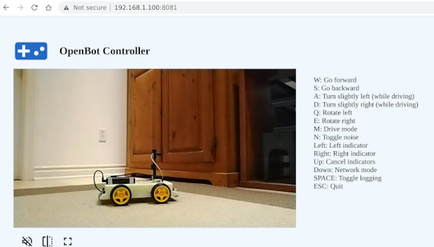
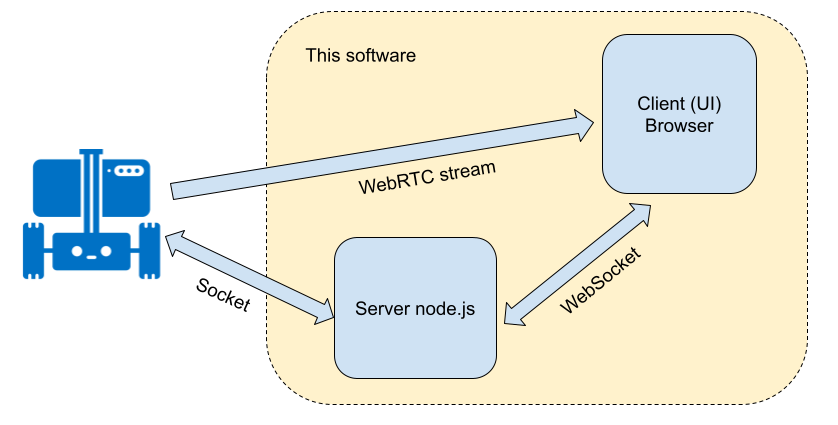

# OpenBot Nodejs Controller

Last updated: Dec 20, 2021

## Nomenclature

Here are some terms we will be using in this document:

* ```Robot, bot``` - this is the Android software running on the phone on the [OpenBot](https://www.openbot.org/) vehicle. 
* ```Server``` - the node server, the server part of this project
* ```Client, UI``` - this is the client part of this project. It runs in the browser.

## Introduction

This is a [Node.js](https://nodejs.org/) based project acting as a controller for the [OpenBot](https://www.openbot.org/) vehicle. The software comprises two parts - a server and a client. The server is a Node.js application running on a computer on the same network as the Robot. The client part runs in the browser.

Here is a screenshot of the browser:



## Getting Started

You can run this software on a PC, RaspberryPi-type device or even [Pi Zero](https://www.raspberrypi.com/products/raspberry-pi-zero/) devices which support ```Node.js``` environment. First make sure you have installed [Node.js](https://nodejs.org/), version 10 or newer. Check the version:

    node --version

The software is located in the ```/controller/node-js``` directory of the OpenBot project. After checking out the code from [github](https://github.com/isl-org/OpenBot), change into this directory and run the following commands:

    npm install
    npm start

The last command will start the server. If you like to run the server without a terminal in the background, on ```Linux/MacOS``` you can run:

    npm run start-nohup

or just:

    nohup npm start

Point your browser to the server’s  IP address at port 8081, for example [http://localhost:8081](http://localhost:8081), or [http://192.168.1.100:8081](http://192.168.1.100:8081). Note that you can access the server from a different computer, but the Robot, server and browser PC need to be on the same network. In the future we can add the ability to access the server remotely.

Make sure your Robot is connected on the same network. On the Robot Android app, go to the ```General``` panel and select ```Phone``` as the controller. This will connect the Android app to the Node server, and a video will appear on the UI.  

## How it Works

1. The Node server creates and publishes a DNS service of type ```openbot.tcp``` and a name ```OPEN_BOT_CONTROLLER``` at port 19400. This allows the Robot to automatically find  the server without knowing its IP address. The Robot is looking for this service, and will establish a Socket connection when put into the ```Phone``` controller mode.

2. The Node server creates an HTTP server at port 8081, and starts serving requests from the browser.

3. In addition, the node server creates a WebSocket server at port 7071. This will be used to communicate to the browser directly. So, to summarise so far, the server has created two Socket connections, one to the Robot and one to the Browser.

4. The user enters keyboard commands from the browser. These keypresses are sent to the Server via the WebSocket. The server converts these to commands that the Robot can understand, like ```{driveCmd: {r:0.4, l:0.34}}``` (a list of all commands can be found in the documentation for the Android controller [here](https://github.com/isl-org/OpenBot/blob/master/docs/technical/OpenBotController.pdf)). These commands are sent to the Robot via the Socket connection.

5. The Robot sends status information back to the server on the Socket connection, and the server forwards it to the UI. The UI can use this information to enhance its appearance, like displaying blinking indicators, etc, but currently this status is ignored.

6. The node server also acts as a WebRTC signalling proxy. It forwards WebRTC negotiation commands between the robot and the browser. It reuses the open socket connections for that purpose, so no additional connection or configuration is required.



## Development

This code uses [snowpack](https://www.snowpack.dev/) for a fast, lightweight building tool.

We use [eslint](https://eslint.org/) for linting and automatically formatting your code. It is recommended that you run lint and fix any errors before committing new code. If you are using Visual Code, you can get a plugin [here](https://marketplace.visualstudio.com/items?itemName=dbaeumer.vscode-eslint). Run the linter like this:

    npm run lint

## Production

To build a production version of the ```client```, run:

    npm run build

This will optimize the client code into a ```build``` directory, which can be deplyed on a server. In addition we need to setup a process manager to restart the server, and possibly a reverse proxy like [nginx](https://docs.nginx.com/nginx/admin-guide/web-server/reverse-proxy/), which is not yet done.

## Troubleshooting

* Sometimes the browser will not show the commands menu, just the title. This means the WebSocket connection could not be established. This usually happens right after starting the server. If you examine the browser console, you can find a message about not being able to connect, something like ```WebSocket connection to 'ws://localhost:7071/ws' failed```, Kill all node processes (pkill -9 node)  and restart it. Reload the page and connection should be established.
* If you cannot connect the phone to the app, make sure another instance of this application is not running on this machine or another machine on the same network.

## Known Bugs

None.

## Things to do/try

* This software has not been tested on Windows. It would be useful if somebody can test and update this documentation.
* We need to investigate if we can connect to the server remotely, and if WebRTC will still work. We should document firewall configuration to make this possible.
* We need to create a ```production``` configuration, possibly using [pm2 process manager](https://www.npmjs.com/package/pm2) and [nginx](https://docs.nginx.com/nginx/admin-guide/web-server/reverse-proxy/).
