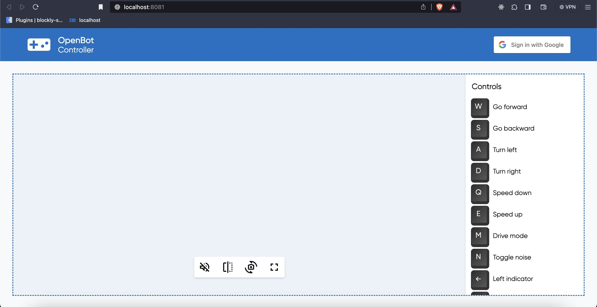

# OpenBot Web Controller

<p align="center">
  <a href="README.md">English</a> |
  <a href="README.zh-CN.md">简体中文</a> |
  <span>Deutsch</span> |
  <a href="README.fr-FR.md">Français</a> |
  <a href="README.es-ES.md">Español</a>
</p>

## Nomenklatur

Hier sind einige Begriffe, die wir in diesem Dokument verwenden werden:

* ```Roboter, Bot``` - dies ist die Android-Software, die auf dem Telefon auf dem [OpenBot](https://www.openbot.org/) Fahrzeug läuft.
* ```Server``` - der Webserver, der Serverteil dieses Projekts.
* ```Client, UI``` - dies ist der Clientteil dieses Projekts. Er läuft im Browser.

## Einführung

Dieses Projekt arbeitet remote auf einem Cloud-Server und fungiert als Controller für das [OpenBot](https://www.openbot.org/) Fahrzeug. Die Software besteht aus zwei Komponenten: einem Server und einem Client. Der Server ist eine Cloud-Anwendung, die in einer entfernten Umgebung bereitgestellt wird. Die Client-Komponente läuft direkt im Webbrowser. Hier ist ein Screenshot des Browsers:



## Erste Schritte

Sie können diese Software auf einem PC, einem RaspberryPi-ähnlichen Gerät oder sogar auf [Pi Zero](https://www.raspberrypi.com/products/raspberry-pi-zero/) Geräten ausführen, die die ```Node.js``` Umgebung unterstützen. Stellen Sie zunächst sicher, dass Sie [Node.js](https://nodejs.org/) Version 10 oder neuer installiert haben. Überprüfen Sie die Version:

    node --version

Die Software befindet sich im Verzeichnis ```/controller/web-server``` des OpenBot-Projekts. Nachdem Sie den Code von [github](https://github.com/isl-org/OpenBot) ausgecheckt haben, wechseln Sie in dieses Verzeichnis und führen Sie die folgenden Befehle aus:

    npm install
    npm start

Der letzte Befehl startet den Server. Wenn Sie den Server ohne Terminal im Hintergrund ausführen möchten, können Sie unter ```Linux/MacOS``` Folgendes ausführen:

    npm run start-nohup

oder einfach:

    nohup npm start

## Funktionen des Web-Controllers

- Der OpenBot-Controller arbeitet auf einem Cloud-Server, der remote über das Internet zugänglich ist. Clients können den Controller direkt und nahtlos erreichen, indem sie sich mit ihren Google-Konten anmelden. Darüber hinaus verwenden die Clients in der Roboter-App dieselbe E-Mail-ID wie bei der Anmeldung am Web-Controller zur Authentifizierung. Diese Implementierung stellt sicher, dass es keine Kreuzverbindungen zwischen Servern und Clients gibt.

- Der Server wird unter ``ws://verdant-imported-peanut.glitch.me`` mit einer sicheren WebSocket-Verbindung gehostet, was eine schnelle und zuverlässige Kommunikation gewährleistet. Diese Konfiguration ermöglicht es den Clients, den Roboter von jedem Standort aus zu verbinden und zu steuern, ohne von einem lokalen Server abhängig zu sein.

- Der Web-Controller ist so konzipiert, dass er Video-Streaming über WebRTC, ein Echtzeit-Kommunikationsprotokoll, ermöglicht. Die Latenz, die Benutzer erleben, hängt von ihrer individuellen Internetverbindungsgeschwindigkeit und dem geografischen Standort des Servers ab. Das bedeutet, dass Benutzer mit schnelleren Internetverbindungen und Servern in näherer Umgebung im Allgemeinen eine geringere Latenz während der Video-Streaming-Sitzung erleben.

- In der Roboter-Android-App gehen Sie zum ```Allgemein```-Panel und wählen ```Web``` als Controller. Dies verbindet die Android-App mit dem Cloud-Server, und ein Video erscheint auf der Benutzeroberfläche.

## Wie es funktioniert

1. Der WebSocket erstellt eine Verbindung zum Cloud-Server. Der Server fordert eine Identifikation, typischerweise in Form einer E-Mail-Adresse, vom Browser des Benutzers an. Gleichzeitig durchläuft die Roboteranwendung die Authentifizierung über Google Sign-In. Wenn der Controller-Modus auf ``Web`` gesetzt ist, fordert der Server den Benutzer zur Eingabe seiner E-Mail-Adresse auf.

    

2. Wenn sich ein Benutzer über Google im Browser anmeldet, wird die mit dem Konto verknüpfte E-Mail an den Server übertragen. Anschließend wird ein dedizierter ``Raum`` dynamisch generiert, wobei die E-Mail des Benutzers als ``eindeutiger Bezeichner`` dient. Innerhalb dieses Raums werden zwei Kandidaten eingerichtet. Der erste Kandidat wird für den Browser-Client konfiguriert, der dann in einen Wartezustand übergeht, um eine Verbindung zur Roboteranwendung herzustellen.

    

3. Nachdem der Controller auf ```Web``` gesetzt wurde, erreicht der Raum seine volle Kapazität, wobei der zweite Kandidat als Roboteranwendung bezeichnet wird. Gleichzeitig sendet die Roboteranwendung eine Anfrage für ein Angebot für WebRTC (Web Real-Time Communication). Der erste Kandidat, der dem Browser-Client zugewiesen ist, antwortet auf diese Anfrage. Dieser erfolgreiche Austausch führt zur Etablierung einer robusten und funktionalen Verbindung und zeigt den Videostream auf der Benutzeroberfläche des Browsers an.

    

4. Der Benutzer gibt Tastaturbefehle vom Browser aus ein. Diese Tastendrücke werden über den WebSocket oder WebRTC an den Server gesendet. Der Server wandelt diese in Befehle um, die der Roboter verstehen kann, wie ```{driveCmd: {l:0.4, r:0.34}}``` (eine Liste aller Befehle finden Sie in der Dokumentation für den Android-Controller [hier](https://github.com/isl-org/OpenBot/blob/master/docs/technical/OpenBotController.pdf)). Diese Befehle werden über die Socket-Verbindung an den Roboter gesendet.
5. Der WebSocket dient als wichtiger Datenkanal für das WebRTC-Signalisierungsproxy. WebRTC nutzt effizient die bestehenden offenen Socket-Verbindungen für diesen Zweck, wodurch zusätzliche Verbindungen oder Konfigurationen überflüssig werden. Dieser optimierte Ansatz erhöht die Effizienz und minimiert die Einrichtungsanforderungen für eine nahtlose Echtzeitkommunikation.

### Erstellen Sie Ihren eigenen Server

- ``Server-Setup``: Der Code startet einen WebSocket-Server, der auf Port 8080 lauscht. Nach der Bereitschaft des Servers protokolliert er eine Bestätigungsmeldung über seinen aktiven Zustand auf dem angegebenen Port. Anschließend wird eine Map namens "rooms" initialisiert, die als Repository zur Verwaltung und Speicherung von Details zu einzelnen Räumen dient. Jeder Raum wird durch eine ID eindeutig identifiziert.

- ``Client-Verbindungsverwaltung``: Der Client und die Roboter-App fungieren als zwei Kandidaten im Raumgenerierungsprozess zur Einrichtung eines Servers remote. Das System protokolliert die Verbindung eines Clients und liefert Informationen über die Gesamtzahl der verbundenen Clients. Die Funktion askIdOfClient interagiert mit den Clients und fordert sie auf, ihre jeweiligen Raum-IDs mitzuteilen. Darüber hinaus hört das System auf eingehende Nachrichten von Clients. Der Browser-Client, der als erster Kandidat fungiert, wird konfiguriert und wechselt in einen Wartezustand, bereit, eine Verbindung zur Roboteranwendung herzustellen.

- ``Raumverwaltung``: Die Funktion createOrJoinRoom bewertet das Vorhandensein eines Raums, der durch die angegebene Raum-ID identifiziert wird. Wenn der Raum nicht vorhanden ist, wird die Erstellung eines neuen Raums initiiert. In Fällen, in denen der Raum bereits existiert, erleichtert die Funktion das Beitreten zum bestehenden Raum unter Berücksichtigung seiner Verfügbarkeit.

- ``Client-Trennungsverwaltung und Interaktion``: Bei der Trennung eines Clients generiert das System Protokolle, die Informationen über die Gesamtzahl der verbundenen Clients enthalten. Wenn zugehörige Räume vorhanden sind, werden diese Räume geschlossen und der Eintrag des getrennten Clients aus der rooms-Map entfernt. Darüber hinaus fordert der Server die Clients auf, ihre jeweiligen Raum-IDs während des Verbindungsprozesses anzugeben.

- ``Broadcast-Funktionen``:
  - wss.broadcast: Sendet eine Nachricht an alle verbundenen Clients.
  - broadcastToRoom: Sendet eine Nachricht an alle Clients innerhalb eines bestimmten Raums.
  - sendToBot: Sendet eine Nachricht an einen Bot (sendet an alle Clients außer dem Absender).

- Sobald der Browser-Client auf die Angebotsanfrage antwortet, wird schließlich ein Videostream auf der Benutzeroberfläche des Browsers angezeigt.

## Implementierung eines benutzerdefinierten Servers:

Zu Testzwecken haben wir einen neuen Remote-Server auf ``glitch`` geöffnet, aber Sie können jede Cloud-Umgebung für Ihre Web-Server-Kommunikation mit der OpenBot-Anwendung verwenden.
- Erstellen Sie zunächst ein neues Konto auf [Glitch](https://glitch.com/). Erstellen Sie danach Ihr neues Projekt, wie im folgenden Bild gezeigt.

    

- Danach müssen Sie den Code aus der Datei [server.js](server/server.js) in die server.js-Datei Ihres Projekts (Remote-Server) einfügen, wie im folgenden Bild gezeigt.

    

- Im nächsten Schritt müssen Sie die ``webSocket``-Abhängigkeit in Ihrem Projekt hinzufügen, wie im folgenden Bild zu sehen ist.

    

- Um Ihren eigenen Server zu erstellen, müssen Sie den Projektnamen in der Datei authentication.js angeben, wie gezeigt, um die WebSocket-Verbindung zu initiieren.

    ``new WebSocket(`ws://gossamer-southern-hygienic`);``

## Entwicklung

Dieser Code verwendet [snowpack](https://www.snowpack.dev/) für ein schnelles, leichtgewichtiges Build-Tool.

Wir verwenden [eslint](https://eslint.org/) für Linting und automatisches Formatieren Ihres Codes. Es wird empfohlen, dass Sie Lint ausführen und alle Fehler beheben, bevor Sie neuen Code einchecken. Wenn Sie Visual Code verwenden, können Sie ein Plugin [hier](https://marketplace.visualstudio.com/items?itemName=dbaeumer.vscode-eslint) erhalten. Führen Sie den Linter wie folgt aus:

    npm run lint

## Produktion

Um eine Produktionsversion des ```Clients``` zu erstellen, führen Sie Folgendes aus:

    npm run build

Dies optimiert den Client-Code in ein ```build``` Verzeichnis, das auf einem Server bereitgestellt werden kann. Zusätzlich müssen wir einen Prozessmanager einrichten, um den Server neu zu starten, und möglicherweise einen Reverse-Proxy wie [nginx](https://docs.nginx.com/nginx/admin-guide/web-server/reverse-proxy/), was noch nicht erledigt ist.

## Fehlerbehebung

* Manchmal zeigt der Browser nur das Befehlsmenü, aber nicht den Titel. Dies bedeutet, dass die WebSocket-Verbindung nicht hergestellt werden konnte. Dies passiert normalerweise direkt nach dem Starten des Servers. Wenn Sie die Browserkonsole untersuchen, finden Sie eine Nachricht über die fehlgeschlagene Verbindung, etwas wie ```WebSocket connection to 'ws://localhost:8081/ws' failed```. Beenden Sie alle Node-Prozesse (pkill -9 node) und starten Sie sie neu. Laden Sie die Seite neu und die Verbindung sollte hergestellt werden.
* Wenn Sie das Telefon nicht mit der App verbinden können, stellen Sie sicher, dass keine andere Instanz dieser Anwendung auf diesem oder einem anderen Computer mit derselben E-Mail läuft.

## Bekannte Fehler

Keine.

## Dinge zu tun/auszuprobieren

* Diese Software wurde nicht auf Windows getestet. Es wäre nützlich, wenn jemand dies testen und diese Dokumentation aktualisieren könnte.
* Wir müssen untersuchen, ob wir eine Verbindung zum Server remote herstellen können und ob WebRTC weiterhin funktioniert. Wir sollten die Firewall-Konfiguration dokumentieren, um dies zu ermöglichen.
* Wir müssen eine ```Produktions```-Konfiguration erstellen, möglicherweise unter Verwendung des [pm2 Prozessmanagers](https://www.npmjs.com/package/pm2) und [nginx](https://docs.nginx.com/nginx/admin-guide/web-server/reverse-proxy/).