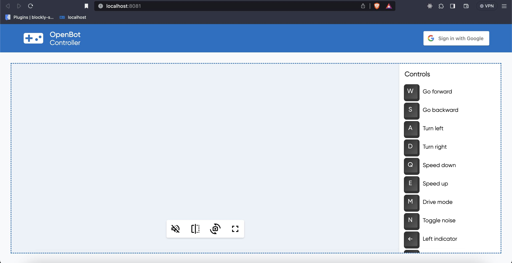
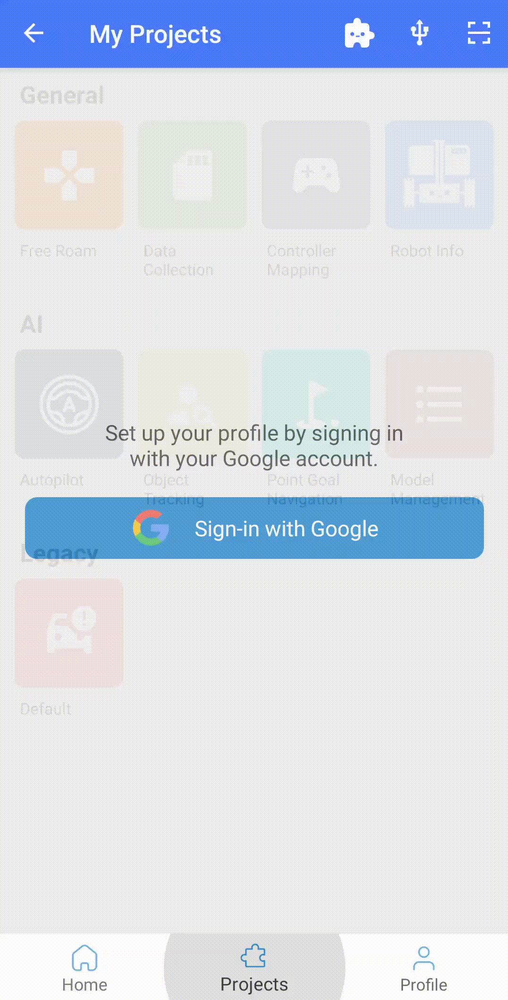
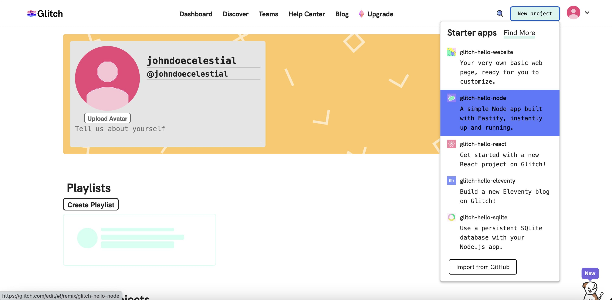
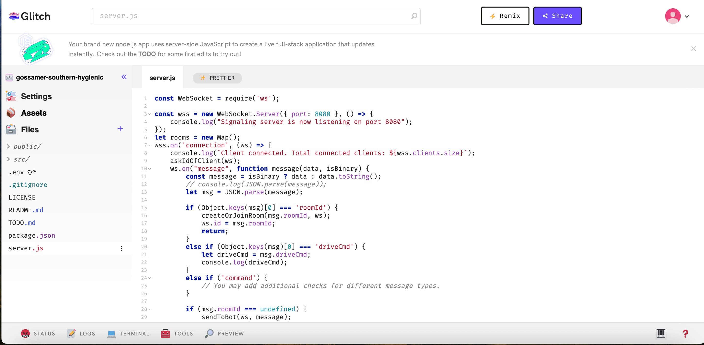
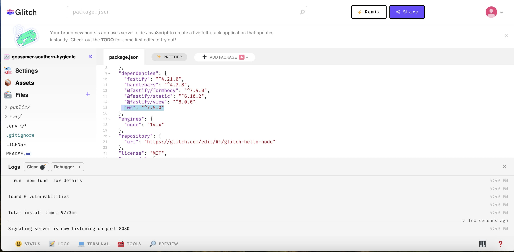

# OpenBot Web Controller

<p align="center">
  <a href="README.md">English</a> |
  <a href="README.zh-CN.md">简体中文</a> |
  <a href="README.de-DE.md">Deutsch</a> |
  <span>Français</span> |
  <a href="README.es-ES.md">Español</a>
</p>

## Nomenclature

Voici quelques termes que nous utiliserons dans ce document :

* ```Robot, bot``` - il s'agit du logiciel Android fonctionnant sur le téléphone du véhicule [OpenBot](https://www.openbot.org/).
* ```Serveur``` - le serveur web, la partie serveur de ce projet.
* ```Client, UI``` - il s'agit de la partie client de ce projet. Il fonctionne dans le navigateur.

## Introduction

Ce projet fonctionne à distance sur un serveur cloud, agissant comme un contrôleur pour le véhicule [OpenBot](https://www.openbot.org/). Le logiciel comprend deux composants : un serveur et un client. Le serveur est une application cloud déployée dans un environnement distant. Le composant client fonctionne directement dans le navigateur web. Voici une capture d'écran du navigateur :



## Pour Commencer

Vous pouvez exécuter ce logiciel sur un PC, un appareil de type RaspberryPi ou même des appareils [Pi Zero](https://www.raspberrypi.com/products/raspberry-pi-zero/) qui supportent l'environnement ```Node.js```. Assurez-vous d'abord d'avoir installé [Node.js](https://nodejs.org/), version 10 ou plus récente. Vérifiez la version :

    node --version

Le logiciel se trouve dans le répertoire ```/controller/web-server``` du projet OpenBot. Après avoir récupéré le code depuis [github](https://github.com/isl-org/OpenBot), changez de répertoire et exécutez les commandes suivantes :

    npm install
    npm start

La dernière commande démarrera le serveur. Si vous souhaitez exécuter le serveur en arrière-plan sans terminal, sur ```Linux/MacOS``` vous pouvez exécuter :

    npm run start-nohup

ou simplement :

    nohup npm start

## Fonctionnalités du contrôleur web

- Le contrôleur OpenBot fonctionne sur un serveur cloud accessible à distance via Internet. Les clients peuvent accéder directement au contrôleur, permettant un processus de ``connexion`` pratique en utilisant leurs comptes Google. De plus, sur l'application du robot, les clients utilisent le ``même identifiant email`` que leur connexion au contrôleur web pour l'authentification. Cette implémentation garantit qu'il n'y a pas de connexions croisées entre les serveurs et les clients.

- Le serveur est hébergé à ``ws://verdant-imported-peanut.glitch.me`` en utilisant une connexion WebSocket sécurisée, assurant une communication rapide et fiable. Cette configuration permet aux clients de se connecter et de contrôler le robot depuis n'importe quel endroit sans dépendre d'un serveur local.

- Le contrôleur web est conçu pour faciliter le streaming vidéo via WebRTC, un protocole de communication en temps réel. La latence ressentie par les utilisateurs dépend de la vitesse de leur connexion Internet individuelle et de la localisation géographique du serveur. Cela signifie que les utilisateurs avec des connexions Internet plus rapides et des serveurs situés à proximité expérimenteront généralement une latence plus faible pendant la session de streaming vidéo.

- Sur l'application Android du robot, allez dans le panneau ```Général``` et sélectionnez ```Web``` comme contrôleur. Cela connectera l'application Android au serveur cloud, et une vidéo apparaîtra sur l'interface utilisateur.

## Comment ça marche

1. Le WebSocket crée une connexion avec le serveur cloud. Le serveur initie une demande d'identification, généralement sous la forme d'une adresse email, depuis le navigateur de l'utilisateur. Simultanément, l'application du robot subit une authentification via Google Sign-In. Lorsque le mode contrôleur est réglé sur ``Web``, le serveur demande à l'utilisateur son adresse email.

    

2. Lorsqu'un utilisateur se connecte via Google sur le navigateur, l'email associé au compte est transmis au serveur. Ensuite, une ``salle`` dédiée est générée dynamiquement, avec l'email de l'utilisateur servant d'``identifiant unique``. Dans cette salle, deux candidats sont établis. Le premier candidat est configuré pour le client navigateur, qui entre alors en état d'attente, prêt à établir une connexion avec l'application du robot.

    

3. Après que le contrôleur soit réglé sur ```web```, la salle atteint sa pleine capacité, avec le deuxième candidat désigné comme l'application du robot. Concurremment, l'application du robot envoie une demande d'offre pour WebRTC (Web Real-Time Communication). Le premier candidat, qui est assigné au client navigateur, répond à cette demande. Cet échange réussi aboutit à l'établissement d'une connexion robuste et fonctionnelle, et affiche le flux vidéo sur l'interface utilisateur du navigateur.

    

4. L'utilisateur entre des commandes clavier depuis le navigateur. Ces pressions de touches sont envoyées au serveur via le WebSocket ou WebRTC. Le serveur les convertit en commandes que le robot peut comprendre, comme ```{driveCmd: {l:0.4, r:0.34}}``` (une liste de toutes les commandes peut être trouvée dans la documentation du contrôleur Android [ici](https://github.com/isl-org/OpenBot/blob/master/docs/technical/OpenBotController.pdf)). Ces commandes sont envoyées au robot via la connexion Socket.
5. Le WebSocket sert de canal de données crucial pour le proxy de signalisation WebRTC. WebRTC utilise efficacement les connexions socket ouvertes existantes à cette fin, éliminant le besoin de connexions ou de configurations supplémentaires. Cette approche simplifiée améliore l'efficacité et minimise les exigences de configuration pour une communication en temps réel fluide.

### Créez votre propre serveur

- ``Configuration du serveur`` : Le code initie un serveur WebSocket qui écoute sur le port 8080. Une fois que le serveur est prêt, il enregistre un message de confirmation sur son état actif sur le port spécifié. Ensuite, une Map nommée "rooms" est initialisée, servant de référentiel pour gérer et stocker les détails des salles individuelles. Chaque salle est identifiée de manière unique par un ID.
  
- ``Gestion de la connexion client`` : Le client et l'application du robot agissent comme deux candidats dans le processus de génération de salle pour établir un serveur à distance. Le système enregistre la connexion d'un client, fournissant des informations sur le nombre total de clients connectés. La fonction askIdOfClient engage les clients, les invitant à partager leurs identifiants de salle respectifs. De plus, le système écoute les messages entrants des clients. Le client navigateur, fonctionnant comme le premier candidat, est configuré et passe en état d'attente, prêt à initier une connexion avec l'application du robot.

- ``Gestion des salles`` : La fonction createOrJoinRoom évalue l'existence d'une salle identifiée par le roomId spécifié. Si la salle n'est pas présente, elle initie la création d'une nouvelle salle. Dans les cas où la salle existe déjà, la fonction facilite la jonction de la salle existante, en tenant compte de sa disponibilité.

- ``Gestion de la déconnexion client et interaction`` : Lors de la déconnexion d'un client, le système génère des journaux incluant des informations sur le nombre total de clients connectés. S'il y a des salles associées, ces salles sont fermées, et l'entrée du client déconnecté est supprimée de la Map des salles. De plus, le serveur invite les clients à fournir leurs identifiants de salle respectifs pendant le processus de connexion.

- ``Fonctions de diffusion`` :
  - wss.broadcast : Diffuse un message à tous les clients connectés.
  - broadcastToRoom : Diffuse un message à tous les clients au sein d'une salle spécifique.
  - sendToBot : Envoie un message à un bot (diffuse à tous les clients sauf l'expéditeur).

- Une fois que le client navigateur répond avec une réponse à la demande d'offre, cela conduira finalement à l'affichage d'un flux vidéo sur l'interface utilisateur du navigateur.

## Implémentation d'un serveur personnalisé :

À des fins de test, nous avons ouvert un nouveau serveur distant sur ``glitch`` mais vous pouvez utiliser n'importe quel environnement cloud pour votre communication web-server avec l'application OpenBot.
- Tout d'abord, créez un nouveau compte sur [Glitch](https://glitch.com/). Ensuite, créez votre nouveau projet comme montré dans l'image ci-dessous.

    

- Après cela, vous devez insérer le code du fichier [server.js](server/server.js) dans le fichier server.js de votre projet (serveur distant) comme montré dans l'image suivante.

    

- À l'étape suivante, vous devez ajouter la dépendance ``webSocket`` dans votre projet comme vous pouvez le voir dans l'image ci-dessous

    

- Pour établir votre propre serveur, vous devez spécifier le nom du projet dans le fichier authentication.js, comme démontré, pour initier la connexion WebSocket.

    ``new WebSocket(`ws://gossamer-southern-hygienic`);``

## Développement

Ce code utilise [snowpack](https://www.snowpack.dev/) pour un outil de construction rapide et léger.

Nous utilisons [eslint](https://eslint.org/) pour le linting et le formatage automatique de votre code. Il est recommandé d'exécuter le lint et de corriger toutes les erreurs avant de valider un nouveau code. Si vous utilisez Visual Code, vous pouvez obtenir un plugin [ici](https://marketplace.visualstudio.com/items?itemName=dbaeumer.vscode-eslint). Exécutez le linter comme ceci :

    npm run lint

## Production

Pour construire une version de production du ```client```, exécutez :

    npm run build

Cela optimisera le code client dans un répertoire ```build```, qui peut être déployé sur un serveur. De plus, nous devons configurer un gestionnaire de processus pour redémarrer le serveur, et éventuellement un proxy inverse comme [nginx](https://docs.nginx.com/nginx/admin-guide/web-server/reverse-proxy/), ce qui n'est pas encore fait.

## Dépannage

* Parfois, le navigateur n'affichera pas le menu des commandes, juste le titre. Cela signifie que la connexion WebSocket n'a pas pu être établie. Cela se produit généralement juste après le démarrage du serveur. Si vous examinez la console du navigateur, vous pouvez trouver un message indiquant qu'il n'a pas pu se connecter, quelque chose comme ```WebSocket connection to 'ws://localhost:8081/ws' failed```. Tuez tous les processus node (pkill -9 node) et redémarrez-le. Rechargez la page et la connexion devrait être établie.
* Si vous ne pouvez pas connecter le téléphone à l'application, assurez-vous qu'une autre instance de cette application ne fonctionne pas sur cette machine ou une autre machine avec le même email.

## Bugs connus

Aucun.

## Choses à faire/essayer

* Ce logiciel n'a pas été testé sur Windows. Il serait utile que quelqu'un puisse tester et mettre à jour cette documentation.
* Nous devons enquêter pour savoir si nous pouvons nous connecter au serveur à distance, et si WebRTC fonctionnera toujours. Nous devrions documenter la configuration du pare-feu pour rendre cela possible.
* Nous devons créer une configuration ```production```, possiblement en utilisant [pm2 process manager](https://www.npmjs.com/package/pm2) et [nginx](https://docs.nginx.com/nginx/admin-guide/web-server/reverse-proxy/).