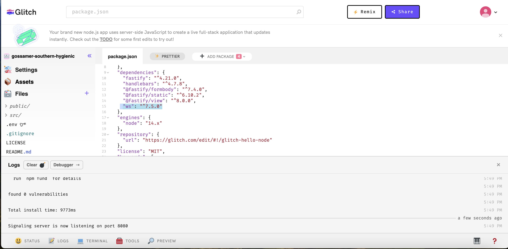

# OpenBot 웹 컨트롤러

<p align="center">
  <a href="README.md">English</a> |
  <a href="README.zh-CN.md">简体中文</a> |
  <a href="README.de-DE.md">Deutsch</a> |
  <a href="README.fr-FR.md">Français</a> |
  <a href="README.es-ES.md">Español</a> |
  <span>한국어</span>
</p>

## 용어 설명

이 문서에서 사용할 몇 가지 용어는 다음과 같습니다:

* ```Robot, bot``` - 이것은 [OpenBot](https://www.openbot.org/) 차량에서 실행되는 Android 소프트웨어입니다.
* ```Server``` - 웹 서버, 이 프로젝트의 서버 부분입니다.
* ```Client, UI``` - 이것은 이 프로젝트의 클라이언트 부분으로, 브라우저에서 실행됩니다.

## 소개

이 프로젝트는 클라우드 서버에서 원격으로 작동하며, [OpenBot](https://www.openbot.org/) 차량의 컨트롤러 역할을 합니다. 소프트웨어는 서버와 클라이언트 두 가지 구성 요소로 이루어져 있습니다. 서버는 원격 환경에 배포된 클라우드 애플리케이션입니다. 클라이언트 구성 요소는 웹 브라우저에서 직접 실행됩니다. 아래는 브라우저 화면 캡처입니다:


## 시작하기

이 소프트웨어는 PC, RaspberryPi 유형의 장치 또는 ```Node.js``` 환경을 지원하는 [Pi Zero](https://www.raspberrypi.com/products/raspberry-pi-zero/) 장치에서 실행할 수 있습니다. 먼저 [Node.js](https://nodejs.org/) 버전 10 이상이 설치되어 있는지 확인하세요. 버전을 확인하려면 다음 명령어를 입력합니다:

    node --version

소프트웨어는 OpenBot 프로젝트의 ```/controller/web-server``` 디렉터리에 위치해 있습니다. [github](https://github.com/isl-org/OpenBot)에서 코드를 체크아웃한 후 이 디렉터리로 이동하여 다음 명령어들을 실행하세요:

    npm install
    npm start

마지막 명령어는 서버를 시작합니다. 터미널 없이 백그라운드에서 서버를 실행하려면, ```Linux/MacOS```에서는 다음 명령어를 사용할 수 있습니다:

    npm run start-nohup

또는 간단히:

    nohup npm start

## 웹 컨트롤러의 기능

- OpenBot 컨트롤러는 클라우드 서버에서 원격으로 인터넷을 통해 접근할 수 있습니다. 클라이언트는 컨트롤러에 직접 접근할 수 있으며, Google 계정을 사용하여 간편하게 ``로그인``할 수 있습니다. 또한, 로봇 앱에서는 클라이언트가 ``웹 컨트롤러 로그인에 사용한 동일한 이메일 ID``로 인증을 받습니다. 이 구현은 서버와 클라이언트 간에 교차 연결이 없도록 보장합니다.

- 서버는 ``ws://verdant-imported-peanut.glitch.me``에서 보안 WebSocket 연결을 통해 호스팅되어, 빠르고 안정적인 통신을 보장합니다. 이 설정은 클라이언트가 로컬 서버에 의존하지 않고 어느 위치에서나 로봇을 연결하고 제어할 수 있도록 합니다.

- 웹 컨트롤러는 WebRTC를 통해 실시간 통신 프로토콜을 사용하여 비디오 스트리밍을 지원합니다. 사용자에게 경험되는 지연 시간은 개별 인터넷 연결 속도와 서버의 지리적 위치에 따라 달라집니다. 즉, 더 빠른 인터넷 연결과 더 가까운 서버에 위치한 사용자들은 일반적으로 비디오 스트리밍 세션에서 더 낮은 지연 시간을 경험하게 됩니다.

- 로봇 안드로이드 앱에서 ```일반``` 패널로 이동하여 ```웹```을 컨트롤러로 선택합니다. 그러면 안드로이드 앱이 클라우드 서버에 연결되고 UI에서 비디오가 표시됩니다.

## 작동 원리

1. WebSocket은 클라우드 서버와 연결을 생성합니다. 서버는 사용자 브라우저에서 이메일 주소 형태의 신원 확인 요청을 시작합니다. 동시에, 로봇 애플리케이션은 Google 로그인을 통해 인증을 받습니다. 컨트롤러 모드가 ``웹``으로 설정되면, 서버는 사용자에게 이메일 주소를 요청합니다.

    

2. 사용자가 브라우저에서 Google로 로그인하면, 계정과 연결된 이메일이 서버로 전송됩니다. 이후, 사용자 이메일을 고유 식별자로 사용하여 동적으로 ``방``이 생성됩니다. 이 방에서 두 개의 후보가 설정됩니다. 첫 번째 후보는 브라우저 클라이언트를 위한 것이며, 이 클라이언트는 로봇 애플리케이션과 연결을 맺기 위해 대기 상태에 들어갑니다.

    

3. 컨트롤러가 ```웹```으로 설정되면, 방이 가득 차고 두 번째 후보는 로봇 애플리케이션으로 지정됩니다. 동시에, 로봇 애플리케이션은 WebRTC(웹 실시간 통신) 요청을 보내며, 첫 번째 후보는 브라우저 클라이언트로 이를 응답합니다. 이 성공적인 교환을 통해 강력하고 기능적인 연결이 설정되며, 브라우저 UI에서 비디오 스트리밍이 표시됩니다.

    

4. 사용자는 브라우저에서 키보드 명령을 입력합니다. 이 키 입력은 WebSocket이나 WebRTC를 통해 서버로 전송됩니다. 서버는 이를 로봇이 이해할 수 있는 명령으로 변환하여 ```{driveCmd: {l:0.4, r:0.34}}``` (모든 명령 목록은 [여기](https://github.com/isl-org/OpenBot/blob/master/docs/technical/OpenBotController.pdf)에서 확인할 수 있습니다) 로봇에 전송합니다.

5. WebSocket은 WebRTC 신호 대리자 역할을 하는 중요한 데이터 채널로 사용됩니다. WebRTC는 이 목적을 위해 기존 열린 소켓 연결을 효율적으로 활용하며, 추가적인 연결이나 설정이 필요하지 않습니다. 이 간소화된 접근 방식은 효율성을 높이고 원활한 실시간 통신을 위한 설정 요구 사항을 최소화합니다.

### 자체 서버 만들기

- ``서버 설정``: 코드에서 WebSocket 서버를 시작하여 포트 8080에서 연결을 기다립니다. 서버가 준비되면, 지정된 포트에서 활성 상태임을 알리는 확인 메시지를 로그로 기록합니다. 이후 "rooms"라는 이름의 맵이 초기화되어 개별 방에 대한 세부 정보를 관리하고 저장하는 저장소 역할을 합니다. 각 방은 고유한 ID로 식별됩니다.

- ``클라이언트 연결 처리``: 클라이언트와 로봇 앱은 서버 원격 연결을 위한 방 생성 과정에서 두 후보자로 작용합니다. 시스템은 클라이언트 연결을 기록하고, 연결된 총 클라이언트 수에 대한 정보를 제공합니다. askIdOfClient 함수는 클라이언트와 상호작용하며, 클라이언트에게 각각의 방 ID를 공유하도록 요청합니다. 또한 시스템은 클라이언트로부터 오는 메시지를 수신합니다. 브라우저 클라이언트는 초기 후보자로 설정되며, 로봇 애플리케이션과의 연결을 시작하기 위해 대기 상태로 전환됩니다.

- ``방 관리``: createOrJoinRoom 함수는 지정된 roomId로 방의 존재 여부를 확인합니다. 방이 존재하지 않으면 새로운 방을 생성합니다. 이미 방이 존재하는 경우, 해당 방에 접속할 수 있도록 처리합니다.

- ``클라이언트 연결 끊김 처리 및 상호작용``: 클라이언트가 연결을 끊으면, 시스템은 연결된 총 클라이언트 수에 대한 정보를 포함한 로그를 생성합니다. 연결된 방이 있다면, 해당 방은 닫히고, 끊어진 클라이언트의 정보는 rooms 맵에서 삭제됩니다. 또한, 서버는 클라이언트가 연결 과정에서 자신의 방 ID를 제공하도록 요청합니다.

- ``브로드캐스트 기능``:
    - wss.broadcast: 모든 연결된 클라이언트에게 메시지를 브로드캐스트합니다.
    - broadcastToRoom: 특정 방에 있는 모든 클라이언트에게 메시지를 브로드캐스트합니다.
    - sendToBot: 봇에게 메시지를 보내며, 보낸 사람을 제외한 모든 클라이언트에게 브로드캐스트합니다.

- 브라우저 클라이언트가 제안 요청에 응답하면, 결국 브라우저 UI에 비디오 스트리밍이 표시됩니다.

## 커스텀 서버 구현:

테스트를 위해 우리는 새로운 원격 서버를 ``glitch``에 열었지만, OpenBot 애플리케이션과의 웹 서버 통신을 위해 어떤 클라우드 환경을 사용해도 됩니다.

- 먼저 [Glitch](https://glitch.com/)에 새 계정을 만드세요. 그런 다음 아래 이미지처럼 새 프로젝트를 생성합니다.

    

- 그 후, [server.js](server/server.js) 파일의 코드를 프로젝트의 server.js 파일에 삽입해야 합니다. 아래 이미지를 참고하세요.

    

- 다음 단계에서는 아래 이미지처럼 프로젝트에 ``webSocket`` 의존성을 추가해야 합니다.

    

- 자신의 서버를 구축하려면 authentication.js 파일에서 프로젝트 이름을 지정해야 합니다. 아래와 같이 WebSocket 연결을 시작합니다.

  ``new WebSocket(`ws://gossamer-southern-hygienic`);``


## 개발

이 코드는 빠르고 가벼운 빌드 도구인 [snowpack](https://www.snowpack.dev/)을 사용합니다.

우리는 [eslint](https://eslint.org/)를 사용하여 코드 린팅과 자동 포맷팅을 합니다. 새로운 코드를 커밋하기 전에 린트를 실행하고 오류를 수정하는 것이 권장됩니다. Visual Code를 사용하고 있다면, [여기](https://marketplace.visualstudio.com/items?itemName=dbaeumer.vscode-eslint)에서 플러그인을 받을 수 있습니다. 린터를 실행하려면 다음과 같이 입력하세요:

    npm run lint

## 프로덕션

```client```의 프로덕션 버전을 빌드하려면 다음 명령을 실행하세요:

    npm run build

이 명령은 클라이언트 코드를 최적화하여 ```build``` 디렉토리에 저장합니다. 이 디렉토리는 서버에 배포할 수 있습니다. 또한 서버를 재시작할 수 있도록 프로세스 관리자를 설정하고, 아직 설정되지 않은 [nginx](https://docs.nginx.com/nginx/admin-guide/web-server/reverse-proxy/)와 같은 리버스 프록시도 설정해야 합니다.

## 문제 해결

* 가끔 브라우저에서 명령 메뉴 대신 제목만 보일 수 있습니다. 이는 WebSocket 연결이 설정되지 않았다는 의미입니다. 보통 서버 시작 직후에 발생합니다. 브라우저 콘솔을 확인하면 "연결할 수 없음"이라는 메시지가 표시됩니다. 예를 들어 ```WebSocket connection to 'ws://localhost:8081/ws' failed``` 같은 메시지를 볼 수 있습니다. 이 경우 모든 node 프로세스를 종료하고 (pkill -9 node) 다시 시작하세요. 페이지를 새로고침하면 연결이 설정됩니다.
* 앱에 전화기를 연결할 수 없는 경우, 같은 이메일로 이 애플리케이션이 다른 기기에서 실행되지 않고 있는지 확인하세요.

## 알려진 버그

없음.

## 할 일 / 시도할 것들

* 이 소프트웨어는 Windows에서 테스트되지 않았습니다. 누군가 테스트하고 이 문서를 업데이트할 수 있으면 좋겠습니다.
* 서버에 원격으로 연결할 수 있는지, WebRTC가 여전히 작동하는지 조사해야 합니다. 이를 가능하게 하려면 방화벽 구성도 문서화해야 합니다.
* ```production``` 구성 설정이 필요합니다. [pm2 프로세스 관리자](https://www.npmjs.com/package/pm2)와 [nginx](https://docs.nginx.com/nginx/admin-guide/web-server/reverse-proxy/)를 사용해 설정할 수 있을 것입니다.