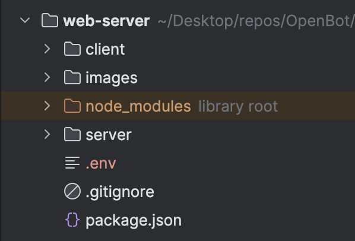

## Firebase Google Sign-In Authentifizierung

<p align="center">
  <a href="README.md">English</a> |
  <a href="README.zh-CN.md">简体中文</a> |
  <span>Deutsch</span> |
  <a href="README.fr-FR.md">Français</a> |
  <a href="README.es-ES.md">Español</a>
</p>

- #### Verwendung
  In unserer Webanwendung verwenden wir Firebase für die Google-Anmeldung, um jeden einzelnen Client zu identifizieren und Kreuzverbindungen zwischen der Roboter-App und dem Webserver zu verhindern. Wenn Sie dieses Projekt klonen und auf Ihrem Gerät ausführen, müssen Sie Ihr eigenes Firebase-Projekt einrichten, da die Firebase-Konfiguration für die Anmeldung erforderlich ist.
- #### Über Google Sign-In
  Firebase Google Sign-In Authentifizierung ist eine Funktion der Firebase-Plattform, die es Benutzern ermöglicht, sich mit ihren Google-Anmeldedaten bei mobilen oder Web-Apps anzumelden. Dieser Dienst bietet eine sichere und bequeme Möglichkeit für Benutzer, auf Apps zuzugreifen, ohne sich separate Anmeldeinformationen merken und verwalten zu müssen. Firebase verwaltet den gesamten Authentifizierungsprozess, von der Überprüfung der Identität des Benutzers bei Google bis hin zur Bereitstellung einer eindeutigen Benutzer-ID, die zur Personalisierung der Benutzererfahrung innerhalb der App verwendet werden kann. Diese Funktion umfasst auch zusätzliche Sicherheitsmaßnahmen wie die Zwei-Faktor-Authentifizierung, um Benutzerkonten vor unbefugtem Zugriff zu schützen.

**Hinweis** - Bitte folgen Sie der OpenBot Playground [Dokumentation](../../../../open-code/src/services/README.de-DE.md), um Ihr Firebase-Projekt einzurichten und die Google-Authentifizierung zu aktivieren. Es ist derzeit nicht erforderlich, die Google Drive API zu aktivieren.

### Einrichten von Umgebungsvariablen

Verwendung von Umgebungsvariablen Bei der Verwendung der Firebase-Authentifizierung müssen Sie möglicherweise sensible Informationen wie API-Schlüssel, Datenbankanmeldeinformationen und andere Geheimnisse speichern. Um dies sicher zu tun, können Sie Umgebungsvariablen verwenden, um diese Informationen außerhalb Ihres Codes zu speichern. Gehen Sie dazu wie folgt vor:

1. Erstellen Sie eine neue Datei im Web-Server namens .env.

   

2. Fügen Sie die folgenden Umgebungsvariablen zur .env-Datei hinzu, die in der authentication.js-Datei verwendet werden.
      ```bash
      REACT_APP_FIREBASE_API_KEY=<REACT_APP_FIREBASE_API_KEY>
      SNOWPACK_PUBLIC_FIREBASE_API_KEY=<SNOWPACK_PUBLIC_FIREBASE_API_KEY>
      SNOWPACK_PUBLIC_AUTH_DOMAIN=<SNOWPACK_PUBLIC_AUTH_DOMAIN>
      SNOWPACK_PUBLIC_PROJECT_ID=<SNOWPACK_PUBLIC_PROJECT_ID>
      SNOWPACK_PUBLIC_STORAGE_BUCKET=<SNOWPACK_PUBLIC_STORAGE_BUCKET>
      SNOWPACK_PUBLIC_MESSAGING_SENDER_ID=<SNOWPACK_PUBLIC_MESSAGING_SENDER_ID>
      SNOWPACK_PUBLIC_APP_ID=<SNOWPACK_PUBLIC_APP_ID>
      SNOWPACK_PUBLIC_MEASUREMENT_ID=<SNOWPACK_PUBLIC_MEASUREMENT_ID>
   ```