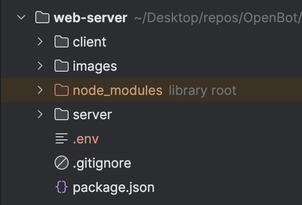

## Authentification Google Sign-In avec Firebase

<p align="center">
  <a href="README.md">English</a> |
  <a href="README.zh-CN.md">简体中文</a> |
  <a href="README.de-DE.md">Deutsch</a> |
  <span>Français</span> |
  <a href="README.es-ES.md">Español</a>
</p>

- #### Utilisation
  Dans notre application web, nous utilisons Firebase pour l'authentification Google sign-in afin d'identifier chaque client unique et de prévenir les connexions croisées entre l'application robot et le serveur web. Si vous clonez ce projet et l'exécutez sur votre appareil, vous devez configurer votre propre projet Firebase car la configuration de Firebase est nécessaire pour l'authentification de connexion.
- #### À propos de Google Sign-In
  L'authentification Google Sign-In de Firebase est une fonctionnalité de la plateforme Firebase qui permet aux utilisateurs de se connecter à des applications mobiles ou web en utilisant leurs identifiants Google. Ce service offre un moyen sécurisé et pratique pour les utilisateurs d'accéder aux applications sans avoir à se souvenir et à gérer des identifiants de connexion distincts. Firebase gère l'ensemble du processus d'authentification, de la vérification de l'identité de l'utilisateur avec Google à la fourniture d'un identifiant utilisateur unique qui peut être utilisé pour personnaliser l'expérience de l'utilisateur au sein de l'application. Cette fonctionnalité inclut également des mesures de sécurité supplémentaires, telles que l'authentification à deux facteurs, pour aider à protéger les comptes des utilisateurs contre les accès non autorisés.

**Remarque** - Veuillez suivre la documentation du terrain de jeu OpenBot [documentation](../../../../open-code/src/services/README.fr-FR.md) pour configurer votre projet Firebase et activer l'authentification Google. Il n'est pas nécessaire d'activer l'API Google Drive pour le moment.

### Configuration des variables d'environnement

Utilisation des variables d'environnement Lors de l'utilisation de l'authentification Firebase, vous pouvez avoir besoin de stocker des informations sensibles telles que des clés API, des identifiants de base de données et d'autres secrets. Pour ce faire de manière sécurisée, vous pouvez utiliser des variables d'environnement pour stocker ces informations en dehors de votre code en suivant les étapes suivantes.

1. Créez un nouveau fichier dans le serveur web appelé .env.

   

2. Ajoutez les variables d'environnement suivantes au fichier .env qui seront utilisées dans le fichier authentication.js.
      ```bash
      REACT_APP_FIREBASE_API_KEY=<REACT_APP_FIREBASE_API_KEY>
      SNOWPACK_PUBLIC_FIREBASE_API_KEY=<SNOWPACK_PUBLIC_FIREBASE_API_KEY>
      SNOWPACK_PUBLIC_AUTH_DOMAIN=<SNOWPACK_PUBLIC_AUTH_DOMAIN>
      SNOWPACK_PUBLIC_PROJECT_ID=<SNOWPACK_PUBLIC_PROJECT_ID>
      SNOWPACK_PUBLIC_STORAGE_BUCKET=<SNOWPACK_PUBLIC_STORAGE_BUCKET>
      SNOWPACK_PUBLIC_MESSAGING_SENDER_ID=<SNOWPACK_PUBLIC_MESSAGING_SENDER_ID>
      SNOWPACK_PUBLIC_APP_ID=<SNOWPACK_PUBLIC_APP_ID>
      SNOWPACK_PUBLIC_MEASUREMENT_ID=<SNOWPACK_PUBLIC_MEASUREMENT_ID>
   ```