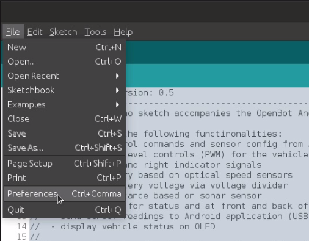
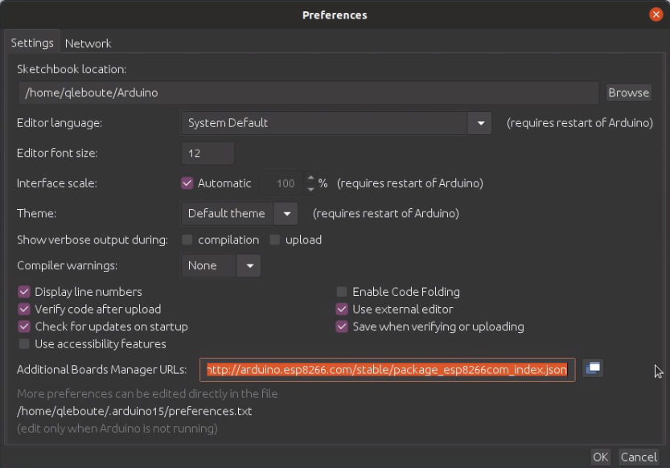
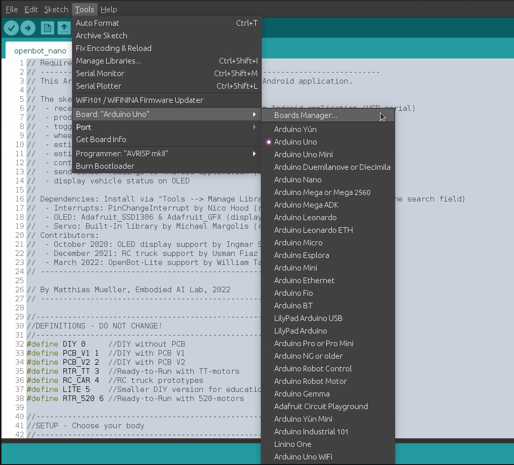
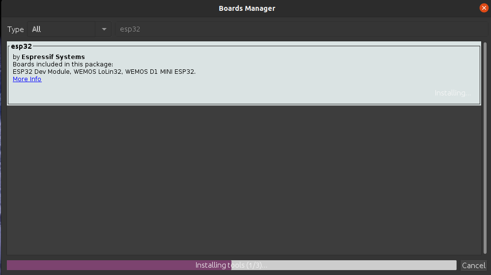
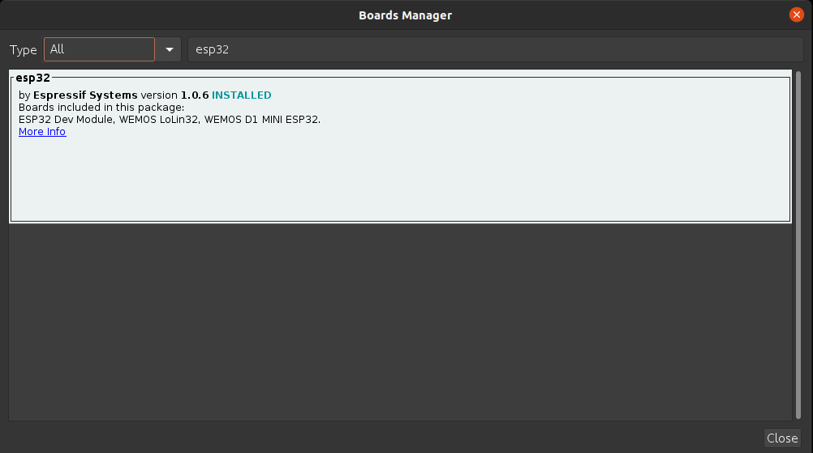
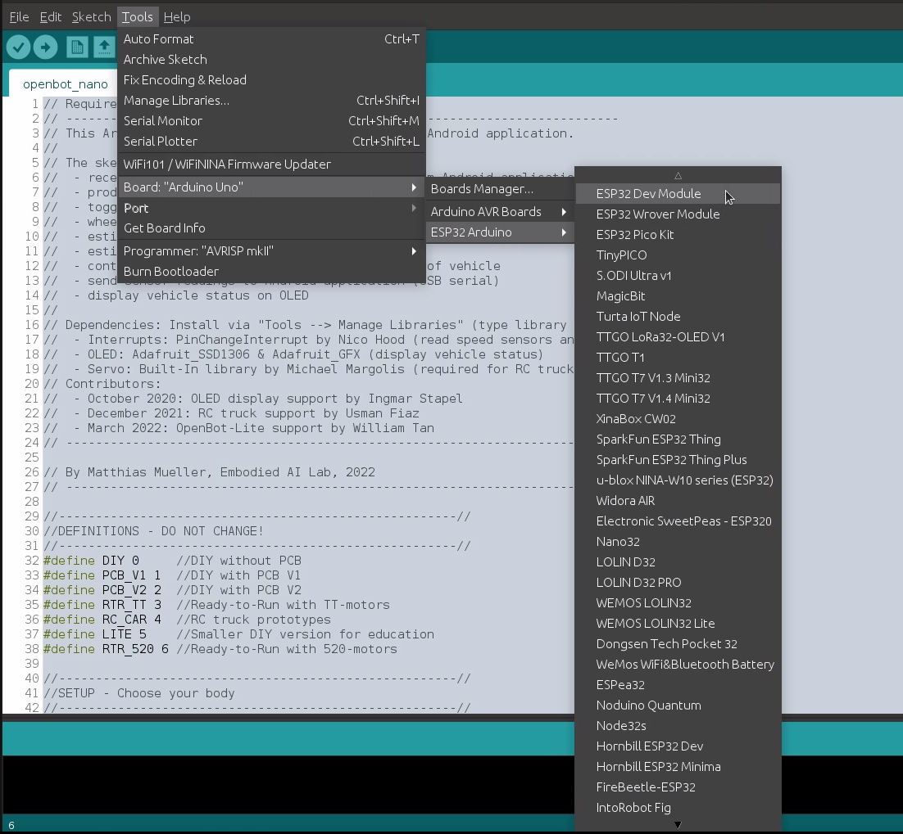

# Firmware

  <a href="README.md">English</a> |
  <a href="README.zh-CN.md">简体中文</a> |
  <a href="README.de-DE.md">Deutsch</a> |
  <a href="README.fr-FR.md">Français</a> |
  Español

Usamos una unidad de microcontrolador (MCU) para actuar como un puente entre el cuerpo del robot y el smartphone. Proporcionamos nuestro [firmware](openbot_nano/openbot_nano.ino) para el Arduino Nano con un microcontrolador ATmega328P, así como para el kit de desarrollo ESP32.

## Características

La tarea principal del MCU es manejar el control de bajo nivel del vehículo y proporcionar lecturas de los sensores montados en el vehículo. El MCU recibe los controles del vehículo y las señales de los indicadores a través de la conexión serial. Convierte los controles en señales PWM para el controlador del motor y activa los LEDs según la señal del indicador. El programa de Arduino también realiza un seguimiento de las rotaciones de las ruedas contando las interrupciones de los sensores ópticos en las ruedas delanteras izquierda y derecha. Calcula el voltaje de la batería mediante un promedio móvil escalado de las mediciones en el circuito divisor de voltaje. También puede medir la distancia a los obstáculos frente al coche con un sensor ultrasónico opcional. Estas mediciones se envían de vuelta a la aplicación de Android a través del enlace serial.

## Configuración

Primero debes configurar tu hardware al inicio del código. Si hiciste la construcción DIY (usando el controlador de motor L298N), establece `OPENBOT DIY`. Si usaste la PCB personalizada, verifica la versión y establece `OPENBOT PCB_V1` o `OPENBOT PCB_V2`. Si tienes un kit OpenBot, establece `OPENBOT RTR_TT`. Si has adaptado un camión RC, establece `OPENBOT RC_CAR`. Si usas la versión DIY más pequeña para educación, establece `OPENBOT LITE`. Si usas el kit OpenBot Ready-to-Run con motores 520, establece `OPENBOT RTR_520`. Si construiste el Vehículo Multi Terreno, debes establecer `OPENBOT MTV`. Para ejecutar el `OpenBot DIY` con el ESP32, establece `DIY_ESP32`.

## Bluetooth

Puedes ejecutar el OpenBot a través de Bluetooth también, para eso puedes habilitar el Bluetooth estableciendo `BLUETOOTH 1` (deshabilitar: 0). Para que el Bluetooth funcione necesitas OpenBot con placas ESP32 como `(RTR_520, MTV, DIY_ESP32)`.

## Configuración

A continuación, necesitas configurar qué características deseas habilitar. Las características deshabilitadas no se compilan para ahorrar memoria y hacer el código más rápido. Si una bandera no está definida, la característica se deshabilitará. Cada modelo tiene algunas configuraciones predeterminadas que puedes necesitar cambiar dependiendo de tu configuración.

- Habilita el divisor de voltaje estableciendo `HAS_VOLTAGE_DIVIDER 1` (deshabilitar: 0). Si tienes un divisor de voltaje, también debes especificar el `VOLTAGE_DIVIDER_FACTOR` que se calcula como (R1+R2)/R2, `VOLTAGE_MIN` que es el voltaje mínimo para conducir los motores, `VOLTAGE_LOW` que es el voltaje mínimo de la batería y `VOLTAGE_MAX` que es el voltaje máximo de la batería.
- Habilita los LEDs indicadores estableciendo `HAS_INDICATORS 1` (deshabilitar: 0).
- Habilita los sensores de velocidad delanteros/traseros estableciendo `HAS_SPEED_SENSORS_FRONT 1` / `HAS_SPEED_SENSORS_BACK 1` (deshabilitar: 0).
- Habilita el sensor ultrasónico estableciendo `HAS_SONAR 1` (deshabilitar: 0). Habilita el filtro de mediana para las mediciones del sonar estableciendo `USE_MEDIAN 1` (deshabilitar: 0).
- Habilita el sensor de parachoques que se usa para detectar colisiones estableciendo `HAS_BUMPER 1` (deshabilitar: 0).
- Habilita la pantalla OLED estableciendo `HAS_OLED 1` (deshabilitar: 0).
- Habilita los LEDs delanteros/traseros/de estado estableciendo `HAS_LEDS_FRONT 1` / `HAS_LEDS_BACK 1` / `HAS_LEDS_STATUS 1` (deshabilitar: 0).

### Dependencias

Si has habilitado los sensores de velocidad o el sensor ultrasónico, necesitas instalar la biblioteca [PinChangeInterrupt](https://github.com/NicoHood/PinChangeInterrupt). El Arduino Nano solo tiene dos pines de interrupción externa (D2 y D3) y D3 es también uno de los seis pines que soportan PWM. Afortunadamente, también tiene tres interrupciones de puerto que cubren todos los pines del Arduino. Esta biblioteca analiza estas interrupciones de puerto permitiendo que todos los pines del Arduino se usen como interrupciones.

Si has habilitado la OLED, necesitas instalar las bibliotecas [Adafruit_SSD1306](https://github.com/adafruit/Adafruit_SSD1306) y [Adafruit_GFX Library](https://github.com/adafruit/Adafruit-GFX-Library).

Puedes instalar bibliotecas siguiendo estos pasos:
1. Abre el Administrador de Bibliotecas: `Herramientas` :arrow_right: `Administrar Bibliotecas`
2. Ingresa el nombre de la biblioteca en la barra de búsqueda.
3. Selecciona la última versión y haz clic en instalar. Si ya has instalado la biblioteca, se mostrará y podrás actualizarla.

  
   

### Nano clon chino (por ejemplo, enlace de EE.UU.)

Es posible que necesites descargar los controladores [WCH340](http://www.wch.cn/product/CH340.html) del fabricante del chip (chino):

- [Windows](http://www.wch.cn/downloads/CH341SER_EXE.html)
- [Linux](http://www.wch.cn/download/CH341SER_LINUX_ZIP.html)
- [Mac](http://www.wch.cn/download/CH341SER_MAC_ZIP.html)

### Kit de desarrollo ESP32

Para instalar la placa ESP32 en tu IDE de Arduino, sigue estas instrucciones:

1. En tu IDE de Arduino, ve a **Archivo > Preferencias**:

  

2. Ingresa *https://dl.espressif.com/dl/package_esp32_index.json* en el campo “*URLs adicionales del gestor de placas*” como se muestra en la figura a continuación. Luego, haz clic en el botón “OK”:

  

**Nota:** si ya tienes la URL de las placas ESP8266, puedes separar las URLs con una coma de la siguiente manera:

    https://dl.espressif.com/dl/package_esp32_index.json, 
    http://arduino.esp8266.com/stable/package_esp8266com_index.json

3. Abre el Gestor de Placas. Ve a **Herramientas > Placa > Gestor de Placas**:

  

4. Busca ESP32 y presiona el botón de instalar para “ESP32 by Espressif Systems“:

  

5. Ahora deberías tener todo para flashear con éxito la placa ESP32 de tu OpenBot usando el entorno de desarrollo de Arduino.

  

6. Para flashear el OpenBot con tu nuevo código, simplemente selecciona **ESP32 Dev Module** en el menú **Herramientas > Placa > ESP32 Arduino**. Ten en cuenta que contenido adicional así como solución de problemas del proceso de flasheo del ESP32 se pueden encontrar en el siguiente [enlace](https://randomnerdtutorials.com/installing-the-esp32-board-in-arduino-ide-windows-instructions/).

  

## Subir

### Configuración (configuración de Arduino nano)

- `Herramientas` :arrow_right: `Placa` :arrow_right: `Arduino AVR Boards` :arrow_right: `Arduino Nano`
- `Herramientas` :arrow_right: `Procesador` :arrow_right: `ATmega328P (Old Bootloader)`
- `Herramientas` :arrow_right: `Puerto` :arrow_right: `*Selecciona el puerto USB*`

:memo: NOTA: Actualmente, la mayoría de las placas Arduino Nano baratas vienen con el *Old Bootloader*. Sin embargo, dependiendo del vendedor, también puedes obtener una con el nuevo bootloader. Así que si no puedes subir el firmware, es probable que necesites cambiar el procesador a *ATmega328P*.

### Configuración (configuración de ESP32)

- `Herramientas` :arrow_right: `Placa` :arrow_right: `ESP32 Arduino` :arrow_right: `ESP32 Dev Module`
- `Herramientas` :arrow_right: `Puerto` :arrow_right: `*Selecciona el puerto USB*`

### Subiendo el firmware

El firmware ahora se puede subir a través de `Sketch` :arrow_right: `Upload` o presionando el botón de subir (flecha derecha).

### Pruebas

Esta sección explica cómo probar todas las funcionalidades del coche después de que el firmware se haya flasheado con éxito.

1. Confirma que:
    1. las ruedas no están conectadas al coche
    2. el Arduino está conectado a la computadora
    3. el puerto USB correcto está seleccionado
2. Abre el Monitor Serial: `Herramientas` :arrow_right: `Monitor Serial`

#### Enviando mensajes al OpenBot

También puedes enviar mensajes al Arduino escribiendo un comando en el campo de entrada en la parte superior y luego presionando enviar. Los siguientes comandos están disponibles (siempre que las características necesarias sean compatibles con el robot):

- `c<izquierda>,<derecha>` donde `<izquierda>` y `<derecha>` están en el rango [-255,255]. Un valor de `0` detendrá los motores. Un valor de `255` aplica el voltaje máximo conduciendo los motores a la velocidad máxima hacia adelante. Valores más bajos conducen a voltajes y velocidades proporcionalmente más bajos. Valores negativos aplican los voltajes correspondientes en polaridad inversa conduciendo los motores en reversa.
- `i<izquierda>,<derecha>` donde `<izquierda>` y `<derecha>` están en el rango [0,1] y corresponden a los LEDs indicadores izquierdo y derecho. Por ejemplo, `i1,0` enciende el indicador izquierdo, `i0,1` el derecho e `i1,1` ambos indicadores. Las luces indicadoras habilitadas parpadearán una vez por segundo. Un valor de `i0,0` apaga los indicadores. Solo es posible un estado a la vez.
- `l<frontal>,<trasero>` donde `<frontal>` y `<trasero>` están en el rango [0,255] y corresponden al brillo de los LEDs delanteros y traseros.
- `s<tiempo_ms>` donde `<tiempo_ms>` corresponde al tiempo en ms entre mediciones de sonar activadas (predeterminado = 1000). Después de adquirir la lectura del sonar, el mensaje se envía al robot. Si se agota el tiempo, se envía la `MAX_SONAR_DISTANCE` especificada.
- `w<tiempo_ms>` donde `<tiempo_ms>` corresponde al tiempo en ms entre mediciones de odometría de ruedas enviadas al robot (predeterminado = 1000). La velocidad de las ruedas se monitorea continuamente y el rpm se calcula como promedio durante el intervalo de tiempo especificado.
- `v<tiempo_ms>` donde `<tiempo_ms>` corresponde al tiempo en ms entre mediciones de voltaje enviadas al robot (predeterminado = 1000). El voltaje se monitorea continuamente y se filtra a través de un filtro de promedio móvil de tamaño 10. Además de establecer el intervalo de tiempo para las lecturas de voltaje, enviar este comando también activará mensajes que informan el voltaje mínimo para conducir los motores (`vmin:<valor>`), el voltaje mínimo de la batería (`vlow:<valor>`) y el voltaje máximo de la batería (`vmax:<valor>`).
- `h<tiempo_ms>` donde `<tiempo_ms>` corresponde al tiempo en ms después del cual el robot se detendrá si no se recibe un nuevo mensaje de latido (predeterminado = -1).
- `b<tiempo_ms>` donde `<tiempo_ms>` corresponde al tiempo en ms después del cual se restablecerá el disparador del parachoques (predeterminado = 750).
- `n<color>,<estado>` donde `<color>` corresponde a un LED de estado (`b` = azul, `g` = verde, `y` = amarillo) y `estado` a su valor (`0` = apagado, `1` = encendido).
- `f` enviará una solicitud al OpenBot para devolver un mensaje con el tipo de robot y sus características, por ejemplo, medición de voltaje (`v`), indicadores (`i`), sonar (`s`), sensores de parachoques (`b`), odometría de ruedas (`wf`, `wb`), LEDs (`lf`, `lb`, `ls`), etc. Por ejemplo, para la versión `RTR_V1` de OpenBot, el mensaje se vería así: `fRTR_V1:v:i:s:b:wf:wb:lf:lb:ls:`.

#### Recibiendo mensajes del OpenBot

Dependiendo de tu configuración, puedes ver diferentes mensajes.

- Los mensajes que comienzan con `v` informan el voltaje de la batería. Si conectas la batería al coche (es decir, enciendes el interruptor), debería mostrar el voltaje de la batería. Si desconectas la batería (es decir, apagas el interruptor), debería mostrar un valor pequeño.
- Los mensajes que comienzan con `w` informan las lecturas de los sensores de velocidad medidas en revoluciones por segundo (rpm). Cada agujero en el disco del codificador incrementará un contador en más/menos uno dependiendo de la dirección. Puedes establecer el número de agujeros con el parámetro `DISK_HOLES`. Si estás usando el disco estándar con 20 agujeros, habrá 20 cuentas para cada revolución de la rueda.
- Los mensajes que comienzan con `s` informan el espacio libre estimado frente al sensor ultrasónico en cm.
- Los mensajes que comienzan con `b` informan colisiones. Los códigos `lf` (frontal izquierdo), `rf` (frontal derecho), `cf` (frontal central), `lb` (trasero izquierdo), `rb` (trasero derecho) indican qué sensor activó la colisión.

#### Procedimiento de prueba

Antes de continuar, asegúrate de que los neumáticos estén removidos. Necesitarás el Monitor Serial abierto para enviar comandos y verás los mensajes recibidos de tu OpenBot. Si tienes la pantalla OLED instalada, también verás el estado del vehículo allí en un formato más legible. El siguiente procedimiento de prueba se puede usar para probar todas las funcionalidades del coche:

1. Enciende el coche y observa el voltaje de la batería (el número después de la `v`). Puedes verificar la lectura con un multímetro y ajustar el `VOLTAGE_DIVIDER_FACTOR` si es necesario.
2. Si tienes un sensor ultrasónico instalado:
    1. Sostén tu mano frente al sensor y muévela hacia adelante y hacia atrás. Deberías ver las lecturas (el número después de la `s`) cambiar correspondientemente.
    2. Hemos observado que el sensor ultrasónico es muy sensible a las vibraciones. Por lo tanto, es aconsejable asegurarse de que obtendrás lecturas confiables durante la operación realizando la siguiente prueba:
        1. Coloca el OpenBot con el sensor ultrasónico instalado de manera que haya al menos 200 cm de espacio libre frente a él. Deberías ver una lectura de `200` o más.
        2. Observa las lecturas en el monitor serial durante un tiempo y luego ingresa el comando `c128,128`.
        3. Si las lecturas del sensor cambian significativamente, necesitarás amortiguar las vibraciones transmitidas al sensor ultrasónico desde el chasis (por ejemplo, agregar algo de silicona, ajustar la posición de montaje).
3. Si tienes los sensores de velocidad instalados:
    1. Asegúrate de tener mucho espacio libre frente al sensor ultrasónico. La lectura (el número después de la `s`) debe estar al menos por encima del `STOP_DISTANCE` que es `10` por defecto.
    2. Envía el comando `c128,128`. Los motores comenzarán a girar a *baja velocidad* (50% PWM). Las lecturas del sensor de velocidad (valores después de la `w`) se informan en rpm y deben estar entre 250 y 300 para la versión RTR_TT dependiendo del SOC de la batería. Si estás usando la versión DIY o una batería más débil, los valores pueden ser más bajos. Verifica que todos los motores estén girando hacia adelante y que las lecturas del sensor de velocidad sean positivas.
    3. Intenta enviar diferentes controles y observa las lecturas del sensor de velocidad. Por ejemplo, el comando `c-128,-128` hará que todos los motores giren hacia atrás a *baja velocidad* (50% PWM). El comando `c255,-255` hará que los motores izquierdos giren hacia adelante y los derechos hacia atrás a *alta velocidad* (100% PWM). El comando `c-192,192` hará que los motores izquierdos giren hacia atrás y los derechos hacia adelante a *velocidad normal* (75% PWM).
4. Detén los motores enviando el comando `c0,0` o colocando tu mano